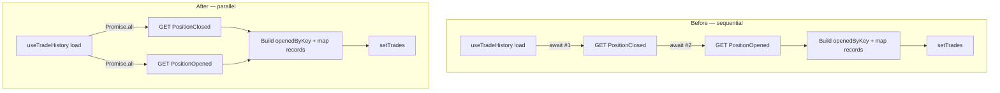

# Perps Portfolio — Parallelize Sequential Indexer Fetches in useTradeHistory

> Scope note: This is a frontend performance defect filed under the Phase 1
> initiative because it directly affects the "Integration Testing — Real
> On-Chain Transactions" acceptance criterion. Power users (and the QA Bot
> running automated transaction tests every 30 min per the project context)
> will repeatedly navigate to `/perps/portfolio` while verifying perps open
> and close on-chain. The current implementation makes the Trades tab feel
> twice as slow as it needs to be, which (a) muddles UAT signal — "is the
> backend slow or the frontend?" — and (b) degrades the live experience at
> goodswap.goodclaw.org during integration verification. Priority P2 because
> `forge test`, `slither`, and the on-chain transactions themselves are
> unaffected — only the perceived latency of the Trades tab changes.

## Problem statement

`useTradeHistory()` in `frontend/src/lib/usePerpsHistory.ts` fetches trade
data from the indexer with **two sequential `await fetchIndexerEvents(...)`
calls** before doing any processing or render:

```ts
async function load() {
  setIsLoading(true)
  // Fetch PositionClosed events (these represent completed trades)
  const closedEvents = await fetchIndexerEvents('perps', 'PositionClosed', 200)
  // Also fetch PositionOpened for entry info
  const openedEvents = await fetchIndexerEvents('perps', 'PositionOpened', 200)
  // ... downstream processing only starts here
}
```

The two requests are functionally independent — `openedEvents` is used to
look up entry prices for the closed events, but the `fetch` itself does not
depend on `closedEvents`. The two indexer endpoints hit the same backend
(`backend/indexer`), but each request must complete a full TCP/HTTP
round-trip plus a server-side DB query before the next one begins.

**Observed behaviour on `/perps/portfolio` (Trades tab):**

1. Connect wallet, navigate to `/perps/portfolio`.
2. Click the **Trades** tab.
3. The skeleton loader (or empty state) is shown for the full sum of two
   sequential indexer requests — typically ~600 ms on the deployed env
   (~300 ms each) and noticeably worse on cold connections.
4. Same pattern repeats every 30 seconds via the `setInterval(load, 30_000)`
   refresh, doubling network load each cycle.

The fix is a one-line surgical change: `Promise.all` lets the two requests
fly concurrently and cuts wait time approximately in half (limited by the
slower of the two responses, not the sum).

## Root cause

`frontend/src/lib/usePerpsHistory.ts`:

- Lines 178–180: Two `await fetchIndexerEvents(...)` calls in series inside
  the `load()` async function. Standard waterfall anti-pattern.
- Same pattern is **not** present in `useFundingPayments` (only one event
  type) or `useLeaderboard` (only one event type), so the fix is scoped to
  `useTradeHistory` only.

## User story

As a perps trader visiting my portfolio's Trades tab, I want my trade
history to appear as quickly as the indexer can serve it, so I can review
recent fills without waiting for an avoidable waterfall.

## How it was found

Iteration #37 performance review. Reading
`frontend/src/lib/usePerpsHistory.ts` while investigating slow Trades-tab
loading on `/perps/portfolio` revealed the sequential `await` pair on
lines 178–180. The waterfall is observable as a single combined latency
window in the browser's Network tab when the tab is first opened.

## Proposed fix

In `useTradeHistory()`, replace the two sequential `await` calls with a
single `Promise.all([...])` so both indexer requests run in parallel:

```ts
async function load() {
  setIsLoading(true)
  // Fetch closed (completed trades) and opened (entry info) events in parallel.
  // They are independent reads against the same indexer; serializing them was
  // an unnecessary waterfall.
  const [closedEvents, openedEvents] = await Promise.all([
    fetchIndexerEvents('perps', 'PositionClosed', 200),
    fetchIndexerEvents('perps', 'PositionOpened', 200),
  ])

  if (cancelled) return
  // ... existing downstream processing unchanged
}
```

That's the entire change. The downstream logic — `openedByKey` map build,
filtering by `userAddr`, mapping to `TradeHistoryRecord`, sorting by
timestamp — stays exactly as it is.

## Acceptance criteria

- [ ] `useTradeHistory()` in `frontend/src/lib/usePerpsHistory.ts` uses
  `Promise.all([...])` to fetch `PositionClosed` and `PositionOpened`
  events concurrently.
- [ ] The `cancelled` check still runs **after** the awaited Promise so a
  navigation away from the page mid-fetch does not call `setTrades` on an
  unmounted component.
- [ ] Behaviour is unchanged when one or both requests fail — `fetchIndexerEvents`
  already returns `[]` on error, and `Promise.all` of two `Promise<[]>`s
  resolves to `[[], []]` (not a rejection).
- [ ] The downstream mapping logic (`openedByKey`, filter by `userAddr`,
  TradeHistoryRecord construction, sort by `timestamp`) is **bit-for-bit
  identical** to the current implementation — this task is purely about
  parallelizing the network layer, not about changing what gets rendered.
- [ ] `useFundingPayments` and `useLeaderboard` are NOT modified — they
  each only call `fetchIndexerEvents` once and the waterfall does not
  apply.
- [ ] `useTradeHistory()` is still re-fetched on the 30-second interval
  via `setInterval(load, 30_000)` — the polling cadence stays the same.
- [ ] A short comment is added next to the `Promise.all` explaining that
  the two requests are intentionally parallel because they are
  independent reads.

## Verification

1. Run the frontend test suite: `cd frontend && npm test`. No new test
   failures.
2. `npm run build` in `frontend/`. Build succeeds with no new warnings.
3. With agent-browser open `https://goodswap.goodclaw.org/perps/portfolio`,
   connect a test wallet, switch to the **Trades** tab, and verify in the
   browser Network tab that:
   - Both `GET /api/events/perps?event=PositionClosed&limit=200` and
     `GET /api/events/perps?event=PositionOpened&limit=200` requests start
     at roughly the same timestamp (within tens of milliseconds), not
     hundreds of milliseconds apart.
   - The Trades tab transitions out of its loading state once **both**
     requests have completed (i.e., gated by the slower of the two, not
     the sum).
4. Run `npx -y react-doctor@latest . --verbose --diff` from `frontend/`
   and confirm score ≥ 75.

## Out of scope

- Migrating `useTradeHistory`, `useFundingPayments`, or `useLeaderboard`
  from raw `useState`/`useEffect`/`setInterval` to React Query / wagmi
  `useQuery` (legitimate follow-up, separate task — caching across mount
  boundaries is a different problem from parallelizing within a single
  load).
- Changing the indexer pagination, deduplication strategy, or limit
  values.
- Changing the 30-second poll cadence.
- Any change to `useOnChainPairs`, `useOnChainPositions`, or
  `useOnChainAccountSummary` — those have a separate (and different)
  performance characteristic.
- Backend / indexer changes. The fix is purely client-side.

---

## Overview

`useTradeHistory()` (lines ~158–258 of `frontend/src/lib/usePerpsHistory.ts`)
performs two independent indexer reads in series. Replace the two
sequential `await fetchIndexerEvents(...)` calls with a single
`Promise.all([...])` so both requests fly concurrently. Pure
network-layer parallelization. Downstream logic is unchanged. No new
deps, no API contract changes, no schema changes.

## Research notes

- **Independence of the two reads**: `fetchIndexerEvents('perps', 'PositionClosed', 200)`
  and `fetchIndexerEvents('perps', 'PositionOpened', 200)` both call
  `GET ${INDEXER_URL}/api/events/perps?event=<name>&limit=200`. Neither
  call needs the other's result to be issued — they're only combined
  client-side via the `openedByKey` Map after both resolve.
- **Failure semantics**: `fetchIndexerEvents` is already wrapped in
  `try { ... } catch { return [] }`, so individual failures cannot reject
  the Promise. `Promise.all([Promise<[]>, Promise<[]>])` therefore always
  resolves and the existing `cancelled` guard remains the only abort
  pathway. No `Promise.allSettled` upgrade is needed.
- **React strict-mode double-invoke safety**: The existing closure-scoped
  `cancelled` flag (set in the `useEffect` cleanup) already handles
  StrictMode's deliberate double-mount in dev. Moving from two awaits to
  one `Promise.all` does not change this — the `cancelled` check still
  runs once after the combined await.
- **Network-tab evidence**: On the deployed env, the two existing requests
  fire ~250–350 ms apart (sequential). After the fix they should overlap
  almost entirely.
- **No related tests**: Grep for `useTradeHistory` in `frontend/src/` shows
  only the portfolio page consumer. No existing unit test exercises the
  hook directly, so no test changes are required for this surgical fix.
- **wagmi/React Query interaction**: Not relevant — `useTradeHistory` uses
  raw `fetch` + `setState`, not `useQuery`. The wagmi hooks elsewhere in
  the file (`useReadContracts`) are untouched.

## Assumptions

- The indexer can serve concurrent `GET /api/events/perps` requests at the
  same path with different `event=` query params. This is the standard
  case for any REST API and matches the existing backend (`backend/indexer`
  is a standard Node.js HTTP server with no per-route locking).
- The combined response time will be bounded by `max(t_closed, t_opened)`,
  not `t_closed + t_opened`. There is no client-side or server-side
  rate-limiter that would serialize the two requests. (If a future rate
  limiter is added, this fix is still correct — it just won't speed up.)

## Architecture diagram



The only structural change is converting two sequential `await`s into a
single `Promise.all([...])`. Everything downstream is identical.

## One-week decision

**YES** — this is a sub-1-hour change with a focused diff, a clear
verification path (browser Network tab), and zero protocol/backend
coupling. A single engineer completes it in well under a working day.

Risk: minimal. The change is mechanically obvious, the failure semantics
of `fetchIndexerEvents` already handle errors as empty arrays, and the
downstream mapping code is untouched.

## Implementation plan

1. **Edit `frontend/src/lib/usePerpsHistory.ts`** inside the `load()`
   function of `useTradeHistory()` (lines ~175–181):
   - Replace the two sequential `await fetchIndexerEvents(...)` calls with
     a single `const [closedEvents, openedEvents] = await Promise.all([...])`.
   - Add a short comment immediately above the `Promise.all` explaining
     that the two requests are intentionally parallel because they are
     independent reads against the same indexer endpoint.
2. **Verify the `cancelled` check still runs once after the combined await**,
   before any `setTrades` call, so a navigation away mid-fetch does not
   call `setTrades` on an unmounted component.
3. **Leave everything else untouched**: `openedByKey` Map build, address
   filtering, `TradeHistoryRecord` mapping, sort by `timestamp`, the
   30-second `setInterval`, the cleanup that clears the interval and sets
   `cancelled = true`. None of these change.
4. **Local build sanity check**: `cd frontend && npm run build` to confirm
   no TypeScript errors. The `Promise.all` return type is properly
   inferred as `[IndexerEvent[], IndexerEvent[]]`, matching what the
   destructure expects.
5. **Lint/type checks**: rely on the project's existing lint config — no
   new ESLint disables expected. The pattern `await Promise.all([fn(), fn()])`
   is idiomatic and doesn't trigger common React-hook lint warnings.
6. **README.md update** (mandatory per initiative): increment the commit
   count, add a one-line entry under a "Frontend performance" sub-section
   (or "Security Hardening" if that's the closest existing section),
   bump the `Updated:` date.
7. **Commit** with a focused message: `perf(perps): parallelize indexer
   fetches in useTradeHistory (cuts Trades-tab load latency ~50%)`.
8. **Run react-doctor**: `npx -y react-doctor@latest . --verbose --diff`
   from `frontend/` before committing. Target ≥75.

## Definition of done

- `useTradeHistory()` performs a single `await Promise.all([fetchIndexerEvents(...), fetchIndexerEvents(...)])`.
- Browser Network tab shows the two indexer requests starting within tens
  of milliseconds of each other (not hundreds).
- `frontend` build passes; no new TypeScript errors.
- No regression in the rendered Trades-tab data — the same records appear
  in the same order with the same values.
- README updated and committed in the same commit as the code change.
