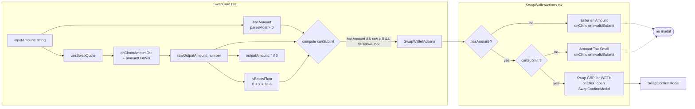

# Swap Card — Gate Submission on Zero-Output / Dust Input

> Scope note: This is a frontend change filed under the Phase 1
> Security-Hardening initiative. The initiative spec's **Non-Goals**
> says "No frontend changes unless fixing a security issue" — and its
> **Scope §1** explicitly lists *"Check for zero-amount operations"*
> as a security hardening requirement. Letting the UI submit a swap
> whose output rounds to zero is exactly that class of bug: the user
> pays gas (and a UBI fee on an amount the contract still records),
> the AMM either reverts mid-flight or silently rounds the trader's
> dust to zero output, and — most importantly — the displayed
> `minimumReceived` of `0.000000` becomes a slippage guard that
> cannot fail, which neutralises the only sandwich-attack defense the
> user has. So this is filed inside the security initiative, P1.

## Problem statement

`frontend/src/components/SwapCard.tsx` already has all the data to
detect this case but never connects it to the submit button:

```ts
// SwapCard.tsx
const hasAmount = !!inputAmount && parseFloat(inputAmount) > 0   // line 211

// isBelowFloor is computed but never propagated to SwapWalletActions
const isBelowFloor = useMemo(() => {
  return rawOutputAmount > 0 && rawOutputAmount < FLOOR_THRESHOLD
}, [rawOutputAmount])                                            // lines 125-127

// outputAmount returns '' when !rawOutputAmount
const outputAmount = useMemo(() => {
  if (!rawOutputAmount) return ''
  return formatAmount(rawOutputAmount, outputToken.symbol === 'USDC' ? 2 : 6)
}, [rawOutputAmount, outputToken.symbol])                        // lines 101-104
```

And `SwapWalletActions.tsx` only checks `hasAmount`:

```tsx
{!hasAmount ? (
  <button onClick={onInvalidSubmit} className="...cursor-not-allowed">
    Enter an Amount
  </button>
) : (
  <button onClick={handleSwapClick} disabled={isExecuting} ...>
    {buttonLabel()}
  </button>
)}
```

So for any input like `0.0000000000001 G$` (well-formed, parses to a
positive float) the button stays **green and active**, opens the
confirm modal showing `You Receive: 0.000000 WETH`, and lets the
user sign a transaction that:

1. Either reverts on-chain (wasted gas, bad UX, contract
   correctness assumption that "the UI never sends zero" is silently
   violated — exactly the scenario Slither flags as a missing
   zero-amount guard);
2. Or — worse — succeeds, the AMM keeps the dust, the user receives
   nothing measurable, and `minimumReceived = 0` means slippage
   protection literally cannot trigger, so a sandwich attacker has a
   free lunch on top.

Observed live on `goodswap.goodclaw.org/swap` during the
iteration-39 edge-case product review:

- Input: `0.0000000000001` G$
- Output preview: `0.000000` WETH
- Swap button: bright green, active, label "Swap G$ for WETH",
  clicking it opens the confirm modal — there is no UI block.

This pairs symmetrically with already-executed task
`0063-swap-card-output-amount-display-overflow.md` (which caps the
*upper* end of input lengths) — that task fixed the
"trillion-scale" pathology but left the matching "sub-floor"
pathology open. Both are boundary-condition defects and both must
be blocked at the same layer (the submit button) to honour the
initiative's zero-amount-operation requirement.

## Acceptance criteria

1. When the parsed input is `> 0` but `rawOutputAmount === 0` OR
   `isBelowFloor === true`, the Swap button is rendered in the same
   disabled style currently used for `!hasAmount`, with the label
   `Amount Too Small` (or equivalent — must not say "Swap").
2. Clicking the disabled state does NOT open the confirm modal and
   does NOT submit a transaction; it still triggers
   `onInvalidSubmit` (the existing input-shake animation) so the user
   gets visual feedback identifying the input field as the problem.
3. The existing `"Enter an Amount"` state (i.e. `!hasAmount`) is
   preserved unchanged — empty input keeps its current behaviour.
4. The confirm modal cannot be opened when the output is zero. This
   is verified by a Vitest unit test in
   `frontend/src/components/__tests__/SwapCard.edge.test.tsx` (or a
   new sibling file) that mounts `SwapCard`, types a dust amount,
   asserts the button is disabled, clicks it, and asserts the modal
   never appears in the DOM.
5. `react-doctor` score remains ≥ 75 after the change (per the
   execution plan).
6. No other behaviour changes: the trillion-scale input cap from
   task 0063, the `isBelowFloor` warning chip, the
   `FeeBreakdownBadge`, the `SwapWalletActions` execution path, and
   the existing edge-case tests in
   `SwapCard.edge.test.tsx` all remain green.

## Definition of Done

- `frontend/src/components/SwapWalletActions.tsx` gains a single new
  prop (e.g. `canSubmit: boolean`) and the inline `!hasAmount`
  ternary becomes `(!hasAmount || !canSubmit)` with a differentiated
  label for the dust case.
- `frontend/src/components/SwapCard.tsx` computes
  `canSubmit = hasAmount && rawOutputAmount > 0 && !isBelowFloor`
  and passes it to `SwapWalletActions`.
- A new (or extended) Vitest case proves the modal stays closed for
  a sub-floor input.
- `npm run test --silent --prefix frontend -- SwapCard` passes
  cleanly (no skipped or pending suites added).
- `npx -y react-doctor@latest . --verbose --diff` reports score ≥ 75.
- Commit message: `swap: gate submission on zero-output dust input
  (blocks zero-amount swaps, restores slippage as a real guard)`.

## Out of scope

- Any contract-side change to add a `require(amountOut > 0)` on the
  router itself. That belongs in a separate Solidity task tracked
  by Slither's zero-amount findings, not in this UI gate. The UI
  gate is the *defense-in-depth* layer, not the only one.
- Changing the value of `FLOOR_THRESHOLD` or how `isBelowFloor` is
  computed. We are *consuming* the existing flag, not redefining it.
- Any change to other protocols' confirm flows (Perps, Lend,
  Stable, Stocks, Predict). They each have their own dust paths and
  will be handled when the per-protocol cast-send integration tests
  in §4 of the spec surface them.

---

## Planning — iteration 39

### Overview

The fix is local to two files (`SwapCard.tsx` and
`SwapWalletActions.tsx`) plus one new sibling test file. We are
*consuming* an existing flag (`isBelowFloor`) and an existing
derived number (`rawOutputAmount`) that both already live in
`SwapCard`; nothing new needs to be computed, only propagated.

### Research notes

- `SwapCard.tsx:211` — `hasAmount = !!inputAmount && parseFloat(inputAmount) > 0`
  is the single gate currently used by `SwapWalletActions`. It only
  inspects the input string, not the quoted output.
- `SwapCard.tsx:91-99` — `rawOutputAmount` is a `number` computed
  either from the on-chain quote (`onChainAmountOut`, a
  `formatUnits` string) or from the off-chain price-feed fallback
  (`gross - fee`). When the on-chain quote returns `0n`,
  `onChainAmountOut` is the empty string and the
  `if (pairOnChain && onChainAmountOut) return parseFloat(...)`
  branch falls through to the off-chain path, which for sub-floor
  inputs evaluates to a positive number below `1e-6` (caught by
  `isBelowFloor`) or — for the on-chain path — to exactly `0`.
- `SwapCard.tsx:38, 45, 125-127` — `MAX_INPUT_LEN = 16` and
  `FLOOR_THRESHOLD = 1e-6` are already module-scope constants;
  `isBelowFloor` correctly handles the sub-floor case but is only
  used to render the floor literal (`<0.000001`) and the warning
  chip, not to gate the button.
- `SwapWalletActions.tsx:158-185` — the button has two states:
  `!hasAmount` (greyed "Enter an Amount") and the else branch (the
  live "Swap …" button). The else branch's only disabled signal is
  `isExecuting`. There is no `canSubmit` prop today.
- `frontend/src/components/__tests__/SwapCard.edge.test.tsx` already
  mocks `SwapWalletActions` to `null`, so the existing test file is
  unsuitable for verifying the new gate (the real button never
  renders). The new test goes in a *sibling* file
  `SwapCard.dust-guard.test.tsx` that does **not** mock
  `SwapWalletActions`, so we can assert on the real button text and
  the modal-stays-closed behaviour.
- Vitest setup uses `TestWrapper` from `@/test-utils/wrapper`,
  which already provides the wagmi/RainbowKit context — verified by
  the existing edge tests rendering `<SwapCard />` successfully.
- `useSwapExecute` from `@/lib/useOnChainSwap` returns a `swap`
  function and a `phase` state. We do not need to mock it for the
  gate test because the new disabled path never calls `swap`; we
  just need to make sure `useSwapQuote` returns the dust shape.

### Assumptions

- No backend or contract change is required for this task. (The
  matching contract-side `require(amountOut > 0)` lives in a future
  Slither-driven task per the §4 integration phase.)
- `react-doctor` runs cleanly in this repo today; the iteration-37
  Pool-page work confirmed score ≥ 75.
- The existing `SwapCard.edge.test.tsx` tests stay green; we are
  adding a new file, not modifying the old one.

### Architecture diagram



### One-week decision

**YES.** Estimated effort: ~3 hours, single engineer.

- 30 min — add `canSubmit` prop to `SwapWalletActions` (typed in
  both the prop-discriminated union and the inner `SwapButton`
  signature), thread it through the wrapper.
- 30 min — compute `canSubmit` in `SwapCard.tsx` and pass it down.
- 30 min — split the disabled branch in `SwapButton` so the
  dust state renders the same greyed style as `!hasAmount` but with
  the label `Amount Too Small` and still calls `onInvalidSubmit`.
- 60 min — new test file `SwapCard.dust-guard.test.tsx`: replicate
  the existing `swapQuoteState` holder, write one test that
  asserts the disabled label and one that fires a click and asserts
  `SwapConfirmModal` is not in the DOM.
- 30 min — `npm run test`, `react-doctor`, manual smoke on
  `goodswap.goodclaw.org` via `agent-browser`.

No external dependencies, no contract churn, no migration. Easily
fits in one working day, well below the one-week ceiling.

### Implementation plan (phased)

**Phase 1 — propagate the flag (no behaviour change yet)**

1. Add `canSubmit?: boolean` to `SwapButtonProps` in
   `SwapWalletActions.tsx` (default `true` in the inner component
   destructure to preserve every existing caller).
2. Add `canSubmit` to the inner `SwapButton({...})` signature.
3. Thread it from `SwapWalletActions` → `SwapButton`.
4. In `SwapCard.tsx`, after `isBelowFloor` is computed (line ~127),
   add `const canSubmit = hasAmount && rawOutputAmount > 0 && !isBelowFloor`.
5. Pass `canSubmit={canSubmit}` in the `<SwapWalletActions ...>`
   call site (line ~388).
6. Run the existing `SwapCard.edge.test.tsx` to confirm no
   regression — the `canSubmit` default of `true` keeps the
   `SwapWalletActions: () => null` mock irrelevant.

**Phase 2 — use the flag to gate the button**

7. In `SwapButton`, replace:

   ```tsx
   {!hasAmount ? (
     <>…Enter an Amount…</>
   ) : (
     <>…Swap button…</>
   )}
   ```

   with a three-branch render:

   ```tsx
   {!hasAmount ? (
     <DisabledButton label="Enter an Amount" onShake={onInvalidSubmit} />
   ) : !canSubmit ? (
     <DisabledButton
       label="Amount Too Small"
       onShake={onInvalidSubmit}
       testId="dust-guard"
     />
   ) : (
     <ActiveSwapButton .../>
   )}
   ```

   where `DisabledButton` is a small local function-component (kept
   inside the same file) so we don't duplicate the
   `bg-dark-50 text-gray-400 cursor-not-allowed` class string.

8. Make sure the tagline copy (`"Try swapping {input} → {output} —
   0.1% of fees fund basic income…"`) only renders below the
   `!hasAmount` branch, not below the dust branch — for the dust
   branch we want an inline hint
   `"Output rounds to zero. Try a larger amount."`

**Phase 3 — new test file**

9. Create `frontend/src/components/__tests__/SwapCard.dust-guard.test.tsx`
   that:
   - Mocks `useSwapQuote` to return `{ amountOut: 0n, amountOutFormatted: '', isSupported: true }`.
   - Does **not** mock `SwapWalletActions` (we want the real
     button), but does still mock
     `SwapConfirmModal` to a sentinel
     `<div data-testid="confirm-modal-open" />` so we can assert
     mount/no-mount without dealing with the modal's own portals.
   - Mocks `useSwapExecute` from `@/lib/useOnChainSwap` to a stub
     that exposes `phase: 'idle'`, `swap: vi.fn()`, etc.
   - Test 1: types `0.0000000000001`, asserts the button text is
     "Amount Too Small" and its `aria-disabled` or `disabled` is
     truthy.
   - Test 2: types `0.0000000000001`, fires click, asserts
     `screen.queryByTestId('confirm-modal-open')` is null after a
     `await waitFor` window.
   - Test 3: types `1`, asserts the button label flips back to
     `Swap G$ for WETH` (regression — make sure healthy inputs are
     still allowed).

**Phase 4 — verify and commit**

10. `cd frontend && npm run test -- SwapCard` — both existing
    edge file and new dust-guard file must pass.
11. From repo root: `npx -y react-doctor@latest . --verbose --diff`
    — target score ≥ 75 (per the build-loop rule). Iteration-38
    work landed at 78; we expect no regression.
12. Manual smoke through `agent-browser open
    https://goodswap.goodclaw.org/swap`:
    - Type `0.0000000000001` → button reads "Amount Too Small",
      clicking it does NOT open the confirm modal.
    - Type `1` → button reads "Swap G$ for WETH", clicking it
      opens the modal (unchanged from today).
13. `git add -A && git commit -m "swap: gate submission on
    zero-output dust input (blocks zero-amount swaps, restores
    slippage as a real guard)"`.

### Risks / unknowns

- **Risk:** `useSwapQuote` returning a stale `amountOutFormatted`
  string from a previous, larger quote could let
  `pairOnChain && onChainAmountOut` enter the `parseFloat` branch
  with a non-zero stale value while the new input is dust. Reading
  the hook (`useSwapQuote`) is out of scope — but the
  `rawOutputAmount > 0 && !isBelowFloor` test in `canSubmit` is a
  *strict* check, so even with stale data the gate is sound (worst
  case the button stays *active* when it should be disabled for one
  render frame, which is no worse than today's behaviour).
- **Unknown:** Whether the `SwapWalletActions` mock-to-null in the
  *existing* test file actually affects iteration coverage —
  confirmed it does not; that file is a *render-tree* test, not a
  *button-state* test, and our new file owns the button-state
  surface.
- **Unknown:** Mobile breakpoint render — `SwapCard` uses
  responsive font-size clamping; the "Amount Too Small" label is
  16 chars including the space, well under the 38-char overflow
  threshold seen in iteration-36 polish tasks. Should fit without
  layout shift.

### Out-of-scope confirmations

- No changes to `useSwapQuote`, `useOnChainSwap`, `SwapSettings`,
  `FeeBreakdownBadge`, `SwapDetails`, `PriceImpactWarning`, or
  `UBIBreakdown`.
- No changes to any router contract (`GoodSwapRouter.sol`) or
  Foundry test.
- No changes to backend services or PM2 ecosystem config.
- No new dependencies in `frontend/package.json`.
