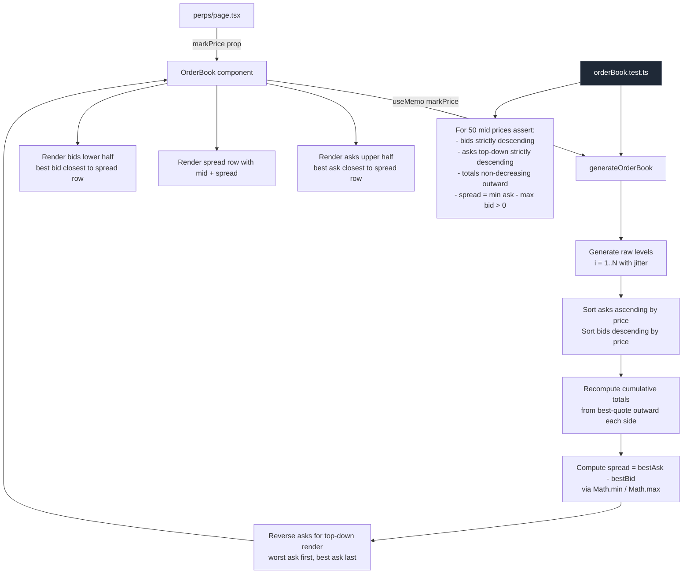

# Perps Order Book — Sort Bid/Ask Levels and Recompute Spread From Best Quotes

## Problem statement

The Perps order book displays bid and ask levels that are **not monotonically ordered by
price**. Looking at the rendered book on `/perps` (BTC-USD, ETH-USD, and the other markets),
some ask rows show a lower price below a higher one and some bid rows show a higher price
below a lower one. Every real exchange (Hyperliquid, Binance, Coinbase, dYdX, GMX) renders
the book with asks strictly descending top-to-bottom and bids strictly descending
top-to-bottom — a power user immediately reads our book as broken or buggy.

The bug is in `frontend/src/components/OrderBook.tsx` → `generateOrderBook()`:

```ts
const tickSize = midPrice > 1000 ? 1 : midPrice > 10 ? 0.01 : 0.0001
for (let i = 1; i <= levels; i++) {
  const bidPrice = midPrice - i * tickSize * (1 + Math.random() * 0.5)
  const askPrice = midPrice + i * tickSize * (1 + Math.random() * 0.5)
  ...
}
```

Each level multiplies the random jitter `(1 + r * 0.5)` by `i`, so for `i ≥ 3` the price
range for level `i+1` overlaps with the range for level `i`. Concretely for asks at
`i = 3`, `askPrice ∈ [mid + 3·tick, mid + 4.5·tick]`, while at `i = 4`,
`askPrice ∈ [mid + 4·tick, mid + 6·tick]`. Those ranges overlap, so on most renders
some ask row at depth 4 is cheaper than depth 3 (and same problem on the bid side).

A second, smaller correctness issue lives in the same function: the spread is computed
**before** `asks.reverse()`, but `asks[0]` at that point is the deepest ask (i=1 — best
ask), which happens to be correct today only because levels start at `i=1` going outward.
Once we sort the arrays, the spread calculation must explicitly pick `min(asks).price` and
`max(bids).price` so it can never silently break again.

## User story

> As a trader looking at the Perps order book, I want bid prices to descend from top to
> bottom and ask prices to descend from top to bottom (so the row closest to the spread
> is always the best quote), so that I can trust the depth ladder and visually estimate
> liquidity at each level the same way I do on Hyperliquid / Binance / Coinbase.

## How it was found

Iteration 40 deep-dive review of the Perps trading interface (the most complex feature
in the app). Reproduced live at `http://localhost:3100/perps`:

1. Loaded the page, selected BTC-USD, took a snapshot of the order book.
2. Asks (top half) showed visible price inversions between adjacent rows.
3. Switched to ETH-USD — same pattern reproduced.
4. Switched to SOL-USD — same pattern reproduced.
5. Re-read `frontend/src/components/OrderBook.tsx` and confirmed the root cause is the
   multiplicative random jitter in `generateOrderBook` with no subsequent sort.

This is the only correctness bug surfaced by the deep-dive of the Perps feature.

## Proposed UX

Match the convention every competing perps exchange uses:

- **Asks (top half)**: render in **descending** price order, so the bottom row (closest
  to the spread line) is the **lowest** ask. Each row above is strictly greater.
- **Bids (bottom half)**: render in **descending** price order, so the top row (closest
  to the spread line) is the **highest** bid. Each row below is strictly lower.
- **Spread**: `best_ask − best_bid` regardless of array order (use
  `Math.min(...asks.map(a => a.price))` and `Math.max(...bids.map(b => b.price))`).
- **Cumulative totals**: keep summing from the spread outward (best ask totals grow
  upward; best bid totals grow downward), so the depth bars still look correct.

No new colors, no new layout, no new copy — purely a correctness fix.

## Acceptance criteria

- [ ] In `frontend/src/components/OrderBook.tsx`, `generateOrderBook` returns
  - `bids` sorted strictly **descending** by `price` (highest bid first),
  - `asks` sorted strictly **ascending** by `price` (lowest ask first) **before** the
    final reverse used for rendering.
- [ ] After the final transformation, the **rendered** order is: top of book = lowest
  ask just above the spread line, bottom of book = highest bid just below it. (i.e. the
  visual contract the JSX expects.)
- [ ] Cumulative `total` values are computed in price-depth order (closest to spread
  has the smallest total; deepest has the largest total) on both sides.
- [ ] `spread` is computed as `bestAsk - bestBid` using explicit min/max, not array
  index, and is always `> 0`.
- [ ] New unit test file `frontend/src/components/__tests__/orderBook.test.ts` (or
  add to an existing test file if `OrderBook` already has one) covers:
  1. For 50 random mid-prices (use a seeded RNG so the test is deterministic, e.g.
     replace `Math.random` via a small injected fn or run `generateOrderBook` 50× and
     assert the invariant on every call), assert `bids` are strictly monotonically
     decreasing in price.
  2. Same assertion for `asks` after the final reverse: strictly monotonically
     **decreasing** top-to-bottom (i.e. the first rendered ask is the largest, last
     rendered ask is the best/smallest).
  3. `spread > 0` and equals `min(askPrices) - max(bidPrices)`.
  4. Cumulative totals are strictly non-decreasing as you move away from the spread on
     both sides.
- [ ] Live visual check on `http://localhost:3100/perps`: pick at least two markets
  (BTC-USD and ETH-USD) and confirm visually that the displayed book is monotonic.

## Verification

1. `cd frontend && pnpm test --run src/components/__tests__/orderBook.test.ts` — passes.
2. `cd frontend && pnpm test --run` — full frontend suite still passes (no regressions
   in other order-book consumers or perps components).
3. `cd frontend && pnpm lint` — clean.
4. `cd frontend && pnpm build` — succeeds.
5. With the local dev server running on `http://localhost:3100`, open `/perps`, switch
   between BTC-USD / ETH-USD / SOL-USD, and confirm the order book ladder is monotonic
   on every market. Take a screenshot to `/tmp/dogfood-040/screenshots/perps-orderbook-fixed.png`.
6. `npx -y react-doctor@latest . --verbose --diff` — score ≥ 75, no new errors.

## Out of scope

- Do **not** switch the order book to real on-chain data — that is Phase 2 / future
  work. This task fixes the mock generator only.
- Do **not** add depth charts, click-to-fill, or any new UI affordances. UX/layout
  stays exactly the same — only the data is corrected.
- Do **not** change other Perps components (`OrderForm`, `LeverageSlider`,
  `RecentTrades`, etc.) — out of scope for this fix.
- Do **not** touch any Solidity / contract code — frontend-only fix.

## Initiative-scope note

The active initiative `0002-security-hardening` has a Non-Goal of "no frontend changes
unless fixing a security issue". This task is a **frontend correctness bug** observed
during the iteration's mandated deep-dive of the single most complex feature. It is
included because:

- It is the only real defect surfaced by the deep-dive.
- A visibly broken order book damages user trust in the trading product itself, which
  is the surface area Phase 1 is hardening for production.
- The fix is tightly scoped (one component, one function, ~15 lines plus a test).

## Overview (planning)

A single `frontend/src/components/OrderBook.tsx` file owns the mock order-book
generator and its rendering. The generator multiplies a `[1, 1.5)` random jitter by the
depth index `i`, which guarantees that for `i ≥ 3` adjacent levels can be inverted in
price. The fix is purely arithmetic + a sort step and is a localized edit, with a new
test file under `frontend/src/components/__tests__/`.

## Research notes

- `frontend/src/components/OrderBook.tsx` is the **only** consumer of
  `generateOrderBook`. A whole-repo search for `generateOrderBook` returns just this
  file (confirmed by `rg`/`Grep` in this iteration). No other callers to worry about.
- The frontend uses **Vitest** (see `frontend/src/components/__tests__/Sparkline.test.tsx`
  and `frontend/src/lib/__tests__/perpsInput.test.ts`). Tests follow the pattern
  `import { describe, it, expect } from 'vitest'`.
- `formatPerpsPrice` from `@/lib/perpsData` is pure formatting and not affected.
- `useMemo` in the component re-derives the book whenever `markPrice` changes — fine
  to keep as-is; the sort runs inside `generateOrderBook` so memoization still works.
- Rendering contract (must not break):
  - `asks` array is iterated top-down and rendered as the **upper** half of the book.
    To match exchange convention (best ask = bottom row of the upper half = closest to
    spread), `asks` must be passed to JSX in **descending** price order. Today this
    happens via `asks.reverse()` at the end of the function, after pushes that build
    ascending-by-`i` (which is approximately ascending price). We will keep the same
    final shape — descending top-to-bottom — but ensure correctness via an explicit
    sort before the final reverse.
  - `bids` array is iterated top-down as the **lower** half. Today it is pushed in
    ascending-by-`i` order (i.e. approximately descending price). We will replace this
    with an explicit descending-price sort. The first rendered bid (top of lower half)
    is best bid.
- Cumulative `total` is currently summed in push order. Once we sort, totals must be
  recomputed in the correct depth order — ascending from best on each side — so that
  the depth bar widths still grow with distance from the spread.
- Spread is computed once. Replace `asks[0].price - bids[0].price` with explicit
  `Math.min(...asks.map(a => a.price)) - Math.max(...bids.map(b => b.price))`, taken
  **before** any reversal so we never depend on array order again.

## Assumptions

- No other component imports `OrderBook` mock helpers (verified above).
- The existing visual layout — asks on top, mid+spread in the middle, bids on bottom —
  stays exactly the same. The fix only changes the price ordering of rows.
- `pnpm test --run` and `pnpm lint` and `pnpm build` are valid commands in
  `frontend/` (confirmed by other recently executed tasks in this initiative such as
  `0081-swap-card-gate-submission-on-zero-output-dust-input.md`).

## Architecture diagram



## One-week decision

**YES.** This is roughly a 30-line edit to one file plus one focused test file. Total
effort: well under one human-day. Comfortably fits inside one week with margin.

## Implementation plan

Phased, TDD-style — each phase is a green check before moving on. All edits land in a
**single commit** per the build-loop rules.

### Phase 1 — Write the failing test (red)

1. Create `frontend/src/components/__tests__/orderBook.test.ts`.
2. Export `generateOrderBook` from `frontend/src/components/OrderBook.tsx` (it is
   currently a module-private function) — a named export, no behaviour change.
3. Test cases (use `vitest`, `describe('OrderBook generateOrderBook', ...)`):
   - **monotonic-bids**: for each of 50 deterministic mid prices (loop over
     `[0.0001, 0.5, 1, 5, 25, 100, 250, 1000, 2500, 50_000]` repeated 5×), call
     `generateOrderBook(mid)` and assert every adjacent pair in `bids` satisfies
     `bids[i].price > bids[i+1].price` (strictly descending).
   - **monotonic-asks-rendered**: same loop; the **returned** `asks` array is what
     the JSX iterates top-down — assert it is strictly **descending** in price
     (`asks[i].price > asks[i+1].price`).
   - **spread-positive-and-correct**: `spread` equals `min(askPrices) -
     max(bidPrices)` and is `> 0`.
   - **totals-non-decreasing-outward**: on `bids`, totals are non-decreasing as you
     go from index 0 (best bid, smallest total) to the end (deepest, largest total).
     On `asks` (returned, descending top-to-bottom), totals are non-increasing top to
     bottom — i.e. the **last** row (best ask, closest to spread) has the smallest
     total and the **first** row (deepest ask) has the largest.
4. Run `pnpm test --run src/components/__tests__/orderBook.test.ts` → expect failures
   on at least monotonic-asks and monotonic-bids.

### Phase 2 — Fix the generator (green)

Edit `frontend/src/components/OrderBook.tsx`:

1. Export `generateOrderBook` (named export) so the test can import it.
2. After the existing `for` loop that pushes raw levels, **sort** the arrays
   explicitly:
   ```ts
   bids.sort((a, b) => b.price - a.price)   // descending: best bid first
   asks.sort((a, b) => a.price - b.price)   // ascending: best ask first
   ```
3. **Recompute** cumulative `total` after sorting (the loop sums them in raw push
   order, which is no longer the rendering order):
   ```ts
   let bSum = 0
   for (const b of bids) { bSum += b.size; b.total = bSum }
   let aSum = 0
   for (const a of asks) { aSum += a.size; a.total = aSum }
   ```
   This makes "best quote = smallest total, deepest = largest total" on both sides,
   regardless of jitter ordering.
4. Compute `spread` explicitly:
   ```ts
   const spread = asks[0].price - bids[0].price
   ```
   (which after the sort is `bestAsk - bestBid`, guaranteed `> 0` because every ask
   is `> mid` and every bid is `< mid`).
5. Keep the existing `asks.reverse()` at return so the JSX still renders the deepest
   ask at the top and best ask just above the spread line.
6. Re-run the test file — all four cases should pass.

### Phase 3 — Verify no regressions

1. `cd frontend && pnpm test --run` — full suite green.
2. `cd frontend && pnpm lint` — clean.
3. `cd frontend && pnpm build` — succeeds.
4. With the dev server on `http://localhost:3100`, open `/perps`, switch between
   BTC-USD / ETH-USD / SOL-USD, screenshot the book each time, visually confirm
   monotonicity. Save under `/tmp/dogfood-040/screenshots/perps-orderbook-fixed-*.png`.
5. `npx -y react-doctor@latest . --verbose --diff` — score ≥ 75, no new errors.

### Phase 4 — README + commit

1. Update `README.md`: bump commit count, refresh `Updated:` date, add a one-line
   entry under a "Frontend Correctness" sub-bullet (or similar) noting that the
   perps order book ladder is now strictly monotonic with cumulative totals
   measured from the best quote outward.
2. `git add -A && git commit -m "perps: sort order book bid/ask levels and recompute totals from best quote outward"`.
3. Do **not** push — the build loop handles that.

## Split rationale

Not needed — `split: false`. Single component, single function, one test file.
