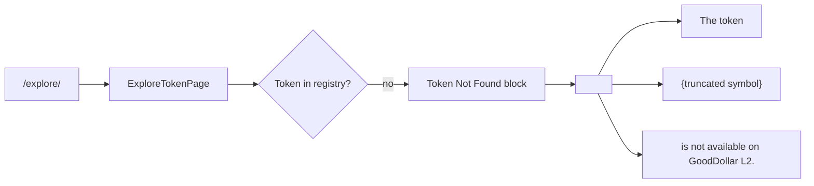

# Explore — Stop "GoodDollar L2" Brand Text From Wrapping Mid-Word on Token-Not-Found Page

## Overview (planner)

Single-file, ~3-line className change in
`frontend/src/app/(app)/explore/[symbol]/page.tsx`. Move `break-all`
from the outer `<p>` (which currently breaks the brand "GoodDollar"
into "Goo dDollar") onto an inner `<span>` that wraps only the
user-controlled symbol value. Outer paragraph switches to
`break-words` (Tailwind = `overflow-wrap: break-word`) so regular
words wrap only at whitespace.

## Research notes

- Task #0054 introduced `break-all` on the whole paragraph to defend
  against arbitrary URL segments — but `break-all` is too aggressive
  for prose. `break-words` is the correct primitive for prose +
  `break-all` on the unbreakable inner token is the standard CSS
  pattern.
- The symbol is already truncated to 24 chars by
  `truncateSymbolForDisplay`, so the inner `break-all` rarely fires
  in practice but provides defense-in-depth for super-long input.
- Existing test file:
  `frontend/src/app/(app)/explore/[symbol]/__tests__/page.test.tsx`
  — must be inspected for any assertion on the paragraph's class
  attribute.
- React's HTML escaping still applies, so the XSS posture is unchanged.

## Architecture



## One-week decision

**YES.** Pure className change in one file plus a test tweak. Total
edit < 10 lines. Done in well under an hour.

## Implementation plan

1. Edit `frontend/src/app/(app)/explore/[symbol]/page.tsx`:
   replace `break-all` on the paragraph with `break-words` and wrap
   the symbol in a `<span className="break-all">…</span>`.
2. Update any test assertion in
   `frontend/src/app/(app)/explore/[symbol]/__tests__/page.test.tsx`
   that checks the old class string.
3. Verify with `agent-browser` (or local Next dev) on
   `/explore/0xdeadbeefdeadbeef…` and `/explore/AAAAA…` that
   (a) "GoodDollar L2" no longer breaks mid-word, and
   (b) ultra-long symbols still wrap inside `max-w-md`.
4. `npx react-doctor@latest . --verbose --diff` then commit.

## Problem

On `/explore/<unknown-symbol>` (e.g. `/explore/0xdeadbeefdeadbeefdeadbeefdeadbeefdeadbeef`
or `/explore/AAAAAAAAAAAAAAAAAAAAAAAAAAAAAAAA…`), the "Token Not Found" page
renders this paragraph:

> The token "0XDEADBEEFDEADBEEFDEADBE…" is not available on Goo
> dDollar L2.

The brand name "GoodDollar" is split across two lines as "Goo / dDollar".
This is a regression introduced by task #0054, which added
`break-all` to the **whole** paragraph in order to wrap arbitrary
user-controlled symbol strings.

`word-break: break-all` breaks *any* word at *any* character — including
brand words with no actual overflow issue — so even short, ordinary text
in the same sentence is mangled.

Captured in iteration #41 review:
- `.autobuilder/review-screenshots/iter41/explore-invalid-token.png`
- `.autobuilder/review-screenshots/iter41/explore-long-symbol.png`

Both clearly show "Goo dDollar L2." instead of "GoodDollar L2."

## Root Cause

`frontend/src/app/(app)/explore/[symbol]/page.tsx` line 144:

```tsx
<p className="text-sm text-gray-400 mb-6 max-w-md break-all">
  The token "{truncateSymbolForDisplay(symbol)}" is not available on GoodDollar L2.
</p>
```

`break-all` is applied to the entire `<p>`, so the wrap algorithm is free
to split *any* word — and it picks "GoodDollar" because of how the line
ends inside the `max-w-md` container.

The symbol is already truncated to 24 chars by `truncateSymbolForDisplay`,
so the only string that could legitimately need character-level wrapping
is the symbol itself.

## Fix

Restrict the `break-all` (or, better, `break-words` with `overflow-wrap`)
to *only* the symbol value. Keep the brand sentence using normal word
wrapping.

Suggested patch:

```tsx
<p className="text-sm text-gray-400 mb-6 max-w-md break-words">
  The token{' '}
  <span className="break-all">&quot;{truncateSymbolForDisplay(symbol)}&quot;</span>
  {' '}is not available on GoodDollar L2.
</p>
```

- `break-words` on the paragraph (Tailwind = `overflow-wrap: break-word`)
  lets the layout break long unbreakable strings *only when needed*, never
  ordinary words.
- The inner `<span class="break-all">` ensures the symbol itself can
  still break at any character if it somehow exceeds the line width.

## Acceptance Criteria

1. On `/explore/0xdeadbeefdeadbeefdeadbeefdeadbeefdeadbeef`, the
   sentence renders "GoodDollar L2." on a single contiguous token
   (no mid-word split).
2. On `/explore/AAAAAAAAAAAAAAAAAAAAAAAAAAAAAAAAAAAAAAAAAA`, the
   symbol still wraps inside the `max-w-md` container without
   horizontal overflow.
3. Existing tests in
   `frontend/src/app/(app)/explore/[symbol]/__tests__/page.test.tsx`
   still pass and any test asserting on the wrapping class is updated.
4. No new visual regressions on the surrounding "Back to Explore"
   button layout.

## Non-Goals

- Do **not** rewrite the truncation helper.
- Do **not** change the page copy.
- Do **not** touch other `break-all` usages in the codebase in this task.

## Risk

Tiny — pure className change inside one paragraph, no logic change.
