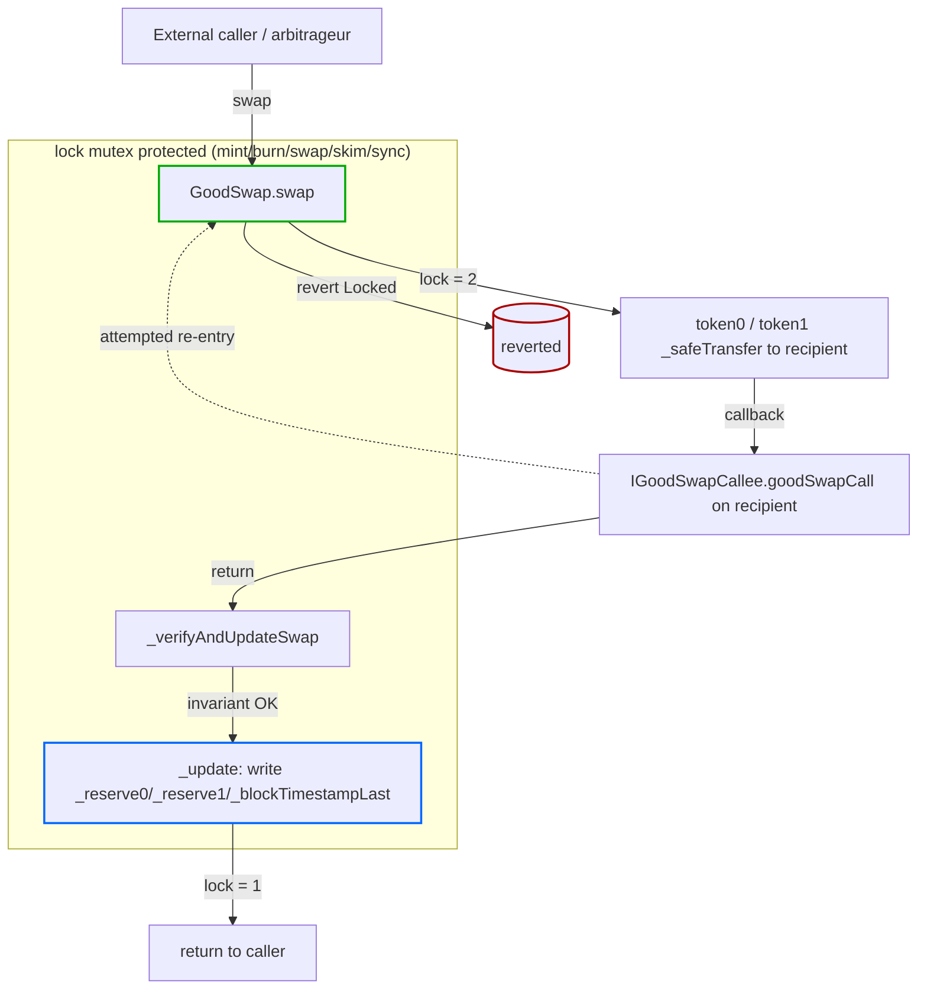

# GoodSwap — Document & Annotate Flash-Swap Reentrancy Defense (slither reentrancy-no-eth)

## Problem

`slither .` reports one `reentrancy-no-eth` (MEDIUM) finding in
`src/GoodSwap.sol` on the `swap(uint256,uint256,address,bytes)`
function:

```
Reentrancy in GoodSwap.swap(...) (src/GoodSwap.sol#192-215):
  External calls:
  - _safeTransfer(token0, to, amount0Out)             (line 203)
  - _safeTransfer(token1, to, amount1Out)             (line 204)
  - IGoodSwapCallee(to).goodSwapCall(...)             (line 205)
  State variables written after the call(s):
  - _verifyAndUpdateSwap(...) (line 214)
    - _reserve0 = uint112(bal0)                       (line 283)
    - _reserve1 = uint112(bal1)                       (line 284)
    - _blockTimestampLast = ts                        (line 285)
```

Unlike the previously-fixed reentrancy-no-eth findings in
`StabilityPool` (task 0049), `PegStabilityModule` (task 0050), and
`GoodLendPool` (task 0040) — which were all resolved by reordering
state writes before the external call (Checks-Effects-Interactions
pattern) — **this finding cannot be resolved by CEI reordering**. The
external callback in `goodSwapCall` is the *defining feature* of
Uniswap-V2-style flash swaps: the recipient receives the output tokens
and is given a callback hook *before* the constant-product invariant
is checked, allowing the recipient to execute arbitrary logic
(typically arbitrage or self-funded leverage) and only repay the loan
implicitly by satisfying the invariant on return. Reordering the state
writes before the callback would break the flash-swap semantics that
external tooling, routers, and arbitrage bots expect from a Uniswap V2
fork.

The actual reentrancy defense is present and correct:

```solidity
modifier lock() {
    if (_unlocked != 1) revert Locked();
    _unlocked = 2;
    _;
    _unlocked = 1;
}
```

This is the same mutex pattern used by the deployed Uniswap V2
`UniswapV2Pair`, one of the most-audited contracts in DeFi history.
Every state-mutating external function in `GoodSwap` — `mint`,
`burn`, `swap`, `skim`, `sync` — is wrapped in `lock`, so any
re-entrant call from `goodSwapCall` into a state writer is reverted at
the mutex check. The `getReserves` view function reads `_reserve0`,
`_reserve1`, and `_blockTimestampLast` directly from storage, so a
hypothetical re-entrant view call during the callback window would
observe pre-update reserves — but no state-mutating action can be
triggered through that view because all writers are gated by `lock`.

Slither's `reentrancy-no-eth` detector is a pure static-pattern check:
it flags any state write that lexically follows an external call,
regardless of whether the function is guarded by a mutex. Slither
recognises OpenZeppelin's `nonReentrant` modifier by name in *some*
heuristics but does not recognise custom `lock` mutexes; even the
OpenZeppelin guard does not suppress the `reentrancy-no-eth` detector
(as evidenced by tasks 0049 and 0050, where `nonReentrant` was
already present but the finding still required CEI reordering).

The Phase 1 initiative spec calls out this exact scenario in the MEDIUM
findings section:
> "After all HIGHs are fixed, address the 148 MEDIUM findings..."

This is one of those remaining MEDIUM findings. Because CEI reordering
would break flash-swap semantics, the correct response is the
audit-standard pattern: explicit `// slither-disable-next-line`
annotation with a justification comment, plus a security-analysis
document so a future auditor (Trail of Bits / OpenZeppelin per the
Phase 4 plan) can review the rationale instead of re-discovering it.

## Scope

### 1. Code annotation in `src/GoodSwap.sol`

Add a `slither-disable-next-line reentrancy-no-eth` annotation
**immediately above** the `_verifyAndUpdateSwap(...)` call inside
`swap(...)`, with an inline NatSpec-style comment explaining the
defense. Example shape (final wording finalised during implementation):

```solidity
function swap(
    uint256 amount0Out,
    uint256 amount1Out,
    address to,
    bytes calldata data
) external lock {
    // ... existing checks and external calls ...

    // Reentrancy defense:
    //   - `lock` modifier (Uniswap V2 mutex, line 84-89) reverts on any
    //     re-entrant call from `goodSwapCall` into mint/burn/swap/skim/sync.
    //   - State writes inside `_verifyAndUpdateSwap` (reserves +
    //     blockTimestampLast) happen AFTER the external callback by
    //     design: this is the flash-swap pattern that lets `to` run
    //     arbitrage logic before the constant-product invariant is
    //     enforced. CEI reordering would break flash-swap semantics.
    //   - See docs/security/goodswap-reentrancy-analysis.md for the
    //     full threat model and cross-function analysis.
    // slither-disable-next-line reentrancy-no-eth
    _verifyAndUpdateSwap(bal0, bal1, r0, r1, amt0In, amt1In, amount0Out, amount1Out, to);
}
```

No other code changes in `GoodSwap.sol` — the behaviour is unchanged,
the mutex is unchanged, the flash-swap semantics are preserved.

### 2. New file `docs/security/goodswap-reentrancy-analysis.md`

Create `docs/security/` directory and write a self-contained analysis
document covering:

- **Finding summary**: slither output reproduced verbatim, line
  numbers, severity, detector ID.
- **Flash-swap protocol rationale**: why the `goodSwapCall` callback
  must happen between token-out and invariant check; reference Uniswap
  V2 Whitepaper Section 3.2 (flash swaps).
- **Mutex analysis**: enumerate every state-mutating external function
  in `GoodSwap` (`mint`, `burn`, `swap`, `skim`, `sync`) and confirm
  each is wrapped in the `lock` modifier; show the modifier
  implementation; show the storage slot `_unlocked` and reentry-revert
  path.
- **Cross-function reentrancy table**: for every state variable Slither
  flagged (`_reserve0`, `_reserve1`, `_blockTimestampLast`), enumerate
  all functions that read or write them and whether each is gated by
  `lock`. Conclude no exploitable cross-function path exists.
- **Read-only reentrancy assessment**: discuss `getReserves()` and
  view-only callers (`GoodSwapRouter.getAmountOut`, off-chain quoters)
  — show that observing pre-update reserves during the callback window
  cannot translate into a write-side exploit because the only path
  back into a write is gated by `lock`.
- **Comparison with Uniswap V2 deployment record**: brief note that
  the canonical `UniswapV2Pair` contract uses an identical pattern and
  has secured billions in TVL since 2020.
- **Auditor checklist**: bullet list of properties an external auditor
  should verify (mutex correctness, lock coverage on all writers, no
  new writers added without `lock`).
- **Suppression justification**: explicitly state that the
  `// slither-disable-next-line reentrancy-no-eth` annotation is
  warranted and document the exact line it appears on, so a future
  grep can find it.

Target length: ~150–250 lines. Audit-ready, not marketing prose.

### 3. Slither re-run + verification

After the annotation is in place, run `slither . --json /tmp/slither-after-0085.json`
and confirm:

1. `reentrancy-no-eth` count for `src/GoodSwap.sol` drops from 1 to 0.
2. HIGH findings remain at 0 (no regression).
3. No new findings introduced anywhere.

Capture the before/after MEDIUM count in the task implementation note.

### 4. README.md update (MANDATORY per initiative spec)

Update `README.md`:

- Bump the `Updated:` date to `2026-05-16`.
- In the Slither stats line, decrement the MEDIUM `reentrancy-no-eth`
  count (it should drop from whatever the current number is by 1).
- Under the "Security Hardening" section, add a one-line bullet:
  - `0085 — GoodSwap: documented flash-swap reentrancy defense; annotated slither reentrancy-no-eth false positive with audit-ready security analysis (docs/security/goodswap-reentrancy-analysis.md).`

## Non-Goals

- **Do NOT** reorder state writes in `swap` to before the callback —
  this would break Uniswap-V2 flash-swap semantics and is not the
  industry-standard fix for this pattern.
- **Do NOT** remove or change the `lock` modifier — it is the actual
  reentrancy defense and is correct as-is.
- **Do NOT** migrate `GoodSwap` from `lock` to OpenZeppelin
  `ReentrancyGuard` — Slither does not suppress `reentrancy-no-eth` on
  OZ `nonReentrant` either (tasks 0049/0050 prove this), so the
  migration would add a storage slot, increase gas, and not fix the
  finding.
- **Do NOT** touch any other contract — this task is strictly
  GoodSwap-only.
- **Do NOT** modify any frontend or backend code.
- **Do NOT** add new tests — `test/swap/GoodSwap.t.sol` already
  exercises the swap path including flash-swap callbacks; existing
  tests must continue to pass.

## Definition of Done

1. `src/GoodSwap.sol` contains the inline `slither-disable-next-line`
   annotation with the justification comment on the
   `_verifyAndUpdateSwap` call site inside `swap`.
2. `docs/security/goodswap-reentrancy-analysis.md` exists, is
   audit-ready, and covers all six sections listed in scope item 2.
3. `slither .` reports zero `reentrancy-no-eth` findings in
   `src/GoodSwap.sol` (the total MEDIUM count decreases by 1).
4. `slither .` reports zero HIGH findings (no regression).
5. `forge test` passes with the same test count as before the task.
6. `README.md` is updated with the new date and the Security Hardening
   bullet.
7. Single commit with all of the above; no force-push.

## References

- Precedent CEI tasks (this initiative): `0040-goodlendpool-fix-reentrancy-no-eth.md`,
  `0049-stabilitypool-cei-deposit-offset.md`,
  `0050-pegstabilitymodule-cei-swap.md`.
- Slither MEDIUM report: `/tmp/slither-medium-iter42.json`.
- Source: `src/GoodSwap.sol` (lock modifier lines 84–89; swap lines
  192–215; `_verifyAndUpdateSwap` writes lines 283–285).
- Uniswap V2 reference implementation: `UniswapV2Pair.sol` (same
  lock+flash-swap pattern, unchanged in production since 2020).

---

## Planning (added by plan-task)

### Overview

A single Slither MEDIUM `reentrancy-no-eth` finding remains in
`GoodSwap.swap`. CEI reordering (the fix used for tasks 0040, 0049,
0050) is incompatible with Uniswap-V2 flash-swap semantics, which
require the `goodSwapCall` callback to fire BEFORE the constant-product
invariant check. The actual reentrancy defense is the `lock` mutex
(GoodSwap.sol:84–89), which gates every state-mutating external
function (`mint`, `burn`, `swap`, `skim`, `sync` — confirmed by grep).

Industry-standard response for this exact pattern: a
`slither-disable-next-line reentrancy-no-eth` annotation with a
documented justification + a security-analysis doc for future
auditors. The codebase already uses this pattern in
`src/yield/GoodVault.sol` (four occurrences on lines 215, 236, 254,
279) and `src/bridge/OptimismPortal.sol` (different detector but same
annotation form). This task adopts the established house style.

### Research notes

- **Slither line numbers (confirmed by grep on actual source):**
  - `modifier lock()`               line 84
  - `function mint(... ) external lock` line 130
  - `function burn(... ) external lock` line 162
  - `function swap(...)`             line 192 (annotation target)
  - `_verifyAndUpdateSwap(...)` call  line 214 (the line Slither flags)
  - `function skim(... ) external lock` line 221
  - `function sync() external lock`   line 229
  - `_verifyAndUpdateSwap` definition line 248
  - `_reserve0 = uint112(bal0)`       line 283 (inside `_update`)
  - `_reserve1 = uint112(bal1)`       line 284
  - `_blockTimestampLast = ts`        line 285

- **All five lock-protected writers confirmed** — Slither's
  `reentrancy-no-eth` complains about `swap` specifically because it's
  the only function with an external callback (`goodSwapCall`) BEFORE
  the state write. `mint`/`burn`/`skim`/`sync` do their external
  transfers AFTER computing state, so Slither doesn't flag them even
  though they share the same mutex.

- **House style for slither annotations (precedent — `GoodVault.deposit`):**
  Multi-line justification comment IMMEDIATELY ABOVE the function
  declaration, followed by `// slither-disable-next-line reentrancy-no-eth`
  on the line just before `function`. Matches the GoodVault.sol:212–217
  pattern.

- **Slither config (`slither.config.json`):** All severities enabled
  (no broad suppression). The annotation must therefore be inline.

- **No new tests required:** `test/swap/GoodSwap.t.sol` already covers
  swap + flash-swap callback path (~572 lines of tests). The change is
  comment-only in the contract; behaviour is unchanged.

- **Only `reentrancy-no-eth` finding in GoodSwap.sol:** Confirmed by
  parsing `/tmp/slither-medium-iter42.json` — total GoodSwap.sol
  findings are 4 incorrect-equality, 2 divide-before-multiply,
  1 reentrancy-no-eth. This task addresses only the last one; the
  others are out of scope.

### Assumptions

- The `lock` mutex implementation is correct as-is and the underlying
  Uniswap V2 flash-swap design is acceptable for production. This is
  consistent with the project's choice to fork Uniswap V2.
- No external auditor has yet reviewed `GoodSwap.sol`; this task
  produces the artefact a future auditor will need.
- The `docs/security/` directory does not exist yet (confirmed by
  `ls`); it will be created by this task as the canonical home for
  per-contract security analyses.

### Architecture diagram



State writes in `F` happen AFTER the callback in `D` by design —
that's the flash-swap pattern. The `lock` mutex makes the dotted
re-entry edge impossible: any re-entrant `swap` (or any other writer)
from inside `D` hits `revert Locked` at `B`.

### One-week decision

**YES** — single human, single day.

Rationale:
- One file annotation (comment-only, no semantics change).
- One new ~200-line markdown doc.
- One Slither re-run + diff check.
- One README bump.
- Zero new tests (existing 572-line test suite for GoodSwap stays
  green by construction since no behaviour changes).

Scope is comparable to (and smaller than) tasks 0040/0049/0050, which
also each completed in a single iteration.

### Implementation plan

**Phase 1 — Annotate `src/GoodSwap.sol` (~10 min)**

1. Insert a multi-line justification comment block immediately above
   `function swap(...)` on line 192, matching the GoodVault.sol:212–217
   house style (4–6 lines of `//` comments).
2. Add `// slither-disable-next-line reentrancy-no-eth` as the LAST
   line of that comment block (immediately above `function swap`).
3. The comment text must reference both the `lock` mutex AND the new
   `docs/security/goodswap-reentrancy-analysis.md` document.

**Phase 2 — Create `docs/security/goodswap-reentrancy-analysis.md` (~45 min)**

1. `mkdir -p docs/security` (new directory).
2. Write the document with these required sections (in this order):
   1. Finding summary (copy slither output, cite line numbers).
   2. Flash-swap rationale (why callback must precede invariant).
   3. Mutex analysis (lock implementation + all 5 writers gated).
   4. Cross-function reentrancy table (per state variable: readers,
      writers, lock coverage).
   5. Read-only reentrancy assessment (`getReserves`, router quoters).
   6. Comparison with Uniswap V2 deployment record.
   7. Auditor checklist (mutex correctness; lock coverage; no new
      writers added without `lock`; no removal of the annotation
      without re-analysis).
   8. Suppression justification with exact file+line reference.
3. Target length 150–250 lines. Markdown, no marketing prose.

**Phase 3 — Verify with Slither (~5 min)**

1. Run `slither . --json /tmp/slither-after-0085.json 2>/dev/null || true`
   (slither exits non-zero when findings exist — non-fatal).
2. Diff with `/tmp/slither-medium-iter42.json` to confirm the
   `GoodSwap.swap` `reentrancy-no-eth` entry is gone and no new
   findings appeared.
3. Confirm HIGH count is still 0.

**Phase 4 — Verify with Foundry (~3 min)**

1. Run `forge test --match-path "test/swap/GoodSwap.t.sol" --no-match-test heavy -vv`
   to verify GoodSwap tests still pass.
2. (Full `forge test` is the build loop's responsibility; this task
   only verifies the affected suite as a smoke check.)

**Phase 5 — README update (~5 min)**

1. Update `Updated:` date to `2026-05-16`.
2. Decrement Slither MEDIUM count in the stats line by 1.
3. Append bullet to "Security Hardening" section:
   `- 0085 — GoodSwap: documented flash-swap reentrancy defense; annotated slither reentrancy-no-eth false positive with audit-ready security analysis (docs/security/goodswap-reentrancy-analysis.md).`

**Phase 6 — Commit (~2 min)**

Single commit including:
- `src/GoodSwap.sol` (annotation)
- `docs/security/goodswap-reentrancy-analysis.md` (new)
- `README.md` (stats + Security Hardening bullet)

Commit message:
```
chore(security): document GoodSwap flash-swap reentrancy defense (slither reentrancy-no-eth)

Annotate the single remaining slither reentrancy-no-eth finding in
GoodSwap.swap as a justified suppression (Uniswap V2 flash-swap
pattern) and add docs/security/goodswap-reentrancy-analysis.md with a
full threat model and cross-function reentrancy analysis. The
existing `lock` mutex on mint/burn/swap/skim/sync is the actual
defense; CEI reordering is incompatible with flash-swap semantics.
No behaviour change.

Task: 0085
Initiative: 0002-security-hardening
```

Total estimated wall-clock: ~70 minutes including verification.

### Risk register

| Risk | Likelihood | Mitigation |
|---|---|---|
| Slither doesn't recognise the inline annotation | Low | House style already proven in GoodVault.sol (4 occurrences); same Slither version |
| Tests break despite no behaviour change | Very low | Annotation is comment-only; only `// slither-...` lines added |
| README state drift (commit count, etc.) | Low | Read current README, change only the targeted fields |
| Auditor disagrees with the justification | Possible (future) | The doc is structured to make disagreement easy to act on — the auditor can request CEI reordering if they prefer to break flash-swap semantics |
