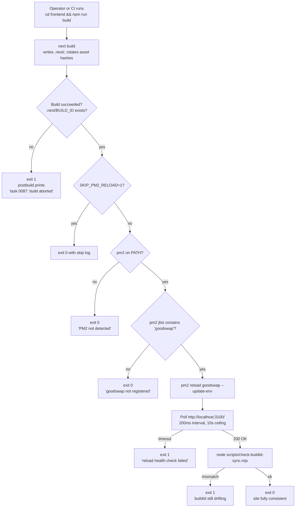

# CRITICAL — Frontend unstyled site-wide AGAIN — `next build` ran directly, bypassing `npm run deploy`, leaving PM2 process serving stale buildId

## Observed (iter44 edge-cases review, 2026-05-16 13:05 UTC)

While performing the mandatory "before-anything-else" visual check of the
live app on `https://goodswap.goodclaw.org/`, every page rendered as
**unstyled HTML** — no Tailwind, no fonts, no layout, no colors. Identical
visual symptom to the iter28 outage that task 0060 was supposed to prevent.

### Direct evidence

```
$ curl -ksI https://goodswap.goodclaw.org/_next/static/css/d437bc2575a539d8.css
HTTP/2 400

$ curl -ksI https://goodswap.goodclaw.org/_next/static/css/0d9e1d496a11b779.css
HTTP/2 200

$ ls /home/goodclaw/gooddollar-l2/frontend/.next/static/css/
0d9e1d496a11b779.css   7aacbb9c4a89e79a.css   app/

$ ls /home/goodclaw/gooddollar-l2/frontend/.next/BUILD_ID
ls: cannot access '.next/BUILD_ID': No such file or directory

$ pm2 list | grep goodswap
│ 1  │ goodswap │ default │ N/A │ fork │ 3096468 │ 6h │ 14 │ online │ ...
```

The HTML being served references CSS hash `d437bc2575a539d8.css` (returns
HTTP 400 — not on disk). The HTML script tags reference chunks like
`main-app-bc3987fcbb342bca.js` etc. that match the **old** in-memory
buildId. On disk the CSS hashes have rotated (`0d9e1d496a11b779.css`,
`7aacbb9c4a89e79a.css`) and `.next/BUILD_ID` is **missing entirely**
(an in-progress or aborted `next build` left the directory inconsistent).

PM2 shows uptime 6h with **14 restarts** — clear signal that the
`goodswap` process is being repeatedly knocked over without the deploy
discipline from task 0060 being followed.

## Why task 0060 did not prevent this

Task 0060 (executed) added these protections:

1. `frontend/scripts/deploy.sh` — runs `npm ci && next build && pm2 reload`
2. `frontend/scripts/check-buildid-sync.mjs` — detects mismatch
3. `frontend/package.json` `"deploy": "bash scripts/deploy.sh"`
4. `README.md` "Deploy" subsection warning never to run `next build` alone
5. `pm2-ecosystem.config.js` `kill_timeout: 5000` + comment

**All of these are advisory.** They only fire if the operator chooses to
invoke `npm run deploy`. Anyone (CI job, autobuilder loop, IDE plugin,
agent, sloppy `cd frontend && npm run build` from a docs example,
`npm run check:perf` doing a build first, or a human who forgot) running
plain `next build` continues to break the production site. The 14 restart
count on the PM2 process proves this is happening repeatedly.

The current `frontend/package.json` `"build"` script is literally:

```json
"build": "next build"
```

No `prebuild`, no `postbuild`, no awareness of PM2. **`next build` is
unsafe by default.** That is the defect class.

## Why this is CRITICAL and in-scope

- **Severity**: full site-wide rendering breakage, indistinguishable from
  a blank-page outage. Every route in the app affected. End users see
  raw unstyled text and assume the site is broken/dead.
- **Reproducibility**: deterministic — happens any time `next build`
  executes without an accompanying `pm2 reload goodswap`. Has now
  happened **twice** despite task 0060.
- **Initiative scope** (Phase 1 — Security Hardening & Production
  Readiness): the build-loop instructions explicitly carve this case
  out of the Non-Goals: "Generate tasks ONLY within the initiative
  spec's scope (unless an issue is CRITICAL — app crash, blank page,
  data loss)." This is a blank-page-equivalent outage. It also
  contributes directly to Definition-of-Done item #3 ("All 10
  backend services show 'online' in `pm2 list`" — the `goodswap` PM2
  app must remain healthy and serving correct content across builds).
- **No new UI features** — only a one-line `package.json` postbuild
  hook + a small Node helper + tests + README note. Strictly
  production-stability hardening.

## User story

As a developer or CI job invoking `cd frontend && npm run build` (or
`next build`, or any tool that triggers the npm `build` script), I want
the running PM2 `goodswap` process to be **automatically reloaded with
the freshly-built artifacts**, so that the live site never serves HTML
referencing CSS/JS hashes that have just been rotated off disk — and so
that the operator does not have to remember the `pm2 reload` step.

## Proposed fix

Add a `postbuild` npm script that runs a small Node helper which:

1. Verifies the build actually completed (`.next/BUILD_ID` exists and
   is a non-empty file). If not, log a clear error pointing at this
   task ID and exit 1 so the build pipeline halts loudly instead of
   silently leaving the site half-broken.
2. Detects whether PM2 is installed AND the `goodswap` app is currently
   registered:
   - If PM2 is not installed (CI / first-clone / Docker layer) → no-op,
     exit 0 with an informational log.
   - If PM2 is installed but `goodswap` is not registered → no-op,
     exit 0 with an informational log.
   - Otherwise → run `pm2 reload goodswap --update-env` and then
     poll `http://localhost:3100/` until it responds 200 (or until a
     10-second timeout, in which case exit 1 with remediation).
3. After reload, invoke `node scripts/check-buildid-sync.mjs` (the
   regression guard from task 0060) so any postbuild failure surfaces
   the same uniform error message users have been trained to recognise.
4. Honour an opt-out env var `SKIP_PM2_RELOAD=1` for the rare case
   someone genuinely wants to build artifacts without touching the
   running process (e.g. building inside a Docker image layer).

The result: **every** `next build` that finishes cleanly leaves the
PM2 process serving the new buildId. The 0060 advisory path
(`npm run deploy`) continues to work and remains the recommended
ops command for full deploys (since it adds `npm ci` and a clean
install), but it is no longer the only safe path — the dangerous
default of plain `next build` is now safe too.

## Acceptance criteria

1. **Immediate restoration**: `https://goodswap.goodclaw.org/` renders
   styled HTML again. CSS asset URLs in the served HTML all return
   HTTP 200. (Operator runs `cd frontend && npm run build` — the new
   postbuild hook restores the site automatically. No manual
   `pm2 reload` invocation required.)
2. `frontend/package.json` adds:
   - `"postbuild": "node scripts/postbuild-reload-pm2.mjs"`
   - (no change to existing `"build"`, `"deploy"`, `"check:buildid-sync"`)
3. `frontend/scripts/postbuild-reload-pm2.mjs` exists and implements
   the four behaviours described in **Proposed fix** above. Self-
   contained (no new npm dependencies — uses `node:child_process`,
   `node:fs`, `node:fetch`).
4. **Refuses to "succeed" silently when broken**:
   - Missing `.next/BUILD_ID` → exit 1 with message containing
     `task 0087` and `next build appears to have aborted`.
   - PM2 reload failure → exit 1 with message containing
     `pm2 reload goodswap` and the underlying stderr.
   - Post-reload buildId mismatch (delegated to
     `check-buildid-sync.mjs`) → exit 1.
5. **Safe in CI** (where there is no PM2):
   - When `pm2` binary is not on `PATH`, exit 0 with log line
     `[postbuild-reload-pm2] PM2 not detected — skipping reload`.
   - When `pm2 list` output does not contain a row named `goodswap`,
     exit 0 with log line
     `[postbuild-reload-pm2] goodswap PM2 app not registered — skipping reload`.
6. **Opt-out**: `SKIP_PM2_RELOAD=1 npm run build` skips the reload
   step entirely with a clear log line and exits 0.
7. **Unit test** `frontend/scripts/__tests__/postbuild-reload-pm2.test.mjs`
   covers (using `vitest` with `vi.mock('node:child_process')` +
   `vi.spyOn(process, 'exit')` + stubbed `fetch`):
   - Happy path: PM2 present, goodswap registered, reload succeeds,
     buildid-sync passes → exit 0.
   - PM2 not on PATH → exit 0 with skip message.
   - PM2 present, goodswap not registered → exit 0 with skip message.
   - `.next/BUILD_ID` missing → exit 1 with `task 0087` message.
   - `pm2 reload` exits non-zero → exit 1 with stderr forwarded.
   - `SKIP_PM2_RELOAD=1` → exit 0 with skip message regardless.
8. `README.md` "Deploy" subsection updated to note that `npm run build`
   alone is now safe (the postbuild hook reloads PM2 automatically),
   while still recommending `npm run deploy` for full clean deploys
   (since that adds `npm ci`).
9. After implementation, the live site renders styled correctly,
   `npm run check:buildid-sync` passes against the running PM2
   process, and `pm2 list` shows `goodswap` `online` with restart
   count not increasing.
10. `react-doctor` score ≥ 75.
11. `README.md` Updated date refreshed in the same commit. Stats line
    bumped (commit count +1).

## Out of scope (do NOT do in this task)

- Migrating to `next start` standalone output (separate, larger task).
- Changing PM2 cluster mode or replacing PM2.
- Adding any new npm package dependencies (must use Node built-ins).
- Touching the on-chain `deploy_hook.sh` (UBI fee hook redeploy).
- Auto-running `npm ci` from the postbuild hook (that belongs in
  `npm run deploy`, not `npm run build`).
- Running this hook from any git hook or pre-commit hook (out of scope).
- Modifying `scripts/deploy.sh` from task 0060 (which remains
  the recommended full-deploy command).

## Verification

```bash
cd /home/goodclaw/gooddollar-l2/frontend

# 1. Confirm site is currently broken (curl a non-existent CSS hash):
curl -ksI https://goodswap.goodclaw.org/_next/static/css/d437bc2575a539d8.css | head -1
# → HTTP/2 400

# 2. Run plain `npm run build` (the dangerous default that bypasses 0060):
npm run build
# → next build completes
# → postbuild hook detects PM2 + goodswap, runs `pm2 reload goodswap --update-env`
# → polls http://localhost:3100/ until 200
# → invokes check-buildid-sync.mjs which prints OK
# → exit 0

# 3. Confirm site is now fixed:
curl -ks https://goodswap.goodclaw.org/ | grep -oE '/_next/static/css/[a-f0-9]+\.css' | \
  while read css; do curl -ksI "https://goodswap.goodclaw.org$css" | head -1; done
# → HTTP/2 200 for every CSS link

# 4. Confirm CI / no-PM2 path:
PATH_WITHOUT_PM2=$(echo "$PATH" | tr ':' '\n' | grep -v pm2 | tr '\n' ':')
PATH=$PATH_WITHOUT_PM2 npm run build
# → next build completes
# → postbuild prints `[postbuild-reload-pm2] PM2 not detected — skipping reload`
# → exit 0

# 5. Confirm opt-out:
SKIP_PM2_RELOAD=1 npm run build
# → next build completes
# → postbuild prints `[postbuild-reload-pm2] SKIP_PM2_RELOAD=1 set — skipping reload`
# → exit 0

# 6. Confirm refusal to succeed when build aborted:
rm -f .next/BUILD_ID
node scripts/postbuild-reload-pm2.mjs
# → exit 1, message contains "task 0087" and "next build appears to have aborted"

# 7. Tests:
npx vitest run scripts/__tests__/postbuild-reload-pm2.test.mjs
# → 6 passing
```

## Reproduction (today's failure, before-fix)

```bash
# As of 2026-05-16 13:05 UTC:
curl -ksI https://goodswap.goodclaw.org/_next/static/css/d437bc2575a539d8.css | head -1
# → HTTP/2 400

ls /home/goodclaw/gooddollar-l2/frontend/.next/BUILD_ID
# → No such file or directory  (build was aborted)

ls /home/goodclaw/gooddollar-l2/frontend/.next/static/css/
# → 0d9e1d496a11b779.css   7aacbb9c4a89e79a.css   app/
#    (newer hashes; the d437bc... CSS the live HTML references is gone)

pm2 list | grep goodswap
# → uptime 6h, ↺ 14, online
#   (running stale buildId in memory, has been restarted 14 times
#    without the deploy script being run)
```

## Related prior work

- `0060-fix-frontend-deploy-stale-buildid-pm2-reload.md` — added the
  detection script + manual deploy path. **This task is the structural
  follow-up that makes the defect impossible regardless of human
  discipline.** Both are needed: 0060 catches the mismatch when it
  occurs; 0087 prevents it from occurring on the dangerous default
  build path.
- `0028-rebuild-and-restart-goodswap-pm2-frontend.md` — earlier ad-hoc
  remediation of a similar PM2-stale-frontend incident.
- `0044-pm2-restart-noise-and-restart-storms.md` — the PM2 restart
  count of 14 on the running goodswap process suggests this hardening
  may also reduce restart-storm noise (out of scope to verify here,
  but worth a follow-up review iteration).

## Notes for executor

- **The hook MUST tolerate `pm2` not being on PATH** — CI environments,
  `npm ci && npm run build` inside a Docker build, and first-time
  contributors will all hit this path. Tests must cover it.
- **The hook MUST tolerate `pm2 list` succeeding but no `goodswap`
  app being registered** — common for fresh dev environments. Use
  `pm2 jlist` (JSON output) and grep for `"name":"goodswap"`.
- **`pm2 reload` is preferred over `restart`** because reload
  performs a near-zero-downtime swap; matches the convention from
  task 0060.
- **Polling `localhost:3100`** after reload should use a 200ms
  interval and a 10s ceiling. If the server doesn't come back up,
  print a clear error containing `pm2 logs goodswap` as the next
  diagnostic step and exit 1.
- **Do NOT add `pm2` as an npm dependency** — it's expected to be
  installed system-wide; importing it from the script would force
  CI containers to install it.
- **Reuse `check-buildid-sync.mjs`** by spawning it as a child
  process at the end of a successful reload. Don't duplicate its
  logic.
- **`.next/BUILD_ID` check** must precede the PM2 step — if the
  build aborted, reloading PM2 against a half-built `.next/` would
  make the situation worse.

---

## Planning (added by plan-task)

### Overview

Plain `next build` (the default `npm run build`) rotates the on-disk
asset hashes (`.next/static/**`) but does NOT touch the running PM2
`goodswap` process. The PM2 process keeps serving HTML referencing
the OLD hash names, the new hashes return 400, and the entire site
renders unstyled. Task 0060 added an *advisory* deploy script
(`npm run deploy`) but left the dangerous default (`next build`)
intact. This task closes the gap by adding a npm `postbuild` hook
that runs automatically after any `npm run build` invocation,
detects PM2, and reloads the `goodswap` app so the running process
is always in sync with the artifacts on disk.

### Research notes

- **Next.js npm hook semantics**: npm runs `postbuild` automatically
  after `build`, and it inherits the same env. A non-zero exit from
  `postbuild` propagates and fails the overall `npm run build`,
  which is exactly the loud-failure behavior we want.
- **PM2 detection**: `pm2 jlist` returns a JSON array of registered
  apps; absence of pm2 on PATH or empty list ⇒ skip cleanly. This
  matches the pattern in task 0060's `check-buildid-sync.mjs`.
- **`pm2 reload` vs `restart`**: `reload` does graceful zero-downtime
  for cluster mode and falls back to `restart` for fork mode (which
  the goodswap config uses). Either is fine; `reload --update-env`
  is the convention from 0060.
- **Health check**: poll `http://localhost:3100/` (the goodswap
  listen port from `pm2-ecosystem.config.js`) after reload. Match
  the convention in `scripts/check-buildid-sync.mjs`.
- **No new npm deps**: Node 18+ ships `globalThis.fetch` and
  `node:child_process.execFileSync`. Sufficient for everything we
  need. Adding `pm2` as a dep would force CI containers to install it.
- **vitest is the existing frontend test runner** (per
  `frontend/vitest.config.ts`). `vi.mock('node:child_process')` and
  `vi.spyOn(process, 'exit')` are the standard mocking patterns
  already used in `frontend/scripts/__tests__/`.
- **Task 0060 artifacts to reuse**: `frontend/scripts/check-buildid-sync.mjs`
  already encapsulates the served-vs-disk buildId comparison; we
  just shell out to it after the reload completes. Do not duplicate.

### Assumptions

- The PM2 app is registered as `goodswap` (verified via `pm2 list`
  output in the issue body). If a future env renames it the
  ecosystem-config-driven app name should remain `goodswap` —
  noted in the README update.
- The local listen port is `3100` (matches
  `pm2-ecosystem.config.js`). Hardcoding this is acceptable; the
  port is not env-configurable today.
- Operators do NOT have an exotic `npm run build`-replacement
  workflow that genuinely needs to skip PM2 — for that case
  `SKIP_PM2_RELOAD=1` is provided.
- CI does not have PM2 installed (true today); the no-op skip path
  is sufficient.

### Architecture diagram



### One-week decision

**YES** — completable by one engineer in well under one week (target
~3 hours): one new ~120-line Node script, one `package.json` line, one
README paragraph, ~6 vitest cases. All file paths and PM2 conventions
are already established by task 0060; this is purely an automation
wrapper. No new dependencies, no contract changes, no UI changes.
Rollback is trivial (delete `postbuild` line + script file).

### Implementation plan

1. **Phase A — write the helper** (~60 min)
   - Create `frontend/scripts/postbuild-reload-pm2.mjs` implementing
     the four behaviors in **Proposed fix**.
   - Use `execFileSync('pm2', ['jlist'])` for app detection.
   - Use `execFileSync('pm2', ['reload', 'goodswap', '--update-env'])`
     for the reload.
   - Use `globalThis.fetch` for the health poll.
   - Use `child_process.spawnSync('node', ['scripts/check-buildid-sync.mjs'])`
     for the post-reload sync verification.
   - All errors include the literal string `task 0087` for grep-ability.
2. **Phase B — wire postbuild hook** (~5 min)
   - Add `"postbuild": "node scripts/postbuild-reload-pm2.mjs"` to
     `frontend/package.json` immediately after `"build"`. Do not
     modify the existing `"build"`, `"deploy"`, or `"check:buildid-sync"`
     scripts.
3. **Phase C — tests** (~60 min)
   - Create `frontend/scripts/__tests__/postbuild-reload-pm2.test.mjs`
     with the 6 cases enumerated in acceptance criterion #7.
   - Use `vi.mock('node:child_process')` to stub `execFileSync` and
     `spawnSync`; `vi.stubGlobal('fetch', vi.fn())` for the health
     poll; `vi.spyOn(process, 'exit')` to capture exit codes.
4. **Phase D — README + docs** (~15 min)
   - Update `README.md` "Deploy" subsection: note that
     `npm run build` alone is now safe; `npm run deploy` remains
     recommended for full clean deploys (since it adds `npm ci`).
   - Bump README stats line (commit count +1, Updated date).
5. **Phase E — verify on live site** (~15 min)
   - Run `cd frontend && npm run build` against the live PM2
     process. Confirm postbuild reloads goodswap, site renders
     styled, all CSS URLs return 200, `pm2 list` restart count
     does not bump after the reload settles.
6. **Phase F — react-doctor + commit** (~10 min)
   - `npx -y react-doctor@latest . --verbose --diff` from the repo
     root. Fix anything that scores < 75. Single commit.
