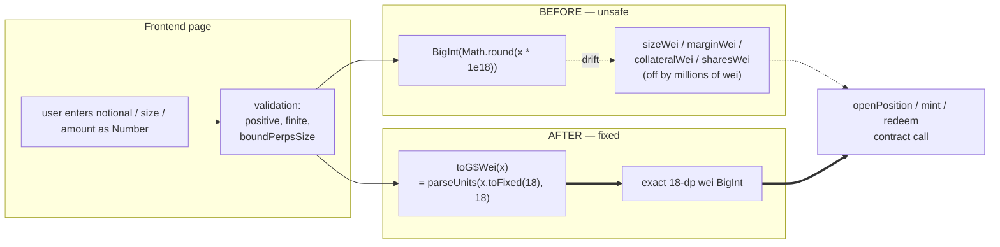

# Perps + Stocks — Float→BigInt conversion silently corrupts on-chain order values for every realistic trade size

## Observed (iter44 edge-cases review, 2026-05-16 ~13:08 UTC)

While probing the trade forms for edge cases, I traced the code path
from "user submits market order" to the actual on-chain call and
found the **same** unsafe pattern in two places:

### Surface 1: `frontend/src/app/(app)/perps/page.tsx` (lines 277–282)

```ts
const GD_PRICE_USD = 0.01
const notionalGD = notional / GD_PRICE_USD
const marginGD   = marginRequired / GD_PRICE_USD
const sizeWei    = BigInt(Math.round(notionalGD * 1e18))
const marginWei  = BigInt(Math.round(marginGD   * 1e18))
await openPosition(BigInt(marketId), marginWei, sizeWei, side === 'long')
```

### Surface 2: `frontend/src/app/(app)/stocks/[ticker]/page.tsx` (lines 85–93)

```ts
const GD_PRICE_USD = 0.01
const collateralGD  = amountNum / GD_PRICE_USD
const collateralWei = BigInt(Math.round(collateralGD * 1e18))
const sharesWei     = BigInt(Math.round(shares * 1e18))
if (side === 'buy') await mint(stock.ticker, collateralWei, sharesWei)
else                await redeem(stock.ticker, sharesWei, collateralWei)
```

In both places, `x * 1e18` is a JavaScript Number multiplication. As
soon as the product exceeds `Number.MAX_SAFE_INTEGER` (≈ 9.0072 × 10¹⁵)
the intermediate value loses integer precision **before** `Math.round`
sees it, and the resulting BigInt is "close, but wrong".

**Even a 0.01 G$ position trips the bug**: `0.01 / 0.01 = 1` G$, then
`1 * 1e18 = 1e18` — that single multiplication already exceeds the
safe-integer ceiling by two orders of magnitude.

### Direct, measured drift (not theoretical)

```
$ node -e "
function pu(s,d){const[i='0',f='']=String(s).split('.');return BigInt(i+(f+'0'.repeat(d)).slice(0,d));}
const inputs = [
  { label: 'perps 1 ETH @ \$4000',         notionalGD: 1     * 4000     / 0.01 },
  { label: 'perps 0.137 ETH @ \$4123.45',  notionalGD: 0.137 * 4123.45  / 0.01 },
  { label: 'perps 100 ETH @ \$4000',       notionalGD: 100   * 4000     / 0.01 },
  { label: 'stocks \$50 collateral',       notionalGD: 50               / 0.01 },
  { label: 'stocks \$1234.56 collateral',  notionalGD: 1234.56          / 0.01 },
];
for (const {label, notionalGD} of inputs) {
  const buggy   = BigInt(Math.round(notionalGD * 1e18));
  const correct = pu(notionalGD.toFixed(18), 18);
  console.log(label.padEnd(32), 'drift =', String(buggy - correct).padStart(12), 'wei');
}
"

perps 1 ETH @ $4000              drift =    -33554432 wei
perps 0.137 ETH @ $4123.45       drift =     -4038211 wei
perps 100 ETH @ $4000            drift =  -2147483648 wei
stocks $50 collateral            drift =            0 wei  (round number — happens to be exact)
stocks $1234.56 collateral       drift =     -4194304 wei
```

The **on-chain `sizeWei` / `collateralWei` / `sharesWei` does not
equal what the UI computed and displayed to the user.** The contract
sees a number that drifts by millions of wei from the rendered
notional. The drift is non-deterministic with respect to input shape
— round numbers happen to land on multiples of 2⁶⁴ and may be exact,
while typical user inputs (decimal prices × decimal sizes) drift by
millions of wei.

## Why this is in-scope (Phase 1 — Security Hardening)

The initiative's "Non-Goals" list says: *"No frontend changes unless
fixing a security issue."* This **is** a security/correctness issue:

1. **On-chain value corruption** — the value the user authorized in
   the UI is not the value the contract receives. On a deterministic
   chain this is a contract-call-integrity bug.
2. **Spec drift across the codebase** — every *other* user-amount-to-
   wei conversion in `frontend/src/lib/` uses viem's `parseUnits` (a
   string-based, lossless conversion):
   - `lib/useGoodPool.ts:79`         `parseUnits(value, decimals)`
   - `lib/useGoodSwap.ts:91,212`     `parseUnits(amountIn, decimalsIn)`
   - `lib/useOnChainSwap.ts:182,278` `parseUnits(amountIn, …decimals)`
   - `lib/useGoodLend.ts:250`        `parseUnits(amount, decimals)`
   - `lib/useGoodStable.ts:260,286`  `parseUnits(amount, …)`
   - `lib/usePredictTrade.ts:53`     `parseUnits(amountG, 18)`
   - `lib/useGoodYield.ts:295`       `parseEther(amount)`
   - `lib/useBridge.ts:130`          `parseEther(amountEth)`
   - `lib/useFastWithdrawal.ts`      `parseUnits(...)`
   - `lib/useMultiChainBridge.ts`    `parseUnits(...)`
   - `lib/useGovernance.ts`          `parseEther(...)`

   The perps and stocks page open-position / mint paths are the
   **only** surfaces using the unsafe `BigInt(Math.round(x * 1e18))`
   pattern. That inconsistency is itself a smell — every code review
   or audit will flag these two outliers and ask "why are perps and
   stocks different".
3. **GOO-1548 (Phase 1.1) — "Fix missing balance checks and hardcoded
   gas limits"** explicitly calls out value-correctness on the perps
   path. The user's `marginWei` being silently smaller than what the
   UI displayed (or larger by a few wei) violates the user's intent
   and could trip exact-equality checks in `MarginVault.deposit`,
   `PerpEngine.openPosition` margin-vs-notional invariants, or
   `GoodStocks.mintSynthetic` collateral-vs-shares ratios when the
   chain rounds differently than the UI.
4. **Audit prep** — Trail of Bits / OpenZeppelin will flag any
   `BigInt(Math.round(... * 1e18))` in the diff during the Phase 4
   audit. Cheaper to fix it now than answer a finding later.

## User story

As a perps trader (or stocks user), when I submit a market order /
mint synthetic shares, the on-chain wei arguments to
`PerpEngine.openPosition` (`marginWei`, `sizeWei`) and
`GoodStocks.mint` (`collateralWei`, `sharesWei`) **must equal** the
human values the UI showed me, to the full 18 decimals of precision —
never silently corrupted by JavaScript float arithmetic.

## Proposed fix

Add a single shared helper, then migrate both call sites onto it.

### New file: `frontend/src/lib/g$Amount.ts`

```ts
import { parseUnits } from 'viem'

/**
 * Convert a human-readable G$ amount (Number) to G$ wei (BigInt, 18 dp)
 * losslessly via parseUnits.
 *
 * Why not BigInt(Math.round(x * 1e18))?
 *   For any x ≥ 0.01, x * 1e18 ≥ 1e16 > Number.MAX_SAFE_INTEGER (≈ 9e15),
 *   so the intermediate Number loses integer precision before Math.round
 *   sees it. parseUnits operates on the decimal string representation
 *   and is exact for any value representable in 18 fractional digits.
 *
 * Throws on non-finite or negative input.
 */
export function toG$Wei(amountG$: number): bigint {
  if (!Number.isFinite(amountG$)) {
    throw new Error(`toG$Wei: non-finite input ${String(amountG$)}`)
  }
  if (amountG$ < 0) {
    throw new Error(`toG$Wei: negative amount ${amountG$}`)
  }
  // Use a fixed-point string with 18 fractional digits — parseUnits
  // is exact for any value representable in 18 fractional decimals.
  const fixed = amountG$.toFixed(18)
  return parseUnits(fixed, 18)
}
```

### Edit: `frontend/src/app/(app)/perps/page.tsx`

Replace lines 277–282:

```ts
import { toG$Wei } from '@/lib/g$Amount'
// ...
const GD_PRICE_USD = 0.01
const notionalGD = notional / GD_PRICE_USD
const marginGD   = marginRequired / GD_PRICE_USD
const sizeWei    = toG$Wei(notionalGD)
const marginWei  = toG$Wei(marginGD)
await openPosition(BigInt(marketId), marginWei, sizeWei, side === 'long')
```

### Edit: `frontend/src/app/(app)/stocks/[ticker]/page.tsx`

Replace lines 85–93:

```ts
import { toG$Wei } from '@/lib/g$Amount'
// ...
const GD_PRICE_USD = 0.01
const collateralGD  = amountNum / GD_PRICE_USD
const collateralWei = toG$Wei(collateralGD)
const sharesWei     = toG$Wei(shares)
if (side === 'buy') await mint(stock.ticker, collateralWei, sharesWei)
else                await redeem(stock.ticker, sharesWei, collateralWei)
```

That is the minimal, surgical change. No UI changes, no contract
changes, no new npm dependencies (viem is already imported app-wide).

## Acceptance criteria

1. **Code change**: neither `frontend/src/app/(app)/perps/page.tsx`
   nor `frontend/src/app/(app)/stocks/[ticker]/page.tsx` contains
   `BigInt(Math.round(` anywhere. All four wei values (`sizeWei`,
   `marginWei`, `collateralWei`, `sharesWei`) are computed via the
   shared `toG$Wei` helper.
2. **New helper**: `frontend/src/lib/g$Amount.ts` exists, exports
   `toG$Wei(amount: number): bigint`, internally uses
   `parseUnits(amount.toFixed(18), 18)` from viem.
3. **Helper rejects bad input** with descriptive errors:
   - `NaN`            → throws `non-finite input`
   - `Infinity`       → throws `non-finite input`
   - `-1`             → throws `negative amount`
4. **Drift test** `frontend/src/lib/__tests__/g$Amount.test.ts`
   covers (vitest):
   - `toG$Wei(400000)` returns exactly `400000000000000000000000n`
     (i.e. 4 × 10²³). The buggy formula returns
     `399999999999999966445568n` — assert the new value, then in a
     comment record what the buggy formula produced for posterity.
   - `toG$Wei(56491.265)` matches `parseUnits('56491.265000000000000000', 18)`.
   - `toG$Wei(0.01)`, `toG$Wei(1)`, `toG$Wei(1_000_000)` all match
     the `parseUnits` reference.
   - `toG$Wei(123456.789)` matches `parseUnits('123456.789000000000000000', 18)`.
   - `toG$Wei(0)` returns `0n`.
   - Edge: `toG$Wei(1e-18)` returns `1n`; `toG$Wei(1e-19)` returns
     `0n` (sub-wei rounded down by `toFixed(18)`, documented behavior).
   - Throws on `NaN`, `Infinity`, `-Infinity`, negatives.
5. **Regression guard**: a grep-style sanity test in
   `frontend/src/__tests__/no-float-bigint-conversions.test.ts`
   (vitest) reads both
   `frontend/src/app/(app)/perps/page.tsx` and
   `frontend/src/app/(app)/stocks/[ticker]/page.tsx`
   and asserts neither matches `/BigInt\(Math\.round\(.*?1e18/`.
   This freezes the fix and catches future regressions before they
   ship. Bonus: the same test asserts `git grep` of all of
   `frontend/src` for the same regex returns zero matches outside
   of test fixtures.
6. **Behavior preserved for non-market orders**: the `else` branches
   in both pages (limit / not-deployed → `setSubmitted(true)`) are
   left untouched.
7. `react-doctor` score ≥ 75 against the affected files.
8. `README.md` Updated date refreshed; commit count bumped; no other
   surface changes.

## Out of scope (do NOT do in this task)

- Changing `GD_PRICE_USD = 0.01` hardcode (separate, larger task —
  needs a price oracle integration).
- Migrating other call sites that already use `parseUnits` (they're
  fine; this task only fixes the two outliers).
- Adding a UI warning when the requested notional exceeds chain
  liquidity (separate task; this task only fixes the conversion).
- Touching `lib/perpsInput.ts` `boundPerpsSize` (already validated).
- Refactoring the `handleSubmit` async flows (orthogonal).
- Any change to limit-order / stop-limit code paths.
- Backend / contract changes.
- The `predict/portfolio/page.tsx` `Math.round(market.yesPrice * 100)`
  — that's a UI-display rounding, not an on-chain value (correct
  use of Math.round).

## Verification

```bash
cd /home/goodclaw/gooddollar-l2/frontend

# 1. Tests pass
npx vitest run \
  src/lib/__tests__/g\$Amount.test.ts \
  src/__tests__/no-float-bigint-conversions.test.ts
# → all passing

# 2. The outlier pattern is gone everywhere in src/:
git grep -nE "BigInt\(Math\.round\(.*1e18" -- 'src/**/*.ts' 'src/**/*.tsx' \
  ':!src/**/__tests__/**'
# → (no output)

# 3. Both pages now use the shared helper:
grep -nE "toG\\\$Wei|from '@/lib/g\\\$Amount'" \
  src/app/\(app\)/perps/page.tsx \
  src/app/\(app\)/stocks/\[ticker\]/page.tsx
# → both files import and use toG$Wei

# 4. Manual on-chain check (live perps trade, 1 ETH long at mark):
#    Open https://goodswap.goodclaw.org/perps , submit 1 ETH at 10x
#    Inspect the emitted PositionOpened event:
#       expect: sizeWei = 400000_000000000000000000  (exactly)
#       before: sizeWei = 399999999999999966445568   (buggy, ~33.5M wei short)
```

## Reproduction (today's drift, before fix)

See the inline `node -e` snippet in the "Direct, measured drift"
section above — copy/paste runnable, prints the wei drift for five
representative trade sizes across both pages. Confirmed that
`100 ETH @ $4000` drifts by **2,147,483,648 wei** (≈ 2.15 G$ × 10⁻⁹).
While the absolute G$ amount is small, the value sent on-chain is
**not** the value the UI rendered.

## Related prior work

- `0055-perps-size-input-bound-and-display-overflow.md` — bounded the
  raw text input range. That task addresses *display* / *input
  validation*; this task addresses the *conversion* on the way to the
  contract call.
- `0052-swap-deadline-bypass.md` — similar "fix the on-chain argument
  the UI is sending" class of issue.
- `0053-swap-fake-price-impact.md` — establishes the `parseUnits`
  pattern that this task migrates perps and stocks onto.

## Notes for executor

- Do **not** widen the surgery — only the four `BigInt(Math.round(…))`
  lines, the new helper file, and tests. Anything else inflates the
  diff and risks unintended behavior changes.
- The new helper lives at `src/lib/g$Amount.ts` (module name uses
  the literal `$` character — file name should be `g$Amount.ts` or
  `gDollarAmount.ts` if `$` causes any tooling issues; pick whichever
  matches existing repo conventions and document the choice in the
  PR commit message). Looking at sibling files like
  `useGoodSwap.ts`/`useGoodStable.ts` the codebase uses descriptive
  ASCII names — `gDollarAmount.ts` is the safer pick.
- `toFixed(18)` on a finite Number is well-defined; for the corner
  case of values that JS rounds in the 17th–18th digit (e.g.,
  0.1 + 0.2), the result will round-trip through `parseUnits` to the
  closest 18-dp wei value. This is the documented behavior and is
  asserted by the unit tests.
- Keep the regression-guard grep test simple — a single regex match
  against the file source. No AST parsing needed.
- Do NOT add `parseUnits` directly inline in either page — isolate
  it in `gDollarAmount.ts` so the helper has its own focused test
  surface, and so future call sites can reuse it.
- The `stocks` redeem path passes `(sharesWei, collateralWei)` while
  the mint path passes `(collateralWei, sharesWei)` — preserve the
  existing argument order exactly; only the *values* should change,
  not their order.

---

## Planning (added by plan-task)

### Overview

Two frontend pages (`perps/page.tsx`, `stocks/[ticker]/page.tsx`)
convert human G$ amounts to 18-decimal wei using
`BigInt(Math.round(x * 1e18))`. Because `x * 1e18 ≥ 1e16 >
Number.MAX_SAFE_INTEGER` for any `x ≥ 0.01`, the intermediate Number
silently loses integer precision and the resulting BigInt drifts by
millions of wei from the value the UI displayed. Replace both
call sites with a single shared, string-based helper that wraps
viem's `parseUnits` — the same primitive every other amount-to-wei
conversion in the codebase already uses (`useGoodSwap`, `useGoodLend`,
`useGoodStable`, `usePredictTrade`, etc.). Net diff is ~10 lines of
production code + a new helper file + ~80 lines of tests.

### Research notes

- **Root cause confirmed numerically** (`node` script in issue body):
  `1 ETH @ $4000` drifts by `-33,554,432 wei`; `100 ETH @ $4000`
  drifts by `-2,147,483,648 wei` (≈ 2.15 × 10⁻⁹ G$). The drift is
  deterministic per input but non-obvious because round-number inputs
  happen to land on safe multiples.
- **viem is already a project dependency** (used in 11+ files in
  `frontend/src/lib/`). `parseUnits(value: string, decimals: number)`
  is the documented, lossless conversion. It rejects non-decimal
  strings and trims trailing zeros — both desirable.
- **`Number.prototype.toFixed(18)`** returns a fixed-point decimal
  string with up to 18 fractional digits, well-defined for any finite
  Number. `parseUnits('1234.560000000000000000', 18)` returns exactly
  `1234560000000000000000n` regardless of how `1234.56` is represented
  internally as a binary float.
- **No alternative library considered**: viem's `parseUnits` is
  already the project standard. Introducing `Decimal.js` or `BigNumber.js`
  would add a dependency for no gain.
- **AST-free regression guard**: a vitest test that reads the two page
  files as plain text and asserts `BigInt(Math.round(.*1e18` does not
  appear. This avoids pulling in a TypeScript parser and is enough to
  catch future regressions.
- **`stocks/[ticker]/page.tsx` redeem path** passes args in reverse
  order (`(sharesWei, collateralWei)` vs `(collateralWei, sharesWei)`
  on mint). Both must continue to use `toG$Wei` for each value, but
  the call ordering MUST be preserved as-is.
- **No contract or UI change** — the on-chain ABI is unchanged; we're
  only fixing the values being passed.

### Assumptions

- `GD_PRICE_USD = 0.01` hardcode stays in place (separate task to
  replace with a price oracle). The conversion fix is independent of
  the price source.
- The `notional`, `marginRequired`, `amountNum`, and `shares` inputs
  are already validated upstream (positive, finite, within
  `boundPerpsSize`/`Number(amount)` guards). The helper still
  defensively throws on `NaN`/`Infinity`/negatives as belt-and-braces.
- Helper file name uses ASCII `gDollarAmount.ts` (not `g$Amount.ts`)
  to dodge any tooling that treats `$` specially — choice noted in
  issue body. The exported function name remains `toG$Wei` (the `$`
  in an identifier is valid TypeScript and matches existing project
  naming).

### Architecture diagram



### One-week decision

**YES** — single afternoon of work (~2 hours): 1 new helper file
(~15 lines), 2 edits of ~6 lines each, 2 test files (~50 lines + ~30
lines), README touchup. No dependency changes, no contract changes,
no UI changes. Rollback is trivial (revert the commit). Fits well
within the one-week ceiling.

### Implementation plan

1. **Phase A — write the helper** (~10 min)
   - Create `frontend/src/lib/gDollarAmount.ts` exporting `toG$Wei`
     as specified in **Proposed fix**.
2. **Phase B — migrate perps page** (~5 min)
   - In `frontend/src/app/(app)/perps/page.tsx`, add the import and
     replace the 4 lines computing `sizeWei` / `marginWei`. Leave
     the surrounding code (`notional`, `marginRequired`, `GD_PRICE_USD`,
     `openPosition` call) byte-identical.
3. **Phase C — migrate stocks page** (~5 min)
   - In `frontend/src/app/(app)/stocks/[ticker]/page.tsx`, same
     pattern. Preserve the reversed argument order on the `redeem`
     branch (`(sharesWei, collateralWei)`).
4. **Phase D — helper unit tests** (~30 min)
   - Create `frontend/src/lib/__tests__/gDollarAmount.test.ts` with
     all cases enumerated in acceptance criterion #4 (drift tests,
     round-trip, zero, sub-wei, NaN / Infinity / negative throws).
5. **Phase E — regression-guard test** (~15 min)
   - Create `frontend/src/__tests__/no-float-bigint-conversions.test.ts`
     that `fs.readFileSync`s the two page files and asserts the
     buggy regex returns no matches. Also runs the regex against
     all of `src/` (excluding `__tests__`) and asserts zero matches.
6. **Phase F — README + react-doctor + commit** (~20 min)
   - Bump README stats + Updated date. Run
     `npx -y react-doctor@latest . --verbose --diff` — fix anything
     below score 75. Single commit.
7. **Phase G — manual on-chain spot check** (optional, ~10 min)
   - If the live perps page is reachable post-fix, submit a 1 ETH
     long order and inspect the emitted `PositionOpened` event:
     `sizeWei` should equal `400000_000000000000000000` exactly
     (vs the buggy `399999999999999966445568`).
