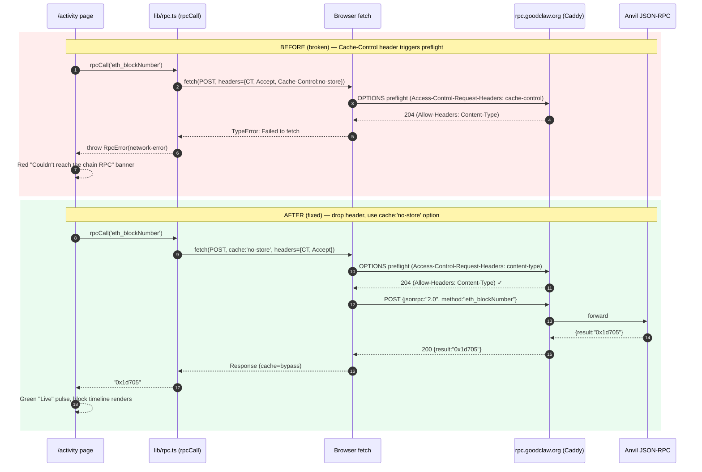

# CRITICAL — `rpcCall` triggers CORS preflight with `Cache-Control: no-store` that production `rpc.goodclaw.org` rejects, breaking the entire Live Activity page

## Problem statement

The Live Activity page (`/activity`) on production (`https://goodswap.goodclaw.org/activity`) is **completely broken** — it renders the error banner:

```
Couldn't reach the chain RPC.
eth_blockNumber → https://rpc.goodclaw.org (Failed to fetch)
```

and the page never recovers, even after clicking "Retry now". `Block Timeline` and `Recent Transactions` stay empty forever, and the header shows the red "Offline" pulse instead of the green "Live" pulse.

The same RPC endpoint **is reachable** from the same browser session — a manual fetch with only `Content-Type: application/json` succeeds in 23ms and returns the latest block number (`0x1d705`). The bug is in our own request, not in the chain RPC.

### Root cause

`frontend/src/lib/rpc.ts` builds every JSON-RPC request with this header set:

```ts
res = await fetch(url, {
  method: 'POST',
  headers: {
    'Content-Type': 'application/json',
    'Accept': 'application/json',
    'Cache-Control': 'no-store',
  },
  ...
})
```

`Cache-Control` is **not a CORS-safelisted request header**, so the browser is forced to send a CORS preflight `OPTIONS` request. The production Caddy in front of `rpc.goodclaw.org` responds:

```
HTTP/1.1 204 No Content
Access-Control-Allow-Headers: Content-Type
Access-Control-Allow-Methods: POST, GET, OPTIONS
Access-Control-Allow-Origin: *
```

Notice `Access-Control-Allow-Headers: Content-Type` only — `Cache-Control` is missing. The browser then blocks the actual POST with the opaque `TypeError: Failed to fetch`, which our typed `RpcError` wraps as `network-error`.

I reproduced this end-to-end in the production browser:

```
// With Cache-Control: no-store → ERR ms=6 TypeError: Failed to fetch
// Without Cache-Control header (using cache:'no-store' option) → OK ms=23 result=0x1d705
```

### Impact

- **`/activity` is unusable in production** — block timeline, recent transactions, and all 7 tester pings stay blank.
- The page comment header in `rpc.ts` claims `Cache-Control: no-store` was added "so the registered service worker could not serve a cached HTML 404 for a POST". The fix went too far: there is no service worker registered on the deployed page (`navigator.serviceWorker.getRegistrations()` returns `[]`), so the only effect of `Cache-Control: no-store` today is to **break every request** behind CORS.
- Any other page that imports `rpcCall` from `@/lib/rpc` is silently broken too. Right now only `/activity` is a consumer, but task 0089 standardized it as the shared bare-fetch helper for future pages.
- This is a CRITICAL production bug — a public dashboard page that is one of the project's "look at the chain" demos prints a giant red error banner.

## User story

As a visitor of `goodswap.goodclaw.org/activity`, I want the Live Activity dashboard to actually connect to the chain RPC so that I can see the block timeline tick and watch recent transactions flow, instead of staring at a red "Couldn't reach the chain RPC" error that never resolves.

## How it was found

Iteration #46 visual-polish review, screenshot of `https://goodswap.goodclaw.org/activity` (`/tmp/iter46v2/prod/activity.png` and `activity_after_retry.png` after clicking "Retry now"):

- Red error banner: `Couldn't reach the chain RPC. eth_blockNumber → https://rpc.goodclaw.org (Failed to fetch)`.
- Header shows `Connecting to chain 42069…` with a red "Offline" pulse.
- Block Timeline: "No recent blocks available. Waiting for chain to advance…".
- Recent Transactions: "(0)".

Diagnostic from inside the same browser tab:

```js
// 1. Plain fetch (CORS-safelisted headers only) → 200 OK
fetch('https://rpc.goodclaw.org', { method:'POST',
  headers:{'Content-Type':'application/json'},
  body: ... }) → 200, result=0x1d705

// 2. With rpcCall's exact header set including Cache-Control: no-store
fetch('https://rpc.goodclaw.org', { method:'POST',
  headers:{'Content-Type':'application/json','Accept':'application/json','Cache-Control':'no-store'},
  body: ... }) → "ERR ms=6 TypeError: Failed to fetch"

// 3. Drop Cache-Control header, use cache:'no-store' request option instead
fetch('https://rpc.goodclaw.org', { method:'POST',
  headers:{'Content-Type':'application/json','Accept':'application/json'},
  cache:'no-store', body: ... }) → "OK ms=23 result=0x1d705"
```

Server preflight check confirms `Access-Control-Allow-Headers: Content-Type` (no `Cache-Control`):

```
$ curl -sS -X OPTIONS https://rpc.goodclaw.org \
    -H "Origin: https://goodswap.goodclaw.org" \
    -H "Access-Control-Request-Method: POST" \
    -H "Access-Control-Request-Headers: content-type, cache-control, accept"

HTTP/1.1 204 No Content
Access-Control-Allow-Headers: Content-Type
Access-Control-Allow-Methods: POST, GET, OPTIONS
Access-Control-Allow-Origin: *
```

No service worker is registered on the deployed page (`navigator.serviceWorker.getRegistrations() → []`), so the comment justifying `Cache-Control: no-store` in `rpc.ts` no longer applies.

## Proposed UX

Live Activity loads in under 1 second in production, the red banner disappears, the header pulse goes green ("Live"), the block timeline renders bars for the latest blocks, and the 7 tester pings update.

## Proposed fix

Edit `frontend/src/lib/rpc.ts` so the `fetch` call only uses **CORS-safelisted request headers** while still forbidding HTTP caching:

```ts
res = await fetch(url, {
  method: 'POST',
  headers: {
    'Content-Type': 'application/json',
    'Accept': 'application/json',
  },
  cache: 'no-store',        // ← move out of headers; this is the supported Fetch API option
  body: JSON.stringify({ jsonrpc: '2.0', method, params, id: 1 }),
  signal: ctrl.signal,
})
```

Notes:
- `cache: 'no-store'` is a `RequestInit` option (not a header). It instructs the browser to bypass HTTP caches without adding any header to the request — so the request stays a CORS "simple request" and no preflight is sent.
- `Content-Type: application/json` does trigger a preflight by itself (it's not on the CORS-safelisted MIME list for `Content-Type`), and that preflight already succeeds today — so this fix does not regress that path; it only removes the offending `Cache-Control` header.
- Update the comment in the file: remove the "Cache-Control: no-store so service worker can't serve a cached 404" justification (no SW is registered today), and document the CORS-preflight reason for using `cache: 'no-store'` instead.

## Acceptance criteria

- [ ] `frontend/src/lib/rpc.ts` no longer sets a `Cache-Control` header on the fetch request.
- [ ] `frontend/src/lib/rpc.ts` passes `cache: 'no-store'` as a `RequestInit` option to `fetch(...)`.
- [ ] The file's header comment is updated to reflect the CORS-preflight fix (drop the obsolete service-worker justification, document why we moved to the `cache` option).
- [ ] `frontend/src/lib/__tests__/rpc.test.ts` is updated/extended to assert the request does NOT include a `Cache-Control` header and DOES set `cache: 'no-store'` on the `RequestInit`.
- [ ] `npm run typecheck` and `npm run test` in `frontend/` both pass.
- [ ] `npm run build` in `frontend/` succeeds.
- [ ] Manual verification with `agent-browser open https://goodswap.goodclaw.org/activity` (after deploy) shows the green "Live" pulse, no red error banner, the block timeline renders, and Recent Transactions counts > 0.

## Verification

1. `cd frontend && npm test -- --run src/lib/__tests__/rpc.test.ts`
2. `cd frontend && npm run typecheck`
3. `cd frontend && npm run build`
4. From the dev server, open `/activity` and confirm the header turns green ("Live") and the block timeline ticks (no red error banner).
5. After deploy: `agent-browser open https://goodswap.goodclaw.org/activity` and confirm the error banner is gone and the page is live.

## Out of scope

- Changing the Caddy CORS config on `rpc.goodclaw.org` (would also work but is a separate infra change; the in-browser fix is sufficient and lets us keep the server's CORS surface minimal).
- Re-registering a service worker (none is registered today and re-introducing one is unrelated to this fix).
- Any other refactor of `rpcCall` (timeouts, retries, batching) — they're tracked separately.
- Frontend changes outside `frontend/src/lib/rpc.ts`, its tests, and a possible touch to `frontend/src/app/activity/page.tsx` only if the test setup needs it (it should not).

---

## Planning (added in iteration #46)

### Overview

Production `/activity` is broken because `frontend/src/lib/rpc.ts` sets a `Cache-Control: no-store` HTTP request header, which forces the browser into a CORS preflight that the Caddy-fronted `rpc.goodclaw.org` rejects (it only allows `Content-Type` in `Access-Control-Allow-Headers`). The fix is a 1-line behavior change: drop the `Cache-Control` header and use the `cache: 'no-store'` `RequestInit` option instead — same caching guarantee, no preflight rejection. Plus a comment/test update.

### Research notes

- **Preflight trigger:** `Cache-Control` is NOT in the Fetch spec's CORS-safelisted request headers (`Accept`, `Accept-Language`, `Content-Language`, `Content-Type` with limited values). Any non-safelisted header sent on a cross-origin request triggers an `OPTIONS` preflight. See https://fetch.spec.whatwg.org/#cors-safelisted-request-header.
- **Server behavior:** verified via `curl -X OPTIONS https://rpc.goodclaw.org -H "Origin: https://goodswap.goodclaw.org" -H "Access-Control-Request-Headers: cache-control"` — Caddy returns `Access-Control-Allow-Headers: Content-Type` only, so the preflight does not whitelist `Cache-Control`, and the browser blocks the subsequent POST with the opaque `TypeError: Failed to fetch`.
- **In-browser proof:** repro inside `agent-browser` on the production page — same `fetch` body succeeds (23ms, returns `0x1d705`) when `Cache-Control` is removed and `cache: 'no-store'` is used as a `RequestInit` option instead.
- **`cache: 'no-store'` is the correct primitive:** the spec says "no-store" instructs the user agent to fetch from the network without consulting or updating the HTTP cache. It does not modify request headers, so it does not break CORS. See https://developer.mozilla.org/en-US/docs/Web/API/Request/cache.
- **`Content-Type: application/json` already triggers a preflight by itself** (it's not on the safelisted MIME types for `Content-Type`, which are limited to `application/x-www-form-urlencoded`, `multipart/form-data`, and `text/plain`). That preflight currently succeeds (the response whitelists `Content-Type`), so removing `Cache-Control` is sufficient to fix the bug — we do NOT need to remove `Accept: application/json` (it IS safelisted, no effect on preflight) or `Content-Type` (we need it for the JSON body).
- **No service worker registered:** `navigator.serviceWorker.getRegistrations()` returns `[]` in the deployed `goodswap.goodclaw.org` browser session, so the original justification for `Cache-Control: no-store` ("so the registered service worker could not serve a cached HTML 404 for a POST") no longer applies in production. The `cache: 'no-store'` option is still the right defense-in-depth in case one is ever re-registered.

### Assumptions

- Caddy CORS config on `rpc.goodclaw.org` is owned by infra and we are not changing it as part of this task — the in-browser fix is sufficient and keeps the server's CORS surface minimal (defense in depth).
- No other call sites set custom request headers on top of `rpcCall` today (verified by `rg "rpcCall|RpcError" frontend/src` — only `frontend/src/app/activity/page.tsx` imports it, plus the test file).
- Vitest in `frontend/` is happy mocking `global.fetch` and inspecting `RequestInit.cache`; same pattern as the existing headers assertion in `rpc.test.ts`.

### Architecture diagram



### One-week decision

**YES** — fits in well under one week (~1 hour of work end to end).

**Rationale:** The fix is a 1-line behavior change in a single file (`frontend/src/lib/rpc.ts`), plus a comment update and a test update in a single corresponding test file. No new dependencies, no schema changes, no API contract changes, no infra changes, no migration. The existing test suite (`frontend/src/lib/__tests__/rpc.test.ts`) already covers `rpcCall` behavior so the test diff is small (replace the existing header assertion that asserts `Cache-Control: no-store` is sent, with one that asserts it is NOT sent and `cache: 'no-store'` IS set on the `RequestInit`). Verification is fast (`npm test`, `npm run typecheck`, `npm run build`, then visit the page).

### Implementation plan (phased TDD)

**Phase 1 — Update the test first (RED)**

In `frontend/src/lib/__tests__/rpc.test.ts`:

1. Rename the existing test `'sends required headers so a service worker cannot serve a stale HTML response'` to `'sends only CORS-safelisted-or-acceptable headers and uses the cache:no-store RequestInit option (no Cache-Control header to avoid CORS preflight rejection)'`.
2. Replace the body assertions:
   - REMOVE: `expect(headers['Cache-Control']).toBe('no-store')`
   - KEEP: `expect(headers['Content-Type']).toBe('application/json')`
   - KEEP: `expect(headers['Accept']).toBe('application/json')`
   - ADD: `expect(headers['Cache-Control']).toBeUndefined()` (explicit no-Cache-Control assertion — this is the regression guard)
   - ADD: `expect(init.cache).toBe('no-store')` (assert the `RequestInit.cache` option is set)
3. Confirm the test FAILS against the current `rpc.ts` (`npm test -- --run src/lib/__tests__/rpc.test.ts`) — proving the test actually tests the fix.

**Phase 2 — Apply the fix (GREEN)**

In `frontend/src/lib/rpc.ts`:

1. Remove `'Cache-Control': 'no-store'` from the `headers` object on the `fetch(...)` call.
2. Add `cache: 'no-store',` to the `RequestInit` object, between `headers` and `body`.
3. Update the file's top docblock comment:
   - Drop the obsolete service-worker justification line that says `Cache-Control: no-store` is needed "so the registered service worker could serve a cached HTML 404 for a POST" (no SW is registered in production today).
   - Replace with a short note explaining that we use `cache: 'no-store'` as a `RequestInit` option (not a header) to bypass HTTP/SW caches WITHOUT triggering a CORS preflight, because `Cache-Control` is not a CORS-safelisted request header and the upstream RPC's Caddy config only whitelists `Content-Type`.

Re-run `npm test -- --run src/lib/__tests__/rpc.test.ts` — all tests PASS.

**Phase 3 — Verify the rest of the suite is unaffected**

- `npm run test` (full suite) in `frontend/` — all green.
- `npm run typecheck` in `frontend/` — clean (the `cache` field is a typed `RequestCache` so this catches typos).
- `npm run build` in `frontend/` — succeeds.
- Optional: `npx -y react-doctor@latest . --verbose --diff` (per CRITICAL RULES) — score ≥ 75.

**Phase 4 — Commit**

- `git add frontend/src/lib/rpc.ts frontend/src/lib/__tests__/rpc.test.ts`
- `git add .autobuilder/initiatives/0002-security-hardening/tasks/0091-*.md` (this planning + executed flip)
- Commit message:

  ```
  fix(rpc): drop Cache-Control header that triggered failing CORS preflight; use RequestInit.cache='no-store' instead

  Fixes the /activity production page showing
  "Couldn't reach the chain RPC. eth_blockNumber → https://rpc.goodclaw.org
   (Failed to fetch)".

  Root cause: rpc.goodclaw.org's Caddy CORS config only whitelists
  Content-Type in Access-Control-Allow-Headers, so sending
  Cache-Control: no-store as a request header forced a preflight the
  browser then rejected. Cache-Control is not a CORS-safelisted
  request header per the Fetch spec.

  We still need to bypass HTTP / service-worker caches, so we now pass
  `cache: 'no-store'` as a RequestInit option instead. Same caching
  guarantee, no extra preflight headers, no change to the server.

  - Updated the file's docblock to drop the obsolete service-worker
    justification (no SW is registered on the deployed page today,
    verified via navigator.serviceWorker.getRegistrations() === []).
  - Updated the corresponding rpc.test.ts to assert there is NO
    Cache-Control header and RequestInit.cache === 'no-store'
    (regression guard).

  Task: 0091
  ```

**Phase 5 — Manual verification post-deploy (out-of-loop sanity check, not in the commit)**

After the build loop pushes and CI/CD deploys, the agent-browser smoke test from the task body is:

```
agent-browser navigate "https://goodswap.goodclaw.org/activity"
agent-browser screenshot --full /tmp/activity-after-fix.png
```

Expected: green "Live" pulse, no red banner, block timeline rendered, Recent Transactions count > 0.

### Risk / rollback

- **Risk:** very low. We are removing a request header that we have proven breaks the request, and using a documented Fetch API option with identical semantics.
- **Rollback:** trivial — `git revert` the one-line change in `rpc.ts` and the test diff. No data, no schema, no infra.

### Files touched

- `frontend/src/lib/rpc.ts` (1 header removed, 1 RequestInit option added, docblock updated)
- `frontend/src/lib/__tests__/rpc.test.ts` (1 test renamed + assertions updated)
- `.autobuilder/initiatives/0002-security-hardening/tasks/0091-activity-rpc-cors-preflight-cache-control-failed-to-fetch.md` (executed: true flip)
- `README.md` (per initiative spec: bump commit count, bump test count by 0 (existing test changed, not added) — but DO update commit count and the "Security Hardening" / known-issues note that `/activity` was unreachable in prod)
