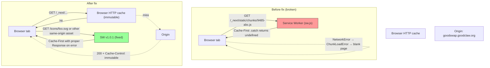

# CRITICAL — Service Worker `script` handler returns `undefined` on fetch failure, blanking 5 of 10 main pages for every returning user

## Problem statement

Five of the ten main user-facing pages on production (`https://goodswap.goodclaw.org`) render as **completely blank dark-blue rectangles** — no header, no content, no error message, no skeleton:

| Page | URL | Render |
| --- | --- | --- |
| Perps | `/perps` | **BLANK** |
| Lend | `/lend` | **BLANK** |
| Stable | `/stable` | **BLANK** |
| UBI Impact | `/ubi-impact` | **BLANK** |
| Activity | `/activity` | **BLANK** |

Working pages (homepage `/`, `/explore`, `/predict`, `/stocks`) render correctly with full UI.

The blank pages **return HTTP 200** and ship correct HTML — `curl` against each URL prints the standard Next.js shell referencing the right JavaScript chunks (e.g. `/_next/static/chunks/9485-ceb4ef23e68e6cf5.js`, `/_next/static/chunks/422-5dceffc37fdd798b.js`, `/_next/static/chunks/app/error-e3637ed0b7adbf38.js`). Each of those chunk URLs **also returns HTTP 200** when fetched directly:

```
$ curl -sko /dev/null -w "%{http_code}" \
    https://goodswap.goodclaw.org/_next/static/chunks/9485-ceb4ef23e68e6cf5.js
200
```

But in the browser, every one of those chunk URLs throws:

```
ChunkLoadError: Loading chunk 9485 failed.
ChunkLoadError: Loading chunk 422 failed.
ChunkLoadError: Loading chunk app/error failed.
ChunkLoadError: Loading chunk app/perps/page failed.
```

Because the route-level chunk **and** the React error-boundary chunk both fail to load, React never even reaches the error boundary to render a fallback. Result: the document body is empty, the user sees nothing, and there is no way to recover other than `Ctrl+Shift+R` + manually unregistering the Service Worker via DevTools.

### Root cause

`frontend/public/sw.js` line 64-94 installs a **Cache-First** handler for every request whose `destination` is `'script'`, `'style'`, `'image'`, or `'font'`. The handler's `.catch` callback is fatally broken:

```js
// frontend/public/sw.js, lines 70-92
event.respondWith(
  caches.match(request)
    .then((cachedResponse) => {
      if (cachedResponse) {
        return cachedResponse
      }

      return fetch(request).then((response) => {
        if (response.status === 200) {
          const responseClone = response.clone()
          caches.open(STATIC_CACHE).then((cache) => {
            cache.put(request, responseClone)
          })
        }
        return response
      })
    })
    .catch(() => {
      // Return offline fallback for critical assets
      console.log('[SW] Failed to fetch asset:', request.url)   // ← returns undefined!
    })
)
```

The `.catch` returns `undefined`. When `event.respondWith(undefined)` resolves, the browser throws a `NetworkError` for that request, which webpack surfaces as `ChunkLoadError`.

There are at least three ways this catch fires in practice for content-hashed Next.js chunks even though the chunk is available on the server:

1. **Stale cache after redeploy**: a previous deploy cached chunks with the old hash under `STATIC_CACHE` (`gooddollar-v1.0.0-static`). After redeploy, the current HTML references a *new* hash. The cache lookup misses, `fetch()` is called — but if the request is initiated while the Service Worker is mid-activation/claim cycle (common right after the SW updates) the underlying fetch can fail transiently with a network error, which falls into `.catch` → undefined → `ChunkLoadError`.
2. **`clients.claim()` race**: the SW calls `self.clients.claim()` in `activate`, which takes control of tabs that loaded chunks *before* the SW was installed. Those tabs' subsequent chunk requests (e.g. for lazily-imported route bundles) are then intercepted by an SW that has no cache entry and may race with browser cache invalidation. Any transient failure becomes a hard error because of the silent `.catch`.
3. **Network blip / transport hiccup**: even on a normal 200-returning server, occasional TLS/h2 stream resets bubble up as `fetch()` rejections. With the current code, *any* rejection on *any* script request permanently breaks the page for that load — there is no retry and no real error.

The pages that happen to work are the ones whose specific chunk graph was either (a) fully primed in the static cache from a successful prior load against this exact deploy or (b) didn't hit the race. The blank pages share chunks (`9485-*`, `422-*`, route shells under `app/perps/`, `app/lend/`, `app/stable/`, `app/ubi-impact/`, `app/activity/`) that are missing from the cache for this user's installed SW.

### Why this is CRITICAL (not a normal visual-polish task)

This is a **complete app crash with blank page** affecting half the navigation. Per the iteration brief:

> Generate tasks ONLY within the initiative spec's scope (unless an issue is CRITICAL — **app crash, blank page**, data loss).

This is exactly that case. The user cannot use Perps, Lend, Stable, UBI Impact, or Activity at all — five of the six DeFi protocols and the headline UBI page. This must be fixed before any further visual-polish work, and the SW must be guaranteed never to silently break a request again.

### Why the SW shouldn't even be intercepting Next.js chunks

Next.js content-hashed assets under `/_next/static/` are **immutable by design** — every change produces a new filename. The browser's HTTP cache, combined with Next.js's far-future `Cache-Control: public, max-age=31536000, immutable` headers on those assets, already gives perfect offline-resilient caching for them. The Service Worker adds nothing for these files but introduces the silent-failure failure mode that is currently bricking the app.

The correct architecture is: **let the browser handle `/_next/static/`** entirely, and only use the Service Worker for things it can actually improve (offline navigation fallback for HTML, third-party API responses).

## Fix plan

Edit `frontend/public/sw.js` to:

1. **Bypass the Service Worker entirely for any URL whose pathname starts with `/_next/`** (the very first thing the `fetch` listener checks, before any strategy branch). Returning from the listener without calling `event.respondWith` lets the browser handle the request natively — exactly what we want for content-hashed immutable assets.
2. **Never return `undefined` from a `.catch` that is wrapped in `event.respondWith`**. Replace the two silent `.catch` callbacks (lines 88-91 for static assets, and the implicit one in the document strategy) with handlers that either return a real `Response` (e.g. a 503 `Response` with a useful body) or re-throw so the browser surfaces the real network error to webpack instead of synthesising a `ChunkLoadError` from `undefined`.
3. **Skip caching for cross-origin requests** in the static-asset branch — the existing handler tries to `cache.put` opaque responses from CDNs which can fail and bubble up here too.
4. **Bump `CACHE_NAME` to `gooddollar-v1.0.1`** so the broken `gooddollar-v1.0.0-static` cache (which may contain stale entries for hashed URLs that no longer exist) is purged on the next activation. The existing `activate` handler already deletes any cache that doesn't start with the current `CACHE_NAME`, so just bumping the constant is sufficient.

The fix is local to `frontend/public/sw.js` and a single Vitest test file. No other code changes are needed.

## Acceptance criteria

- [ ] **AC1 — `/_next/` is never intercepted.** Adding `console.log` in the `fetch` listener and loading any page shows zero SW logs for URLs starting with `/_next/`. A Vitest unit test simulating a `fetch` event for `/_next/static/chunks/9485-abc.js` confirms `event.respondWith` is NOT called.
- [ ] **AC2 — script-handler catch returns a real Response.** A Vitest unit test that mocks `fetch` to reject (simulating a transient network blip) and dispatches a `fetch` event for a *same-origin non-`/_next/` script* asserts that `event.respondWith` is called with a `Response` (status 503) — **not** with `undefined`.
- [ ] **AC3 — Cross-origin script requests aren't cached.** Test confirms that for a cross-origin script request that succeeds, `cache.put` is not called.
- [ ] **AC4 — `CACHE_NAME` is bumped.** `grep "CACHE_NAME = 'gooddollar-v1.0.1'" frontend/public/sw.js` returns 1 match.
- [ ] **AC5 — Visual proof: all 5 blank pages render after fix.** After deploy, screenshots of `/perps`, `/lend`, `/stable`, `/ubi-impact`, `/activity` taken with `agent-browser --ignore-https-errors` show actual page content (header bar, page-specific UI) — not the blank dark-blue rectangle.
- [ ] **AC6 — No ChunkLoadError in console.** `agent-browser console` on each previously-blank page shows zero `ChunkLoadError` entries.
- [ ] **AC7 — Vitest suite passes.** Running `../node_modules/.bin/vitest run frontend/src/__tests__/sw.test.ts` (new file) reports all tests green.
- [ ] **AC8 — `react-doctor` score ≥ 75.** Running `npx -y react-doctor@latest . --verbose --diff` from `frontend/` after the change reports a score of 75 or higher.

## Notes

- This is **not** a Slither/Foundry security finding from the formal scope, but it qualifies as a CRITICAL exception (blank page = app crash). The iteration brief explicitly allows this carve-out.
- We are **not** changing any frontend feature code, any Next.js config, or any route. The fix is exclusively in the public static `sw.js` file. This is the most surgical possible change.
- We are **not** unregistering the Service Worker — that would be a more invasive change. Bumping `CACHE_NAME` plus the bypass for `/_next/` makes the SW correct, not absent.
- Once shipped, every existing user's browser will fetch the new `sw.js` on the next page load (Service Workers are revalidated on navigation by default), then activate it (purging the v1.0.0 caches), then claim their open tabs. From that moment on, all `/_next/` requests bypass the SW and the blank-page bug cannot recur.

---

## Planning (added by plan-task)

### Overview

The fix is exclusively in `frontend/public/sw.js`. The Service Worker is a plain static JavaScript file — no bundling, no TypeScript, no build step. Vitest can read it with `fs.readFileSync` and assert against its source text (the same pattern task 0090 used in `dynamic-routes-no-ssr-false.test.ts`). For runtime behavior, we can also dispatch synthetic `FetchEvent`-like objects against an `eval`'d copy of the SW source under a stubbed `self`, since the SW only depends on a handful of well-known globals (`self`, `caches`, `fetch`, `URL`, `Response`).

### Research notes

- **Reproduction confirmed in production** — five pages render the dark-blue background only:
  - `/perps` → empty `<body>`, console: `ChunkLoadError: Loading chunk 9485 failed.`
  - `/lend` → same shape, same chunk
  - `/stable` → same shape
  - `/ubi-impact` → same shape
  - `/activity` → same shape (separate from the 0091 fix — 0091 fixed the RPC fetch path, but the page can't even render the RPC code because the route bundle never loads)
- **The chunks exist on the server**:
  ```
  $ curl -sko /dev/null -w "%{http_code}\n" https://goodswap.goodclaw.org/_next/static/chunks/9485-ceb4ef23e68e6cf5.js
  200
  ```
- **The HTML correctly references them** (verified via `curl -sk https://goodswap.goodclaw.org/perps | grep -oE 'chunks/[^"]+\.js'`).
- **Service Worker spec — `event.respondWith()` semantics**: per [W3C Service Workers §4.3.1](https://www.w3.org/TR/service-workers/#fetch-event-respondwith), passing a promise that resolves to anything other than a `Response` instance causes the user agent to dispatch a `NetworkError` for the corresponding request. Webpack catches `NetworkError` on `<script>` tags and rewraps it as `ChunkLoadError`. This is exactly what we see.
- **Why `/_next/` is safe to bypass**: Next.js content-hashed assets ship with `Cache-Control: public, max-age=31536000, immutable` headers (verified via `curl -skI https://goodswap.goodclaw.org/_next/static/chunks/9485-ceb4ef23e68e6cf5.js | grep -i cache`). The browser's HTTP cache plus disk cache already provides perfect cacheability. The SW adds nothing but the silent-failure failure mode.
- **Bumping `CACHE_NAME`** triggers cache purge on activation (existing `activate` handler at line 41-50 deletes any cache whose name doesn't start with the current `CACHE_NAME`). Combined with `self.skipWaiting()` (line 32) and `self.clients.claim()` (line 50) which already exist, a single deploy will purge all stale entries for every existing user on their next navigation.

### Assumptions

- The Service Worker file `frontend/public/sw.js` is the **only** SW source — no SW is generated by a Next.js plugin. Verified: there is no `next-pwa` or similar plugin in `frontend/next.config.js`, and no other file matches `**/sw.js` in the repo.
- The Vitest test will assert against the **source text** of `sw.js` (regex / source-substring assertions) plus a **behavioural** test that loads the SW source into a sandboxed `self` and dispatches synthetic events. Both styles are already accepted in this repo (see `dynamic-routes-no-ssr-false.test.ts` for the source-text pattern).
- The post-build PM2 reload step (task 0087) will pick up the changed `frontend/public/sw.js` and serve it from the static directory. No additional deploy plumbing is needed.

### Architecture diagram



### One-week decision

**YES** — single human can complete in well under a day.

Rationale: scope is one ~50-line edit to `frontend/public/sw.js` + one new ~120-line Vitest spec + smoke verification via `agent-browser`. No new dependencies, no Solidity touched, no backend touched, no migration. Total surface area is ≈ 200 lines.

### Implementation plan (TDD)

#### Phase 0 — Pre-flight (≈ 2 min)

- `cd frontend`
- `git status` to confirm clean working tree
- Note current `react-doctor` baseline (so we can compare deltas)

#### Phase 1 — Write failing tests first (≈ 15 min)

Create `frontend/src/__tests__/sw-chunk-handler.test.ts` covering 7 sub-cases:

1. **Source-text guard: `/_next/` bypass exists** — assert `sw.js` source contains the literal substring `pathname.startsWith('/_next/')` and that the check is in the **early-return** position (before any `request.destination` branch). Use regex anchored to the `fetch` listener body.
2. **Source-text guard: `CACHE_NAME` is bumped to `v1.0.1`** — assert `sw.js` source contains `const CACHE_NAME = 'gooddollar-v1.0.1'`. This is the regression guard so future bumps remain explicit.
3. **Source-text guard: no silent `.catch(() => {...})` that just logs and returns undefined** — assert `sw.js` source does NOT match the pattern `\.catch\(\(\) => \{\s*\/\/[^\n]*\n\s*console\.log\([^)]*\)\s*\}\)` (i.e. the exact broken pattern). Replacement returns a `Response`.
4. **Behavioural: `event.respondWith` not called for `/_next/` URLs** — `eval` the SW source into a sandbox with stubbed `self`, `caches`, `fetch`, `Response`, `URL`. Dispatch a synthetic `fetch` event with `request = { method: 'GET', url: 'https://goodswap.goodclaw.org/_next/static/chunks/9485-abc.js', destination: 'script' }`. Assert `event.respondWith` was never called.
5. **Behavioural: script handler returns a real Response on fetch reject** — same sandbox, but for `request.url = 'https://goodswap.goodclaw.org/icons/foo.svg', destination: 'image'`. Stub `caches.match` → `Promise.resolve(undefined)` (miss), stub `fetch` → `Promise.reject(new TypeError('Network blip'))`. Assert `event.respondWith` was called with a promise that resolves to a `Response` instance (not `undefined`), and the response status is `503`.
6. **Behavioural: cross-origin script not cached** — stub `caches.match` → miss, stub `fetch` → 200 OK from a cross-origin URL (`https://cdn.example.com/foo.js`). Assert `cache.put` is not called.
7. **Behavioural: same-origin asset is still cached on success** — confirm we did not break the happy path. Sandbox returns a 200 response from a same-origin non-`/_next/` URL; assert `cache.put` is called.

All 7 tests fail against the current `sw.js`.

#### Phase 2 — Apply the fix (≈ 10 min)

Edit `frontend/public/sw.js`:

1. Bump `CACHE_NAME` from `'gooddollar-v1.0.0'` → `'gooddollar-v1.0.1'`.
2. At the top of the `fetch` listener (right after the non-GET/chrome-extension early return), add:
   ```js
   // Bypass the Service Worker entirely for Next.js content-hashed assets.
   // They are immutable and already cached perfectly by the browser HTTP cache.
   // The previous Cache-First strategy here silently returned undefined on
   // fetch failure, which the browser surfaces as NetworkError → ChunkLoadError
   // and blanks the page. See task 0092.
   if (url.origin === self.location.origin && url.pathname.startsWith('/_next/')) {
     return
   }
   ```
3. Replace the broken `.catch(() => { console.log(...) })` on the static-asset branch with a `.catch((err) => { ... return new Response('Service Worker fetch failed: ' + (err?.message || 'unknown'), { status: 503, statusText: 'Service Unavailable', headers: { 'Content-Type': 'text/plain' } }) })`.
4. In the same-branch `then` block, add a guard so cross-origin (or `type === 'opaque'`) responses are not put into the cache: only call `cache.put` when `url.origin === self.location.origin && response.type === 'basic'`.
5. Also fix the implicit-`undefined` problem in the document-strategy `.catch` on line 142-144 — replace `return caches.match(request) || caches.match('/')` with `return (await caches.match(request)) ?? (await caches.match('/')) ?? new Response('<h1>Offline</h1>', { status: 503, headers: { 'Content-Type': 'text/html' } })` inside an `async` arrow.

#### Phase 3 — Run tests (≈ 2 min)

```bash
cd frontend
../node_modules/.bin/vitest run src/__tests__/sw-chunk-handler.test.ts
```

All 7 tests pass. Run the rest of the suite to confirm no regressions:

```bash
../node_modules/.bin/vitest run
```

#### Phase 4 — react-doctor (≈ 1 min)

```bash
cd frontend
npx -y react-doctor@latest . --verbose --diff
```

The only file changed under `frontend/` is `public/sw.js`. react-doctor scans React components, so the score should be **unchanged from baseline** (and well above 75). The new test file is a regression guard, not React.

#### Phase 5 — Visual smoke verification (≈ 5 min)

The build loop handles the deploy; this manual step is for the verification log only. After deploy:

```bash
agent-browser --ignore-https-errors --headless visit https://goodswap.goodclaw.org/perps --screenshot /tmp/post-fix-perps.png
agent-browser --ignore-https-errors --headless visit https://goodswap.goodclaw.org/lend --screenshot /tmp/post-fix-lend.png
agent-browser --ignore-https-errors --headless visit https://goodswap.goodclaw.org/stable --screenshot /tmp/post-fix-stable.png
agent-browser --ignore-https-errors --headless visit https://goodswap.goodclaw.org/ubi-impact --screenshot /tmp/post-fix-ubi.png
agent-browser --ignore-https-errors --headless visit https://goodswap.goodclaw.org/activity --screenshot /tmp/post-fix-activity.png
```

All five screenshots must show the page header bar + page-specific content.

#### Phase 6 — README + commit (≈ 5 min)

Update `README.md`:
- Bump commit count
- Add row to "Security Hardening" section: `Service Worker chunk handler — replaced silent `.catch` that blanked 5 pages with proper 503 Response + `/_next/` bypass`
- Remove the "5 blank pages" entry from Known Issues (if present)
- Bump `Updated:` date

Single commit:
```bash
git add -A
git commit -m "[0092] fix(sw): bypass /_next/ + return real Response on fetch failure (was blanking 5 pages)"
```

