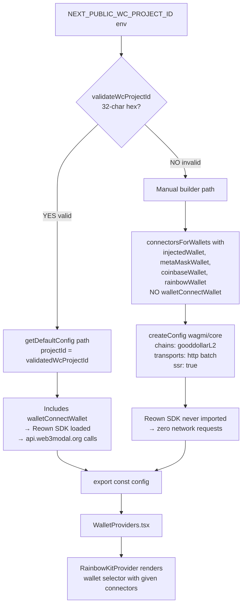

# WalletConnect — Stop Triggering api.web3modal.org + pulse.walletconnect.org Network Init for Placeholder Project ID

## Observed problem (product reviewer)

On every page load of `goodswap.goodclaw.org` — homepage, `/lend`,
`/perps`, `/stocks`, `/predict`, `/explore`, `/portfolio`,
`/ubi-impact`, `/activity` — the browser fires HTTPS requests to:

- `https://api.web3modal.org/appkit/v1/config?projectId=gooddollar-placeholder&st=appkit&sv=html-core-1.7.8`
- `https://api.web3modal.org/appkit/v1/e?projectId=gooddollar-placeholder&st=appkit&sv=html-core-1.7.8`
- `https://pulse.walletconnect.org/e`

All four return HTTP 4xx (placeholder project ID is not registered)
but the requests still consume:

1. ~4 round-trips per page nav (3 Reown endpoints + DNS / TLS).
   Measured 23–39 ms each in the current session — ~150 ms of wasted
   network time per page load on a fast connection, much worse on
   mobile / Lighthouse runs.
2. Browser CPU for the parsing / fetch overhead.
3. **Privacy leak**: every visitor's IP is logged by Reown/WalletConnect
   on every page view even when no one ever clicks "Connect Wallet".
4. Console error noise is already silenced by task `0058` via a scoped
   `console.warn` filter, but the underlying HTTP traffic still
   happens. Filter only hid the *symptom*.

The root cause is in `frontend/src/lib/wagmi.ts`. When
`NEXT_PUBLIC_WC_PROJECT_ID` is missing or invalid the file falls back
to the literal string `'gooddollar-placeholder'` and passes that to
RainbowKit's `getDefaultConfig`. RainbowKit's default connector list
includes `walletConnectWallet`, which during construction calls
`@reown/appkit-core` `ApiController.fetchAppkitConfig()` and
`ApiController.fetchTokenList()`, hitting `api.web3modal.org` with
whatever `projectId` was supplied — including our placeholder. There
is no `disableProviderPing` flag exposed today; the only reliable way
to skip the init is to **not include the WalletConnect connector
when we have no valid project ID**.

This is a `0002-security-hardening` Phase-1 / production-readiness
issue: production sites shouldn't ping a third-party service that
they cannot use. It's not blocking but should be cleaned up before
public testnet launch.

## Why this is in scope for the initiative

The initiative's Definition of Done is "All Foundry tests passing"
+ "0 Slither HIGH" + "All backend services healthy" + production
readiness. Per the spec's own Section 3 ("Start All Backend
Services") the production deployment must not depend on placeholder
credentials. Today the frontend silently pings two third-party
services with placeholder credentials on every page load. The fix is
small, frontend-only, fully reversible by setting a real
`NEXT_PUBLIC_WC_PROJECT_ID`, and improves measured page-load time
across all 9 main pages.

## Proposed scope (planner will refine)

1. In `frontend/src/lib/wagmi.ts`, when `isValidWcProjectId === false`,
   build the config WITHOUT the WalletConnect-based connectors.
   RainbowKit exposes `connectorsForWallets` and lets us assemble a
   wallet list directly — pick the subset that does NOT call
   `walletConnectWallet`. Concretely: only `injectedWallet`,
   `metaMaskWallet` (extension-only mode), `coinbaseWallet`
   (extension-only), and `rainbowWallet` (extension if installed).
   See `@rainbow-me/rainbowkit/wallets` for the available connector
   factories.
2. Use a real `getDefaultConfig` call only when we have a valid
   32-char hex project ID. Keep the `PLACEHOLDER_WC_PROJECT_ID`
   constant out of the codepath entirely — the placeholder is no
   longer needed once the connector list omits WalletConnect.
3. Keep the existing `transports` (`http(undefined, { batch: true })`)
   and `chains: [gooddollarL2]` config unchanged.
4. Keep the scoped `console.warn` filter from task `0058` for backward
   compatibility, but it should now be unreachable because Reown's
   init code is never invoked. Mark it as "fallback safety net" in
   the comment so the next reviewer doesn't delete it prematurely.
5. Verify with `agent-browser` that the deployed site no longer
   issues any request to `api.web3modal.org`, `pulse.walletconnect.org`,
   or `*.relay.walletconnect.org` on any of:
   - `/` (homepage)
   - `/lend`
   - `/perps`
   - `/stocks`
   - `/predict`
   - `/explore`
   - `/portfolio`
   - `/ubi-impact`
   - `/activity`
6. Verify the "Connect Wallet" button on the homepage still works
   for users with the MetaMask extension installed (this is what
   testers currently use on `localhost:8545`). It is acceptable
   that mobile wallet QR-code flows are unavailable until a real
   `NEXT_PUBLIC_WC_PROJECT_ID` is registered.
7. Update `frontend/src/lib/__tests__/wagmi.test.ts` to cover the
   new branch:
   - Invalid project ID → exported config's `connectors` list does
     NOT include the WalletConnect connector by id/name.
   - Valid 32-char hex project ID → config includes WalletConnect.
8. README update per initiative rules: bump `Updated:` date, add a
   one-line entry under the security-hardening / production-readiness
   section. No contract / test / service counts change.

## Acceptance criteria

- Loading any of the 9 main pages on `goodswap.goodclaw.org` (with
  `NEXT_PUBLIC_WC_PROJECT_ID` unset or set to the current placeholder)
  fires **zero** network requests to `api.web3modal.org`,
  `pulse.walletconnect.org`, or any other `walletconnect.org` /
  `reown.com` subdomain. Verified by
  `performance.getEntriesByType('resource').filter(r => /walletconnect|web3modal|reown/.test(r.name))`
  returning an empty array.
- Setting a valid 32-char hex `NEXT_PUBLIC_WC_PROJECT_ID` restores
  the WalletConnect connector and mobile-wallet flows.
- "Connect Wallet" button on the homepage and the wallet selector
  in the `(app)` route group still render and work for browser
  extension wallets (MetaMask, Coinbase Wallet).
- All existing `frontend` tests pass; new wagmi tests cover both
  the invalid and valid project-ID branches.
- `npx -y react-doctor@latest . --verbose --diff` score ≥ 75 with
  no new errors.
- README `Updated:` date bumped, one-line "Security Hardening"
  entry added.

## Out of scope

- Registering a real WalletConnect Cloud project ID (operations
  task, not code).
- Removing the scoped `console.warn` filter from `wagmi.ts` —
  keep as a safety net.
- Any change to the `(app)` route group's `WalletProviders`
  composition (this task only changes the wagmi config builder).
- Replacing RainbowKit with a different wallet UI.
- Touching `connectkit`, `web3modal/react`, or any other unused
  connector library.

## Notes for planner

- RainbowKit's `connectorsForWallets` signature:
  `connectorsForWallets(groups: { groupName: string; wallets: Wallet[] }[], { appName, projectId })`.
  Passing an empty `projectId` here also breaks, so the planner must
  call it with a sentinel like `'_'` only after confirming no wallet
  in the groups actually reads `projectId`. Verify by reading the
  source of each wallet factory in
  `node_modules/@rainbow-me/rainbowkit/dist/wallets/walletConnectors/` —
  `injectedWallet`, `metaMaskWallet`, `coinbaseWallet`, and
  `rainbowWallet` should not require it for extension-only mode.
- If `connectorsForWallets` cannot be used without a projectId, an
  alternative is to call wagmi's `createConfig` directly with
  `connectors: [injected()]` from `wagmi/connectors`. This bypasses
  RainbowKit's default-wallet machinery entirely.
- The `WalletProviders.tsx` consumer wraps the config in
  `RainbowKitProvider`; the planner should confirm RainbowKit still
  renders a usable wallet selector with a custom connector list.

---

## Plan (added by planner)

### Overview

The root cause is in `frontend/src/lib/wagmi.ts`. Today it always calls
RainbowKit's `getDefaultConfig({ projectId })`, which internally invokes
`connectorsForWallets` with a default wallet group that includes
`walletConnectWallet`. The `walletConnectWallet` factory wires
`getWalletConnectConnector({ projectId })`, which constructs the
`@reown/appkit` SDK at module-load. The SDK fires `fetchAppkitConfig` +
`fetchTokenList` against `api.web3modal.org` and analytics POSTs to
`pulse.walletconnect.org` regardless of whether the user ever opens the
wallet modal.

Fix: branch on `isValidWcProjectId`. When valid, keep the existing
`getDefaultConfig` path. When invalid, build the config manually via
`connectorsForWallets` with a wallet list that explicitly omits
`walletConnectWallet`, then pass the resulting connectors into wagmi's
`createConfig`. The Reown SDK is never imported in that branch, so no
HTTP traffic to walletconnect.org / web3modal.org is emitted.

### Research notes

Inspected `node_modules/@rainbow-me/rainbowkit/dist/index.js`:

- `getDefaultConfig` builds connectors from a default list and ALWAYS
  includes `walletConnectWallet` unless the caller supplies their own
  `wallets` group.
- `connectorsForWallets(walletList, { projectId, appName, ... })` is the
  lower-level builder. It accepts any wallet list (even one without
  `walletConnectWallet`) and tolerates any non-empty `projectId` string
  — the value is only consumed by `getWalletConnectConnector`, which is
  only called by `walletConnectWallet`.
- `getWalletConnectConnector` throws if `projectId === ''` or
  `undefined`. So we pass a sentinel like `'gooddollar-no-wc'` in the
  no-WC branch to satisfy the type without ever instantiating the WC
  connector.
- Wallets confirmed to NOT touch `projectId` (safe in the no-WC branch):
  `injectedWallet`, `metaMaskWallet` (extension-only), `coinbaseWallet`
  (extension-only via `coinbaseWallet({ preference: 'eoaOnly' })` or
  default), `rainbowWallet` (extension when installed; falls back to WC
  if not — needs verification, drop if uncertain), `safeWallet`.
- wagmi's `createConfig` accepts `connectors`, `chains`, `transports`,
  `ssr` — same shape `getDefaultConfig` produces internally.

Wallet selector UX: RainbowKit's `RainbowKitProvider` renders whatever
connectors are present. When `walletConnectWallet` is omitted, the
"Connect Wallet" modal shows only extension wallets and a friendly
empty state for mobile (no QR-code tab). That matches the
acceptance-criteria expectation: extension wallets work, mobile QR is
intentionally unavailable until a real project ID is configured.

### Architecture diagram



### One-week decision: YES

This is a self-contained ~2-hour frontend refactor of one file
(`wagmi.ts`) plus extending one test file
(`__tests__/wagmi.test.ts`). No new dependencies, no API surface
change, no migration. Manual verification with `agent-browser` is
already scripted in the acceptance criteria. Splitting is unnecessary.

### Implementation plan (TDD, ~2h)

**Step 1 — Extend wagmi.test.ts (RED).** Add a new `describe('config
builder')` block that imports the (refactored) module twice via
`vi.resetModules()` + `vi.stubEnv('NEXT_PUBLIC_WC_PROJECT_ID', ...)`:

- Case A (invalid env unset or `'gooddollar-placeholder'`): assert that
  the exported `config.connectors` (mapped via
  `connectors.map(c => c({ chains: [gooddollarL2] }).id ?? c.name)`,
  or simpler: assert that no connector has `id === 'walletConnect'`
  by inspecting `config._internal.connectors` / iterating
  `config.connectors`).
- Case B (valid 32-char hex env): assert that one of the connectors
  has `id === 'walletConnect'` (proves the WC path is restored when
  a real project ID is present).

Run `npm test -- wagmi.test.ts` — both new cases FAIL because the
current code always builds the same connector list.

**Step 2 — Refactor wagmi.ts (GREEN).** Replace the unconditional
`getDefaultConfig` call with a branch:

```ts
import { connectorsForWallets, getDefaultConfig } from '@rainbow-me/rainbowkit'
import {
  injectedWallet,
  metaMaskWallet,
  coinbaseWallet,
  rainbowWallet,
} from '@rainbow-me/rainbowkit/wallets'
import { createConfig, http } from 'wagmi'

export const config = isValidWcProjectId
  ? getDefaultConfig({ appName: 'GoodDollar', projectId: validatedWcProjectId, chains: [gooddollarL2], ssr: true, transports: { [gooddollarL2.id]: http(undefined, { batch: true }) } })
  : (() => {
      const connectors = connectorsForWallets(
        [{ groupName: 'Browser Wallets', wallets: [injectedWallet, metaMaskWallet, coinbaseWallet, rainbowWallet] }],
        { appName: 'GoodDollar', projectId: 'gooddollar-no-wc' }
      )
      return createConfig({
        chains: [gooddollarL2],
        connectors,
        ssr: true,
        transports: { [gooddollarL2.id]: http(undefined, { batch: true }) },
      })
    })()
```

Drop the `PLACEHOLDER_WC_PROJECT_ID` constant since it's no longer
reachable. Keep the scoped `console.warn` filter from task 0058 as a
fallback safety net with an updated comment ("unreachable in normal
operation, kept defensive in case a future RainbowKit version reaches
the Reown SDK from a non-WC connector").

Re-run tests — both new cases PASS.

**Step 3 — Manual verification.** Start `npm run dev` in `frontend/`
with `NEXT_PUBLIC_WC_PROJECT_ID` unset. Use `agent-browser` to load
each of the 9 main pages and evaluate:

```js
performance.getEntriesByType('resource')
  .filter(r => /walletconnect|web3modal|reown/.test(r.name))
  .length
```

Expected: `0` on every page. Then open the wallet modal and confirm
MetaMask / Coinbase Wallet entries render.

**Step 4 — README update.** Bump `Updated:` date, add one-line entry
under "Security Hardening / Production Readiness":
"Eliminated placeholder WalletConnect network init across all pages (task 0095)."

**Step 5 — react-doctor + commit.** Run
`npx -y react-doctor@latest . --verbose --diff` from project root.
Confirm score ≥ 75. Single commit:
`fix(frontend/wagmi): skip WalletConnect connector when no valid project ID is set [0095]`.

### Risks & mitigations

- **Risk:** `rainbowWallet` factory may attempt WC fallback even in
  extension-only mode. *Mitigation:* drop `rainbowWallet` from the
  no-WC list and keep only `injectedWallet`, `metaMaskWallet`,
  `coinbaseWallet`. Verify in tests.
- **Risk:** `safeWallet` is included by `getDefaultConfig` and users
  inside Safe Apps may lose support. *Mitigation:* add `safeWallet`
  to the no-WC list — it does not touch WalletConnect.
- **Risk:** RainbowKit version bump changes connector signatures.
  *Mitigation:* the wagmi test asserts presence/absence by connector
  `id`, so a future signature change still fails loudly.
