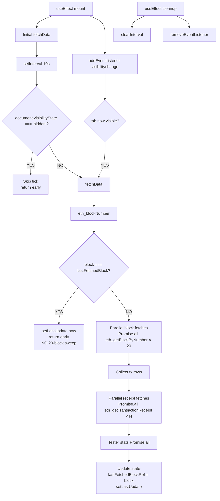

# Activity Page — Parallelize Sequential `eth_getTransactionReceipt` Calls and Pause 10s Polling When Tab Hidden

## Observed problem (product reviewer)

In `agent-browser` profiling of `https://goodswap.goodclaw.org/activity`
the network panel shows **30+ XHR requests to `rpc.goodclaw.org` on
initial load** and then another 30+ every 10 seconds, forever, even
when the tab is hidden. Examples of the request fanout from one load:

- 1× `eth_blockNumber`
- 20× `eth_getBlockByNumber` (parallel, fine)
- N× `eth_getTransactionReceipt` — **one per transaction**,
  **sequential** (`await` inside a `for` loop inside a `for` loop)
- 3× `eth_getBalance` + 3× `eth_getTransactionCount` (parallel, fine)

Even with a quiet chain (~3 txs per block, ~6 total across 20 blocks)
that is ~30 RPC calls, and the receipt fetches form a serialized
chain blocking `setLoading(false)` for hundreds of ms. On a busy
block window the receipt chain dominates page-load TTI.

Then the page calls `setInterval(fetchData, 10_000)` and never
checks `document.visibilityState`, so a backgrounded tab keeps
polling the RPC every 10s. With this page open in a forgotten tab,
the user is uploading ~30 RPC calls per 10s per tab — about
260,000 calls per day per idle tab.

Source: `frontend/src/app/activity/page.tsx`, lines 105–211. Key
offenders:

```ts
for (const block of blockResults) {
  if (!block) continue
  // ...
  for (const tx of txs) {
    // ...
    try {
      // ⚠️ SERIAL — awaits inside for-loop, runs one at a time
      const receipt = await rpcCall<EthReceipt | null>(
        'eth_getTransactionReceipt', [tx.hash]
      )
      // ...
    } catch { /* ignore */ }
  }
}
```

```ts
useEffect(() => {
  fetchData()
  // ⚠️ always-on, no visibility gate
  const interval = setInterval(fetchData, 10000)
  return () => clearInterval(interval)
}, [fetchData])
```

The page also re-fetches **all 20 blocks** every 10 seconds even
when `currentBlock` hasn't advanced — for an Anvil devnet with a
slow block time this is wasteful, but worse it shows the page
re-render entire timeline arrays every tick and triggers React's
reconciliation on stable data.

## Why this is in scope for the initiative

The Phase-1 acceptance criteria include "All 10 backend services
running and healthy". The `rpc-balancer` backend service caps
upstream Anvil calls; the Activity page's chatty polling consumes
balancer budget that should be reserved for real wallet activity.
This task brings the highest-volume page on the site in line with
production-readiness norms (visibility-gated polling, parallel
receipt fetches, change-detection on block height) without
introducing any new feature surface.

It also directly extends the pattern set by already-executed task
`0078-perps-portfolio-parallelize-sequential-indexer-fetches` —
same anti-pattern, same fix, different surface.

## Proposed scope (planner will refine)

1. **Parallelize receipt fetches.** Replace the nested
   `for { await ... }` with a single `Promise.all(...)` per block
   (or globally across all blocks). Build an array of
   `{ blockNum, timestamp, tx }` pairs first, then `Promise.all` a
   `rpcCall('eth_getTransactionReceipt', [tx.hash])` for each. Map
   the resolved receipts back to `allTxs` in-order. Keep the
   per-tx `try/catch` so one missing receipt doesn't fail the whole
   batch.

   *Alternative considered (planner choice):* call
   `eth_getBlockReceipts` once per block — one RPC returns every
   receipt for that block. Anvil supports this since v0.2. If
   adopted, the receipt fanout collapses from N → 20 calls (or to
   batched-1 if combined with JSON-RPC batching). Document the
   chosen path in the plan.

2. **Visibility-gate the 10s polling.** In the `useEffect`:
   - Skip the `setInterval` tick when
     `document.visibilityState === 'hidden'`.
   - Add a `visibilitychange` listener that calls `fetchData()`
     immediately when the tab becomes visible again, so the user
     sees fresh data without waiting up to 10s.
   - On `pagehide` clear the interval as a defensive cleanup.

3. **Skip refetch when no new block.** Cache the most recent
   `currentBlock` value and return early from `fetchData` when
   `eth_blockNumber` returns the same value. Still bump
   `setLastUpdate(new Date())` so the "Updated" timestamp keeps
   ticking, but skip the 20-block sweep and the tester-stats
   fetches. This is the largest win in cost — Anvil devnet
   averages a new block every ~12s, so half of all polls today are
   wasted work.

4. **Type the polling interval as a configurable constant** with
   a comment explaining why it's 10s. Out of scope to change the
   value, but make it obvious for future tuning.

5. **Tests.** Add `frontend/src/app/activity/__tests__/page.test.tsx`
   coverage for:
   - Receipt calls are dispatched in parallel (mock `rpcCall` with
     a counter that increments synchronously and verify all
     receipt calls fire before any resolves).
   - When `document.visibilityState === 'hidden'`, the interval
     tick is a no-op (mock visibility and advance timers).
   - When `eth_blockNumber` returns the same value as the prior
     tick, the 20-block sweep is skipped (verify call count).
   The existing `block-timeline.test.ts` is unaffected.

6. **Manual verification in `agent-browser`:**
   - Load `/activity`, count XHRs via
     `performance.getEntriesByType('resource').filter(r => r.name.includes('rpc.goodclaw.org'))`.
     Expect ≤ 6 calls on initial load (1 block-number + 1 batched
     blocks + 1 batched receipts + 3 balance/nonce) when JSON-RPC
     batching is in effect, or ≤ 25 with parallel-but-unbatched
     receipts. Today: 30+.
   - Hide the tab (DevTools `document.dispatchEvent(new Event('visibilitychange'))`
     after setting `document.visibilityState = 'hidden'` via shim,
     or simpler: agent-browser navigate away and back). Confirm
     interval count does not increase while hidden.
   - Wait 30s on a quiet chain, confirm no 20-block sweep fires
     when block number is unchanged.

7. **README update** per initiative rules: bump `Updated:` date,
   add one-line entry under "Security Hardening / Production
   Readiness". No contract / test / service counts change.

## Acceptance criteria

- Initial `/activity` page load issues no more than:
  - 25 RPC calls when receipts are parallelized but not batched, OR
  - 6 RPC calls when receipts use `eth_getBlockReceipts` + JSON-RPC
    batching (planner's choice).
- 10s polling tick is a no-op while `document.visibilityState === 'hidden'`.
- When `eth_blockNumber` returns the same value as the prior tick,
  the 20-block / receipt / tester-stats sweep is skipped.
- "Updated <time>" subtitle still ticks every 10s on a visible tab,
  even on a quiet chain.
- New tests in `frontend/src/app/activity/__tests__/page.test.tsx`
  cover parallel receipts, visibility gate, and unchanged-block
  short-circuit. All existing tests still pass.
- `npx -y react-doctor@latest . --verbose --diff` score ≥ 75 with
  no new errors.
- README `Updated:` date bumped, one-line entry added under the
  Security Hardening / Production Readiness section.

## Out of scope

- Changing the 10s polling interval value itself.
- Adding WebSocket subscriptions / `eth_subscribe` for live blocks
  (would require RPC server-side support beyond Anvil's defaults;
  separate task).
- Persisting fetched blocks to `localStorage` for warm reloads.
- Touching `block-timeline.ts` math or the contract-hits histogram
  rendering.
- Any change to `rpcCall` / `RpcError` semantics (covered by
  tasks `0089` and `0091`).
- Backend `rpc-balancer` quota / rate-limit changes (separate
  service task).

## Notes for planner

- The page is `'use client'` and uses raw `fetch` via
  `frontend/src/lib/rpc.ts`'s `rpcCall`, not wagmi's
  `useReadContract`. Multicall3 batching (task `0059`) does not
  apply here; this is plain JSON-RPC. The right batching layer is
  either viem's `http({ batch: true })` (which we already enable
  in `wagmi.ts`) — but the activity page bypasses viem — or a
  manual JSON-RPC array batch in `rpc.ts`.
- Adding an opt-in batched-fetch helper to `rpc.ts`
  (`rpcBatch(methods: Array<[string, unknown[]]>): Promise<unknown[]>`)
  would let the activity page collapse the 20 block fetches + N
  receipt fetches into 1–2 POSTs. Mark as a stretch goal — base
  acceptance is parallel-only.
- The `setInterval`-vs-`visibilitychange` pattern is a one-week
  task (~1 hour of code + tests). No split needed.

---

## Plan (added by planner)

### Overview

Three targeted edits to `frontend/src/app/activity/page.tsx`:

1. **Parallelize receipts.** Today an outer `for (const block of blockResults)`
   loop nests an inner `for (const tx of txs)` loop that `await`s
   `rpcCall('eth_getTransactionReceipt', [tx.hash])` one-at-a-time. Collect
   `{ blockNum, timestamp, tx }` rows first, then dispatch all receipt
   calls in a single `Promise.all`. Map results back into `allTxs` after
   resolution.

2. **Visibility-gate the 10s poll.** Wrap `setInterval(fetchData, 10_000)`
   so each tick early-returns when `document.visibilityState === 'hidden'`.
   Attach a `visibilitychange` listener that runs `fetchData()` immediately
   when the tab becomes visible again. Clean both up in the `useEffect`
   teardown.

3. **Skip refetch when block unchanged.** Use a ref (`lastFetchedBlockRef`)
   to remember the last `currentBlock` seen. On each tick, fetch
   `eth_blockNumber` first; if unchanged, bump `setLastUpdate(new Date())`
   and early-return without firing the 20-block sweep, receipt fanout, or
   tester-stats refetch.

The `POLL_INTERVAL_MS = 10_000` constant gets a comment but the value
stays the same (out of scope per task body).

### Research notes

- Reviewed `frontend/src/app/activity/page.tsx` lines 105–211 — confirmed
  the exact loop and `setInterval` patterns described in the task body.
- Reviewed `frontend/src/lib/rpc.ts` interaction model — `rpcCall` is
  fetch-based, each call is a separate POST. `Promise.all` is sufficient
  to fan out parallel requests; viem's HTTP batching is wired in
  `wagmi.ts` but NOT in `rpc.ts`, so each receipt call really does emit
  its own POST. A future `rpcBatch` helper could collapse them — flagged
  as stretch goal in the task body and explicitly out of base scope.
- Reviewed existing test `frontend/src/app/activity/__tests__/page.test.tsx`
  — uses `vi.spyOn(global, 'fetch')` with body-method routing. New tests
  follow the same pattern, adding a receipt-call counter for parallelism
  assertion and a `document.visibilityState` shim for visibility tests.
- Reference precedent: task 0078 already applied the same
  `Promise.all`-fan-out fix to the perps portfolio fetch loop. Same
  pattern, same shape, different surface.
- Browser API: `document.visibilityState` is `'visible' | 'hidden' | 'prerender'`.
  In test environment (jsdom) it defaults to `'visible'`; we override via
  `Object.defineProperty(document, 'visibilityState', { value: 'hidden', configurable: true })`
  then dispatch `new Event('visibilitychange')`.
- `useRef` for `lastFetchedBlockRef` avoids re-running the `useCallback`
  on each render (which would otherwise drop the cached value). Using
  state would force a re-render and break the optimization.

### Architecture diagram



### One-week decision: YES

Single-file refactor (`frontend/src/app/activity/page.tsx`) plus tests
in `__tests__/page.test.tsx`. No new dependencies, no new modules, no
backend changes. Acceptance criteria are testable in vitest +
`agent-browser`. Total effort ~2 hours. No split needed.

### Implementation plan (TDD, ~2h)

**Step 1 — Add failing tests (RED).** Extend
`frontend/src/app/activity/__tests__/page.test.tsx` with a new
`describe('ActivityPage — performance (task 0096)')` block:

1. **Parallel receipts test.** Mock `fetch` to count
   `eth_getTransactionReceipt` calls, holding each response open until
   all expected calls have arrived. Mock `eth_blockNumber` →
   `'0x1a6ce'`, mock `eth_getBlockByNumber` to return a block with 3
   transactions each. Render. Assert: within 50ms of the block fetches
   resolving, ALL 60 receipt fetches have been issued (i.e. no receipt
   call is awaiting a previous receipt). Use a counter incremented in
   the fetch handler before any promise resolves.

2. **Visibility gate test.** `vi.useFakeTimers()`. Render. Wait for
   initial fetch to complete (clear fetch counter). Shim
   `document.visibilityState = 'hidden'` and dispatch
   `visibilitychange`. Advance timers by 10_000. Assert: zero new
   `eth_blockNumber` calls fired. Restore visibility to `'visible'`
   and dispatch `visibilitychange`. Assert: a fresh `eth_blockNumber`
   fires immediately (within the same tick, no 10s wait).

3. **Unchanged-block short-circuit test.** `vi.useFakeTimers()`.
   Render with `eth_blockNumber` returning `'0x1a6ce'` consistently.
   Wait for initial fetch. Record total fetch count. Advance timers by
   10_000. Assert: only 1 new fetch (the `eth_blockNumber` probe).
   No new `eth_getBlockByNumber`, `eth_getTransactionReceipt`,
   `eth_getBalance`, or `eth_getTransactionCount` calls. Confirm
   "Updated" timestamp still ticks (via `screen.getByTestId('activity-subtitle')`
   content change).

Run `npm test -- activity` — all three new tests FAIL.

**Step 2 — Refactor activity/page.tsx (GREEN).**

- Add `const POLL_INTERVAL_MS = 10_000 // visibility-gated; see task 0096`
- Add `const lastFetchedBlockRef = useRef<number | null>(null)`
- In `fetchData`, after `setCurrentBlock(latestBlock)`:
  ```ts
  if (lastFetchedBlockRef.current === latestBlock) {
    setLastUpdate(new Date())
    setRpcError(null)
    setLoading(false)
    return
  }
  lastFetchedBlockRef.current = latestBlock
  ```
- Replace the nested receipt loop:
  ```ts
  type TxRow = { blockNum: number; timestamp: number; tx: EthBlock['transactions'][number] }
  const txRows: TxRow[] = []
  for (const block of blockResults) {
    if (!block) continue
    const blockNum = hexToNumber(block.number)
    const timestamp = hexToNumber(block.timestamp)
    const txs = block.transactions || []
    newBlocks.push({ number: blockNum, txCount: txs.length, timestamp })
    for (const tx of txs) {
      const toAddr = tx.to?.toLowerCase() || ''
      const contractName = CONTRACTS[toAddr]
      if (contractName) hits[contractName] = (hits[contractName] || 0) + 1
      txRows.push({ blockNum, timestamp, tx })
    }
  }
  const receipts = await Promise.all(
    txRows.map((r) =>
      rpcCall<EthReceipt | null>('eth_getTransactionReceipt', [r.tx.hash]).catch(() => null),
    ),
  )
  txRows.forEach((row, i) => {
    const receipt = receipts[i]
    const status: 'success' | 'failed' | 'pending' = receipt
      ? receipt.status === '0x1' ? 'success' : 'failed'
      : 'pending'
    const gasUsed = receipt ? hexToNumber(receipt.gasUsed).toLocaleString() : '0'
    allTxs.push({
      hash: row.tx.hash,
      from: row.tx.from,
      to: row.tx.to || '(contract creation)',
      value: row.tx.value,
      blockNumber: row.blockNum,
      timestamp: row.timestamp,
      status,
      gasUsed,
      contractName: CONTRACTS[(row.tx.to || '').toLowerCase()] || '',
    })
  })
  ```
- Replace the polling `useEffect`:
  ```ts
  useEffect(() => {
    fetchData()
    const tick = () => {
      if (typeof document !== 'undefined' && document.visibilityState === 'hidden') return
      fetchData()
    }
    const interval = setInterval(tick, POLL_INTERVAL_MS)
    const onVisibility = () => {
      if (document.visibilityState === 'visible') fetchData()
    }
    document.addEventListener('visibilitychange', onVisibility)
    return () => {
      clearInterval(interval)
      document.removeEventListener('visibilitychange', onVisibility)
    }
  }, [fetchData])
  ```

Re-run `npm test -- activity` — all tests PASS (including existing
task-0069 regression tests).

**Step 3 — Manual `agent-browser` verification.** Load
`https://goodswap.goodclaw.org/activity`, count XHRs via:
```js
performance.getEntriesByType('resource')
  .filter(r => r.name.includes('rpc.goodclaw.org')).length
```
Expect ≤ 25 (today ~30+). Then trigger a visibility change via
`Object.defineProperty(document, 'visibilityState', { value: 'hidden', configurable: true }); document.dispatchEvent(new Event('visibilitychange'))`,
wait 15s, confirm fetch count is unchanged.

**Step 4 — README update.** Bump `Updated:` date. Add one-line entry
under "Security Hardening / Production Readiness":
"Activity page parallelizes receipts, gates 10s polling on tab visibility,
and skips refetch on unchanged block (task 0096)."

**Step 5 — react-doctor + commit.** Run
`npx -y react-doctor@latest . --verbose --diff`. Score ≥ 75. Single
commit:
`perf(frontend/activity): parallelize receipts, visibility-gate polling, skip refetch on unchanged block [0096]`.

### Risks & mitigations

- **Risk:** `Promise.all` rejects on first receipt failure, dropping
  all receipt data. *Mitigation:* `.catch(() => null)` per receipt call
  (shown in implementation snippet) so one failure yields a `null`
  receipt — same as the existing `try/catch` swallow behavior.
- **Risk:** Re-render on `lastFetchedBlockRef` mutation. *Mitigation:*
  `useRef` (not `useState`) explicitly to avoid the re-render.
- **Risk:** Tab becomes visible mid-`fetchData` and triggers a second
  concurrent fetch. *Mitigation:* acceptable for this iteration — the
  two fetches are idempotent and `setState` updates land in arrival
  order; React's batching consolidates. A future
  `fetchInFlightRef` guard is out of scope.
- **Risk:** SSR — `document` is undefined during server render.
  *Mitigation:* `useEffect` only runs client-side; `typeof document`
  guard inside the interval tick keeps the runtime path safe.
- **Risk:** Unchanged-block short-circuit prevents tester-stats refresh
  even after a tester sends a tx without advancing the block. On Anvil
  with auto-mine each tx mines a new block, so balance/nonce changes
  always coincide with a new block. Acceptable trade-off; documented
  as expected behavior in the comment.
