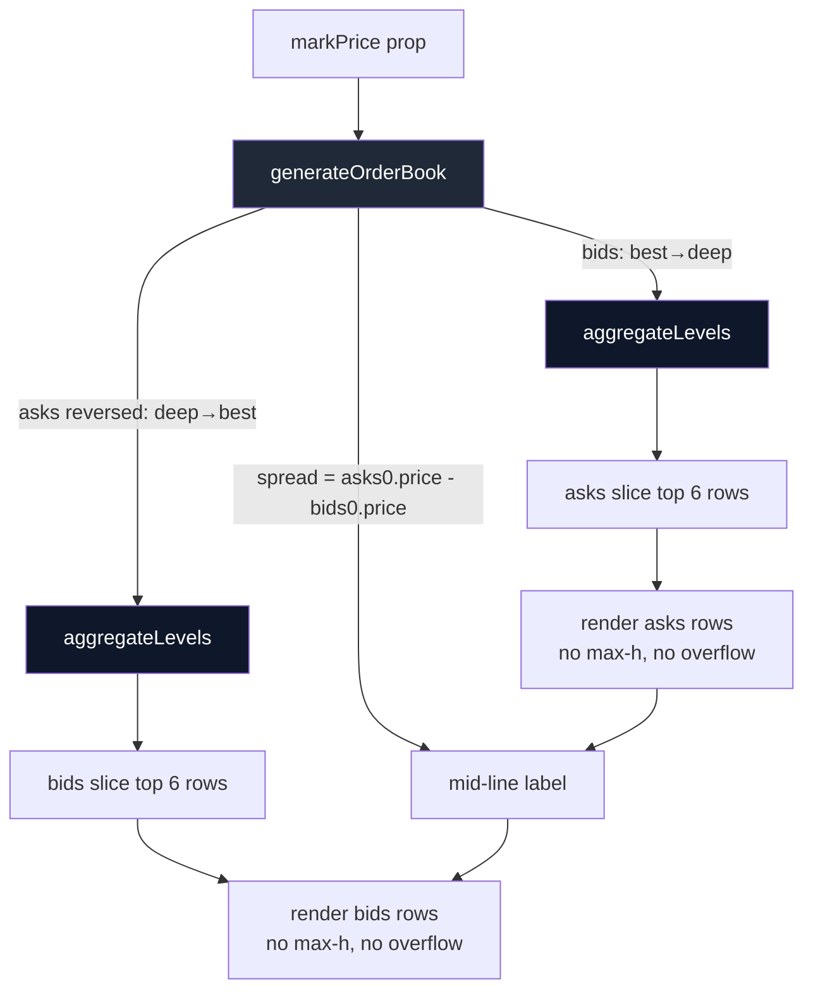

# Perps Order Book — Best Bid/Ask Hidden by Scroll Container; Spread Label Inconsistent With Visible Levels; Adjacent Price Levels Render as Visual Duplicates

## Observed problem (visual-polish review, iteration #50)

Screenshot `/tmp/iter50-screenshots/perps.png` (BTC-USD, 1440×900 viewport) shows the
Perps Order Book panel rendering a state that looks broken to a trader's eye:

- The mid-line label reads **"Spread: $2.20"**.
- But the visually-closest ask above the mid is **$84,259.86** and the closest visible
  bid below the mid is **$84,248.99**, which is a $10.87 spread — five times what
  the label claims.
- Two consecutive bid rows both render as **$84,245.95** with different sizes
  (2.191 / 1.400) and different cumulative totals (10.615 / 12.015). To a user
  these look like a duplicate row or a render bug.

There are two independent bugs colliding here, both rooted in
`frontend/src/components/OrderBook.tsx`:

### Bug 1 — best quotes are scrolled out of view

`generateOrderBook` produces ~12 ask levels and ~12 bid levels per side. After
sorting `asks: asks.reverse()`, the array is iterated top-to-bottom with the
**lowest ask (best ask) at the very bottom** — which is the standard book
layout. But the rendering wrapper is:

```tsx
// frontend/src/components/OrderBook.tsx:69
<div className="max-h-[130px] overflow-y-auto scrollbar-none divide-y divide-gray-700/5">
  {asks.map(...)}
</div>
```

At ~22 px per row × 12 rows = 264 px of asks compressed into 130 px of viewport.
Browsers default `overflow-y-auto` to `scrollTop = 0`, so the asks list is
**pinned to the top showing the WORST asks**, while the best ask (closest to
the mid) is scrolled out of view at the bottom. The `Spread:` label is
computed correctly off the true best quotes (`asks[0].price - bids[0].price`
before reverse — the best ask is `asks[0]` pre-reverse), so the label is
*right* but the user can't see the prices it refers to.

The bids container has the same `max-h-[130px]` cap but bids are listed
top-to-bottom from best (highest bid) downward, so bids happen to render the
best-first. Asymmetric rendering — only the asks side is visually broken.

### Bug 2 — `formatPerpsPrice` rounding collapses adjacent levels

`formatPerpsPrice(84245.951)` and `formatPerpsPrice(84245.948)` both produce
`"$84,245.95"` because the formatter rounds to two decimals for prices ≥ $1000:

```ts
// frontend/src/lib/perpsData.ts
if (abs >= 1000) return `${sign}$${abs.toLocaleString('en-US', { minimumFractionDigits: 2, maximumFractionDigits: 2 })}`
```

`generateOrderBook` produces continuous-float prices with `Math.random()`, so
adjacent ticks frequently round to the same display string, especially when
two ticks fall within ~$0.01 of each other. The result: the order book
renders rows that look like literal duplicates (same price twice in a row,
different size), which is something a real exchange order book never shows
because levels are aggregated.

This is purely a frontend-only mock issue (the prior task `0082` already
fixed the sort-order bug), but the visual consequence is that the order book
looks unreliable.

## Files affected

- `frontend/src/components/OrderBook.tsx` — render loop and `generateOrderBook`
- `frontend/src/lib/perpsData.ts` — `formatPerpsPrice` (read-only reference; do not change)

## Target behavior

1. **Best-quote visibility** — the user must always see the rows immediately
   adjacent to the mid line.
   - Either remove `max-h-[130px]` and let the panel grow (preferred — the
     surrounding Trade panel already scrolls), OR
   - Cap to 6 visible levels per side and slice the data to the best 6 of
     each side instead of trying to scroll a 12-deep list.

2. **No duplicate-looking rows** — when consecutive levels round to the same
   `formatPerpsPrice()` string, **aggregate** them into a single row whose
   `size` is the sum of the merged sizes (and whose `total` is the cumulative
   total at the deepest merged level). This matches how real CLOBs aggregate
   to the displayed tick.
   - Implement an aggregation helper inside `OrderBook.tsx` (or alongside
     `generateOrderBook`) keyed off the formatted price string.
   - Aggregation must run **after** `bids.sort` / `asks.sort` and **before**
     `.reverse()` of asks, so cumulative totals are correct.

3. **Spread label still computed off true best quotes** — i.e., do not change
   the formula `asks[0].price - bids[0].price` (pre-reverse). It was already
   correct, the problem was that the user couldn't see the corresponding rows.

## Acceptance criteria

- Loading `/perps` and choosing any pair, the row immediately above the
  spread label is the lowest-priced ask and the row immediately below is the
  highest-priced bid. No scrolling required to see them.
- The `Spread:` value matches `(price of row immediately above) - (price of
  row immediately below)` to the cent.
- No two consecutive rows on the same side ever display the same
  `formatPerpsPrice` string. If two underlying levels collapse to the same
  display string, they appear as a single aggregated row with summed size.
- Existing `cumulative total` semantics are preserved: each row's `total`
  equals the running sum of its own size plus all sizes between it and the
  mid (inclusive of itself), as before.
- No other component is changed; `formatPerpsPrice` is left untouched.
- `npx -y react-doctor@latest .` score does not regress; targets ≥ 75.

## Out of scope

- Connecting the order book to a real backend (this is a mock today).
- Changing the price-format precision globally (would affect prices on every
  page; outside the polish scope).
- Adjusting the spread label's typography or position.

## Verification steps

1. `cd frontend && pm2 restart goodswap` (or the dev server) and open
   `http://localhost:3100/perps`.
2. Pick BTC-USD, ETH-USD, SOL-USD in turn — for each pair, confirm:
   a. The row directly above the mid is the best ask and the row directly
      below is the best bid (no scroll).
   b. `Spread:` label = (top-row price) − (bottom-row price).
   c. No row displays the same price string as its neighbor.
3. Re-take the screenshot at 1440×900 and compare against
   `/tmp/iter50-screenshots/perps.png`.
4. Re-take a 375×812 mobile screenshot — confirm the same invariants hold
   on mobile.

## Planning

### Research notes

- `frontend/src/components/OrderBook.tsx` has the bug — `generateOrderBook`
  is correct after task 0082's monotonicity fix. The remaining problems are
  rendering-only (scroll container) and display-precision (formatter
  collisions).
- Existing tests live in `frontend/src/components/__tests__/orderBook.test.ts`
  — they assert strict price monotonicity, positive spread, and cumulative
  totals for 20 mid-prices × 5 repeats. **Aggregation must preserve all
  these invariants.** In particular the strict `>` monotonicity across
  pre-aggregated levels must continue to hold (we test `generateOrderBook`'s
  output, not the aggregated render output) — so aggregation should be a
  separate pure helper consumed only by the JSX.
- `formatPerpsPrice` lives in `frontend/src/lib/perpsData.ts` and is imported
  by **18+ places** (Markets table, position cards, swap, etc.) — not safe
  to change globally. The aggregation has to happen at the `OrderBook` layer.
- Real CLOBs (Hyperliquid, Binance, GMX) cap the visible book to 8–12 rows
  per side and aggregate to a configurable tick. They do not scroll; depth
  beyond what fits in the panel is collapsed into a "more depth" indicator
  or simply omitted.
- The Trade panel (`frontend/src/app/(app)/perps/page.tsx`) hosts `OrderBook`
  inside a flex column that already grows naturally. Removing `max-h-[130px]`
  on the asks/bids halves and keeping the panel to a fixed total of 12 rows
  per side gives a clean 264 px book that fits within the viewport.

### Assumptions

- Per-side depth stays at 12 levels generated; the visible cap will be 6
  rows per side after aggregation. If aggregation merges fewer collisions
  the visible cap pads out to whatever rows survive (max 12).
- Aggregation is keyed off the formatted price string so the user sees one
  row per visible price. Cumulative `total` of an aggregated row equals the
  cumulative total of the deepest underlying level it merged (i.e., the
  total at the outermost level present in the merge group).

### Architecture



### One-week decision: **YES**

Two scoped changes inside one ~100-line file plus a small unit test
addition for the aggregation helper. Estimated <2 hours of work for one
engineer. No backend, no contracts, no API changes.

### Implementation plan

1. **Add `aggregateBookLevels` helper** in `OrderBook.tsx` (exported for
   tests): given an `OrderBookEntry[]` already sorted by render order
   (deep→best for asks, best→deep for bids) and a `format` function,
   collapse consecutive entries whose formatted price strings match. The
   merged row's `size` is the sum of merged sizes and its `total` equals
   the cumulative total of the **deepest** member of the merge group
   (preserves "rows farther from spread have larger totals" invariant).
2. **Apply aggregation to both halves** in the `OrderBook` component using
   `formatPerpsPrice` as the key.
3. **Slice to top-6 nearest-the-spread** rows after aggregation:
   `aggregatedAsks.slice(-6)` for asks (best ask is last after reverse +
   aggregate), `aggregatedBids.slice(0, 6)` for bids (best bid is first).
4. **Remove `max-h-[130px] overflow-y-auto scrollbar-none`** from both
   half-containers and let the rows render in full — at 22 px/row × 6
   rows = 132 px per side, the panel is the same total height as before.
5. **Add unit tests** in `orderBook.test.ts` for `aggregateBookLevels`:
   adjacent collisions merge, non-collisions pass through unchanged, and
   merged `total` equals the deepest member's `total`.
6. **Manual verification** per the verification steps above.

No git push; commit message: `Perps order book — aggregate visible levels and surface best bid/ask`.
