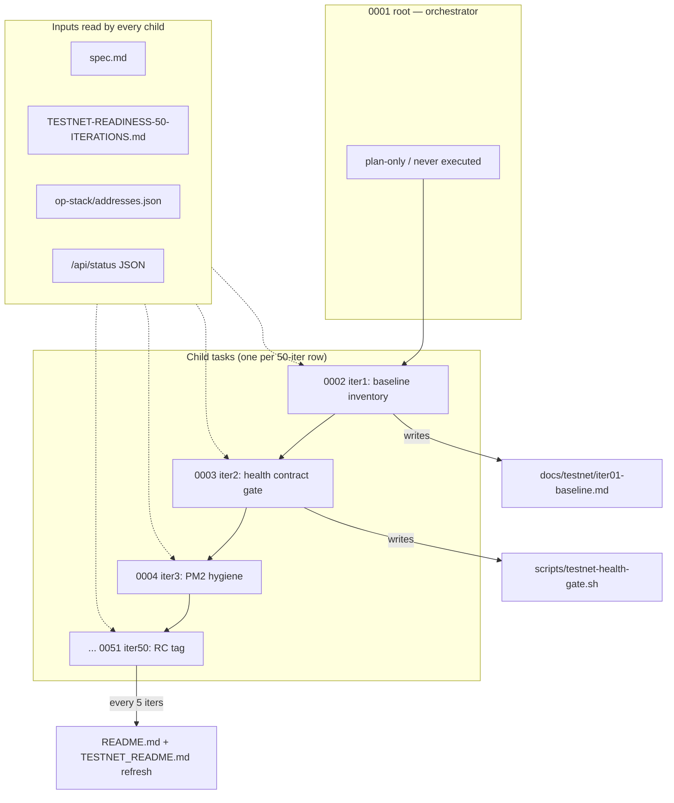

# Testnet Readiness Gate — 50 Iterations

## Overview

This root task orchestrates the 50-iteration plan in `docs/TESTNET-READINESS-50-ITERATIONS.md`
to move GoodDollar L2 from internal devnet demo to a public-testnet release candidate.

It is intentionally **not** executed directly; the build loop adds one child task per
iteration row (0002, 0003, ...), plans it, and executes it. The autobuilder driver
appends children sequentially so future heartbeats can pick up exactly where the last
one left off, while keeping commit history one-iteration-per-commit.

## Research notes

- Canonical plan: `docs/TESTNET-READINESS-50-ITERATIONS.md` (50 rows, each row = one iteration).
- Initiative spec: `.autobuilder/initiatives/0004-testnet-readiness-gate/spec.md`.
- Cross-cutting docs: `README.md`, `docs/TESTNET_README.md`, `docs/ARCHITECTURE.md`,
  `docs/TESTER_CHECKLIST.md`, `docs/TESTNET_GUIDE.md`.
- Canonical address source: `op-stack/addresses.json` (must remain the single source of truth).
- Public surfaces:
  - App: https://goodswap.goodclaw.org
  - RPC: https://rpc.goodclaw.org
  - Status: https://goodswap.goodclaw.org/api/status

## Architecture diagram

## One-week decision

**NO.** 50 iterations × ~1 task/commit each is far more than one human can complete
in five working days. Each row of the canonical plan represents a meaningful unit of
verification work plus named proof (test, command output, screenshot, tx hash, or
explicit blocker).

## Split rationale

The build loop pattern is **one child task per heartbeat**: each heartbeat plans
and executes the next iteration row from `docs/TESTNET-READINESS-50-ITERATIONS.md`.
This matches how prior initiatives (0001/0002/0003) were executed and keeps each
commit reviewable in isolation.

For this heartbeat we add **child 0002 — iter01: baseline inventory** (the explicit
"First Iteration" called out in the spec). Subsequent build-loop heartbeats will
append 0003 (iter02 health gate), 0004 (iter03 PM2 hygiene), etc. as they run.

## Future iteration map (preview, not yet split into files)

| Child | Iter | Upgrade |
|---|---|---|
| 0002 | 1 | Baseline inventory |
| 0003 | 2 | Health contract for testnet |
| 0004 | 3 | Fix PM2/process hygiene |
| 0005 | 4 | Repair degraded status services I |
| 0006 | 5 | README/doc checkpoint 1 |
| 0007 | 6 | Repair degraded status services II |
| 0008 | 7 | Public RPC verification |
| 0009 | 8 | Explorer readiness |
| 0010 | 9 | Faucet reliability |
| 0011 | 10 | README/doc checkpoint 2 + gate |
| ... | ... | (see canonical plan for 11–50) |

## Acceptance criteria (rolled up from spec)

- `https://goodswap.goodclaw.org` is production-built, PM2-managed, and stable.
- Public app pages `/`, `/faucet`, `/perps`, `/portfolio`, `/tests`, `/testnet-guide` return 200 and render without runtime overlays.
- `/api/status` is green, or any non-green service is formally removed from the public gate with documented reason.
- Public RPC, explorer, faucet, and docs are linked and verified.
- Swap, Perps, Predict, Lend, Stable, Stocks, Portfolio/Claim all have smoke or E2E evidence.
- UBI fee routing is documented and tested across protocols.
- `README.md` links to `docs/ARCHITECTURE.md`, `docs/TESTNET_README.md`, `docs/TESTNET-READINESS-50-ITERATIONS.md`, status/test evidence, and release/runbook docs.
- Architecture diagrams explain apps running on top of the chain.
- A release candidate manifest/tag recommendation is produced.

## Rules for child tasks

1. Every child must end with **named proof** written to disk (command output,
   test artifact, screenshot, health JSON, tx hash, or explicit blocker).
2. Children for rows 5, 10, 15, 20, 25, 30, 35, 40, 45, 50 must also refresh
   `README.md` + `docs/TESTNET_README.md` + architecture/doc links.
3. Never modify `op-stack/addresses.json` semantics without a corresponding
   `address registry freeze` style child (row 11).
4. Public URL behavior is the source of truth, not localhost.
5. Do not hide degraded services — fix or document the exclusion.
