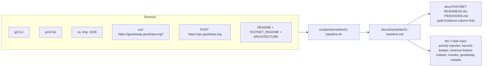

> Executed: produced `scripts/testnet/iter01-baseline.sh.smoke.txt`,
> `scripts/testnet/iter01-baseline.sh`, and `docs/testnet/iter01-baseline.md`
> (~6 KB, all 9 expected sections present). Evidence linked from
> `docs/TESTNET-READINESS-50-ITERATIONS.md` under "Iteration Evidence".
> Key findings: `activity-reporter`, `harvest-keeper`, `revenue-tracker` are
> in restart loops; `indexer: error`, `monitor: degraded`; `/api/status`
> overall = `degraded` (8/12 healthy); public + local RPC agree on
> block `0x2778c`; README does not yet link the plan.

# Iter 1 — Baseline inventory

Snapshot the current state of the project before doing any fix work. The output of
this task is the input the rest of the 50-iteration plan reads from.

## Overview

Row 1 of `docs/TESTNET-READINESS-50-ITERATIONS.md`:
> Baseline inventory — Current services, ports, PM2 state, contracts, frontend
> routes, tests, and dirty git state are documented.
> Proof: `git status`, PM2 status, `/api/status`, page checks, chain block, README gap list.

This is an **inventory-only** iteration. It must not change any running service,
contract address, or PM2 process. Fix work starts in iter 2.

## Research notes

- Public surface: https://goodswap.goodclaw.org (port 3100 via Caddy).
- Public RPC: https://rpc.goodclaw.org (block at scope time: 161579).
- 20 PM2 entries currently; three known-flapping: `activity-reporter`,
  `harvest-keeper`, `revenue-tracker` (>1000 restarts each, status `waiting restart`).
- `/api/status` returns 200 with overall = `degraded` (8/12 healthy); per-service
  shows `indexer: error`, `monitor: degraded`, and the three flappers as
  `unreachable`.
- `goodswap` PM2 process itself has 4406 restarts in 27 minutes → secondary finding,
  flagged for iter 3 (PM2/process hygiene).
- All six public pages (`/`, `/faucet`, `/perps`, `/portfolio`, `/tests`,
  `/testnet-guide`) return HTTP 200.
- `git status --short` clean on `main`, last commit `1e29254 chore: seed testnet
  readiness gate`.
- Existing docs: `README.md` (146 lines), `docs/TESTNET_README.md` (80 lines),
  `docs/ARCHITECTURE.md` (137 lines).
- `op-stack/addresses.json` exists at repo root, treat as canonical.

## Architecture diagram

## One-week decision

**YES.** Inventory is a single sit-down task (≈ 1–2 hours). Captured outputs +
a single markdown report + a tiny shell script + one cross-link from the canonical
plan is well under one engineer-day.

## Split rationale

No split — single deliverable: `docs/testnet/iter01-baseline.md` plus a
reproducible runner `scripts/testnet/iter01-baseline.sh`, plus a one-line evidence
link added to the 50-iteration plan.

## Implementation plan (TDD-ish for shell)

1. **Test first** — add `scripts/testnet/iter01-baseline.sh.smoke.txt` containing the
   minimal expected sections the script must emit (`GIT STATUS`, `PM2`, `PORT 3100`,
   `PUBLIC PAGES`, `/api/status`, `CHAIN BLOCK`, `DOC INVENTORY`).
2. **Red** — confirm `scripts/testnet/iter01-baseline.sh` does not exist yet.
3. **Green** — write `scripts/testnet/iter01-baseline.sh` that calls each probe
   and writes both stdout (human readable) and `docs/testnet/iter01-baseline.md`.
4. **Verify** — run script, diff produced report against smoke expectations
   (`grep -F` each required header).
5. **Document** — append "Iter 1 evidence: `docs/testnet/iter01-baseline.md`" to
   the canonical plan immediately under the existing Iter 1 row.

## Acceptance / proof

- `scripts/testnet/iter01-baseline.sh` is executable, idempotent, and produces
  `docs/testnet/iter01-baseline.md` with all seven required sections.
- `docs/testnet/iter01-baseline.md` exists and contains:
  - Timestamp + commit SHA
  - Raw command outputs (truncated where safe)
  - "Findings" block calling out flapping services, `unknown` overall, doc gaps
  - "Next iteration" block naming concrete iter 2 follow-ups
- `docs/TESTNET-READINESS-50-ITERATIONS.md` links the new evidence file.
- One git commit, no service/address changes.

## Out of scope (deferred to later iterations)

- Restarting `activity-reporter`, `harvest-keeper`, `revenue-tracker` (iter 4).
- Fixing `indexer` / `monitor` health (iter 6).
- Fixing `goodswap` PM2 restart loop (iter 3).
- Any README rewrite (iter 5 doc checkpoint).
- Any frontend code change.
