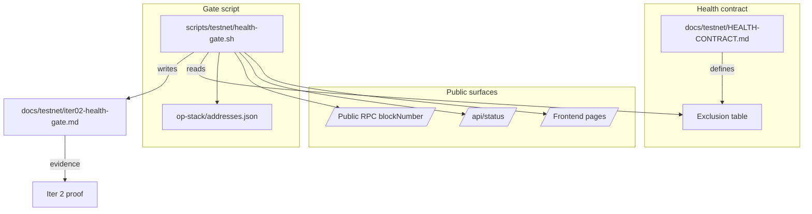

## Overview

Iter 1 established that `/api/status` reports `degraded` because of services we
already know about (`activity-reporter`, `harvest-keeper`, `revenue-tracker`,
`indexer`, `monitor`). Today there is no formal definition of what "green
testnet" actually means — so every status read looks like a failure even when
the public app, RPC, and DeFi lanes are healthy.

Iter 2 fixes that by writing the **health contract** for the public testnet.
It produces:

1. `docs/testnet/HEALTH-CONTRACT.md` — the canonical document listing which
   surfaces MUST be green and which services are formally excluded with a
   reason and an owning iteration.
2. `scripts/testnet/health-gate.sh` — an executable gate that fails (exit 1)
   only on true blockers and exits 0 (with warnings) on documented
   exclusions. Output is human-readable + greppable for CI.
3. `docs/testnet/iter02-health-gate.md` — proof artifact (latest gate run).

This is the foundation iter 10 / iter 20 / iter 30 / iter 40 / iter 50 will
re-run as the rolling testnet gate.

## Research notes

- `/api/status` is served from `status-aggregator` (PM2 `online`, port 3300
  internally). It returns `{ overall, services: [{ name, status }, ...] }`.
- Services seen in iter 1 baseline: `swap-oracle`, `activity-reporter`,
  `harvest-keeper`, `liquidator`, `revenue-tracker`, `stocks-keeper`,
  `indexer`, `monitor`, `rpc-balancer`, `bridge-keeper`, `perps`, `predict`.
- Public surfaces tested in iter 1 all returned 200:
  `/`, `/faucet`, `/perps`, `/portfolio`, `/tests`, `/testnet-guide`.
- Public RPC `https://rpc.goodclaw.org` returns a real `eth_blockNumber`
  (block 169612 at iter 1 capture). The gate should also assert the block
  number advances between two reads (chain not stuck).
- `op-stack/addresses.json` is the canonical address pipeline (Iter 11 owns
  freezing it; Iter 2 only reads it to assert it parses + is non-empty).

### Hard requirements (gate-fails when broken)

- Public site returns 200 on `/`, `/faucet`, `/perps`, `/portfolio`, `/tests`,
  `/testnet-guide`.
- Public RPC `https://rpc.goodclaw.org` answers `eth_blockNumber` with a hex
  string and the block number advances on a second read taken ≥ 6s later.
- `/api/status` is reachable and parses as JSON.
- Required service set (everything in `/api/status` *except* the documented
  exclusions below) is `ok`. Treat `degraded` and `error` and `unreachable`
  as not-ok.
- `op-stack/addresses.json` exists and has at least one address.

### Documented exclusions (warn but pass)

These services are knowingly degraded and have an explicit owner iteration in
the 50-iter plan. The gate logs them as `EXCLUDED` and does not fail on them
until those iterations land:

| service             | reason                                  | owner iter |
|---------------------|-----------------------------------------|------------|
| `activity-reporter` | flapping waiting-restart loop           | 4          |
| `harvest-keeper`    | flapping waiting-restart loop           | 4          |
| `revenue-tracker`   | flapping waiting-restart loop           | 4          |
| `indexer`           | reports `error` (chain reorg / config)  | 6          |
| `monitor`           | reports `degraded` (RPC sampling)       | 6          |

When iter 4 / iter 6 fix these, the exclusion table is the single place to
remove them. No code changes are needed in the gate script.

### Out of scope

- Fixing the excluded services (iters 4 and 6).
- Address freeze (iter 11).
- README/doc checkpoint linking (iter 5 — checkpoint 1).
- E2E lane proofs (iters 16–24).

## Architecture diagram

## One-week decision

**YES** — single iteration.

Rationale: ~150 lines of bash, one Markdown spec, one proof file. Reuses the
probe pattern from `scripts/testnet/iter01-baseline.sh`. No service changes,
no contract changes, no frontend changes.

## Implementation plan

1. Write `docs/testnet/HEALTH-CONTRACT.md` with required surfaces, required
   services (all in `/api/status` minus the exclusion table), and the
   exclusion table.
2. Write `scripts/testnet/health-gate.sh`:
   - Bash, `set -u`, no `set -e` (probes must continue on individual failure).
   - Probe public pages, fail if any non-200.
   - Probe `/api/status`, parse JSON, classify each service as
     `OK | EXCLUDED | BLOCKER`. Fail if any blocker.
   - Probe public RPC twice (≥ 6s apart), fail if block did not advance.
   - Validate `op-stack/addresses.json` parses and has ≥ 1 address.
   - Print a 1-screen summary table; exit 0 only when no blockers.
3. Run the gate against the live system, capture output, and write
   `docs/testnet/iter02-health-gate.md` as the iter 2 proof.
4. Wire the iteration evidence row into
   `docs/TESTNET-READINESS-50-ITERATIONS.md` (Iter 2 row of the Evidence
   table). Do NOT touch other rows.

## Acceptance criteria

- `scripts/testnet/health-gate.sh` is executable, idempotent, and exits 0
  against the live system today (because all blockers are honored: pages 200,
  RPC advancing, required services green, exclusions tolerated).
- Forcing a synthetic blocker (e.g. `BAD_BASE=https://goodswap.invalid`) makes
  the gate exit 1 with a clear `BLOCKER:` line.
- `docs/testnet/HEALTH-CONTRACT.md` enumerates every required surface, every
  required service, and the exclusion table with owner iteration.
- `docs/testnet/iter02-health-gate.md` shows the full gate run with a final
  `RESULT: pass` and a per-service classification table.
- `docs/TESTNET-READINESS-50-ITERATIONS.md` Evidence table now includes a row
  for iter 2 pointing at `docs/testnet/iter02-health-gate.md` and
  `scripts/testnet/health-gate.sh`.
- One commit on `main` (no push), commit message
  `chore(testnet): add iter02 health contract and gate`.
