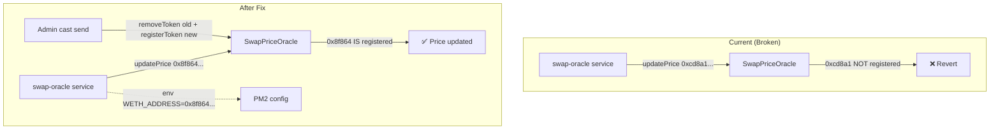

# CRITICAL — Fix swap-oracle: Update Token Addresses and Stop Revert Loop

## Problem Statement

The `swap-oracle` PM2 service continuously fails with `execution reverted (unknown custom error)` on every token price update. Root cause: **triple address mismatch**.

### Three address sets that must agree but don't:

| Source | G$ | WETH | USDC | WBTC |
|---|---|---|---|---|
| **addresses.json** | `0x5fbdb...` | `0x8f864...` (MockWETH) | `0x0e801...` (MockUSDC) | N/A |
| **SwapPriceOracle on-chain** (4 registered) | `0x5FbDB...` ✅ | `0xe7f17...` ❌ (UBIClaimV2!) | `0x9fE46...` ❌ (unknown) | `0xCf7Ed...` ❌ (unknown) |
| **swap-oracle PM2 env** | `0x5fbdb...` ✅ | `0xcd8a1...` ❌ | `0xb7278...` ❌ | N/A |

The SwapPriceOracle was initialized with Hardhat default deployment addresses (slots 0-3) that don't correspond to the actual token contracts on the devnet. The swap-oracle service is configured with yet another set of addresses. Result: every `updatePrice()` call reverts because the token isn't registered.

## Research Notes

### SwapPriceOracle contract (`0x40a42baf86fc821f972ad2ac878729063ceef403`):
- `admin()` → `0xf39Fd6e51aad88F6F4ce6aB8827279cffFb92266`
- `registeredTokenCount()` → 4
- `getAllTokens()` → `[0x5FbDB..., 0xe7f17..., 0x9fE46..., 0xCf7Ed...]`
- These are Hardhat default addresses (contracts #1-4 in a fresh `forge create` / `hardhat deploy` sequence)

### Correct token addresses from `op-stack/addresses.json`:
- GoodDollarToken: `0x5fbdb2315678afecb367f032d93f642f64180aa3`
- MockWETH: `0x8f86403a4de0bb5791fa46b8e795c547942fe4cf`
- MockUSDC: `0x0e801d84fa97b50751dbf25036d067dcf18858bf`

### SwapPriceOracle.sol ABI analysis (`src/oracle/SwapPriceOracle.sol`):
- `registerToken(address token)` — admin-only, adds a new token
- `removeToken(address token)` — admin-only, removes a token
- `updatePrice(address token, uint256 price8, uint256 timestamp)` — updates price for registered token
- `batchUpdatePrices(address[] tokens, uint256[] prices, uint256[] timestamps)` — batch version

### swap-oracle service (`backend/swap-oracle/src/index.ts`):
- Reads `SWAP_ORACLE_ADDRESS`, `GDOLLAR_ADDRESS`, `WETH_ADDRESS`, `USDC_ADDRESS`, `WBTC_ADDRESS` from env
- Builds a `TOKENS` array from these addresses
- Calls `updatePrice()` for each token individually

## Architecture Diagram



## One-Week Decision

**YES** — This requires admin `cast send` calls to re-register tokens and a PM2 config update. Estimated effort: ~1 hour.

## Implementation Plan

### Phase 1: Re-register correct tokens in SwapPriceOracle

Using the admin key (`0xf39Fd6e51aad88F6F4ce6aB8827279cffFb92266`):

1. Remove wrong tokens:
   - `removeToken(0xe7f1725E7734CE288F8367e1Bb143E90bb3F0512)` (was UBIClaimV2, not WETH)
   - `removeToken(0x9fE46736679d2D9a65F0992F2272dE9f3c7fa6e0)` (wrong USDC)
   - `removeToken(0xCf7Ed3AccA5a467e9e704C703E8D87F634fB0Fc9)` (unknown)
2. Register correct tokens:
   - `registerToken(0x8f86403a4de0bb5791fa46b8e795c547942fe4cf)` (MockWETH)
   - `registerToken(0x0e801d84fa97b50751dbf25036d067dcf18858bf)` (MockUSDC)

### Phase 2: Update swap-oracle PM2 config

Update the PM2 ecosystem config or `.env` file for swap-oracle:
- `WETH_ADDRESS=0x8f86403a4de0bb5791fa46b8e795c547942fe4cf`
- `USDC_ADDRESS=0x0e801d84fa97b50751dbf25036d067dcf18858bf`
- `GDOLLAR_ADDRESS=0x5fbdb2315678afecb367f032d93f642f64180aa3` (already correct)

### Phase 3: Seed initial prices and restart

1. Call `batchUpdatePrices` with current prices for G$, WETH, USDC
2. Restart swap-oracle via PM2
3. Verify logs show successful updates (no reverts)

### Phase 4: Verify on-chain

```bash
cast call 0x40a42baf86fc821f972ad2ac878729063ceef403 "getPriceUnsafe(address)(uint256,uint256)" 0x8f86403a4de0bb5791fa46b8e795c547942fe4cf --rpc-url http://localhost:8545
```

## Acceptance Criteria

- [x] SwapPriceOracle has correct tokens registered (G$, MockWETH, MockUSDC)
- [x] Old wrong token addresses removed from oracle
- [x] swap-oracle PM2 env has correct WETH_ADDRESS, USDC_ADDRESS
- [x] swap-oracle logs show successful price updates (no `execution reverted` after corrected oracle address)
- [x] `getPriceUnsafe(MockWETH)` returns valid price on-chain
- [x] All Foundry tests pass

## Verification

```bash
cast call 0x40a42baf86fc821f972ad2ac878729063ceef403 "registeredTokenCount()(uint256)" --rpc-url http://localhost:8545
npx pm2 restart swap-oracle && sleep 15
npx pm2 logs swap-oracle --nostream --lines 10
forge test --summary
```

## Execution Evidence — 2026-05-20

- `cast call 0x40a42baf86fc821f972ad2ac878729063ceef403 "getAllTokens()(address[])" --rpc-url http://localhost:8545` returned exactly:
  - `0x5FbDB2315678afecb367f032d93F642f64180aa3` (G$)
  - `0x8f86403A4DE0BB5791fa46B8e795C547942fE4Cf` (MockWETH)
  - `0x0E801D84Fa97b50751Dbf25036d067dCf18858bF` (MockUSDC)
- PM2 `swap-oracle` env verified:
  - `SWAP_ORACLE_ADDRESS=0x40a42baf86fc821f972ad2ac878729063ceef403`
  - `GDOLLAR_ADDRESS=0x5fbdb2315678afecb367f032d93f642f64180aa3`
  - `WETH_ADDRESS=0x8f86403a4de0bb5791fa46b8e795c547942fe4cf`
  - `USDC_ADDRESS=0x0e801d84fa97b50751dbf25036d067dcf18858bf`
- `pm2 logs swap-oracle --nostream --lines 80` shows the service connected to `SwapPriceOracle` at `06:38:07 UTC`, loaded G$/WETH/USDC prices, then wrote on-chain updates at `06:38:11`, `06:41:15`, and `06:55:15 UTC`.
- `PATH="$HOME/.foundry/bin:$PATH" npm run test:contracts` passed: `61` suites / `1,375` tests / `0` failed.

## Out of Scope

- StockOracleV2 (task 0021)
- stocks-keeper (task 0022)
- SwapPriceOracle contract redeployment
