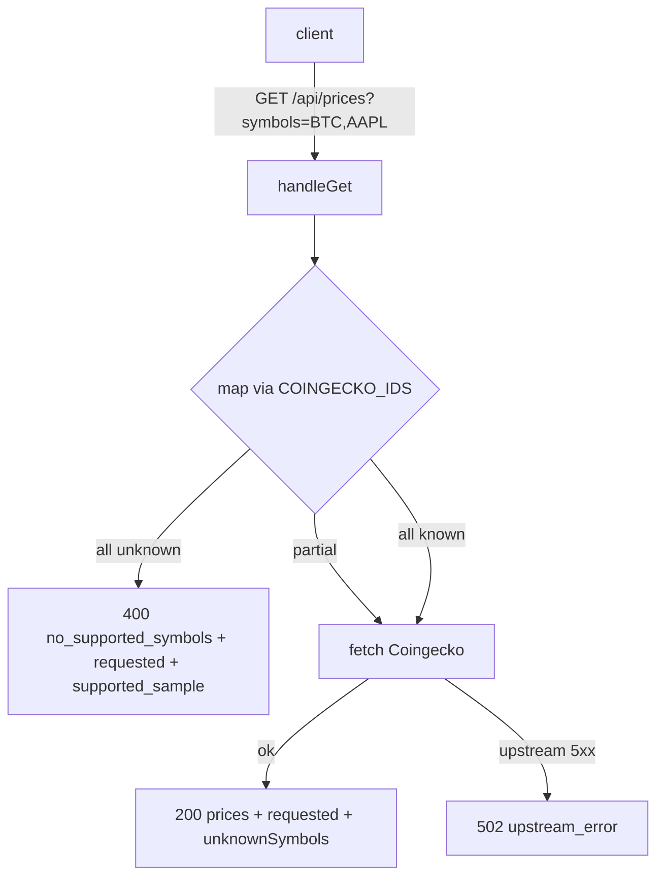

# /api/prices silently returns 200 `{}` for unknown symbols — hides bad config from status surfaces

## Problem Statement

`GET /api/prices?symbols=...` collapses three very different conditions into
the same `HTTP 200` + `{}` response:

1. The caller passed symbols that are not in the `COINGECKO_IDS` lookup
   (e.g. `NONSENSE12345`, but also legitimate-looking tickers like `AAPL`
   that simply aren't mapped on the testnet).
2. The caller passed valid IDs but Coingecko returned an empty object for
   them this minute.
3. The caller's symbol → ID lookup is misconfigured on the client.

All three look identical on the wire. There is no way for a status page,
keeper, or UI badge to distinguish "this symbol is unsupported, fix your
caller" from "Coingecko is loading, retry in 30s".

This makes price-feed health invisible on the status surfaces, which is
exactly the kind of regression the lane-C scope (status surfaces + keeper
observability) is supposed to prevent.

## Observed evidence (curl reproductions)

```text
$ curl -s -i 'http://localhost:3123/api/prices'
HTTP/1.1 400 Bad Request
Content-Type: application/json
{"error":"Missing \"symbols\" query parameter"}    # ✅ good

$ curl -s -i 'http://localhost:3123/api/prices?symbols=AAPL'
HTTP/1.1 200 OK
Content-Type: application/json
{}                                                  # ❌ silent: AAPL not in COINGECKO_IDS

$ curl -s -i 'http://localhost:3123/api/prices?symbols=NONSENSE12345'
HTTP/1.1 200 OK
Content-Type: application/json
{}                                                  # ❌ silent: bogus symbol, indistinguishable from above

$ curl -s -i 'http://localhost:3123/api/prices?symbols=AAPL,MSFT'
HTTP/1.1 200 OK
Content-Type: application/json
{}                                                  # ❌ silent: every input dropped
```

Compare to a real upstream failure path already implemented in the route:

```text
# When upstream Coingecko 5xxs, the existing code returns 502 JSON:
{"error":"Coingecko returned 503"}                  # ✅ good — distinguishable
```

## Root cause

`frontend/src/app/api/prices/route.ts` does this in `handleGet`:

```ts
const ids = Array.from(
  new Set(symbols.map(s => COINGECKO_IDS[s]).filter(Boolean))
)
if (ids.length === 0) {
  // returns 200 {} — same shape as "Coingecko returned no data this tick"
  return NextResponse.json({}, { headers: { 'Cache-Control': 'public, max-age=60' } })
}
```

There is no signal at all back to the caller that **every** requested
symbol was unknown. The branch is also `Cache-Control: public, max-age=60`
which compounds the problem: misconfigured callers will see the silent
empty for a full minute.

## User Story

**As a** status page / keeper / UI component asking `/api/prices` for one
or more symbols,
**I want** the API to clearly tell me when none of my symbols are
supported, **so that** I can surface "symbol unsupported" on the status
surface instead of showing a perpetual "loading…" spinner and so that
misconfigured callers fail loudly during testnet validation instead of
quietly during production.

## How it was found

Iteration #2 product review, strategy = **error-handling**. The price API
was probed with both nonsense (`NONSENSE12345`) and superficially-valid
(`AAPL`, `MSFT`) symbols that are not in the lookup. In every case the
endpoint returned `200 {}` with no indication that the caller was wrong,
which directly conflicts with the lane-C goal of "status surfaces and
keeper observability".

## Proposed UX (API contract)

When **all** requested symbols are unknown:

```json
HTTP/1.1 400 Bad Request
Content-Type: application/json; charset=utf-8
Cache-Control: no-store
{
  "error": "No supported symbols in request",
  "code": "no_supported_symbols",
  "requested": ["AAPL", "MSFT"],
  "supported_sample": ["BTC", "ETH", "USDC", "G$"]
}
```

When **some** requested symbols are unknown (partial result), include an
`unknownSymbols` array alongside the price map, still as `HTTP 200`:

```json
HTTP/1.1 200 OK
Content-Type: application/json; charset=utf-8
{
  "prices": { "bitcoin": { "usd": 67234.5 } },
  "requested": ["BTC", "AAPL"],
  "unknownSymbols": ["AAPL"]
}
```

When Coingecko returns an empty object for valid ids (upstream had nothing
this tick), preserve the current 200 behavior but mark it:

```json
HTTP/1.1 200 OK
Content-Type: application/json; charset=utf-8
{
  "prices": {},
  "requested": ["BTC"],
  "unknownSymbols": [],
  "warning": "Upstream returned no data"
}
```

## Proposed implementation

In `frontend/src/app/api/prices/route.ts`:

1. After the symbol → id mapping, compute `unknownSymbols` (symbols whose
   `COINGECKO_IDS` lookup returned `undefined`).
2. If `ids.length === 0`:
   - Return `400` with `code: "no_supported_symbols"`, the original
     `requested` list, and a sample of supported symbols.
   - Set `Cache-Control: no-store`.
3. Otherwise, fetch Coingecko as today and return:
   ```ts
   { prices: data, requested: symbols, unknownSymbols, warning?: string }
   ```
   This is a strict superset of the previous payload, but to avoid
   breaking existing callers that read the raw map, ALSO inline the
   `prices` entries at the top level via spread:
   ```ts
   return NextResponse.json(
     { ...data, prices: data, requested: symbols, unknownSymbols }
   )
   ```
   so legacy callers (`data.bitcoin?.usd`) continue to work and new
   callers can read `data.unknownSymbols`. Document both shapes.
4. Update the existing 502 branch to use the shared `apiError(...)` helper
   from task **0026** once that lands (deps: see below). If 0026 has not
   landed yet, this task can stand alone using inline `NextResponse.json`.

## Architecture diagram



## Acceptance criteria

- [ ] `curl -s -i 'http://localhost:3123/api/prices?symbols=NONSENSE12345'` returns HTTP 400 with `Content-Type: application/json`, body containing `"code":"no_supported_symbols"`, `"requested":["NONSENSE12345"]`, and a non-empty `supported_sample` array.
- [ ] `curl -s -i 'http://localhost:3123/api/prices?symbols=AAPL,MSFT'` returns HTTP 400 with `"requested":["AAPL","MSFT"]` and `"code":"no_supported_symbols"`.
- [ ] `curl -s -i 'http://localhost:3123/api/prices?symbols=BTC'` returns HTTP 200 with a body that contains BOTH the legacy shape (top-level `bitcoin.usd`) AND the new fields (`prices`, `requested`, `unknownSymbols: []`).
- [ ] `curl -s -i 'http://localhost:3123/api/prices?symbols=BTC,AAPL'` returns HTTP 200 with `unknownSymbols: ["AAPL"]` and the legacy top-level `bitcoin.usd` field still present.
- [ ] `curl -s -i 'http://localhost:3123/api/prices'` (missing symbols) still returns HTTP 400 with the existing `Missing "symbols" query parameter` message — no regression.
- [ ] `Cache-Control: no-store` is set on the new 400 response so misconfigured callers do not get cached errors.
- [ ] The status-page / UI badge that consumes `/api/prices` (whichever component currently calls it — discover during planning) is updated to display "Unsupported symbol" when `code === "no_supported_symbols"` is returned, and to surface a small warning chip when `unknownSymbols.length > 0`. This keeps the surface honest.
- [ ] A unit/integration test added under `frontend/` covers: (a) all unknown → 400; (b) partial unknown → 200 + `unknownSymbols`; (c) all known → 200 + legacy shape preserved; (d) missing param → 400 (regression).

## Verification

1. Start the dev server (`localhost:3123`).
2. Run all four curl probes in the acceptance criteria and confirm
   bodies + status codes + `Content-Type`.
3. Run the frontend test suite — all green, including the new tests.
4. Open the status surface in `agent-browser`, screenshot before/after to
   show the new "Unsupported symbol" chip surfaces correctly when the
   caller is misconfigured.
5. `npx -y react-doctor@latest . --verbose --diff` ≥ 75.

## Out of scope

- Do **not** change Coingecko ID coverage (the `COINGECKO_IDS` table)
  in this task. Adding tickers is a separate, ongoing concern.
- Do **not** add retries / circuit-breaking around the upstream fetch.
- Do **not** introduce auth, rate-limiting, or quota changes.
- No new Solidity. No new chain calls. No PM2 changes.

## Assumptions

- The existing callers of `/api/prices` consume the Coingecko-shaped
  response (`{ <coingeckoId>: { usd: <number> } }`). Any change to the
  success shape must remain backward compatible — i.e. the top-level
  Coingecko keys stay, and the new fields (`prices`, `requested`,
  `unknownSymbols`) are ADDED alongside, not replacing them.
- The `COINGECKO_IDS` lookup is the authoritative list of supported
  symbols at request time. Symbols missing from this table are
  unambiguously "unsupported on this deployment" — not a transient
  upstream issue.
- A status surface or UI badge consumes `/api/prices` somewhere in the
  frontend; if grep during implementation surfaces zero callers, the
  UI portion of the acceptance criteria becomes a no-op and is dropped
  with a note in the implementation commit message.
- The new 400 response with `Cache-Control: no-store` is acceptable —
  it means a misconfigured caller will hammer the endpoint until fixed,
  but the volume is bounded (one request per UI poll cycle) and the
  signal is critical.
- This task can ship independently of task 0026 (API 404/405 JSON
  envelope). They share spirit but no code; either can land first.

## One-week decision

**YES — fits comfortably in well under one week (≈2–4 hours for one engineer).**

Rationale:
- Touches exactly one route file (`frontend/src/app/api/prices/route.ts`),
  changes ≈30 LOC.
- One new test file with ~4 assertions.
- At most one small UI component change (consumer of `/api/prices`)
  to surface the new `code` / `unknownSymbols` signal — discoverable
  via a single grep.
- No new dependencies, no schema/contract changes, no protocol work.
- Strictly additive on the success path (legacy keys preserved), so
  no consumer breaks.

`split: false`.

## Implementation plan (phased)

**Phase 1 — Audit current callers (15 min)**
- `rg "/api/prices" frontend/src` to enumerate every component, hook, or
  status badge that fetches the endpoint.
- Note for each: what shape it currently parses, and whether a new
  `unknownSymbols` warning chip would be visible to humans.

**Phase 2 — Update `frontend/src/app/api/prices/route.ts` (30 min)**
- After splitting `symbols` into the array, compute
  `unknownSymbols = symbols.filter(s => !COINGECKO_IDS[s])` and
  `ids = symbols.map(s => COINGECKO_IDS[s]).filter(Boolean)`.
- If `ids.length === 0` AND `unknownSymbols.length > 0`: return
  `apiError(400, 'no_supported_symbols', 'None of the requested symbols are supported on this deployment', { requested: symbols, unknownSymbols, supported_sample: Object.keys(COINGECKO_IDS).slice(0, 10) })`
  with `Cache-Control: no-store`. (Reuse the `apiError` helper from task
  0026 if it has landed; otherwise inline an equivalent `NextResponse.json(...)`
  call and refactor when 0026 lands.)
- On the success path, spread the Coingecko response at the top level
  (legacy keys preserved) AND add `prices`, `requested`, `unknownSymbols`
  fields alongside. Keep the existing `Cache-Control: public, max-age=60`.

**Phase 3 — UI consumer update (45 min, conditional)**
- For each caller identified in Phase 1: when the response includes
  `code === 'no_supported_symbols'`, render an inline "Unsupported
  symbol" chip + the bad symbol name.
- When `unknownSymbols.length > 0`, render a small warning badge ("⚠ 1 unsupported symbol skipped").
- If grep returns zero callers, document this in the commit message and
  skip Phase 3.

**Phase 4 — Tests (30 min)**
- Add `frontend/__tests__/api-prices-error-signal.test.ts` (or matching
  existing test location) covering:
  - All unknown → 400 + `code: "no_supported_symbols"` + correct
    `requested`/`unknownSymbols` arrays.
  - Partial unknown → 200 + legacy `bitcoin.usd` field preserved +
    `unknownSymbols: ["AAPL"]`.
  - All known → 200 + legacy shape preserved + `unknownSymbols: []`.
  - Missing `symbols` param → 400 with existing message (regression).

**Phase 5 — Verify (15 min)**
- Manual `curl` walk through all four acceptance probes.
- `npm test` in `frontend/`.
- `agent-browser` screenshot of the status surface (if a UI consumer
  was updated in Phase 3) showing the new chip on a configured-bad
  symbol.
- `npx -y react-doctor@latest . --verbose --diff` ≥ 75.
- `git add -A && git commit -m "fix(api/prices): return 400 on no supported symbols, surface unknownSymbols on partial success"`.

**Total estimate: ~2 hours implementation + buffer. Well under one week.**

