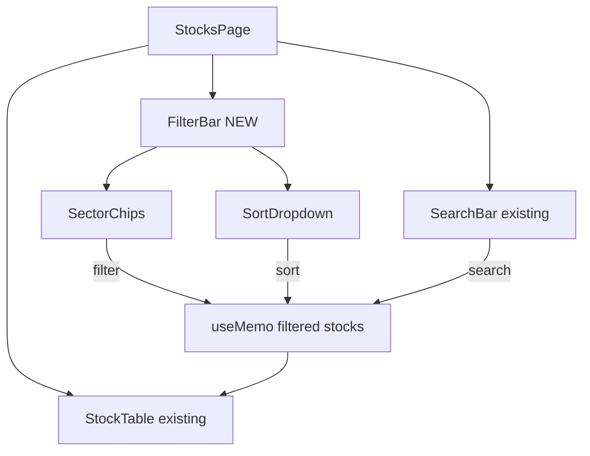

## Problem

Our stocks browse page (`/stocks`) only provides a search box and a simple flat table of all stocks.
There are no filter controls, no sorting beyond column headers, and no way to discover stocks by category.

**eToro comparison (observed via research):**
- **Advanced Stock Screener** with 10+ filter dimensions: market cap ranges, P/E ratio, dividend yield, sector, geography, 52-week performance, beta, revenue growth
- **Category pages**: Top Gainers, Top Losers, Most Popular, Most Traded, New on eToro
- **Industry drill-down**: Technology, Healthcare, Financials, Energy, Consumer — each with dedicated browse pages
- **Real-time filter updates**: results update dynamically as filters are adjusted
- **Preset filter combinations**: Quick presets like "Value Stocks", "Growth Stocks", "Dividend Payers"

**Our current state (observed from screenshot):**
- A search bar at the top
- A flat table: #, Stock icon+name, Price, 24h Change, Volume, Market Cap, 7d Trend sparkline, "View details" link
- No sector tabs, no filter dropdowns, no screener panel
- Users must scroll through the entire list to find stocks — no discovery path

## Impact

Users coming from eToro expect to filter stocks by criteria (e.g., "show me high-dividend tech stocks under $100"). Without any screening, the browse experience feels primitive and forces users to already know what they want. Stock discovery is a key acquisition funnel for trading platforms.

## Expected Behavior

Add a filter panel above the stock table with at minimum:
1. **Sector filter** chips/tabs (Technology, Healthcare, Finance, Energy, Consumer, etc.)
2. **Sort controls** (by Market Cap, by 24h Change, by Price, by Volume)
3. **Quick category views**: Top Gainers (24h), Top Losers (24h), Most Popular
4. **Market cap range** filter (Mega-cap, Large-cap, Mid-cap, Small-cap)

## Reproduction

1. Navigate to `/stocks`
2. Observe: only a search bar and flat table — no filters, categories, or screener
3. Compare: eToro's Discover > Stocks page with full screener UI

---

## Planning

### Overview

Add a filter/screener bar above the stock table on `/stocks` page. The `Stock` interface already exposes `sector`, `marketCap`, `change24h`, `volume24h`, `peRatio`, and `dividendYield` — so no new data fetching is needed. This is a pure frontend UI enhancement.

### Research Notes

- `Stock` type in `frontend/src/lib/stockData.ts` already has `sector: string`, `peRatio: number`, `dividendYield: number`, `marketCap: number`
- `useOnChainStocks()` returns all stocks with full data including sector
- Current page (`frontend/src/app/(app)/stocks/page.tsx`) has search + sort by column headers
- Sectors available in the dataset need to be extracted dynamically from data (no hardcoded list)
- Existing Tailwind classes and `goodgreen` design tokens should be reused

### Assumptions

- Sectors are already populated in stock data from on-chain hooks
- Filter state is local (no URL params needed for MVP)
- Mobile: filters collapse into a dropdown or horizontal scroll chips

### Architecture

### One-Week Decision

**YES** — This is a single-component frontend change. Adding filter chips/tabs and a sort dropdown to an existing page with existing data. ~2-3 hours of work.

### Implementation Plan

1. Extract unique sectors from `data` array via `useMemo`
2. Add sector filter chips above the table (horizontal scroll on mobile)
3. Add an "All" chip (default selected)
4. Integrate sector filter into existing `filtered` useMemo pipeline
5. Style with existing Tailwind design tokens (goodgreen, dark-100, rounded-xl)
6. Ensure mobile responsive: chips horizontally scroll, sort controls stack

### Acceptance Criteria

- [ ] Sector filter chips appear above the stock table
- [ ] Clicking a sector chip filters the table to only stocks in that sector
- [ ] "All" chip shows all stocks (default)
- [ ] Active chip has distinct visual treatment (goodgreen background)
- [ ] Sort dropdown works alongside sector filter
- [ ] Mobile responsive: chips scroll horizontally
- [ ] Existing search still works with sector filter applied
