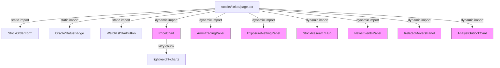

## Problem

The stock detail page (`stocks/[ticker]/page.tsx`) eagerly imports 12+ heavy components at the top level, causing a large initial JavaScript bundle that takes ~5s server-side and blocks client hydration. Components like `PriceChart` (imports `lightweight-charts`), `AmmTradingPanel`, `ExposureNettingPanel`, `StockResearchHub`, `NewsEventsPanel`, `RelatedMoversPanel`, and `AnalystOutlookCard` are all statically imported even though many are below the fold or conditionally rendered.

## Observed evidence

- `curl` to `/stocks/AAPL` takes 5.28s (vs 0.05s for `/stocks`)
- 14 eager component imports in the file header
- `PriceChart` pulls in `lightweight-charts` library (~45KB gzipped)
- `AmmTradingPanel` has complex AMM math + multiple useMemo hooks
- `StockResearchHub` renders tabbed content that's always below the fold
- `ExposureNettingPanel` only renders when user has a position
- `NewsEventsPanel` and `RelatedMoversPanel` are secondary content

## Expected fix

Use `next/dynamic` with `ssr: false` (or appropriate loading fallbacks) for these components:
1. `PriceChart` — heavy charting library, show skeleton placeholder
2. `AmmTradingPanel` — complex, below fold on mobile
3. `ExposureNettingPanel` — conditional (only shown with position)
4. `StockResearchHub` — always below fold
5. `NewsEventsPanel` — secondary content, below fold
6. `RelatedMoversPanel` — secondary content, below fold
7. `AnalystOutlookCard` — secondary content

Keep eagerly loaded: `StockOrderForm`, `StockOrderFormFallback`, `OracleStatusBadge`, `WatchlistStarButton`, `OracleUnavailableBanner`, `RebalanceSyncPanel`, `RebalanceErrorBoundary` (these are above-fold or critical path).

## Planning

### Overview

Replace 7 static component imports with `next/dynamic` lazy imports in `stocks/[ticker]/page.tsx`. Each dynamic import gets an appropriate loading fallback (skeleton div). This is a single-file change with straightforward testing.

### Research notes

- Next.js `dynamic()` with `{ ssr: false }` prevents the component from being included in the server-rendered HTML and its JS from being included in the initial page bundle. It loads the component's chunk only when it's about to mount on the client.
- For components that need SSR (like PriceChart for SEO), use `dynamic()` without `ssr: false` — the component still code-splits but renders on server. However, since these are all client components behind `'use client'`, `ssr: false` is appropriate.
- `lightweight-charts` is the heaviest single dependency pulled by PriceChart.

### Assumptions

- All 7 target components are client-side only (no SSR dependency).
- Loading fallbacks can be simple skeleton divs matching approximate dimensions.
- No prop type changes needed — dynamic components accept the same props.

### Architecture diagram

### One-week decision

**YES** — This is a single-file refactor replacing static imports with `next/dynamic`. Estimated: 1-2 hours including testing.

### Implementation plan

1. Add `import dynamic from 'next/dynamic'` at top of file
2. Replace 7 static component imports with `dynamic(() => import(...), { ssr: false, loading: () => <FallbackSkeleton /> })`
3. Create inline skeleton loading components for each (simple div with matching height/bg)
4. Verify the page still renders correctly with all components loading
5. Test: confirm page loads faster, components appear after initial paint
