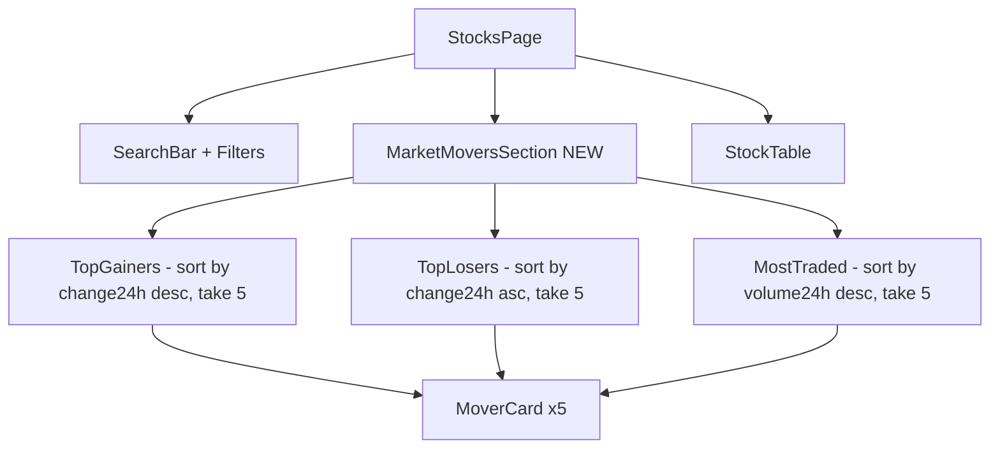

## Problem

Our stocks browse page shows all stocks in a single flat list ordered by a default sort.
There is no way to quickly discover trending, top-performing, or worst-performing stocks.

**eToro comparison (observed via research):**
- **Top Gainers** section: stocks with the largest positive price change today, updated in real-time
- **Top Losers** section: stocks with the largest negative price change today
- **Most Popular**: stocks most bought/traded by eToro users, providing social proof
- **Trending Now**: stocks with unusual volume or momentum spikes
- **New on eToro**: recently added instruments for early discovery
- These categories are accessible as tabs/sections within the stock discovery page, making it easy for users to find trading opportunities without researching individual stocks

**Our current state (observed from screenshot):**
- A flat list of stocks in a table (AAPL, MSFT, NVDA visible)
- No "Top Gainers" or "Top Losers" sections
- No "Most Popular" or "Most Traded" categories
- No trending/momentum indicators
- Users see the same static list every visit — no sense of what's happening in the market right now

## Impact

Market movers are the #1 entry point for retail traders looking for short-term opportunities. Without them, users have no reason to check the stocks page daily. eToro makes this a primary discovery mechanism; our absence here means users don't feel the "pulse" of the market.

## Expected Behavior

Add a tabbed or sectioned layout above the stock table:
1. **All Stocks** (current default view)
2. **Top Gainers** (sorted by 24h change descending, green highlights)
3. **Top Losers** (sorted by 24h change ascending, red highlights)
4. **Most Traded** (sorted by volume descending)

Each tab should show the top 5-10 stocks with clear visual treatment (green/red change badges, volume bars).

## Reproduction

1. Navigate to `/stocks`
2. Observe: flat table with no category tabs or market mover sections
3. Compare: eToro's stock discovery with Top Gainers, Top Losers, Most Popular tabs

---

## Planning

### Overview

Add a "Market Movers" section above the main stock table showing Top Gainers, Top Losers, and Most Traded as horizontal card carousels or tab views. Data is derived from the existing `useOnChainStocks()` hook — just re-sorted by different fields.

### Research Notes

- `Stock` has `change24h` (for gainers/losers) and `volume24h` (for most traded)
- No new data fetching needed — just `useMemo` with different sort criteria
- eToro shows 5-10 stocks per category as cards
- Horizontal scrollable card layout works well for mobile
- This should sit between the search bar and the main table

### Assumptions

- Top 5 stocks per category is sufficient for MVP
- Volume data from on-chain hooks is reliable
- Cards should be clickable, linking to stock detail pages

### Architecture

### One-Week Decision

**YES** — Pure frontend: derive 3 sorted slices from existing data, render as horizontal card rows with tabs. ~2-3 hours.

### Implementation Plan

1. Create `MarketMovers` component with tab state (Gainers | Losers | Most Traded)
2. Derive each category via `useMemo` on existing stocks data
3. Render horizontal scrollable card row for each tab
4. Each card: ticker, name, price, change24h (color-coded), mini sparkline
5. Cards link to `/stocks/[ticker]`
6. Place between filter bar and main table
7. Mobile: horizontal scroll with snap points

### Acceptance Criteria

- [ ] Market Movers section visible above the stock table
- [ ] Three tabs: Top Gainers, Top Losers, Most Traded
- [ ] Each tab shows top 5 stocks as horizontal cards
- [ ] Cards show ticker, price, and 24h change with green/red coloring
- [ ] Cards are clickable, navigating to stock detail page
- [ ] Mobile responsive: cards horizontally scroll
- [ ] Default tab is "Top Gainers"
