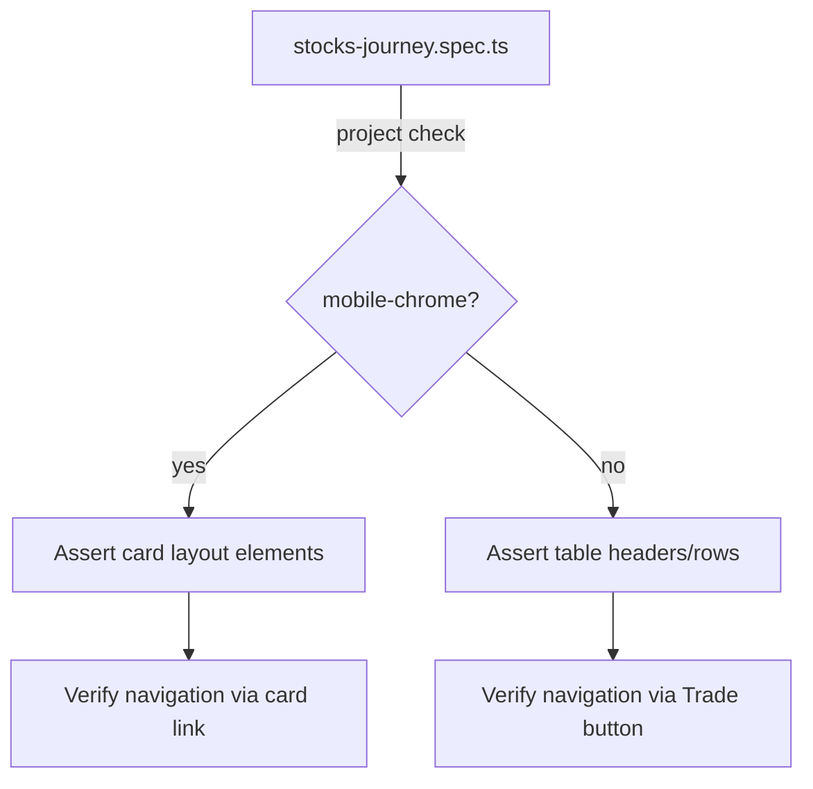

## Problem statement
7 out of 10 failing stocks E2E tests fail exclusively on the `mobile-chrome` Playwright project. The tests assert that `<th>` table headers (Stock, Price, 24h Change, Volume, Market Cap, 7d Trend) are visible and that table-based Trade buttons and sort headers are clickable. However, the stocks page intentionally hides the `<table>` below the `sm` Tailwind breakpoint and renders a mobile card layout instead (`sm:hidden` wrapper at line 486 of `page.tsx`). The tests are not viewport-aware and assert desktop-only DOM structures on a mobile viewport.

## Failing tests (all in `frontend/e2e/stocks-journey.spec.ts`)
1. `stock table shows column headers` — mobile-chrome
2. `stock table shows volume and market cap columns` — mobile-chrome
3. `stock table has 7d trend column` — mobile-chrome
4. `search filters stocks by ticker` — mobile-chrome (searches within `table`)
5. `clicking sort headers changes sort direction` — mobile-chrome
6. `clicking stock row navigates to detail page` — mobile-chrome (clicks Trade `button` in table row)
7. `no results shows empty state with clear button` — mobile-chrome (searches within `table`)

## How it was found
Full E2E test suite run during surface-sweep product review (iteration #1):
```
export BASE_URL=http://localhost:3214 SKIP_DEV_SERVER=1 && \
  timeout 300 npx playwright test e2e/stocks-journey.spec.ts --reporter=list
```
Result: 22 passed, 10 failed (7 of the 10 are mobile-chrome only).

## Root cause
- `frontend/src/app/(app)/stocks/page.tsx` line 486: `<div className="sm:hidden space-y-2 mb-2">` renders a card list on mobile.
- Table headers (`<th>`) and the Trade `<button>` column (`hidden sm:table-cell`) are hidden below `sm` breakpoint.
- E2E tests do not branch assertions based on viewport size.

## Proposed fix
Add viewport-aware branching to the 7 failing tests:
- Desktop (`chromium`): keep existing `<th>` and table-based assertions.
- Mobile (`mobile-chrome`): assert equivalent content in the card layout (stock names, price text, search input still works, tapping a card navigates to detail).

Alternatively, skip table-specific tests on mobile and add dedicated mobile card tests.

## Acceptance criteria
- [ ] All 7 mobile-chrome failures listed above turn green.
- [ ] All 22 previously passing tests remain green.
- [ ] No new test-only code changes are made to the stocks page component.

## Verification
```bash
export BASE_URL=http://localhost:3214 SKIP_DEV_SERVER=1 && \
  timeout 300 npx playwright test e2e/stocks-journey.spec.ts --reporter=list
# Expect: 32 passed, 0 failed (or similar total with mobile additions)
```

## Out of scope
- Changing the stocks page responsive design itself.
- Adding new product functionality.

---

## Overview

The stocks page uses a responsive layout: `<table>` with `<th>` headers on `>=sm` (640px), card list on `<sm`. Seven E2E tests assert desktop table elements that are hidden on mobile. Fix is test-only: add viewport branching via `test.info().project.name`.

## Research notes

- `frontend/playwright.config.ts`: `mobile-chrome` uses `devices['Pixel 5']` (393×851 viewport). Tailwind `sm` is 640px. Cards render below 640px.
- `frontend/src/app/(app)/stocks/page.tsx`: Table has `hidden sm:table-cell` on Volume, Market Cap, 7d Trend, Trade columns. The `<div className="sm:hidden ...">` wraps mobile cards. Each card shows ticker name, price, and change — enough data for mobile assertions. The card wraps content in a `<Link>` to `/stocks/[ticker]`, so tapping navigates.
- Sort headers: Only visible in `<table>` on desktop. No sort UI on mobile cards. Skip sort test on mobile.
- Search input: Present on both layouts (outside the table/card split). Search filtering works on both.
- No-results state: Desktop renders inside `<table>` body; mobile renders inside `sm:hidden` div. Both use `StocksNoResults` component. This overlap with task 0074 is handled there.

## Assumptions

- `test.info().project.name` returns `'mobile-chrome'` for the mobile project — verified from Playwright docs.
- Mobile card layout renders stock ticker text and price visibly.
- Sort is intentionally desktop-only; skipping on mobile is correct behavior.

## Architecture diagram



## One-week decision

**Fits in one week?** YES — test-only changes, no component modifications, estimated 1-2 hours.

**Split needed?** NO — all 7 fixes are in the same file and follow the same pattern.

## Implementation plan

1. **Helper function**: Add `const isMobile = test.info().project.name === 'mobile-chrome'` at top of each affected test (or as a shared constant via `test.beforeEach`).

2. **Test: `stock table shows column headers`** (line 41):
   - Desktop: existing `<th>` assertions.
   - Mobile: assert stock name text is visible in at least one card element.

3. **Test: `stock table shows volume and market cap columns`** (line 52):
   - Desktop: existing `<th>` assertions.
   - Mobile: `test.skip(isMobile, 'Volume/Market Cap hidden on mobile')`.

4. **Test: `stock table has 7d trend column`** (line 62):
   - Desktop: existing assertion.
   - Mobile: `test.skip(isMobile, '7d Trend hidden on mobile')`.

5. **Test: `search filters stocks by ticker`** (line 81):
   - Desktop: assert within `table`.
   - Mobile: assert `page.getByText('AAPL')` visible (outside table scope).

6. **Test: `clicking sort headers changes sort direction`** (line 106):
   - Mobile: `test.skip(isMobile, 'Sort headers hidden on mobile')`.

7. **Test: `clicking stock row navigates to detail page`** (line 126):
   - Desktop: click Trade button.
   - Mobile: click first card link to `/stocks/[ticker]`.

8. **Test: `no results shows empty state with clear button`** (line 93):
   - Handled jointly with task 0074. On mobile, don't scope to `table`.

9. **Run verification**: `export BASE_URL=http://localhost:3214 SKIP_DEV_SERVER=1 && timeout 300 npx playwright test e2e/stocks-journey.spec.ts --reporter=list`

## Split rationale

No split needed. All changes are in one file following a single pattern.
