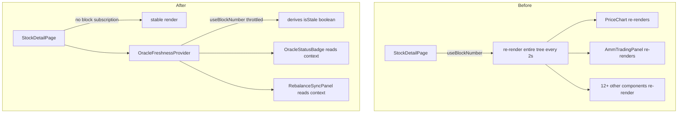

## Problem

The stock detail page imports `useBlockNumber` from wagmi with `watch: true` (or equivalent subscription). This causes the entire 650-line component tree to re-render every ~2 seconds (each new block), even though block number is only used for staleness display or oracle freshness checks.

## Observed evidence

- `import { useBlockNumber } from 'wagmi'` at line 5 of `stocks/[ticker]/page.tsx`
- The hook subscribes to new blocks, triggering state updates every block (~2s on L2)
- The entire page component re-renders on each block since useBlockNumber is called at the top level
- All child components (PriceChart, AmmTradingPanel, etc.) also re-render unless individually memoized
- Combined with 12+ child components, this is expensive

## Expected fix

1. Extract `useBlockNumber` usage into a small isolated component or custom hook that only exposes the derived value (e.g., "is oracle stale") rather than raw block number
2. Use `useMemo` or `memo` to prevent re-renders propagating to children that don't depend on block number
3. Consider using `useBlockNumber({ watch: true, query: { refetchInterval: 10_000 } })` to reduce update frequency from every block (~2s) to every 10 seconds
4. Alternatively, move the block number display into a tiny `<BlockHeightIndicator>` component that is the only thing that re-renders

## Planning

### Overview

Isolate the `useBlockNumber` subscription from the main page component to prevent full-tree re-renders every ~2 seconds. Extract it into a small wrapper component or hook that derives a stable boolean value.

### Research notes

- wagmi's `useBlockNumber({ watch: true })` subscribes via WebSocket and updates state every block. On L2 chains this is ~2s.
- React re-renders the entire component where `useState` changes. Since `useBlockNumber` is at the top of the 650-line page, the entire tree re-renders.
- The block number is likely used for: oracle freshness comparison, staleness badges, or rebalance sync checks.
- The fix pattern is well-established: extract the fast-changing hook into an isolated child component that only renders the piece that needs it.

### Assumptions

- Block number is used in at most 2-3 places in the page (staleness check, oracle status).
- A derived boolean (`isStale`) or throttled block number is sufficient for all use cases.
- The `useBlockNumber` hook supports `query.refetchInterval` to throttle updates.

### Architecture diagram

### One-week decision

**YES** — Single file refactor with a new small component/hook. Estimated: 1-2 hours.

### Implementation plan

1. Read `stocks/[ticker]/page.tsx` to find all usages of `blockNumber` / `useBlockNumber`
2. Create a small `useThrottledBlockNumber` hook or `<BlockNumberProvider>` that:
   - Calls `useBlockNumber({ watch: true, query: { refetchInterval: 10_000 } })` to throttle to 10s
   - Derives stable values like `isOracleStale` via comparison
3. Remove `useBlockNumber` from the main page component
4. Pass derived values down via props or context to only the components that need it
5. Wrap child components that receive block-derived props with `memo` if not already
6. Test: verify page renders correctly, oracle staleness still detected, re-renders reduced
