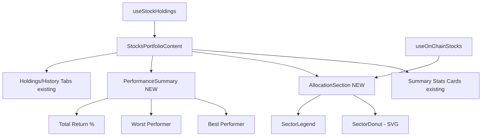

## Problem

Our portfolio page (`/portfolio` tab on `/stocks`) displays three summary cards (Total Value, Unrealized P&L, Active Positions) and two empty-state sections (Stocks, Predictions). When populated, it would show a simple list of holdings. There is no analytical depth.

**eToro comparison (observed via research):**
- **Portfolio Breakdown**: interactive pie/donut charts showing allocation by asset type (stocks, crypto, ETFs), by sector (Technology, Healthcare, Finance), by geography (US, EU, Asia), and by exchange
- **Risk Insights**: risk score calculation, identification of which assets raise or lower portfolio risk, correlation analysis between holdings
- **Expected Dividends**: projected dividend income per holding and total
- **Portfolio Comparison**: performance plotted against benchmarks (S&P 500, NASDAQ) showing alpha/underperformance
- **Performance History**: time-series chart of portfolio value with date range selector
- **Detailed P&L per Position**: entry price, current price, absolute gain/loss, percentage gain/loss, holding period

**Our current state (observed from screenshot):**
- Three summary metric cards: Total Value ($0), Unrealized P&L (+$0.00), Active Positions (0)
- "Stocks" section with empty state: "No stock holdings yet. Buy synthetic stocks like sAAPL or sTSLA to start tracking them here."
- "Predictions" section with empty state
- No allocation charts, no risk analysis, no benchmark comparison, no dividend tracking
- Even when positions exist, the planned layout is a basic list — no analytical views

## Impact

The portfolio page is where users assess whether the platform is helping them build wealth. eToro's rich portfolio analytics (breakdown, risk, benchmarks) create engagement and retention. Our bare-bones portfolio page offers no analytical value and gives users no reason to return beyond checking a number.

## Expected Behavior

When positions exist, the portfolio page should include:
1. **Allocation donut chart** showing distribution by sector (Technology, Healthcare, etc.)
2. **Performance chart** showing portfolio value over time (1D, 1W, 1M, 3M, 1Y)
3. **Per-position P&L table** with entry price, current price, $ change, % change, weight in portfolio
4. **Portfolio summary stats**: total return %, best performer, worst performer

Empty state should preview these features with sample data or a "what you'll see" mockup to motivate first trade.

## Reproduction

1. Navigate to `/stocks` → click "Portfolio" tab
2. Observe: three summary cards and two empty-state sections — no charts, breakdowns, or analytics
3. Compare: eToro's portfolio page with breakdown charts, risk insights, dividend tracking, and benchmark comparison

---

## Planning

### Overview

Enhance the portfolio page with a sector allocation donut chart and a summary stats row (best/worst performer, total return %). The existing `useStockHoldings` hook provides `holdings` with `ticker`, `shares`, `currentPrice`, `avgCost`. We need to cross-reference with stock metadata to get `sector` for the donut chart. Uses a lightweight SVG donut (no chart library dependency).

### Research Notes

- `StocksPortfolioContent.tsx` already has `holdings` array from `useStockHoldings(address)`
- Each `PortfolioHolding` has: `ticker`, `shares`, `avgCost`, `currentPrice`
- Stock metadata (including `sector`) is available from `useOnChainStocks()` hook
- Existing `HoldingRow` already computes per-position P&L
- A pure SVG donut chart avoids adding chart library dependencies
- Summary stats (best/worst performer, total return) can be derived from holdings data

### Assumptions

- Cross-referencing holdings with stock metadata to get sector is cheap (both datasets are small)
- SVG donut chart is sufficient — no need for Chart.js/Recharts for MVP
- Empty state: show a placeholder donut with "Connect wallet to see allocation"

### Architecture

### One-Week Decision

**YES** — Adding an SVG donut chart and summary stats row is a contained frontend addition. ~3-4 hours. No new dependencies, no backend changes.

### Implementation Plan

1. Import `useOnChainStocks` in `StocksPortfolioContent` to get sector data
2. Build sector allocation map: group holdings by sector, sum values
3. Create `AllocationDonut` component: pure SVG with `stroke-dasharray` arcs
4. Create `SectorLegend` component: colored dots + sector name + percentage
5. Add performance summary row: best performer, worst performer, total return %
6. Place allocation section between stats cards and holdings tabs
7. Handle empty state gracefully (gray placeholder donut)

### Acceptance Criteria

- [ ] Sector allocation donut chart visible on portfolio page when holdings exist
- [ ] Donut shows sector breakdown with distinct colors per sector
- [ ] Legend below donut lists each sector with percentage
- [ ] Performance summary shows best/worst performer by P&L %
- [ ] Total portfolio return percentage displayed
- [ ] Empty state shows placeholder donut with "No positions" message
- [ ] Mobile responsive: donut and legend stack vertically on small screens
