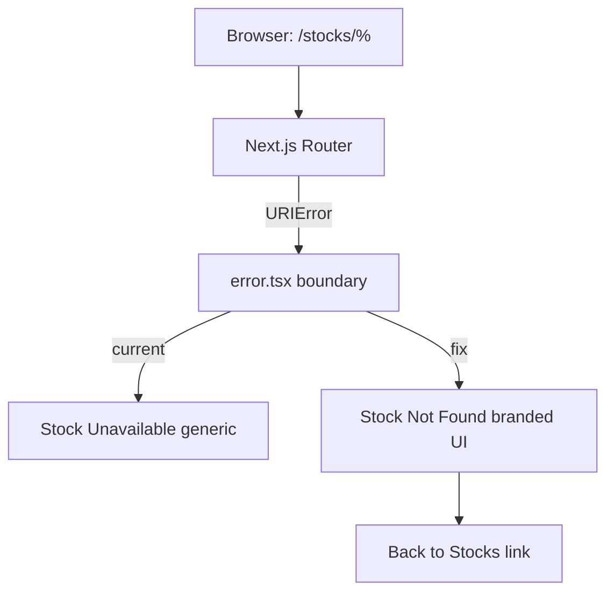

## Problem statement
Routes like `/stocks/%`, `/stocks/%2`, and `/stocks/%E0%A4%A` contain malformed percent-encoding that throws `URIError: URI malformed` when decoded. The stock detail page (`frontend/src/app/(app)/stocks/[ticker]/page.tsx`) has a Stock Not Found component (line 431-440), but the URIError crashes the page before the component renders. Both `chromium` and `mobile-chrome` fail.

## Failing tests (in `frontend/e2e/stocks-journey.spec.ts`)
1. `malformed percent-encoding routes render branded stocks recovery UI` — chromium
2. `malformed percent-encoding routes render branded stocks recovery UI` — mobile-chrome

## Test expectations
For each of `/stocks/%`, `/stocks/%2`, `/stocks/%E0%A4%A`:
- `heading { name: 'Stock Not Found' }` visible
- `'This stock symbol is not available.'` visible
- `link { name: 'Back to Stocks' }` visible

## How it was found
Full E2E test suite run during surface-sweep product review (iteration #1).

## Root cause
The `[ticker]` page component likely calls `decodeURIComponent(params.ticker)` (or Next.js decodes the param internally) which throws `URIError` for malformed sequences. No try/catch or error boundary catches this, so the page crashes instead of showing the Stock Not Found fallback.

## Security relevance
Malformed URL handling is security-adjacent — attackers probe URL parsers with malformed encoding to trigger crashes, bypass WAFs, or exploit edge cases. Graceful handling prevents error-based information leakage.

## Proposed fix
Wrap ticker decoding in try/catch inside the `[ticker]/page.tsx` component. When `decodeURIComponent` throws `URIError`, treat the ticker as invalid and render the existing Stock Not Found component.

Alternatively, add a Next.js error boundary at the `[ticker]` route level.

## Acceptance criteria
- [ ] `/stocks/%`, `/stocks/%2`, `/stocks/%E0%A4%A` all render the Stock Not Found page with heading, description, and Back to Stocks link.
- [ ] No raw percent-encoded text leaked into the rendered page.
- [ ] The E2E test `malformed percent-encoding routes render branded stocks recovery UI` passes on both chromium and mobile-chrome.

## Verification
```bash
export BASE_URL=http://localhost:3214 SKIP_DEV_SERVER=1 && \
  timeout 120 npx playwright test e2e/stocks-journey.spec.ts -g "malformed percent-encoding" --reporter=list
# Expect: 2 passed, 0 failed
```

## Out of scope
- Other XSS or injection hardening beyond URL decoding.
- Changes to the Stock Not Found UI design.

---

## Overview

URLs like `/stocks/%`, `/stocks/%2`, `/stocks/%E0%A4%A` contain malformed percent-encoding. Next.js's router throws `URIError` during parameter decoding before the page component renders, triggering the generic `error.tsx` boundary which shows "Stock Unavailable" instead of the branded "Stock Not Found" UI. The fix is to update the error boundary to render the correct branded recovery UI.

## Research notes

- `frontend/src/app/(app)/stocks/[ticker]/page.tsx`: Contains `decodeTickerBounded()` with try/catch around `decodeURIComponent`, and `normalizeTickerForLookup()` that rejects `%` via `UNSAFE_TICKER_PATTERN`. The component code would handle this correctly IF it got to execute.
- `frontend/src/app/(app)/stocks/[ticker]/error.tsx`: Catches React errors at the route level. Currently renders `<ErrorFallback title="Stock Unavailable" message="Unable to load stock details. Please try again." />`. This is what users see for malformed URLs.
- The E2E test expects: heading "Stock Not Found", text "This stock symbol is not available.", link "Back to Stocks".
- The issue is the error boundary's UI doesn't match the expected branded recovery UI.
- Next.js App Router: `useParams()` may already have the raw URL-decoded param, but the framework-level decoding of the URL segment itself throws `URIError` for truly malformed percent sequences like `%` or `%2`.

## Assumptions

- Next.js throws `URIError` at the routing/rendering level, caught by `error.tsx`.
- The `error.tsx` boundary receives the error and can inspect `error.message` or `error instanceof URIError` to decide which UI to show.
- The branded "Stock Not Found" UI elements (heading, description, link) can be inlined in the error boundary.

## Architecture diagram



## One-week decision

**Fits in one week?** YES — single file change to error boundary, estimated 30 minutes.

**Split needed?** NO.

## Implementation plan

1. **Read** `frontend/src/app/(app)/stocks/[ticker]/error.tsx` current implementation.

2. **Update** the error boundary to render the branded "Stock Not Found" UI:
   - Heading: `<h1>Stock Not Found</h1>`
   - Description: `<p>This stock symbol is not available.</p>`
   - Link: `<Link href="/stocks">Back to Stocks</Link>`
   - Keep the existing `ErrorFallback` as a fallback for non-URI errors (optional, or just always show the branded UI since any error on this route means the stock is inaccessible).

3. **Verify locally** by navigating to `/stocks/%` in the browser.

4. **Run E2E verification**:
   ```bash
   export BASE_URL=http://localhost:3214 SKIP_DEV_SERVER=1 && \
     timeout 120 npx playwright test e2e/stocks-journey.spec.ts -g "malformed percent-encoding" --reporter=list
   ```

## Split rationale

No split needed. Single file change.
