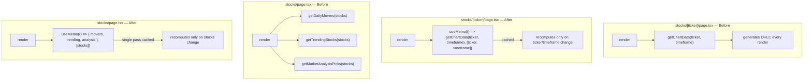

## Problem

The stock detail page calls `getChartData(ticker, timeframe)` on every render without memoization. The main stocks page calls `getDailyMovers()`, `getTrendingStocks()`, and `getMarketAnalysisPicks()` which all iterate over the full stocks array and derive subsets — these run on every render cycle rather than being cached.

## Observed evidence

- `stocks/[ticker]/page.tsx` calls `getChartData(normalizedTicker, timeframe)` which generates OHLC data — this is called on each render, not wrapped in useMemo with proper deps
- `stocks/page.tsx` calls `getDailyMovers(stocks)`, `getTrendingStocks(stocks)`, and `getMarketAnalysisPicks(stocks)` — three separate iterations over the stocks array
- `StocksDiscoveryShelves` receives already-computed movers/trending/analysis from the parent, but if the parent re-renders (e.g., on sort change), all three derivations recompute
- The portfolio page renders all holdings in a flat table — no virtualization for long lists

## Expected fix

1. In `stocks/[ticker]/page.tsx`: wrap `getChartData` call in `useMemo` with `[normalizedTicker, timeframe]` as dependencies
2. In `stocks/page.tsx`: wrap `getDailyMovers`, `getTrendingStocks`, `getMarketAnalysisPicks` calls in `useMemo` with `[stocks]` as dependency — they only need to recompute when the stocks data changes, not on sort/filter changes
3. Consider combining the three discovery functions into a single `useMemo` that returns `{ movers, trending, analysis }` to avoid three separate array passes

## Planning

### Overview

Wrap expensive data derivation calls in `useMemo` to prevent recomputation on every render. Two files need changes: `stocks/[ticker]/page.tsx` for chart data, and `stocks/page.tsx` for discovery shelf derivations.

### Research notes

- `useMemo(fn, deps)` caches the return value of `fn` and only recomputes when `deps` change.
- `getChartData(ticker, timeframe)` generates OHLC candle data — deterministic for the same inputs, so `useMemo([ticker, timeframe])` is correct.
- `getDailyMovers(stocks)`, `getTrendingStocks(stocks)`, `getMarketAnalysisPicks(stocks)` all iterate over the stocks array. They should only recompute when the stocks array reference changes.
- Combining three separate array passes into one `useMemo` that returns a tuple/object reduces iterations from 3N to roughly 1N.

### Assumptions

- `getChartData`, `getDailyMovers`, `getTrendingStocks`, `getMarketAnalysisPicks` are pure functions (same input → same output).
- The `stocks` array reference from `useOnChainStocks` is stable between renders when data hasn't changed (React Query / wagmi typically return stable references).
- No side effects in these derivation functions.

### Architecture diagram

### One-week decision

**YES** — Adding `useMemo` wrappers around existing function calls. Estimated: 30 minutes to 1 hour.

### Implementation plan

1. In `stocks/[ticker]/page.tsx`: wrap `getChartData(normalizedTicker, timeframe)` in `useMemo` with `[normalizedTicker, timeframe]` as deps
2. In `stocks/page.tsx`: wrap `getDailyMovers`, `getTrendingStocks`, `getMarketAnalysisPicks` calls in a single `useMemo` with `[stocks]` as dep, returning `{ movers, trending, analysis }`
3. Update the `StocksDiscoveryShelves` prop passing to use the memoized values
4. Ensure `useMemo` is imported from React in both files
5. Test: verify pages render correctly, data still updates when stocks/ticker/timeframe change
