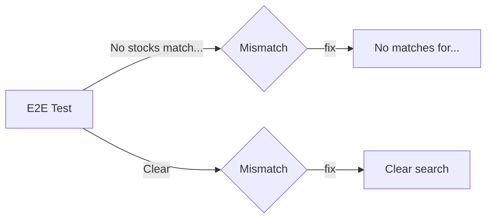

## Problem statement
The E2E test `no results shows empty state with clear button` fails on both `chromium` and `mobile-chrome`. The test expects text and button names that don't match the actual `StocksNoResults` component implementation.

**Test expects (line 102-103 of stocks-journey.spec.ts):**
- `'No stocks match your search'`
- `getByRole('button', { name: 'Clear' })`

**Component renders (line 89-105 of stocks/page.tsx):**
- `'No matches for "{query}"'`
- Button text: `'Clear search'`

## Prior work
Task 0059 (`stocks-search-no-results-error-state`) was executed and the component was implemented, but the E2E test assertions were not aligned with the actual component output.

## How it was found
Full E2E test suite run during surface-sweep product review (iteration #1).

## Proposed fix
Update the E2E test assertions to match the actual component:
- Change `'No stocks match your search'` → `'No matches for'` (partial text match)
- Change `getByRole('button', { name: 'Clear' })` → `getByRole('button', { name: 'Clear search' })`

On mobile-chrome, the no-results state is inside the `sm:hidden` card section, not the `<table>`. The test should locate the no-results state without scoping to `table` on mobile viewports. This overlaps with task 0072 for mobile viewport branching.

## Acceptance criteria
- [ ] `no results shows empty state with clear button` passes on both chromium and mobile-chrome.
- [ ] No changes to the `StocksNoResults` component itself.
- [ ] All other tests remain green.

## Verification
```bash
export BASE_URL=http://localhost:3214 SKIP_DEV_SERVER=1 && \
  timeout 120 npx playwright test e2e/stocks-journey.spec.ts -g "no results" --reporter=list
# Expect: 2 passed, 0 failed
```

## Out of scope
- Redesigning the no-results state UI.
- Adding new no-results functionality.

---

## Overview

Pure test assertion fix. The E2E test expects text/button labels that differ from what the component actually renders. Update test to match component.

## Research notes

- `StocksNoResults` component (stocks/page.tsx lines ~89-105): renders `"No matches for \"{query}\""` and a button with text `"Clear search"`.
- E2E test (stocks-journey.spec.ts lines 93-104): expects `"No stocks match your search"` and `getByRole('button', { name: 'Clear' })`.
- On mobile, the no-results state renders inside `<div className="sm:hidden">`, not inside `<table>`. The test scopes some assertions to `table` which won't work on mobile.

## Assumptions

- The component text is the source of truth. Tests should match the component, not the other way around.
- Task 0072 handles the broader mobile viewport branching pattern; this task focuses specifically on the text mismatch.

## Architecture diagram



## One-week decision

**Fits in one week?** YES — two line changes in test file, estimated 15 minutes.

**Split needed?** NO.

## Implementation plan

1. In `frontend/e2e/stocks-journey.spec.ts`, test `no results shows empty state with clear button`:
   - Change `getByText('No stocks match your search')` to `getByText(/No matches for/)` (regex partial match).
   - Change `getByRole('button', { name: 'Clear' })` to `getByRole('button', { name: 'Clear search' })`.
   - Add mobile viewport branching (per task 0072 pattern): on mobile don't scope to `table`.

2. **Run verification**:
   ```bash
   export BASE_URL=http://localhost:3214 SKIP_DEV_SERVER=1 && \
     timeout 120 npx playwright test e2e/stocks-journey.spec.ts -g "no results" --reporter=list
   ```

## Split rationale

No split needed. Two-line fix in one file.
