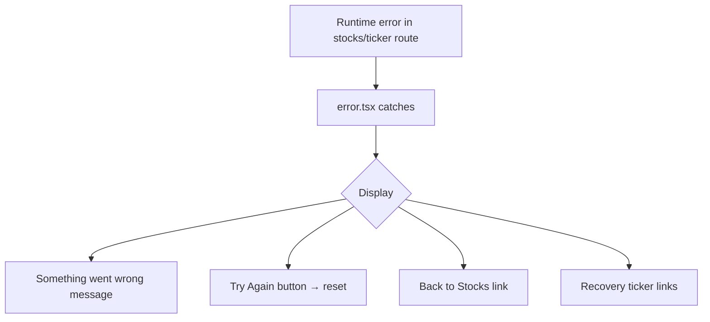

## Problem

The stock detail error boundary (`frontend/src/app/(app)/stocks/[ticker]/error.tsx`) catches ALL runtime errors and displays "Stock Not Found" regardless of the actual error type. A network failure, contract revert, or rendering crash is indistinguishable from a genuinely invalid ticker.

Additionally, the component receives a `reset` function in its props but never uses it — there is no retry/try-again button. The root-level `error.tsx` already implements this pattern correctly with a "Try Again" button calling `reset`.

## Expected

- Runtime errors (network, contract, rendering) should show "Something went wrong" with a retry button.
- Only genuinely invalid/unknown tickers should show "Stock Not Found".
- The retry button should call the `reset()` function to attempt re-rendering.

## Evidence

- `frontend/src/app/(app)/stocks/[ticker]/error.tsx` line: `export default function StockDetailError({ error }: { error: Error & { digest?: string }; reset: () => void })` — `reset` is destructured but never used in the component body.
- Root `frontend/src/app/error.tsx` correctly has `<Button onClick={reset}>Try Again</Button>`.
- Observed during error-handling review: navigating to valid tickers in agent-browser sometimes showed "Stock Not Found" instead of the expected stock detail, suggesting error boundary activation.

## Scope

- `frontend/src/app/(app)/stocks/[ticker]/error.tsx`

---

## Planning

### Overview

Replace the generic "Stock Not Found" error boundary with one that differentiates runtime errors from not-found states and adds a retry button using the `reset` function already provided by Next.js.

### Research Notes

- Next.js App Router error boundaries receive `{ error, reset }` props. `reset()` re-renders the route segment.
- The root `error.tsx` already demonstrates the correct pattern: `<Button onClick={reset}>Try Again</Button>`.
- The error boundary catches React rendering errors, not HTTP 404s (those go to `not-found.tsx`). So ALL errors caught here are runtime errors — the "Stock Not Found" label is always incorrect.

### Assumptions

- No server-side error classification is available; the error boundary should treat all caught errors as runtime/transient errors.

### Architecture Diagram

### One-Week Decision

**YES** — Single file, ~30 lines changed. Under 1 hour of work.

### Implementation Plan

1. Destructure `reset` from props (it's already in the type but unused).
2. Change heading from "Stock Not Found" to "Something went wrong".
3. Change description to indicate a transient error.
4. Add a "Try Again" button calling `reset()`.
5. Keep "Back to Stocks" link and recovery ticker links as secondary navigation.
6. Match styling with root `error.tsx` (warning icon, button styles).
