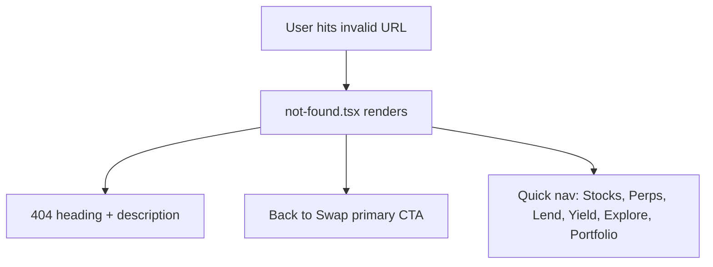

## Problem

The global 404 page (`frontend/src/app/not-found.tsx`) only offers a single "Back to Swap" link. Users who land on an invalid URL (e.g. mistyped `/stocks/AAPPL`, `/perps/FAKEMARKET`, `/lend/0xinvalidmarket`) see no indication that the app has other sections they could navigate to.

## Expected

The 404 page should include quick-nav links to the main sections: Swap, Stocks, Perps, Lend, Yield, Explore — matching the app's bottom navigation. This helps users who mistyped a URL quickly find the correct section.

## Evidence

- `frontend/src/app/not-found.tsx` currently renders only `<Link href="/">Back to Swap</Link>`.
- Observed during error-handling review: navigating to `/lend/0xinvalidmarket`, `/yield/0xfakevault`, `/perps/FAKEMARKET` all showed the generic 404 with only "Back to Swap".

## Scope

- `frontend/src/app/not-found.tsx`

---

## Planning

### Overview

Enhance the global 404 page with quick-nav links to all main app sections so users can self-recover from mistyped URLs.

### Research Notes

- App main sections from bottom nav: Swap (`/`), Stocks (`/stocks`), Perps (`/perps`), Lend (`/lend`), Yield (`/yield`), Explore (`/explore`), Portfolio (`/portfolio`).
- The page already uses `Button` and `Link` components from the design system.

### Assumptions

- The list of sections is static and matches the bottom navigation.

### Architecture Diagram

### One-Week Decision

**YES** — Single file, ~15 lines added. Under 30 minutes.

### Implementation Plan

1. Add a section below the primary "Back to Swap" button with labeled links to: Stocks, Perps, Lend, Yield, Explore, Portfolio.
2. Style as pill-shaped secondary links matching the app's design language (similar to recovery tickers in stock error boundary).
3. Add a "Or try:" label above the links.
