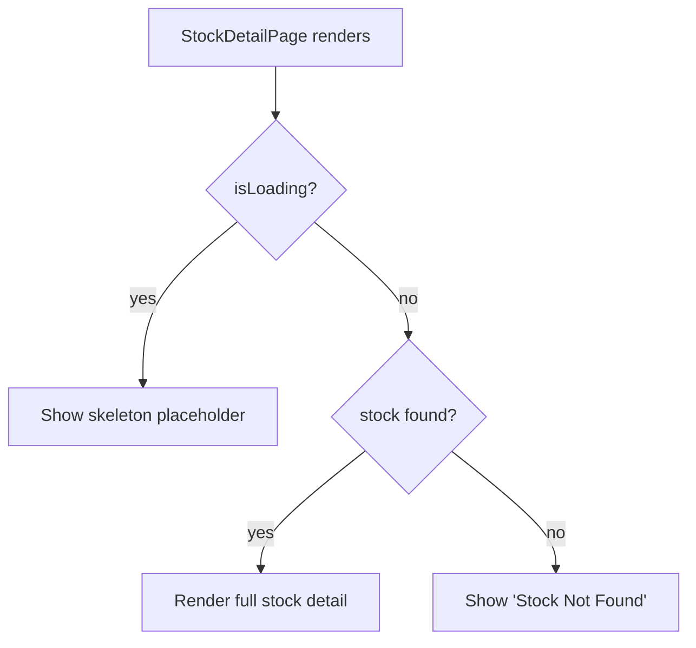

## Problem

The `StockDetailPage` (`frontend/src/app/(app)/stocks/[ticker]/page.tsx`) does not destructure or check the `isLoading` state from `useOnChainStocks()`. On line 417, only `stocks` and `isLive` are destructured. On line 464, `if (!stock)` immediately renders the "Stock Not Found" fallback without considering whether data is still loading.

While `FALLBACK_STOCKS` mitigates this for the current set of known tickers, any stock added to the on-chain contract but not yet to `FALLBACK_STOCKS` would show a brief "Stock Not Found" flash during initial data fetch.

## Expected

- Destructure `isLoading` from `useOnChainStocks()`.
- While `isLoading` is true and `stock` is null, show a loading skeleton (shimmer placeholder) instead of "Stock Not Found".
- Only show "Stock Not Found" when `isLoading` is false AND `stock` is null.

## Evidence

- Line 417: `const { stocks, isLive } = useOnChainStocks()` — `isLoading` not destructured.
- Line 464: `if (!stock) { return ... "Stock Not Found" ... }` — no loading guard.
- `useOnChainStocks` in `frontend/src/lib/useOnChainStocks.ts` returns `{ stocks, isLoading, isLive }`.

## Scope

- `frontend/src/app/(app)/stocks/[ticker]/page.tsx`

---

## Planning

### Overview

Add a loading state check to `StockDetailPage` so it shows a skeleton placeholder while `useOnChainStocks` is still fetching, instead of immediately rendering "Stock Not Found".

### Research Notes

- `useOnChainStocks()` returns `{ stocks, isLoading, isLive }` from `frontend/src/lib/useOnChainStocks.ts`.
- Currently line 417 only destructures `stocks` and `isLive`, ignoring `isLoading`.
- `FALLBACK_STOCKS` mitigates the flash for known tickers but not newly added ones.
- The stocks list page already has skeleton/shimmer patterns that can be referenced for consistency.

### Assumptions

- A simple shimmer skeleton (header bar + price area + chart placeholder) is sufficient; no need for full page fidelity.

### Architecture Diagram

### One-Week Decision

**YES** — Single file, ~20 lines changed. Under 1 hour.

### Implementation Plan

1. Destructure `isLoading` from `useOnChainStocks()` on line 417.
2. Add a loading guard before the `if (!stock)` check on line 464: if `isLoading && !stock`, render a skeleton.
3. Skeleton should include: back link, header shimmer bar, price shimmer, chart area shimmer block.
4. Use `animate-pulse bg-gray-800 rounded` pattern consistent with existing skeletons in the app.
