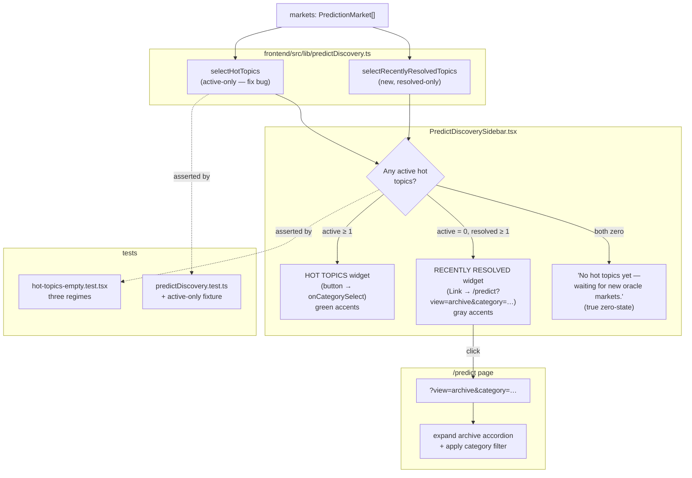

## Planning notes

### Overview

Fix the Hot Topics widget on `/predict` so it doesn't tint
*resolved* categories as active hot markets. Two layers:

1. **Honest counts.** `selectHotTopics` (in
   `frontend/src/lib/predictDiscovery.ts`) should compute the per-
   category `n` against the same predicate the main markets grid uses
   (`market.status === 'active'`). Resolved-only categories drop to
   `n === 0` and are filtered out of the widget.
2. **Honest empty state.** When zero categories have active markets,
   `PredictDiscoverySidebar` flips the Hot Topics widget header from
   `HOT TOPICS` to `RECENTLY RESOLVED`, recomputes counts against
   `status === 'resolved'`, and replaces the row's onClick (which
   currently calls `onCategorySelect` and routes to the empty
   active-filter view) with a navigation into the archive view
   (e.g. `Link href="/predict?view=archive&category={cat}"`).
3. **Visual treatment** for the resolved fallback uses the same gray
   palette as the existing `Show expired (n)` control — distinguishing
   it from the green active treatment.

Breaking News widget already has an honest `Nothing trending yet.`
empty state — left untouched.

### Research notes

- `frontend/src/components/predict/PredictDiscoverySidebar.tsx` reads
  `selectHotTopics(markets, hotTopicsLimit)` from
  `frontend/src/lib/predictDiscovery.ts` (confirmed in this planning
  round). The current `selectHotTopics` aggregates across **all**
  markets (active + resolved), which is the bug.
- `frontend/src/lib/__tests__/predictDiscovery.test.ts` already exists
  — extend it with a `status: 'resolved'` fixture to lock the new
  filter-by-status rule.
- The `MarketCategory` type and the `markets` list shape (`status`,
  `category`, `volume`, etc.) are already imported into the sidebar.
  No new types needed.
- The page-supplied `onCategorySelect` only triggers the active filter
  (the source of the bug). For the resolved-fallback we navigate via
  `next/link` to `/predict?view=archive&category=…` rather than calling
  `onCategorySelect` — this requires the parent page (`/predict`) to
  understand a `view=archive` query param. If the param is not yet
  honoured, the executor adds a small handler in the page that opens
  the archive accordion on mount when `view=archive` is present.

### Assumptions

- The archive-view query-param wiring is in scope (a small `useEffect`
  in the `/predict` page that expands the archive accordion when
  `searchParams.get('view') === 'archive'`).
- The category-filter chip behaviour is unchanged in the active state.
- The PRD's "single conditional on the same data" approach is correct
  — no new datastores, no new selectors beyond a sibling
  `selectRecentlyResolvedTopics` that mirrors `selectHotTopics` but
  filters on `status === 'resolved'`.

### Architecture



### One-week decision

**YES** — one to two days.

Rationale:
- Two small files change: `predictDiscovery.ts` (filter predicate +
  one new selector) and `PredictDiscoverySidebar.tsx` (one branch
  fork + visual treatment).
- A tiny addition to `/predict/page.tsx` for the `view=archive` query
  param.
- Three test fixtures (all active / all resolved / mixed) in one new
  integration test.
- No new design tokens — re-use the existing gray
  `text-gray-400 border-gray-700` palette from `Show expired (n)`.
- No new state machinery and no Polymarket-style data plumbing.

### Implementation plan

**Phase 1 — Failing test fixtures (TDD).**
1. Extend `frontend/src/lib/__tests__/predictDiscovery.test.ts`:
   - Add a fixture with one `status: 'resolved'` market in `Culture`
     and one `status: 'active'` market in `Politics`. Assert
     `selectHotTopics` returns only `Politics`.
2. Add `frontend/src/app/(app)/predict/__tests__/hot-topics-empty.test.tsx`:
   - **Regime A — all active:** mock `markets` with at least one
     active in each category. Sidebar shows `HOT TOPICS` header,
     active counts only.
   - **Regime B — mixed:** active in Politics, resolved-only in
     Culture. Sidebar shows `HOT TOPICS` header with only the
     Politics row.
   - **Regime C — all resolved (today's state):** sidebar shows
     `RECENTLY RESOLVED` header with the gray treatment; clicking a
     row navigates to `/predict?view=archive&category=…` (or, if the
     test framework can't intercept routing, asserts the rendered
     `<a href>` value).

**Phase 2 — Update selector + add resolved-only sibling.**
3. In `frontend/src/lib/predictDiscovery.ts`:
   - In `selectHotTopics`, filter `markets` by
     `market.status === 'active'` before aggregating by category.
   - Add `selectRecentlyResolvedTopics(markets, limit)` with the same
     aggregation logic but filtered on `status === 'resolved'`.

**Phase 3 — Sidebar branch logic + visual treatment.**
4. In `PredictDiscoverySidebar.tsx`:
   - Compute both `hotTopics = selectHotTopics(markets, limit)` and
     `resolvedTopics = selectRecentlyResolvedTopics(markets, limit)`.
   - When `hotTopics.length > 0`, render the existing `HotTopicsWidget`.
   - When `hotTopics.length === 0 && resolvedTopics.length > 0`,
     render a new `RecentlyResolvedTopicsWidget` (or extend
     `HotTopicsWidget` with a `variant: 'active' | 'resolved'` prop —
     executor's choice based on legibility). Header reads
     `RECENTLY RESOLVED`, rows are `<Link href="/predict?view=archive&category=…">`,
     button visuals use the gray palette
     (`text-gray-400 border-gray-700`, no green hover).
   - When both are zero, render the empty-state copy
     `"No hot topics yet — waiting for new oracle markets."`.

**Phase 4 — `/predict` page wiring for `view=archive`.**
5. Read `searchParams` (or `useSearchParams`). When
   `searchParams.get('view') === 'archive'`, expand the archive
   accordion on mount and apply the requested `category` filter (if
   any). If the archive accordion is already expanded by default for
   the all-resolved state, this is a no-op.

**Phase 5 — Verification.**
6. `cd frontend && npm run test -- predict discovery hot-topics` passes
   (existing + new tests green).
7. `cd frontend && npm run lint` passes for changed files.
8. Restart dev server, drive `/predict` with `agent-browser`,
   screenshot the discovery sidebar. With all markets resolved:
   sidebar shows `RECENTLY RESOLVED` (gray). Clicking a row navigates
   into the archive view, not the empty active filter. Save
   screenshots under
   `.autobuilder/initiatives/0007d-app-integration/review-screenshots/`.

## Problem statement

`/predict` (Prediction Markets) is in an end-of-cycle state right now —
every market has resolved. The main column correctly shows:

```
[Clock icon]
All current markets have resolved
Past predictions are archived below. New markets are added by the
oracle as upcoming events get scheduled.
[Browse archive →]

[v Show expired (20)]
Markets are illustrative. Resolution via oracle coming soon.
```

…which is a fine empty state.

But the right-rail discovery widgets contradict this honest framing:

```
BREAKING NEWS
Nothing trending yet.

HOT TOPICS
Culture       $40 · 20 markets
```

The Hot Topics row is rendered as a **clickable button** styled like an
active topic (`Culture · $40 · 20 markets`). A user clicks it expecting
a list of 20 hot Culture markets to bet on. Instead the page
filters to `Culture` and renders:

```
[X icon]
No active markets match your filter
20 resolved markets match: open the archive below or clear your filters.
[Browse archive →] [Clear filters]
```

So the widget that claims `20 markets` actually means
`20 resolved (i.e. unbettable) markets`. The same pattern holds for the
other category filters when their `n markets` count comes entirely from
the archive.

Observed during this iteration:

- Screenshots:
  - `…/review-screenshots/17-predict-default.png` — default view with
    `Hot Topics · Culture · 20 markets` rendered like an active topic.
  - `…/review-screenshots/19-predict-culture.png` — after clicking
    Culture: empty state explains the markets are resolved.

The `BREAKING NEWS` widget is honest (`Nothing trending yet.`) — the
Hot Topics widget should be too. The lane-4 spec is about
source/timestamp explicitness — this is the prediction-markets
equivalent: the widget should *say* whether its count is live or
historical.

## User story

> As a user on the Prediction Markets page when all markets have
> resolved, I want the discovery widgets (Hot Topics, Breaking News)
> to either (a) hide themselves, or (b) clearly label their counts as
> "resolved" — so I don't click a hot topic only to land on a "no
> active markets" empty state.

## How it was found

Strategy: edge-cases iteration — empty datasets and surrounding-widget
inconsistency.

1. Opened `/predict` in `agent-browser`. Captured
   `…/review-screenshots/17-predict-default.png`.
2. Snapshot identified the Hot Topics button at `@e47`
   (`"Culture $40 20 markets"`).
3. Clicked the Culture filter (`@e41`). Captured
   `…/review-screenshots/19-predict-culture.png`.
4. Confirmed empty-state copy reads:
   `"No active markets match your filter — 20 resolved markets match:
   open the archive below or clear your filters."`
5. Cross-checked the source: the Hot Topics counter is computed against
   the full markets dataset (active + resolved). The filter applied on
   click is `category`, but the empty-state predicate is
   `status === 'active'`. The two views disagree on whether resolved
   counts as a "hot market".

## Proposed UX

Three small changes — make the widget honest, then make its click
action useful.

1. **Hot Topics count should match what the user gets on click.**
   - Compute the per-category `n` against the same predicate the main
     list uses: `markets.filter(m => m.status === 'active' && m.category === c)`.
   - When `n === 0` for every category (today's state), render the
     widget's empty-state copy:
     `No hot topics yet — waiting for new oracle markets.`
   - When some categories have active markets, render the widget
     normally (today's behaviour).

2. **Optional fallback: surface resolved counts in a separate row.**
   - When zero active markets exist but some resolved categories do,
     replace the Hot Topics widget with a "RECENTLY RESOLVED" widget:
     ```
     RECENTLY RESOLVED
     Culture    $40 · 20 markets   [Browse archive]
     ```
   - The button label changes from "filter" to "Browse archive" and
     navigates the user into the archive view directly, instead of
     into the empty-active state.
   - Cheap to implement (single conditional on the same data).

3. **Breaking News widget is already honest** (`Nothing trending yet.`).
   Leave it as-is.

4. **Clickable button affordance.**
   - When the widget shows resolved counts (option 2 above), the button
     visual treatment changes to the same `text-gray-400 border-gray-700`
     palette used by `Show expired (20)` — making it visually
     distinguishable from an active hot topic.

## Acceptance criteria

- `frontend/src/components/predict/PredictDiscoverySidebar.tsx` (or
  wherever the Hot Topics widget lives — find at implementation time)
  computes the per-category `n` from `markets.filter(m => m.status ===
  'active' && m.category === c)`, not from the full dataset.
- When the sum of active categories is zero, the widget renders the
  empty-state copy `No hot topics yet — waiting for new oracle markets.`
  (instead of historic resolved-only categories tinted as hot).
- When zero active but ≥1 resolved category exists, the widget header
  flips to `RECENTLY RESOLVED`, each row's CTA navigates to the
  archive view (not the active filter), and the visual treatment
  matches the existing `Show expired (n)` gray palette.
- When ≥1 active categories exist (the normal state), the widget
  behaves as today.
- New test
  `frontend/src/app/(app)/predict/__tests__/hot-topics-empty.test.tsx`
  asserts the three regimes:
  - All resolved (today's state) → "RECENTLY RESOLVED" header.
  - Some active categories → "HOT TOPICS" header with active counts
    only.
  - Mixed: only active categories count toward the hot-topics widget;
    resolved-only categories are excluded.
- Existing `discovery-sidebar.test.tsx` is updated (or left alone if
  its fixtures all use `status: 'active'`).

## Verification

- `cd frontend && npm run test -- predict discovery hot-topics` passes.
- `cd frontend && npm run lint` passes for changed files.
- Restart dev server, open `/predict` with `agent-browser`, screenshot.
- Expected (with all markets resolved):
  - Sidebar shows `RECENTLY RESOLVED` (or the no-active empty-state
    copy), no green active-styled Culture button.
  - Clicking the resolved row navigates to the archive instead of the
    active-filter empty state.
- Save screenshot to
  `.autobuilder/initiatives/0007d-app-integration/review-screenshots/`.

## Out of scope

- Sourcing real breaking-news content for the BREAKING NEWS widget.
- Designing a new "discovery" surface — only relabel + recount.
- Generating new active markets (oracle work, not UI).
- Persisting the user's "hide widgets" preference.
- Reworking the main empty state on `/predict` (already honest).
- Localising the new copy strings.
