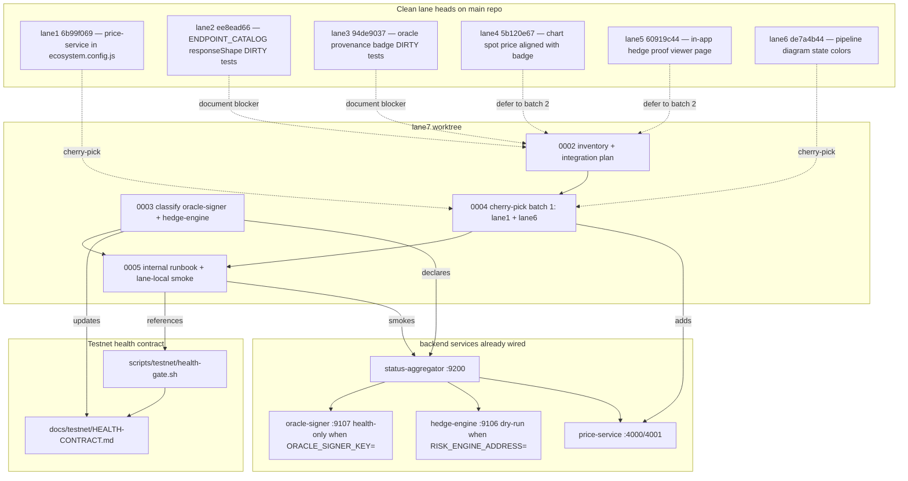

# 0001 — Bootstrap internal testnet setup lane

Prepare an internal testnet candidate for `0007-etoro-live-prices-and-hedging`.

This is the **root task** of the lane 7 initiative. It is split into four
vertical-slice children (0002–0005) that each ship committed evidence on the
lane-7 worktree without ever pushing or touching the main worktree.

## Acceptance (from initiative spec)

- Inventory existing testnet deploy/start/smoke scripts and health contract surfaces.
- Identify exact commands for internal-only deployment and smoke.
- Integrate clean lane commits where safe, or document conflicts/failing tests.
- Ensure `oracle-signer` and `hedge-engine` are visible in the health/status contract.
- Keep real trading fenced and avoid production restarts.

## Overview

Lane 7 starts from `main` head `86e73194` ("docs: document TypeScript
compatibility issues after Next.js 16 upgrade") with a single bootstrap commit
`3bb4dff2` ("0001: bootstrap testnet setup lane"). Lanes 1–6 already have
clean named heads ahead of `main`:

| lane | clean head  | summary                                                       | commits ahead of HEAD |
|------|-------------|---------------------------------------------------------------|-----------------------|
| 1    | `6b99f069`  | register price-service in `backend/ecosystem.config.js`       | 47                    |
| 2    | `ee8ead66`  | align ENDPOINT_CATALOG `responseShape` strings to `timestamp` | 44                    |
| 3    | `94de9037`  | surface oracle provenance in status badge                     | 38                    |
| 4    | `5b120e67`  | keep ticker chart spot price aligned with oracle badge age    | 26                    |
| 5    | `60919c44`  | in-app hedge proof viewer page                                | 44                    |
| 6    | `de7a4b44`  | cover pipeline flow diagram state colors                      | 36                    |

Lanes 2 and 3 also carry **dirty/skipped** work that must NOT be
blind-cherry-picked:

- lane 2: `server-symbol-not-configured-suggestions.test.ts` failing (APLE
  expected `didYouMean: AAPL` but got `undefined`).
- lane 3: `OracleStatusBadge.test.tsx` provenance/block-link expectations
  failing.

Today the testnet readiness gate (initiative `0004`, iter 2) already exists:

- Source of truth: `docs/testnet/HEALTH-CONTRACT.md`.
- Gate runner: `scripts/testnet/health-gate.sh`.
- Required services include `swap-oracle`, `liquidator`, `stocks-keeper`,
  `rpc-balancer`, `bridge-keeper`, `perps`, `predict`.
- Documented exclusions: `activity-reporter`, `harvest-keeper`,
  `revenue-tracker`, `indexer`, `monitor`.

`backend/ecosystem.config.js` already starts `oracle-signer` (port 9107) and
`hedge-engine` (port 9106) in safe **health-only mode** (no signer key /
risk-engine address) and `backend/status-aggregator/src/index.ts` already
polls both. **Neither service is mentioned in `HEALTH-CONTRACT.md`**, so the
gate currently reports them as `⚠️ UNCLASSIFIED` warnings instead of treating
them as a declared part of the testnet contract. `price-service` is not in
`ecosystem.config.js` at all on `main` — lane 1's clean head is the commit
that registers it.

## Research notes

### Existing artifacts to reuse (not rewrite)

- `scripts/testnet/health-gate.sh` — production-quality gate already wired,
  reads `HEALTH-CONTRACT.md` Markdown tables at runtime via awk. Adding a
  service to the contract requires no code change.
- `scripts/testnet/iter01-baseline.sh` — probe pattern lane 7's smoke can
  imitate.
- `docs/testnet/HEALTH-CONTRACT.md` — the canonical exclusion table. Editing
  this file is how lane 7 classifies oracle-signer / hedge-engine.
- `backend/status-aggregator/src/index.ts` — already polls
  `hedge-engine` (port 9106) and `oracle-signer` (port 9107). No code change
  needed for visibility, only contract classification.
- `backend/ecosystem.config.js` — `oracle-signer` defaults to
  `ORACLE_SIGNER_KEY=''` and `hedge-engine` defaults to
  `RISK_ENGINE_ADDRESS=''` + `HEDGE_DRY_RUN=true`. Both are already fenced for
  testnet use; the runbook just needs to document this contract.

### Gaps lane 7 must close

1. `price-service` is missing from `backend/ecosystem.config.js` on HEAD —
   needs lane 1's `6b99f069`.
2. `oracle-signer` and `hedge-engine` are not declared in `HEALTH-CONTRACT.md`
   so the gate emits unclassified warnings.
3. There is no internal-only runbook documenting build/deploy/start/reload/
   smoke/rollback for the lane-7 services. `docs/testnet/iter03-pm2-hygiene.md`
   covers production but not the lane-local fence.
4. There is no smoke command that asserts (a) price-service `/health`,
   (b) oracle-signer health + chain freshness, (c) on-chain
   `StockOracleV2.lastUpdated()` or equivalent freshness, (d) frontend status
   page renders with real provenance, and (e) `REAL_TRADING_ENABLED=false`.

### Hard constraints (from `spec.md` + `constraints.md`)

- **No pushes**: `git push` never appears in any commit, script, or runbook.
- **No production restarts**: never `pm2 restart goodswap|goodperps|goodpredict`.
- **Lane-local PM2 names/ports**: any new internal service uses suffix
  `-lane7` and ports in 49xxx range to avoid collision with production
  status-aggregator (9200), oracle-signer (9107), hedge-engine (9106).
- **No real trading**: `REAL_TRADING_ENABLED=false`,
  `ETORO_MODE=demo-readonly` or `demo-trading` only.
- **No secrets printed**: env presence checks with redacted output only.
- **Worktree isolation**: never write outside
  `/home/goodclaw/goodchain-live-prices-lanes/lane7-testnet-setup`.
- **MCP preserved**: `.cursor/mcp.json` is gitignored on this branch (per
  `.gitignore` change in lane bootstrap) but the working-copy file must keep
  the eToro API docs MCP entry untouched.

## Architecture diagram

## One-week decision

**NO** — do not attempt this in a single iteration.

Rationale:

- Cherry-picking the six lane heads spans **235 total commits** (47+44+38+26
  +44+36) with two lanes carrying dirty failing tests. Even doing only the
  cleanest two lanes (1 + 6) is a multi-day exercise of running targeted
  backend/frontend tests after each batch and resolving any conflict
  surface.
- The runbook + smoke command must be authored after the price-service
  registration is in place (it depends on lane 1) so it can probe a
  PM2-supervised price-service end-to-end.
- The four sub-deliverables are independent vertical slices — they do not
  share files, can be reviewed separately, and each produces standalone
  committed evidence. Splitting them gives the executor a clean
  one-task-per-iteration cadence and keeps each commit reversible.
- If the executor crashes or is preempted on cherry-pick batch 1, the other
  three slices are unaffected and a future iteration can pick up batch 2
  (lanes 4 + 5) without re-doing inventory work.

## Split rationale

Four vertical slices, each with its own `Acceptance` and a one-week-fits=YES
plan. Dependencies are minimal (only batch 2 needs inventory; runbook needs
both classification and price-service).

| ID   | Title                                                      | Deps              | Est.   |
|------|------------------------------------------------------------|-------------------|--------|
| 0002 | Inventory testnet artifacts and produce lane-7 integration plan + blocker list | none | ~1 day |
| 0003 | Classify `oracle-signer` and `hedge-engine` in HEALTH-CONTRACT.md as testnet exclusions | none | ~1 day |
| 0004 | Cherry-pick clean lane heads batch 1 (lane1 + lane6) onto lane-7 integration branch | 0002 | ~2 days |
| 0005 | Internal testnet runbook + lane-local smoke command         | 0003, 0004        | ~2 days |

Why this split (not by component):

- **Vertical, not horizontal**: each child ends in a committed, runnable
  artifact (a Markdown plan / a contract update / a cherry-pick batch /
  a runbook+script), not a half-built layer.
- **Independent demos**: 0003 is shippable without 0002 (we already know
  exactly which two services to classify). 0002 is shippable without 0003
  (it's pure analysis). 0005 only needs 0003 + 0004.
- **Reversible**: each child is one commit (or one cherry-pick batch). If a
  cherry-pick conflict is too severe in 0004, that task documents the
  blocker and leaves the other three in place.
- **Future batches**: lanes 4 and 5 (hedge proof viewer, chart alignment)
  intentionally deferred to a follow-up iteration's "batch 2" task — the
  inventory deliverable from 0002 is the input to that future task.

## Out of scope (this iteration)

- Cherry-picking lanes 2 / 3 — both have known failing tests; deferred until
  those lanes ship clean heads.
- Cherry-picking lanes 4 / 5 — deferred to a "batch 2" follow-up after this
  iteration validates the cherry-pick + smoke loop on lanes 1 + 6.
- Promoting the testnet to public/shareable — coordinator wants smoke + soak
  first; lane 7 stops at "internal candidate" by design.
- Editing the production PM2 ecosystem.config in `/home/goodclaw/gooddollar-l2`.
- Changing the production gate (`scripts/testnet/health-gate.sh`); lane 7
  may add a *new* lane-local smoke script but does not modify the existing
  gate's contract beyond exclusion-table updates.

## Notes for child tasks

- All children write a one-line evidence entry into `.autobuilder/status.md`
  on completion (initiative spec requires this).
- All children must keep `.cursor/mcp.json` and `.env` untouched.
- Commits use the lane convention `0007g/<NNNN>: <subject>`.
