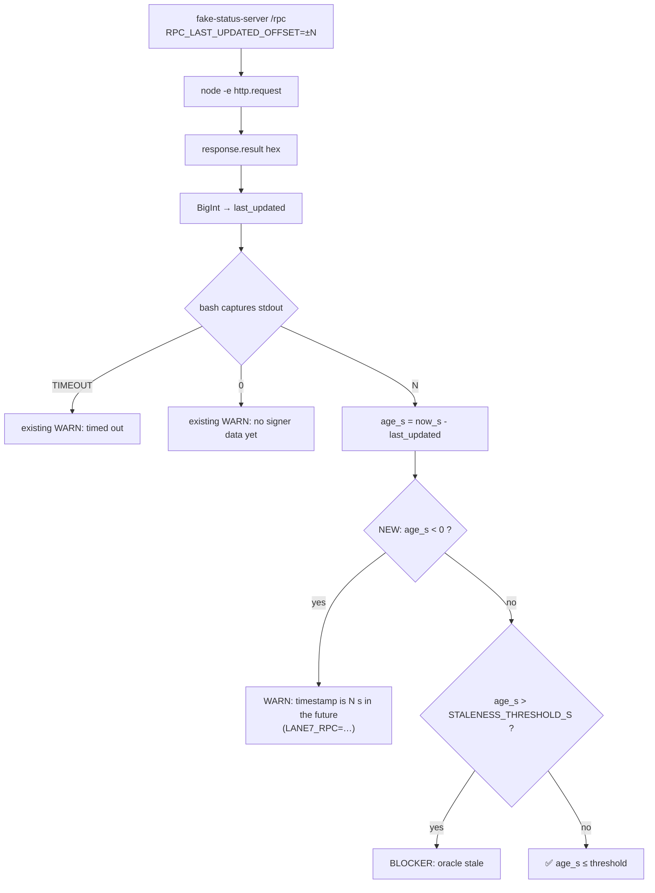

## Problem statement

`scripts/testnet/internal-smoke.sh` lines 412–420 compute on-chain
freshness as:

```bash
now_s="$(date -u +%s)"
age_s=$(( now_s - last_updated ))
if (( age_s > STALENESS_THRESHOLD_S )); then
  add_summary "❌ StockOracleV2.lastUpdated() = $last_updated; age $age_s s > threshold $STALENESS_THRESHOLD_S s"
  BLOCKERS+=("on-chain oracle stale (age ${age_s}s > ${STALENESS_THRESHOLD_S}s)")
else
  add_summary "✅ StockOracleV2.lastUpdated() = $last_updated; age $age_s s ≤ $STALENESS_THRESHOLD_S s"
fi
```

The check only fires when `age_s > STALENESS_THRESHOLD_S`. When
`last_updated > now_s` (a future-dated timestamp), `age_s` is **negative**
and the comparison silently returns false → the script logs:

```
✅ StockOracleV2.lastUpdated() = 1779647627; age -86400 s ≤ 600 s
```

GREEN verdict, even though the oracle just claimed a timestamp from
tomorrow. Confirmed by direct reproduction:

```
$ now=$(date -u +%s); future_ts=$((now + 86400))
$ age_s=$(( now - future_ts ))    # = -86400
$ (( age_s > 600 )) && echo STALE || echo FRESH
FRESH
```

This is a safety-critical edge case for the lane-7 candidate, because:

1. **Clock skew on the signer host** (NTP drift, container with stale
   `/etc/localtime`, manual `date` set during a fire-drill) produces
   future-dated timestamps that the smoke says are fine.
2. **A malicious or buggy signer** could write `block.timestamp + 1h`
   on every push and the smoke would call the oracle perpetually
   fresh — exactly the wrong signal for promotion gating.
3. The literal `age -86400 s ≤ 600 s` printed in the report is
   nonsense to any operator reading it — the smoke is supposed to
   be the trusted heartbeat, and a negative age line in green
   silently undermines that trust.

The runbook calls out "Promotion to release candidate" as the next
phase; we cannot let a smoke that green-lights future-dated timestamps
through that gate.

## User story

As a lane-7 testnet operator running `internal-smoke.sh` against a
signer that reports a future-dated `lastUpdated()` value, I want the
smoke to flag the negative age explicitly (WARN, not BLOCKER —
matches the existing "no signer data yet" treatment) and refuse to
print a contradictory "✅ age -N s ≤ threshold" line, so I can spot
clock skew or signer misbehavior before the candidate moves toward
public testnet.

## How it was found

Code reading of `scripts/testnet/internal-smoke.sh` lines 405–420
during the edge-cases iteration. Reproduced directly in bash:

```
$ bash -c 'age_s=$(( 1779561227 - 1779647627 )); echo $age_s; (( age_s > 600 )) && echo STALE || echo FRESH'
-86400
FRESH
```

The same kind of asymmetry was already noted in task 0010 (the
freshness probe path has weaker invariants than the curl probes
elsewhere); this is the next layer — even when the probe returns a
value, the staleness math has no lower bound.

## Proposed fix

Add a negative-age branch immediately before the `(( age_s > STALENESS_THRESHOLD_S ))`
comparison. Match the existing warning conventions:

```bash
if (( age_s < 0 )); then
  add_summary "⚠️  StockOracleV2.lastUpdated() = $last_updated is in the future by $(( -age_s )) s — clock skew on signer host or RPC, or signer misbehavior"
  WARNINGS+=("on-chain oracle timestamp is $(( -age_s ))s in the future (LANE7_RPC=$LANE7_RPC)")
elif (( age_s > STALENESS_THRESHOLD_S )); then
  ...existing blocker branch...
else
  ...existing OK branch...
fi
```

Verdict shape:

- `age_s < 0` → **WARN** (matches "no signer data yet" and "RPC
  timeout" rules — staleness threshold breach is still the only
  BLOCKER path for the freshness probe).
- `age_s == 0` → OK (treat zero as "just written").
- `0 < age_s ≤ threshold` → OK (unchanged).
- `age_s > threshold` → BLOCKER (unchanged).

Reasoning for WARN instead of BLOCKER: the smoke cannot tell whether
the future-dated value comes from the signer or from the operator's
own clock being behind. Promoting to BLOCKER would mean an
operator with a sloppy host clock can never get a green smoke — too
brittle. WARN surfaces the anomaly without preventing the operator
from making forward progress while they investigate.

## Acceptance criteria

1. Running the smoke against an RPC harness that returns
   `last_updated = now + 86400` (24h in the future) completes with:
   - a literal `WARN: on-chain oracle timestamp is 86400s in the
     future (LANE7_RPC=...)` line in the report,
   - no `❌ ... age -86400 s` line anywhere,
   - exit code 0 (green-with-warnings — matches "no signer data yet"
     behavior, not RED).
2. Running the smoke against an RPC harness that returns
   `last_updated = now` (within ±1s) still reports `✅ ... age 0 s
   ≤ N s` (no regression on the zero-age boundary).
3. Running the smoke against an RPC harness that returns
   `last_updated = now - 3600` (1h ago, threshold 600s) still
   reports `❌ ... age 3600 s > threshold 600 s` BLOCKER
   (no regression on the stale path).
4. Running the smoke against a stuck signer (`last_updated = 0`)
   still emits the existing `⚠️ ... fresh oracle absent (testnet
   candidate phase)` line (no regression on the unsigned path).
5. The new WARN line is captured in
   `.autobuilder/initiatives/0007g-testnet-setup/iter07-smoke-future-dated.md`
   alongside the corresponding `age=0` and `age=3600` cases for
   contrast.
6. Single commit on the lane-7 branch:
   `0007g/0011: warn instead of green on future-dated StockOracleV2 lastUpdated()`.

## Verification

- Extend the RPC harness in
  `.autobuilder/initiatives/0007g-testnet-setup/proof/fake-status-server.js`
  (already extended in task 0010 with a `/rpc` endpoint that returns
  a `lastUpdated()` selector response). Add a knob — e.g. a query
  parameter on the listening port, or an `RPC_LAST_UPDATED_OFFSET`
  env read at startup — that lets the test driver pick the
  timestamp offset (`now + 86400`, `now`, `now - 3600`, `0`).
- Add a proof driver
  `.autobuilder/initiatives/0007g-testnet-setup/proof/run-future-dated.sh`
  that exercises all four cases and asserts the expected line in
  each report.
- Run the existing iter05/06 proof artifacts and confirm
  byte-identical output on the unchanged paths.

## Out of scope

- Promoting the future-dated case to a BLOCKER. Operators with
  clock-skewed hosts must still be able to make forward progress;
  the WARN is the right level for the smoke. A separate promotion
  gate (HEALTH-CONTRACT.md "Promotion to release candidate") can
  decide whether to block public testnet promotion on this warning.
- Adding a configurable `FUTURE_TOLERANCE_S` knob to allow small
  future drift (e.g. 5s). Strict zero-tolerance keeps the smoke
  simple; if operators need a window, follow up in a separate task.
- Querying NTP / `/proc/timex` to disambiguate signer-fault from
  operator-clock-fault. That's a runbook step ("if you see this
  WARN, check `timedatectl status` on signer and operator host"),
  not a smoke-script responsibility.
- Touching the staleness BLOCKER path or the threshold default.

---

## Planning (2026-05-23)

### Overview

The on-chain freshness block in `scripts/testnet/internal-smoke.sh`
(today at lines 413–420) computes `age_s = now_s - last_updated` and
only flags `age_s > STALENESS_THRESHOLD_S`. A future-dated
`lastUpdated()` value produces a negative `age_s` that silently
passes the comparison and prints a contradictory `✅ ... age -86400 s
≤ 600 s` line. Fix is a single new branch right before the existing
`(( age_s > STALENESS_THRESHOLD_S ))` test that handles `age_s < 0`
as a WARN (not BLOCKER) — matching the warning-grade treatment
already used for "no signer data yet" and "probe timed out".

### Research notes

- The verdict layering already has the right shape for a WARN-grade
  signal: `WARNINGS+=(...)` lands in `GREEN-with-warnings`, never
  in `RED`. We just need a new branch that pushes into that array
  before the staleness test runs.
- Negative-age semantics: `age_s < 0` always means
  `last_updated > now_s`. Two real-world causes — operator host
  clock behind NTP, or signer writing a future timestamp. The smoke
  cannot disambiguate; WARN is the only correct verdict (BLOCKER
  would lock out operators with clock skew on their own machine).
- `age_s == 0` is a legitimate "just written" — keep it on the OK
  branch. The boundary test (criterion 2) explicitly pins this.
- The bash arithmetic `$(( now_s - last_updated ))` produces signed
  64-bit integers; no overflow concerns for any plausible timestamp.
- Output sentinel: print `$(( -age_s ))` (the absolute future drift
  in seconds) in the WARN message so the operator can quickly tell
  "1 second future-drift" from "24h future-drift" — the former is
  garden-variety NTP noise, the latter is a signer bug.
- Harness extension: `proof/fake-status-server.js` already has the
  `lane7-smoke-rpc-fresh` profile that hard-codes `Math.floor(Date.now()/1000) - 60`.
  Generalise the timestamp via an env knob —
  `RPC_LAST_UPDATED_OFFSET` (signed integer seconds, relative to
  `now`) — so the same profile can produce `now + 86400`, `now`,
  `now - 3600`, and `0` cases. Keep the default at `-60` so existing
  iter06 artifacts remain byte-identical.

### Architecture diagram



### One-week decision

**YES** — fits in a few hours.

Rationale:
- One new bash branch (3 lines) in a region we already touched in
  task 0010. No new dependencies; no new helpers.
- Fixture extension is additive: a single `parseInt(process.env.RPC_LAST_UPDATED_OFFSET || '-60', 10)`
  line in `fake-status-server.js`. Default preserves byte-identical
  iter06 output.
- Proof driver is four `RPC_LAST_UPDATED_OFFSET=...` invocations
  with grep assertions on the report — trivial.

### Implementation plan (TDD-style)

1. **Red — write the proof driver for the four offset cases.**
   - Create `.autobuilder/initiatives/0007g-testnet-setup/proof/run-future-dated.sh`:
     - Case A (`+86400`): future by 24h → expect WARN line
       `on-chain oracle timestamp is 86400s in the future`, no `❌`
       row, exit 0.
     - Case B (`0`): exact-now → expect `✅ ... age 0 s ≤ N s`,
       exit 0.
     - Case C (`-3600`): 1h ago, threshold 600 → expect
       `❌ ... age 3600 s > threshold 600 s` BLOCKER, exit 1.
     - Case D (`-60` default): regression baseline against existing
       iter06 green output.
   - Run today; confirm Case A produces the contradictory
     `✅ ... age -86400 s ≤ 600 s` line.
2. **Green — add the negative-age branch.**
   - Edit `scripts/testnet/internal-smoke.sh`, in the block
     currently at lines 413–420, change the `else` branch from:
     ```bash
     now_s="$(date -u +%s)"
     age_s=$(( now_s - last_updated ))
     if (( age_s > STALENESS_THRESHOLD_S )); then
       ...
     else
       ...
     fi
     ```
     to:
     ```bash
     now_s="$(date -u +%s)"
     age_s=$(( now_s - last_updated ))
     if (( age_s < 0 )); then
       future_s=$(( -age_s ))
       add_summary "⚠️  StockOracleV2.lastUpdated() = $last_updated is ${future_s}s in the future — check signer host clock / NTP"
       WARNINGS+=("on-chain oracle timestamp is ${future_s}s in the future (LANE7_RPC=$LANE7_RPC)")
     elif (( age_s > STALENESS_THRESHOLD_S )); then
       ...existing blocker branch...
     else
       ...existing OK branch (unchanged)...
     fi
     ```
   - Rerun Cases A–D; confirm A flips to WARN, B/C/D unchanged.
3. **Extend the fixture for the offset knob.**
   - In `.autobuilder/initiatives/0007g-testnet-setup/proof/fake-status-server.js`,
     replace the hard-coded `- 60` in the `/rpc` handler with
     `parseInt(process.env.RPC_LAST_UPDATED_OFFSET || '-60', 10)`.
     Default literal stays `-60` so iter06 artifacts do not change.
4. **No-regression check.**
   - Re-run `.autobuilder/initiatives/0007g-testnet-setup/proof/run-rpc-timeout.sh`;
     confirm Case C (working RPC) still reports fresh and exits 0
     with the default `-60` offset.
   - Diff `iter06-smoke-rpc-timeout.md` before/after — byte-identical
     modulo wallclock timestamps.
5. **Capture proof.**
   - Save Cases A–D to
     `.autobuilder/initiatives/0007g-testnet-setup/iter07-smoke-future-dated.md`.
6. **Commit.**
   - Single commit: `0007g/0011: warn instead of green on future-dated StockOracleV2 lastUpdated()`.

### Dependencies + sequencing

- Independent of 0012/0013/0014/0015. Touches the freshness
  comparison block (lines 413–420) only — no overlap with the
  preflight, env, or address-resolution regions.
- Depends conceptually on task 0010's `/rpc` endpoint and `TIMEOUT`
  sentinel branch — both already landed (0010 has `executed: true`).
- Safe to execute first in this iteration; the fixture change is
  purely additive.

### Risks

- **`bash -u` on `future_s`**: the new variable is assigned right
  before use, so `set -u` cannot trip. Sanity-checked against the
  script header at line 46.
- **Fixture default drift**: switching from a hard-coded `-60` to
  `process.env.RPC_LAST_UPDATED_OFFSET || '-60'` keeps the literal
  default but introduces a string→int conversion. `parseInt('-60', 10)`
  is well-defined; iter06 artifact byte-identicality is preserved.
- **WARN versus BLOCKER framing**: PRD explicitly chooses WARN to
  avoid locking out operators with clock skew on their host. If a
  follow-up promotion gate (release-candidate stage) wants
  BLOCKER-on-future, that's a separate task with its own
  operator-impact discussion.

