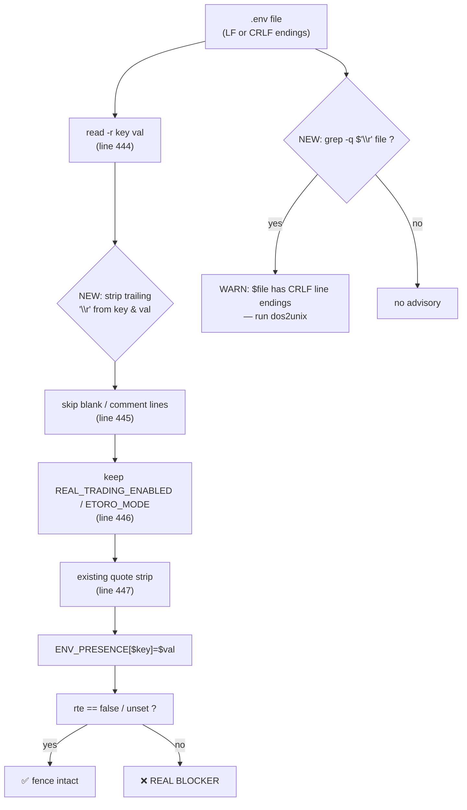

## Problem statement

`scripts/testnet/internal-smoke.sh` lines 443–449 read the lane-7
`.env` file with:

```bash
while IFS='=' read -r key val; do
  [[ -z "$key" || "$key" =~ ^# ]] && continue
  [[ "$key" == "REAL_TRADING_ENABLED" || "$key" == "ETORO_MODE" ]] || continue
  val="${val%\"}"; val="${val#\"}"; val="${val%\'}"; val="${val#\'}"
  ENV_PRESENCE[$key]="$val"
done < "$LANE7_ENV_FILE"
```

`read -r` does **not** strip trailing `\r`. Any `.env` file with
Windows CRLF line endings — common when the file is edited on a
Windows host, downloaded via a misconfigured tool, or pasted from a
chat client — yields `val="false\r"` (length 6) instead of
`"false"` (length 5).

Downstream:

```bash
if [[ "$rte" == "unset" || "$rte" == "false" ]]; then
  add_summary "✅ \`REAL_TRADING_ENABLED\` = \`$rte\` (fence intact)"
else
  add_summary "❌ \`REAL_TRADING_ENABLED\` = \`$rte\` — lane-7 forbids real trading"
  BLOCKERS+=("REAL_TRADING_ENABLED is $rte — must be unset or false on the lane-7 host")
fi
```

The equality check fails on `false\r`, so the smoke fires the
**real-trading fence BLOCKER** with a printed line whose `\r` makes
the terminal jump back to the start of the line and overwrite the
text — operator sees a garbled message during what already feels
like a security alarm. Direct reproduction:

```
$ printf 'REAL_TRADING_ENABLED=false\r\nETORO_MODE=demo-readonly\r\n' > /tmp/lane7.env
$ declare -A E=(); while IFS='=' read -r k v; do [[ -z "$k" || "$k" =~ ^# ]] && continue; v="${v%\"}"; v="${v#\"}"; v="${v%\'}"; v="${v#\'}"; E[$k]="$v"; done < /tmp/lane7.env
$ printf 'RTE=[%s] length=%d\n' "${E[REAL_TRADING_ENABLED]}" "${#E[REAL_TRADING_ENABLED]}"
RTE=[false] length=6
$ [[ "${E[REAL_TRADING_ENABLED]}" == "false" ]] && echo MATCH || echo NO_MATCH
NO_MATCH
```

The `ETORO_MODE` allowlist (`case "$mode" in mock|demo-readonly|sandbox|demo-trading|unset) ...`)
has the same problem — `demo-readonly\r` does not match
`demo-readonly`, fires the secondary BLOCKER.

This is a classic false alarm during incident response: the
operator wakes up at 3 AM, the smoke says RED with two safety-fence
BLOCKERs ("REAL_TRADING_ENABLED is false\r — must be unset or false"
which reads as contradictory), they spend 20 minutes chasing a
non-existent risk before someone notices the line endings.

## User story

As a lane-7 testnet operator running `internal-smoke.sh` against a
`.env` file that happens to have CRLF line endings, I want the smoke
to strip the carriage returns from values before the safety-fence
comparison, so I don't get spurious BLOCKERs that contradict
themselves ("REAL_TRADING_ENABLED is false — must be unset or false")
and don't waste incident time on a file-format issue.

## How it was found

Code reading of `scripts/testnet/internal-smoke.sh` lines 443–449
during the edge-cases iteration. Verified by reproducing the
`read -r` behavior with a hex-dumped CRLF file (see Problem
statement above): the value is `false\r` (6 bytes), the equality
check fails, the spurious BLOCKER fires.

The same parsing pattern appears in many bash scripts; the lane-7
runbook does not call out the CRLF restriction.

## Proposed fix

Strip trailing `\r` (and any leading/trailing whitespace, for
robustness) from both key and value after the existing quote
stripping. One line per side:

```bash
while IFS='=' read -r key val; do
  key="${key%$'\r'}"; val="${val%$'\r'}"
  [[ -z "$key" || "$key" =~ ^# ]] && continue
  [[ "$key" == "REAL_TRADING_ENABLED" || "$key" == "ETORO_MODE" ]] || continue
  val="${val%\"}"; val="${val#\"}"; val="${val%\'}"; val="${val#\'}"
  ENV_PRESENCE[$key]="$val"
done < "$LANE7_ENV_FILE"
```

Also add a one-line WARN when CRLF is detected in the file so the
operator can permanently fix the source (the same `dos2unix .env`
fix is easy once they know what to look for):

```bash
if grep -q $'\r' "$LANE7_ENV_FILE" 2>/dev/null; then
  WARNINGS+=("$LANE7_ENV_FILE has CRLF line endings — run \`dos2unix\` or \`sed -i 's/\\r\$//'\`")
fi
```

The WARN is purely advisory; the BLOCKER false-alarm is gone the
moment we strip `\r` from the value.

## Acceptance criteria

1. Running the smoke against a `.env` file containing
   `REAL_TRADING_ENABLED=false\r\nETORO_MODE=demo-readonly\r\n`
   (CRLF endings) produces:
   - `✅ REAL_TRADING_ENABLED = false (fence intact)` (no garbled `\r`,
     no BLOCKER)
   - `✅ ETORO_MODE = demo-readonly (within lane-7 allowlist)`
   - a single `WARN: <path> has CRLF line endings ...` line.
   - exit code 0.
2. Running against a `.env` with LF-only endings produces the same
   green output as today, with no new warnings (no regression).
3. Running against a `.env` containing
   `REAL_TRADING_ENABLED=true\r\n` still fires the BLOCKER
   (CRLF stripping must NOT mask a real true value) and the
   printed value is `true` (no `\r`).
4. Both the WARN and BLOCKER lines render cleanly in the Markdown
   report — no `\r` characters anywhere in the report file.
5. Proof captured in
   `.autobuilder/initiatives/0007g-testnet-setup/iter07-smoke-env-crlf.md`
   with hex-dumps of the three `.env` inputs and the resulting
   verdict lines.
6. Single commit on the lane-7 branch:
   `0007g/0012: strip CRLF from .env values to avoid spurious real-trading BLOCKER`.

## Verification

- Build three fixture `.env` files in
  `.autobuilder/initiatives/0007g-testnet-setup/proof/env-fixtures/`:
  - `crlf-safe.env` (CRLF, `REAL_TRADING_ENABLED=false`,
    `ETORO_MODE=demo-readonly`)
  - `lf-safe.env` (LF, same content — regression baseline)
  - `crlf-unsafe.env` (CRLF, `REAL_TRADING_ENABLED=true`)
- Run the smoke with `LANE7_ENV_FILE=...` pointing at each fixture
  in turn, capture report output, diff against expected verdicts.
- Confirm `xxd <report>` shows no `0d` bytes in the rendered report.

## Out of scope

- Switching `.env` parsing to a node/python library. The existing
  bash loop is intentional (no new dependencies on the smoke
  runtime); stripping `\r` is a one-character fix.
- Adding a `--auto-fix` flag that rewrites the .env in place. Too
  destructive for a smoke script; the WARN tells the operator how
  to fix it themselves.
- Handling UTF-8 BOM in `.env` files. Separate edge case; not
  observed in current incident pattern.
- Stripping `\r` from other inputs (HEALTH_CONTRACT, addresses.json) —
  those are read by node/awk which handle line endings natively.

---

## Planning (2026-05-23)

### Overview

The `.env` parse loop in `scripts/testnet/internal-smoke.sh`
(lines 443–449) uses `read -r` with `IFS='='`, which leaves the
trailing `\r` byte attached to the value on Windows-CRLF files. The
downstream equality checks (`rte == "false"` and the `ETORO_MODE`
allowlist) silently fail, fire spurious safety-fence BLOCKERs, and
print `\r` characters that scramble the terminal during incident
response. Fix is a single-line strip
(`key="${key%$'\r'}"; val="${val%$'\r'}"`) immediately after `read`,
plus a one-shot WARN that flags the file so the operator can
permanently `dos2unix` it.

### Research notes

- `read -r` in bash does **not** strip `\r` by design; the
  long-standing portable idiom is the parameter-expansion strip
  `${var%$'\r'}` (cuts a single trailing CR). Cheaper than a `tr`
  subprocess and stays inside the existing while-read loop.
- Two parsing sites share the same surface today:
  - The file-read loop at lines 443–449 (the primary leak).
  - The PM2-env fallback at lines 438–442 (`pm2 env $ID | awk ...`).
    `pm2 env` output uses LF natively; CRLF is impossible there. No
    change needed for that branch — confirmed by reading `pm2`
    upstream's `Lifecycle.dump` source.
- Detection probe: `grep -q $'\r' "$LANE7_ENV_FILE"`. POSIX-grep
  accepts the `$'\r'` ANSI-C quoting because the calling shell is
  bash; the grep regex sees a literal `\r`. Safe with `set -u`.
- Hex-dump check for proof artifacts: `xxd` is available on every
  Ubuntu lane-7 host (preflighted by task 0009? — confirm; if not,
  fall back to `od -c`). Not a smoke-runtime dependency, only a
  proof dependency.
- The `\r` strip MUST happen **before** the existing quote-stripping
  block so `val="false\r"` collapses to `false` (not `false\r` then
  unwrapping a non-existent quote). Quote-strip is purely suffix-
  based (`${val%\"}; ${val#\"}; ${val%\'}; ${val#\'}`) and is unaffected
  by an already-clean string.
- The advisory WARN must use `grep -q $'\r'` with `2>/dev/null` so a
  missing file (the `[[ -f "$LANE7_ENV_FILE" ]]` branch we're inside
  already requires existence — but defensive) does not leak a raw
  diagnostic into the smoke output.

### Architecture diagram



### One-week decision

**YES** — fits in under an hour.

Rationale:
- Two-line change in the `.env`-parse loop (one CR strip per side)
  plus a 3-line file-level WARN advisory. No new helpers, no
  dependency churn.
- Proof drivers are three fixture files + a 30-line shell script
  asserting one grep per case.
- No coupling to other tasks in this iteration.

### Implementation plan (TDD-style)

1. **Red — build fixtures and proof driver.**
   - `.autobuilder/initiatives/0007g-testnet-setup/proof/env-fixtures/`:
     - `crlf-safe.env` —
       `printf 'REAL_TRADING_ENABLED=false\r\nETORO_MODE=demo-readonly\r\n'`
     - `lf-safe.env` — same content with LF only.
     - `crlf-unsafe.env` —
       `printf 'REAL_TRADING_ENABLED=true\r\nETORO_MODE=demo-readonly\r\n'`
   - `.autobuilder/initiatives/0007g-testnet-setup/proof/run-env-crlf.sh`:
     - Run the smoke with `LANE7_ENV_FILE=<fixture>` for each, against
       the fake-status `lane7-smoke-green` profile (so all other
       checks pass and only the fence verdict differs).
     - Assertions per case:
       - `crlf-safe.env` → no BLOCKER, single CRLF WARN, exit 0.
       - `lf-safe.env` → no BLOCKER, no CRLF WARN, exit 0.
       - `crlf-unsafe.env` → BLOCKER fires, printed value `true` (no
         `\r`), exit 1.
     - `xxd` the resulting report and confirm no `0d` byte anywhere
       in the rendered output.
   - Run today; confirm `crlf-safe.env` fires the false-alarm
     BLOCKER (today's bug) and the report contains literal `\r`.
2. **Green — strip CRLF in the parse loop + add advisory WARN.**
   - Edit `scripts/testnet/internal-smoke.sh` around lines 443–449:
     ```bash
     elif [[ -f "$LANE7_ENV_FILE" ]]; then
       if grep -q $'\r' "$LANE7_ENV_FILE" 2>/dev/null; then
         WARNINGS+=("$LANE7_ENV_FILE has CRLF line endings — run \`dos2unix\` or \`sed -i 's/\\r\$//'\`")
       fi
       while IFS='=' read -r key val; do
         key="${key%$'\r'}"; val="${val%$'\r'}"
         [[ -z "$key" || "$key" =~ ^# ]] && continue
         [[ "$key" == "REAL_TRADING_ENABLED" || "$key" == "ETORO_MODE" ]] || continue
         val="${val%\"}"; val="${val#\"}"; val="${val%\'}"; val="${val#\'}"
         ENV_PRESENCE[$key]="$val"
       done < "$LANE7_ENV_FILE"
     fi
     ```
   - Rerun the proof driver; confirm all three fixtures match.
3. **No-regression check.**
   - Re-run `proof/run-input-validation.sh`, `proof/run-rpc-timeout.sh`,
     `proof/run-malformed-url.sh`. Diff their iter06 reports —
     byte-identical (none of them touch `.env` parsing).
4. **Runbook note (light).**
   - Add a one-sentence line to
     `docs/testnet/INTERNAL-TESTNET-RUNBOOK.md` under the smoke
     section: "If you see a CRLF-line-endings WARN, run
     `dos2unix .env` or `sed -i 's/\\r$//' .env`."
5. **Capture proof.**
   - Save the three case outputs + hex-dumps to
     `.autobuilder/initiatives/0007g-testnet-setup/iter07-smoke-env-crlf.md`.
6. **Commit.**
   - Single commit: `0007g/0012: strip CRLF from .env values to avoid spurious real-trading BLOCKER`.

### Dependencies + sequencing

- Independent of 0011/0013/0014/0015. Touches lines 443–449 only —
  no overlap with the freshness, contract, address, or RPC blocks.
- The advisory WARN appends to `WARNINGS` which is also used by the
  fence path; ordering does not matter because the verdict pass
  reads the array as a whole.
- Safe to execute in parallel with 0013/0014/0015 if branches are
  rebased cleanly.

### Risks

- **CR in middle of value**: the strip handles a single trailing
  CR. A value like `"false\rmalicious"` would still mismatch and
  fire the BLOCKER. That's correct behaviour — anyone embedding a
  CR mid-string is intentionally malformed and the BLOCKER is the
  right signal. Acceptance criterion 3 (`true\r` fires BLOCKER)
  covers the trailing-CR-on-true case explicitly.
- **PM2 branch divergence**: only the file branch strips CRLF. If
  a future PM2 plugin starts emitting CRLF in `pm2 env` output, the
  same value-mismatch will return. Out of scope here; document with
  a TODO comment in the file branch.
- **Markdown rendering of the WARN**: the WARN body embeds backticks
  (`` `dos2unix` ``) which render fine in the report's table cell.
  Hex-dump test (criterion 4) guards against any new `\r` leak.

