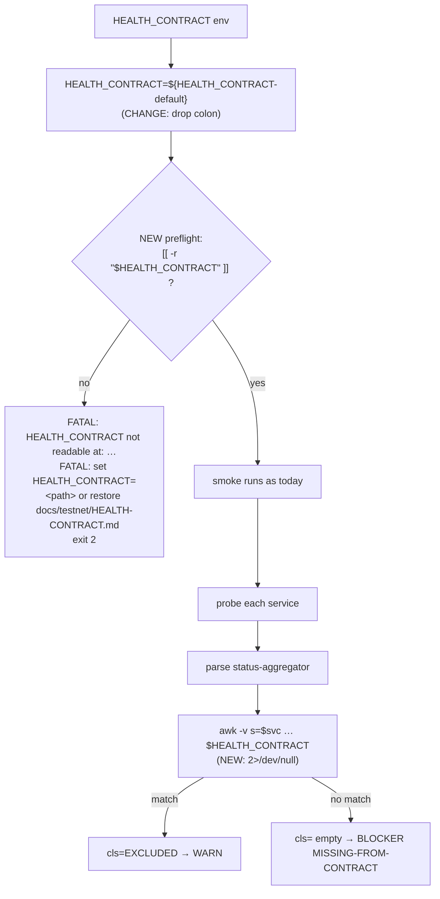

## Problem statement

`scripts/testnet/internal-smoke.sh` resolves the contract path early:

```bash
HEALTH_CONTRACT="${HEALTH_CONTRACT:-$REPO_ROOT/docs/testnet/HEALTH-CONTRACT.md}"
```

It is only consulted inside the status-aggregator block at lines
311–317:

```bash
cls="$(awk -v s="$svc" '
  /^## / { in_excl = (index($0, "Documented exclusions") > 0) ? 1 : 0; next }
  in_excl && /^\| *`[a-zA-Z0-9_-]+` *\|/ {
    n = split($0, parts, "|"); gsub(/[ `]/, "", parts[2])
    if (parts[2] == s) { print "EXCLUDED"; exit }
  }
' "$HEALTH_CONTRACT")"
```

There is **no preflight check** that `$HEALTH_CONTRACT` exists. If
an operator runs the smoke from a partial checkout (cherry-pick
batch that hasn't yet landed the contract update), or if the file
was deleted / moved during a rename, or if `HEALTH_CONTRACT=` is
exported as an empty string, awk fatals to stderr **per service**:

```
$ awk '...' /nonexistent/HEALTH-CONTRACT.md
awk: fatal: cannot open file `/nonexistent/HEALTH-CONTRACT.md' for reading: No such file or directory
```

awk's stderr is **not** redirected (compare lines 311–317 with the
`2>/dev/null` on the json_field helper at line 209). The operator
gets the raw fatal interleaved with the smoke's own output, AND for
each missing-contract iteration the smoke fires a different BLOCKER:

```
BLOCKER: oracle-signer not classified in HEALTH-CONTRACT.md exclusions table
BLOCKER: hedge-engine not classified in HEALTH-CONTRACT.md exclusions table
```

The operator chases a phantom "classification table is wrong"
problem (re-running the smoke, opening the contract file, looking
for typos in the service name) for tens of minutes before someone
notices the awk fatal upstream. The actual root cause —
contract file missing — is buried.

Confirmed by reproduction:

```
$ cls=$(awk -v s="oracle-signer" '
    /^## / { in_excl = (index($0, "Documented exclusions") > 0) ? 1 : 0; next }
    in_excl && /^\| *`[a-zA-Z0-9_-]+` *\|/ {
      n = split($0, parts, "|"); gsub(/[ `]/, "", parts[2])
      if (parts[2] == s) { print "EXCLUDED"; exit }
    }
  ' /nonexistent/HEALTH-CONTRACT.md 2>&1)
$ echo "[$cls]"
[awk: fatal: cannot open file `/nonexistent/HEALTH-CONTRACT.md' for reading: No such file or directory]
```

The script invocation does NOT capture stderr, so cls becomes empty
on stdout — but the fatal text leaks to the operator's TTY.

## User story

As a lane-7 testnet operator running `internal-smoke.sh` from a
checkout that does not yet include `docs/testnet/HEALTH-CONTRACT.md`
(common during cherry-pick batches), I want a single FATAL line at
the top of the smoke output that says **"HEALTH_CONTRACT not found
at <path>"** with exit code 2 (matching the existing tool-preflight
and URL-preflight fatals), so I do not waste time chasing a
phantom misclassification BLOCKER and a raw awk error.

## How it was found

Code reading of `scripts/testnet/internal-smoke.sh` lines 108–109
(resolve `$HEALTH_CONTRACT`) and 311–317 (use it inside awk)
during the edge-cases iteration. Confirmed by running the same awk
incantation against a non-existent path and observing the fatal
leak plus the empty cls value the script would consume.

The pattern matches the rest of the script: `STALENESS_THRESHOLD_S`
is preflighted (require_uint), tool dependencies are preflighted
(node/curl/awk/date), probe URLs are preflighted (regex match),
production URLs are preflighted (case match). The HEALTH_CONTRACT
path was missed.

## Proposed fix

Add a preflight existence check immediately after the existing
URL-preflight block (around line 110), grouped with the other
"fail fast" checks:

```bash
if [[ ! -r "$HEALTH_CONTRACT" ]]; then
  echo "FATAL: HEALTH_CONTRACT not readable at: $HEALTH_CONTRACT" >&2
  echo "FATAL: set HEALTH_CONTRACT=<path> or restore docs/testnet/HEALTH-CONTRACT.md" >&2
  exit 2
fi
```

This makes the failure mode symmetric with the existing
"FATAL: missing required tool" / "FATAL: malformed probe URL"
lines: one line, exit 2, no half-run report. The awk block then
runs against a file we know exists, so no stderr leakage is
possible from this code path.

Secondary hardening: change the awk invocations at lines 311–317
to redirect their own stderr (`awk '...' "$HEALTH_CONTRACT" 2>/dev/null`)
so any future contract-format weirdness (e.g. binary garbage in
the file) cannot leak raw awk diagnostics into the smoke's TTY.
Belt-and-suspenders.

## Acceptance criteria

1. Running the smoke with `HEALTH_CONTRACT=/nonexistent/path.md`
   produces a single stderr block:
   ```
   FATAL: HEALTH_CONTRACT not readable at: /nonexistent/path.md
   FATAL: set HEALTH_CONTRACT=<path> or restore docs/testnet/HEALTH-CONTRACT.md
   ```
   with exit code 2, no Markdown report written, no awk fatals
   leaked, no spurious BLOCKERs.
2. Running with `HEALTH_CONTRACT=` (empty string) hits the same
   FATAL path (existing default still resolves first because
   `${HEALTH_CONTRACT:-...}` short-circuits, but the case where
   the path is set to an empty string by `export HEALTH_CONTRACT=""`
   must be covered — confirm with a fixture).
3. Running with `HEALTH_CONTRACT` unset uses the default
   `$REPO_ROOT/docs/testnet/HEALTH-CONTRACT.md` and continues as
   today (no regression).
4. The awk invocations at lines 311–317 redirect stderr; running
   with a deliberately malformed contract file (e.g. binary
   garbage) does not leak raw awk diagnostics into the smoke
   output — the existing `MISSING-FROM-CONTRACT` BLOCKER fires
   cleanly instead.
5. Proof captured in
   `.autobuilder/initiatives/0007g-testnet-setup/iter07-smoke-contract-preflight.md`
   showing:
   - `HEALTH_CONTRACT=/nonexistent` → exit 2, single FATAL block
   - `HEALTH_CONTRACT=` (empty)    → exit 2, single FATAL block
   - `HEALTH_CONTRACT` unset       → existing green/red verdict
     (whichever the harness is set to)
   - garbled contract file         → BLOCKER without awk leak
6. Single commit on the lane-7 branch:
   `0007g/0013: preflight HEALTH_CONTRACT readability and silence awk stderr`.

## Verification

- Add a proof driver
  `.autobuilder/initiatives/0007g-testnet-setup/proof/run-contract-preflight.sh`
  that runs the four cases above against the existing fake-status
  harness (no new harness needed — the contract path is
  independent of the status-aggregator).
- Capture wallclock to confirm the FATAL path exits in <100ms
  (single `-r` check, no curl probes attempted).

## Out of scope

- Auto-fetching the contract from origin/main if missing. The
  smoke is push-fenced and must not perform git operations as a
  side effect.
- Switching the awk-table parser to a node JSON / YAML parser.
  The contract is a human-edited Markdown table; awk is the right
  tool. Adding a structured-data sibling file is a separate task
  if it becomes useful.
- Validating that the contract's "Documented exclusions" section
  actually exists. If awk runs against a real file and finds no
  matches, the existing `MISSING-FROM-CONTRACT` BLOCKER is the
  correct signal.
- Restoring the contract file if missing — that's an operator /
  cherry-pick-batch responsibility, not the smoke's.

---

## Planning (2026-05-23)

### Overview

`scripts/testnet/internal-smoke.sh` resolves `HEALTH_CONTRACT` at
line 109 but never checks the file exists. The path is consumed by
an `awk '...' "$HEALTH_CONTRACT"` invocation at lines 311–317
without stderr redirection — so a missing file leaks
`awk: fatal: cannot open file ...` to the operator's TTY **and**
returns empty `cls`, which fires misleading
`MISSING-FROM-CONTRACT` BLOCKERs for both
`oracle-signer` and `hedge-engine`. Fix is a `-r` preflight check
co-located with the existing tool / URL / numeric preflights, plus
`2>/dev/null` belt-and-suspenders on the awk call.

### Research notes

- The script already has four preflight blocks: tool-preflight
  (added in task 0009), URL-preflight (line 87–103), production-URL
  fence (line 341 — service-side, not preflight), and numeric input
  preflight (lines 119–137). The missing one is a path-existence
  check for `HEALTH_CONTRACT`. Operator mental model: one block, one
  FATAL line, exit 2.
- `${HEALTH_CONTRACT:-...}` short-circuits when unset OR when the
  variable is set to an empty string (yes — the `:-` form treats
  empty as unset). So `export HEALTH_CONTRACT=""` collapses to the
  default. That's the **wrong** behaviour for criterion 2 — operator
  set the variable explicitly, the smoke must respect the empty
  value and fail fast. Change the parameter expansion to the
  set-but-empty-preserving form `${HEALTH_CONTRACT-...}` (no colon)
  so the preflight catches `export HEALTH_CONTRACT=""` as `''` and
  emits the FATAL. The numeric preflight at line 110 already uses
  this form (`STALENESS_THRESHOLD_S-600`); follow that precedent.
- `-r` is stronger than `-f` here — covers symlinks, dangling
  symlinks, and permission-stripped files in one test. Awk needs
  read permission, not just existence.
- awk stderr redirection is the secondary fix. The existing
  `json_field` helper (lines 196–209) already redirects `2>/dev/null`
  for exactly this reason. Apply the same pattern at lines 311–317:
  ```bash
  cls="$(awk -v s="$svc" '
    ...
  ' "$HEALTH_CONTRACT" 2>/dev/null)"
  ```
- Garbled contract (binary garbage, partial download) is a separate
  scenario: the file is readable but awk's pattern matches return
  nothing. The existing `MISSING-FROM-CONTRACT` BLOCKER fires
  cleanly — that's the **correct** signal once the awk stderr is
  silenced. Criterion 4 pins this regression baseline.
- Wallclock check (criterion in proof): `time bash internal-smoke.sh`
  with bogus `HEALTH_CONTRACT` should hit the FATAL inside ~50ms —
  the only work before the preflight is env defaults and the URL
  regex loop.

### Architecture diagram



### One-week decision

**YES** — fits in well under an hour.

Rationale:
- One 4-line preflight block + one `2>/dev/null` redirection + one
  parameter-expansion form swap. No new helpers, no fixture
  extension.
- Proof driver exercises four pre-existing cases against the
  current fake-status harness (no harness change).
- No coupling to other tasks in this iteration.

### Implementation plan (TDD-style)

1. **Red — write proof driver for the four cases.**
   - `.autobuilder/initiatives/0007g-testnet-setup/proof/run-contract-preflight.sh`:
     - Case A (`HEALTH_CONTRACT=/nonexistent/path.md`): expect exit
       2, stderr contains both `FATAL:` lines, no Markdown report
       written, wallclock ≤ 100ms.
     - Case B (`HEALTH_CONTRACT=""` explicit empty): same as Case A.
     - Case C (`HEALTH_CONTRACT` unset, default path exists): expect
       existing green verdict against the green-profile fake server,
       byte-identical to iter06 baseline.
     - Case D (`HEALTH_CONTRACT=<binary-garbage.bin>`): expect
       `MISSING-FROM-CONTRACT` BLOCKER fires cleanly, no `awk:`
       text leaked to stderr or report.
   - Run today; confirm Cases A/B/D produce raw `awk: fatal` text
     and misleading BLOCKERs.
2. **Green — three precise edits to `scripts/testnet/internal-smoke.sh`.**
   - **Edit 1** (line 109): switch `:-` to `-` so explicit empty
     string is preserved:
     ```bash
     HEALTH_CONTRACT="${HEALTH_CONTRACT-$REPO_ROOT/docs/testnet/HEALTH-CONTRACT.md}"
     ```
   - **Edit 2** (immediately after the require_uint block, before
     the helpers section around line 139): add the preflight:
     ```bash
     if [[ ! -r "$HEALTH_CONTRACT" ]]; then
       echo "FATAL: HEALTH_CONTRACT not readable at: $HEALTH_CONTRACT" >&2
       echo "FATAL: set HEALTH_CONTRACT=<path> or restore docs/testnet/HEALTH-CONTRACT.md" >&2
       exit 2
     fi
     ```
   - **Edit 3** (line 317): redirect awk stderr:
     ```bash
     ' "$HEALTH_CONTRACT" 2>/dev/null)"
     ```
   - Rerun proof; confirm Cases A/B match, C is byte-identical to
     iter06, D fires `MISSING-FROM-CONTRACT` BLOCKER without leak.
3. **No-regression check.**
   - Re-run `proof/run-rpc-timeout.sh`, `proof/run-input-validation.sh`,
     `proof/run-malformed-url.sh`. Diff iter06 outputs — byte-
     identical modulo timestamps. (All three depend on
     `HEALTH_CONTRACT` resolving to the in-tree default, which is
     readable, so the preflight is a pass-through.)
4. **Capture proof.**
   - Save the four case outputs to
     `.autobuilder/initiatives/0007g-testnet-setup/iter07-smoke-contract-preflight.md`.
   - Include `time` wallclock on Case A.
5. **Commit.**
   - Single commit: `0007g/0013: preflight HEALTH_CONTRACT readability and silence awk stderr`.

### Dependencies + sequencing

- Independent of 0011/0012/0014/0015. The three edits are
  isolated to lines 109, ~138 (new block), and 317.
- Best executed alongside 0012 (both add minor robustness to
  operator-supplied input handling) — same `# ----- preflight -----`
  region.

### Risks

- **`set -u` on the preflight**: `HEALTH_CONTRACT` is assigned just
  above with a default — even if the operator clears it, the
  expansion guarantees a string value (possibly empty), so the
  `[[ -r ... ]]` test is well-defined.
- **Race between preflight and use**: if the file is deleted
  between the preflight (line ~138) and the awk call (line ~317),
  awk's stderr is now silenced and `cls` becomes empty. The
  `MISSING-FROM-CONTRACT` BLOCKER fires — same as today for the
  garbled-file case. Not a regression; operator gets a meaningful
  blocker instead of a raw fatal.
- **Backward compat for `HEALTH_CONTRACT:-` users**: the `:-` →
  `-` swap is observationally different only when the operator
  explicitly sets `HEALTH_CONTRACT=""`. Today that case silently
  uses the default; after this change it fails fast. Documented in
  the runbook section in step 4 (above) — only existing user is
  the smoke itself. No external scripts grep for the smoke's
  internal expansion form.

