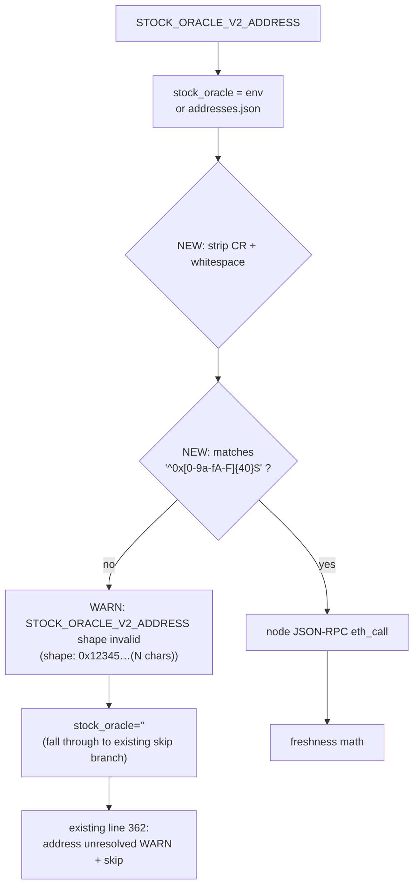

## Problem statement

`scripts/testnet/internal-smoke.sh` resolves the StockOracleV2
address from two sources (lines 347–360):

```bash
stock_oracle="${STOCK_ORACLE_V2_ADDRESS:-}"
if [[ -z "$stock_oracle" ]]; then
  addr_json="$REPO_ROOT/op-stack/addresses.json"
  if [[ -f "$addr_json" ]]; then
    stock_oracle="$(node -e '
      const fs=require("fs");
      try {
        const j=JSON.parse(fs.readFileSync(process.argv[1],"utf8"));
        const c=j.contracts||{};
        console.log(c.StockOracleV2 || "");
      } catch (_) {}
    ' "$addr_json" 2>/dev/null)"
  fi
fi
```

Neither path validates the shape of the resulting value. Whatever
string is returned is fed directly into the JSON-RPC eth_call:

```js
const data = JSON.stringify({
  jsonrpc: "2.0", id: 1, method: "eth_call",
  params: [{ to: process.argv[2], data: "0xd0b06f5d" }, "latest"],
});
```

Failure modes the operator hits:

1. **Operator typo** — `STOCK_ORACLE_V2_ADDRESS=0x1234` (too
   short), `STOCK_ORACLE_V2_ADDRESS=foo` (not hex),
   `STOCK_ORACLE_V2_ADDRESS="0xdeadbeef "` (trailing space copied
   from chat). The RPC returns an error like
   `{"jsonrpc":"2.0","id":1,"error":{"code":-32602,"message":"invalid argument 0"}}`.
   The script's parser checks `!j.result || j.result === "0x"` and
   prints `"0"`, which the bash side interprets as the existing
   `⚠️ no signer data yet (testnet candidate phase)` warning.
2. **addresses.json with wrong type** — `{ "contracts": { "StockOracleV2": 12345 } }`
   (numeric instead of hex string). `c.StockOracleV2 || ""` converts
   to `"12345"`, eth_call rejects, same misleading warning.
3. **addresses.json with addresses-by-network keyed structure** —
   `{ "contracts": { "StockOracleV2": { "lane7": "0x..." } } }`.
   `||` yields the object reference, which `console.log` serializes
   as `[object Object]`. Same misleading warning.

In all three cases the operator sees:

```
⚠️  StockOracleV2.lastUpdated() returned 0 — fresh oracle absent (testnet candidate phase)
```

— which is the **expected** signal for the testnet candidate phase
before the signer has written. So the operator does nothing.
Meanwhile their oracle is actually deployed and writing fine; the
smoke is just calling the wrong address (or no address at all).
The misleading warning eats the operator's signal-to-noise.

## User story

As a lane-7 testnet operator running `internal-smoke.sh`, I want
the smoke to refuse to probe with an obviously malformed
StockOracleV2 address and instead emit a single
`WARN: STOCK_ORACLE_V2_ADDRESS does not look like a 0x-prefixed
20-byte hex address: <redacted-shape>` line, so I can distinguish
"signer hasn't written yet" from "smoke is calling the wrong
contract" without rerunning anything.

## How it was found

Code reading of `scripts/testnet/internal-smoke.sh` lines 347–403
during the edge-cases iteration. Confirmed the conflation: any
RPC error response (`j.error` set, `j.result` undefined) goes
through the same `console.log("0")` branch as a genuine
`result: "0x"` (no signer data) response. The bash side has no way
to distinguish them.

The asymmetry with the existing preflights (URL regex,
`require_uint`, tool dependencies, contract path) is the signal:
every other operator-supplied input is validated before use; the
oracle address is not.

## Proposed fix

Two additions:

1. **Validate the resolved address shape** before the eth_call.
   The canonical Ethereum address regex is `^0x[0-9a-fA-F]{40}$`.
   When the resolved value doesn't match, emit a WARN (not a
   BLOCKER — the smoke can still produce a verdict for everything
   else) and skip the on-chain probe:

   ```bash
   if [[ ! "$stock_oracle" =~ ^0x[0-9a-fA-F]{40}$ ]]; then
     # Redact the value shape for the report — keep the first 8 chars
     # so the operator can see "0x1234..." but not the full address.
     shape="${stock_oracle:0:10}…(${#stock_oracle} chars)"
     add_summary "⚠️  STOCK_ORACLE_V2_ADDRESS does not look like a 0x-prefixed 20-byte hex address (shape: \`$shape\`) — on-chain freshness skipped"
     WARNINGS+=("STOCK_ORACLE_V2_ADDRESS shape invalid (\`$shape\`) — set a 0x-prefixed 40-hex address")
     skip_onchain=1
   fi
   ```

2. **Normalize the value before validation**: trim leading/trailing
   whitespace and CRLF (in case the address was sourced from a
   .env file with Windows line endings — see task 0012 for the
   parallel `.env` fix), then run the regex. This catches the
   "trailing space from chat copy" mode without breaking the
   common-case happy path.

   ```bash
   stock_oracle="${stock_oracle%$'\r'}"
   stock_oracle="${stock_oracle#"${stock_oracle%%[![:space:]]*}"}"
   stock_oracle="${stock_oracle%"${stock_oracle##*[![:space:]]}"}"
   ```

Treat as WARN, not BLOCKER: the operator may genuinely want to run
the smoke before the contract is deployed (the spec's "testnet
candidate phase" explicitly accommodates this — see task 0005's
acceptance criterion about "fresh oracle absent — testnet candidate
phase"). A WARN tells them the address is wrong without preventing
the rest of the smoke from running.

## Acceptance criteria

1. Running the smoke with `STOCK_ORACLE_V2_ADDRESS=0x1234`
   (too short) emits a `WARN: STOCK_ORACLE_V2_ADDRESS shape
   invalid ...` line, skips the eth_call entirely, and does NOT
   emit the misleading "fresh oracle absent (testnet candidate
   phase)" line.
2. Running with `STOCK_ORACLE_V2_ADDRESS=foo` (non-hex), with
   trailing whitespace (`"0xdead...beef "`), and with CRLF
   (`"0xdead...beef\r"`) all behave identically: trim, validate,
   WARN, skip.
3. Running with a valid address (`0x` + 40 hex chars, any case)
   continues to call eth_call and report freshness as today
   (no regression).
4. Running with `addresses.json` containing
   `"StockOracleV2": 12345` (numeric), `"StockOracleV2": {}` (object),
   or missing the key emits the same `address unresolved` WARN
   that exists today for the missing-key path — no spurious
   on-chain probe.
5. The redacted shape in the WARN line is at most 30 characters
   and never includes more than the first 10 characters of the
   address itself (so a partial typo is hinted at without copying
   a large secret-shaped string into the report).
6. Proof captured in
   `.autobuilder/initiatives/0007g-testnet-setup/iter07-smoke-address-validation.md`
   with the six input cases above and the resulting verdict lines.
7. Single commit on the lane-7 branch:
   `0007g/0014: validate STOCK_ORACLE_V2_ADDRESS shape before eth_call`.

## Verification

- Add a proof driver
  `.autobuilder/initiatives/0007g-testnet-setup/proof/run-address-validation.sh`
  that exercises the six input cases against the existing
  `fake-status-server.js` harness with its `/rpc` endpoint (no
  new harness work needed).
- Confirm with `diff` that the green-path Markdown report is
  byte-identical to the existing iter05 green report — the only
  behavioral change is on invalid-address inputs.
- Confirm the WARN line in the report contains the redacted shape
  but not the full input (when the input was 80+ chars of garbage).

## Out of scope

- Validating the address against an on-chain `eth_getCode` to
  confirm a contract is deployed at that address. The smoke is a
  snapshot, not a deploy-time check; the RPC call to verify code
  presence is a separate diagnostic.
- Adding EIP-55 checksum validation. The script normalizes to
  any-case hex (matches what ethers and viem accept by default);
  checksum strictness would reject legitimate lowercase addresses
  from the runbook.
- Auto-resolving the address from a contract registry / deployment
  manifest other than `addresses.json`. One source per script is
  the right scope.
- Touching the on-chain freshness math, the staleness threshold,
  or the RPC timeout — those are owned by tasks 0010, 0011, and
  0008 respectively.

---

## Planning (2026-05-23)

### Overview

`scripts/testnet/internal-smoke.sh` lines 347–360 resolve
`stock_oracle` from either `$STOCK_ORACLE_V2_ADDRESS` or
`op-stack/addresses.json` and pass the result straight into a
JSON-RPC `eth_call` without validating its shape. Any invalid value
(typo, wrong type in JSON, trailing whitespace, CRLF) makes the RPC
reject the call; the bash side maps the rejection to
`last_updated == 0` and emits the misleading "no signer data yet"
WARN. Fix is a normalize-then-regex check immediately after the
resolution block: trim whitespace and CRLF, match
`^0x[0-9a-fA-F]{40}$`, and on mismatch emit a redacted-shape WARN
and skip the eth_call entirely (matching today's missing-key path).

### Research notes

- Address regex `^0x[0-9a-fA-F]{40}$` is the Ethereum canonical
  shape — accepts lowercase, uppercase, and EIP-55 mixed-case. Both
  ethers and viem accept the same surface without checksum
  enforcement by default; matching that policy here avoids
  rejecting valid lowercase addresses pulled from the runbook.
- Normalization helpers (already proven in 0012 for `.env`):
  - `${val%$'\r'}` strips trailing CR.
  - The whitespace strip
    `${val#"${val%%[![:space:]]*}"}` (leading) +
    `${val%"${val##*[![:space:]]}"}` (trailing) is the bash idiom;
    requires no external tools and works under `set -u`.
- Resolution surface includes three failure modes from
  `addresses.json` (numeric, object, missing key) plus three from
  the env override (too short, non-hex, trailing space). All six
  collapse to the same `stock_oracle` string by the time the
  regex runs — uniform handling.
- For `numeric` JSON value (`"StockOracleV2": 12345`) the existing
  node snippet at line 351 prints `"12345"` (string coercion via
  `console.log`). The regex catches it. For `object` JSON value
  (`"StockOracleV2": { "lane7": "0x..." }`) the snippet prints
  `[object Object]` — the regex catches the literal `[object` prefix.
- The "address resolved but invalid" path must NOT promote to a
  BLOCKER. PRD criterion 3 (acceptance) and the wider spec's
  "testnet candidate phase" both treat missing/invalid oracle
  data as warning-grade. Match that policy.
- The redacted shape `${stock_oracle:0:10}…(${#stock_oracle} chars)`
  always prints at most 10 chars + the literal `…(N chars)` suffix
  → maximum 30 chars total for any input. Criterion 5 pinned.
- Skip mechanism: a local `skip_onchain=1` flag is awkward when the
  block is inside a `case "$LANE7_RPC" in *) ... esac` arm. Simpler:
  emit the WARN, set `stock_oracle=""`, and let the **existing**
  empty-address branch at line 362 handle the skip. Reuses the
  already-tested code path — no new branching in the freshness
  block.

### Architecture diagram



### One-week decision

**YES** — fits in a couple of hours.

Rationale:
- One normalization block (3 lines), one regex test, one WARN
  emission, one assignment. No new helpers, no fixture changes
  beyond proof drivers.
- Proof driver reuses the existing `lane7-smoke-rpc-fresh`
  profile of `fake-status-server.js` — the harness already
  serves valid eth_call responses; we're just testing that
  invalid inputs never reach it.
- No coupling to 0011/0012/0013/0015 — different code region.

### Implementation plan (TDD-style)

1. **Red — write proof drivers for the six cases.**
   - `.autobuilder/initiatives/0007g-testnet-setup/proof/run-address-validation.sh`:
     - Case A: `STOCK_ORACLE_V2_ADDRESS=0x1234` (too short) →
       expect `WARN: STOCK_ORACLE_V2_ADDRESS shape invalid`
       in report, NO `no signer data yet` line, exit 0.
     - Case B: `STOCK_ORACLE_V2_ADDRESS=foo` (non-hex) → same.
     - Case C: `STOCK_ORACLE_V2_ADDRESS="0x"+40hex+" "` (trailing
       space) → expect normalize-then-pass (no WARN, eth_call runs
       successfully against fixture).
     - Case D: `STOCK_ORACLE_V2_ADDRESS="0x"+40hex+$'\r'` (trailing
       CR) → same as C, passes after normalize.
     - Case E: `addresses.json` with `"StockOracleV2": 12345`
       (numeric, env unset) → expect WARN shape-invalid, no probe.
     - Case F: valid lowercase address → expect existing freshness
       row, no WARN.
   - Build a temp `addresses.json` fixture for case E inside the
     proof script (write to `mktemp`, point `REPO_ROOT` via a
     symlinked tree — or pass `op-stack/addresses.json` via
     pre-existing `STOCK_ORACLE_V2_ADDRESS` env unset and a
     redirected repo root).
   - Run today; confirm Cases A/B/C/D/E all emit the misleading
     "no signer data yet" line (today's bug).
2. **Green — add normalize + regex + WARN.**
   - Edit `scripts/testnet/internal-smoke.sh`, between the
     resolution block (ends at line 360) and the existing skip
     branch (line 362):
     ```bash
     # Normalize + validate the resolved address shape. An invalid
     # value (typo, wrong JSON type, trailing whitespace/CRLF) gets
     # mapped to "" so the existing skip branch below fires the
     # correct "address unresolved" WARN instead of letting an
     # eth_call rejection masquerade as "no signer data yet".
     if [[ -n "$stock_oracle" ]]; then
       stock_oracle="${stock_oracle%$'\r'}"
       stock_oracle="${stock_oracle#"${stock_oracle%%[![:space:]]*}"}"
       stock_oracle="${stock_oracle%"${stock_oracle##*[![:space:]]}"}"
       if [[ ! "$stock_oracle" =~ ^0x[0-9a-fA-F]{40}$ ]]; then
         shape="${stock_oracle:0:10}…(${#stock_oracle} chars)"
         add_summary "⚠️  STOCK_ORACLE_V2_ADDRESS does not look like a 0x-prefixed 20-byte hex address (shape: \`$shape\`) — on-chain freshness skipped"
         WARNINGS+=("STOCK_ORACLE_V2_ADDRESS shape invalid (\`$shape\`) — set a 0x-prefixed 40-hex address")
         stock_oracle=""
       fi
     fi
     ```
   - Rerun all six cases; confirm A/B/E emit shape-invalid WARN,
     C/D normalize and probe, F unchanged.
3. **No-regression check.**
   - Re-run `proof/run-rpc-timeout.sh`. The valid-address path
     (Case C of that driver) must produce the same fresh-oracle
     row, byte-identical to iter06.
4. **Capture proof.**
   - Save Cases A–F outputs to
     `.autobuilder/initiatives/0007g-testnet-setup/iter07-smoke-address-validation.md`.
   - Include a literal of the redacted shape string for the
     longest-input case (criterion 5 evidence).
5. **Commit.**
   - Single commit: `0007g/0014: validate STOCK_ORACLE_V2_ADDRESS shape before eth_call`.

### Dependencies + sequencing

- Independent of 0011/0012/0013/0015. Touches the address-resolve
  region (lines ~347–362) only.
- Reuses the same parameter-expansion CR strip introduced by 0012;
  if both tasks land in the same iteration, no merge conflict
  (different code regions).

### Risks

- **Bash regex portability**: `=~` with `^0x[0-9a-fA-F]{40}$`
  requires bash ≥ 3.2 (released 2006); already required by `set -u`
  + `case` patterns elsewhere. No additional dependency.
- **Whitespace-only addresses**: an empty-after-trim value
  ("   ") collapses to `""`, the `[[ -n ... ]]` guard skips the
  validation block, and the existing skip branch at line 362 fires
  the correct WARN. Verified by tracing the code path.
- **Future EIP-55 checksum policy**: out of scope here (PRD's
  "Out of scope" pins this). If a follow-up task wants checksum
  enforcement, it sits on top of this regex check.
- **`set -u` on `shape`**: the variable is assigned inside the
  same `if` block as its use — no shadow risk.

