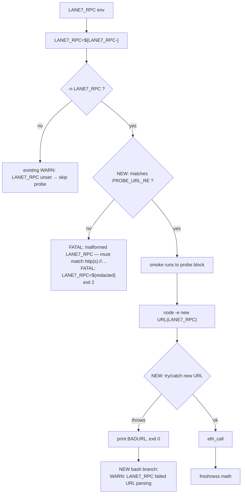

## Problem statement

`scripts/testnet/internal-smoke.sh` preflight at lines 87–104
validates the four lane-local probe URLs against
`^https?://[^:/]+(:[0-9]+)?(/.*)?$` and fails fast with FATAL
on malformed input. `LANE7_RPC` is **not** in that loop and has
no equivalent validation anywhere in the script.

Inside the on-chain freshness block, the URL is passed directly
to node's `new URL(...)`:

```js
const url = new URL(process.argv[1]);
const req = http.request({
  method: "POST", hostname: url.hostname, port: url.port,
  path: url.pathname + url.search,
  ...
});
```

If `LANE7_RPC` is malformed (e.g. `LANE7_RPC=foo`,
`LANE7_RPC=http://` with no host, `LANE7_RPC=tcp://...` (wrong
scheme), `LANE7_RPC="http://localhost:8545 "` with a trailing
space copied from a chat client), the `new URL` call throws
`TypeError: Invalid URL` synchronously. The throw is uncaught,
the node child exits non-zero, and stderr is redirected to
`/dev/null` by the script:

```bash
last_updated="$(node -e '...' "$LANE7_RPC" "$stock_oracle" 2>/dev/null)"
```

stdout is empty → bash's `last_updated="${last_updated:-0}"`
defaults to `"0"` → the script reports the existing
`⚠️ StockOracleV2.lastUpdated() returned 0 — fresh oracle absent
(testnet candidate phase)` warning.

The operator gets exactly the same message they'd see if the
signer hadn't written yet, with no hint that the RPC URL is
malformed. Confirmed by direct reproduction (note node crashes on
the `URL` line, not at request time):

```
$ node -e 'const url=new URL(process.argv[1]); console.log(url.hostname)' "http://"
node:internal/url:818
      href = bindingUrl.parse(input, base, true);
                        ^
TypeError: Invalid URL { code: 'ERR_INVALID_URL', input: 'http://' }
$ echo "exit=$?"
exit=1
$ node -e '...' "http://" 2>/dev/null    # what the smoke does
$ echo "stdout was empty: bash defaults last_updated to 0"
```

The asymmetry with the existing probe-URL preflight is the bug.
The lane-7 spec calls out the on-chain freshness probe as part of
the smoke's contract (see `.autobuilder/initiatives/0007g-testnet-setup/tasks/0005-internal-testnet-runbook-and-smoke.md`
acceptance criterion 2, line 31–34). Letting a malformed URL
disguise itself as a no-data WARN undermines that contract.

## User story

As a lane-7 testnet operator running `internal-smoke.sh` with
`LANE7_RPC=http://localhost:8545 ` (note the trailing space, or
similar typo), I want the smoke to fail fast at preflight with a
single FATAL line naming the offending variable, so I can fix the
typo without rerunning the smoke and chasing a "fresh oracle
absent" message that has nothing to do with the actual problem.

## How it was found

Code reading of `scripts/testnet/internal-smoke.sh`:
- Lines 87–104: probe-URL preflight skips LANE7_RPC.
- Lines 243–252: belt-and-suspenders production-URL fence
  includes LANE7_RPC but only checks for `goodswap.goodclaw.org`
  / `rpc.goodclaw.org` substrings.
- Line 374: `node -e '...' "$LANE7_RPC" 2>/dev/null` swallows
  the parse error.
- Lines 396–401: the node side has `req.on("error", ...)` and
  `req.setTimeout(...)` (added by task 0010), but neither covers
  a synchronous throw from `new URL`.

Confirmed by the reproduction above — `new URL("http://")`
throws synchronously, never reaches `req.setTimeout` or the
error handler.

## Proposed fix

Add `LANE7_RPC` to the existing URL-preflight loop, treating
unset / empty as "skip the probe" (matches today's behavior).
Match the same regex used for the probe URLs so the operator
gets a single mental model:

```bash
# After the existing probe-URL preflight loop (~line 104):
if [[ -n "$LANE7_RPC" ]] && [[ ! "$LANE7_RPC" =~ $PROBE_URL_RE ]]; then
  echo "FATAL: malformed LANE7_RPC — must match http(s)://host[:port][/path]" >&2
  echo "FATAL: LANE7_RPC=$LANE7_RPC" >&2
  exit 2
fi
```

Where `PROBE_URL_RE` is the same `^https?://[^:/]+(:[0-9]+)?(/.*)?$`
already defined for the probe URLs (move its definition out of the
`unset` at line 104 so this block can reuse it; or duplicate the
literal — operator gets the same error shape either way).

Secondary hardening on the node side: wrap the `new URL(...)`
call in a try/catch that prints a sentinel the bash side can
interpret, in case a future operator-supplied URL slips past the
regex (e.g. weird IPv6 literal that matches the regex but throws
inside `new URL`). One-line change to the node snippet:

```js
let url;
try { url = new URL(process.argv[1]); }
catch (_) { console.log("BADURL"); process.exit(0); }
```

…and a bash-side branch alongside the `TIMEOUT` case introduced
by task 0010:

```bash
if [[ "$last_updated" == "BADURL" ]]; then
  add_summary "⚠️  LANE7_RPC=$LANE7_RPC failed URL parsing in node — on-chain freshness skipped"
  WARNINGS+=("LANE7_RPC failed URL parsing (LANE7_RPC=$LANE7_RPC)")
elif [[ "$last_updated" == "TIMEOUT" ]]; then
  ...
```

(The preflight regex is the primary fix; the BADURL sentinel is
a safety net for whatever the regex doesn't catch.)

## Acceptance criteria

1. Running the smoke with `LANE7_RPC=foo` fails fast with:
   ```
   FATAL: malformed LANE7_RPC — must match http(s)://host[:port][/path]
   FATAL: LANE7_RPC=foo
   ```
   exit code 2, no Markdown report, no node child spawned.
2. Running with `LANE7_RPC=http://` (no host), `LANE7_RPC=tcp://localhost:8545`
   (wrong scheme), `LANE7_RPC="http://localhost:8545 "` (trailing
   space), and `LANE7_RPC="http://localhost:8545\r"` (trailing CR)
   all hit the same preflight FATAL path with the offending value
   echoed back.
3. Running with `LANE7_RPC` unset emits the existing
   `⚠️ on-chain freshness check skipped — LANE7_RPC unset` warning
   and exit code 0 (no regression).
4. Running with a valid `LANE7_RPC=http://localhost:8545` against
   the fake-status harness's `/rpc` endpoint returns a fresh
   value as today (no regression).
5. Running with a regex-passing-but-`new URL`-rejecting value
   (if such a value exists for the operator's locale — IPv6
   literals are out of scope; this is a safety net for unknown
   future inputs) emits the `WARN: LANE7_RPC failed URL parsing`
   line and exit code 0, NOT a misleading "fresh oracle absent"
   warning.
6. The redacted line in the FATAL preflight does NOT echo the
   query string if `LANE7_RPC` carries a key in `?key=...` (rare
   but some hosted RPCs use this pattern). Trim everything after
   `?` before echoing — the variable name alone is enough.
7. Proof captured in
   `.autobuilder/initiatives/0007g-testnet-setup/iter07-smoke-rpc-url-validation.md`
   with the six inputs above and the resulting verdicts.
8. Single commit on the lane-7 branch:
   `0007g/0015: preflight LANE7_RPC URL shape; add BADURL node sentinel`.

## Verification

- Add a proof driver
  `.autobuilder/initiatives/0007g-testnet-setup/proof/run-rpc-url-validation.sh`
  that exercises the six input cases above against the existing
  fake-status harness.
- Diff the green-path report against the existing iter05 green
  report — must be byte-identical.
- Run with `time` on the preflight-FATAL case to confirm exit in
  <100ms (no node spawn, no curl probes).

## Out of scope

- Validating that the RPC actually answers JSON-RPC (the existing
  `eth_call` probe + task 0010's timeout handles that).
- Supporting IPv6 literals in URLs (the existing PROBE_URL_RE
  rejects them; expanding the regex is a separate task with its
  own operator-impact discussion).
- Validating `STOCK_ORACLE_V2_ADDRESS` shape — that's task 0014.
- Redacting query-string secrets from probe URLs in general; the
  fix here is scoped to LANE7_RPC because it's the only URL whose
  value commonly carries API keys.
- Adding a `--dry-run-url-only` flag to the smoke. The fail-fast
  preflight is the right shape; a separate flag adds maintenance
  burden for negligible operator benefit.

---

## Planning (2026-05-23)

### Overview

`scripts/testnet/internal-smoke.sh` validates the four lane-local
probe URLs against `PROBE_URL_RE='^https?://[^:/]+(:[0-9]+)?(/.*)?$'`
in the preflight loop at lines 87–104, then explicitly unsets the
regex at line 104. `LANE7_RPC` participates in the same downstream
URL surface (it's passed to node's `new URL(...)` inside the
freshness probe) but is **not** in that loop. A malformed
`LANE7_RPC` throws synchronously in `new URL`; the node child exits
with stderr redirected to `/dev/null`, stdout empty defaults to
`"0"`, and the operator sees the misleading
`fresh oracle absent (testnet candidate phase)` WARN. Fix is to
keep `PROBE_URL_RE` in scope long enough to validate `LANE7_RPC`
(empty value still means "skip the probe"), with a node-side
try/catch `BADURL` sentinel as a safety net for inputs that pass
the regex but throw in `new URL`.

### Research notes

- Today's `PROBE_URL_RE` is `unset` at line 104. Two minimal
  options: (a) move the LANE7_RPC validation **before** the unset,
  or (b) lift the regex into a `readonly` definition that survives
  to the new validation site. Option (a) is the smaller change and
  keeps the regex scope tight — pick it.
- Sequencing constraint: `LANE7_RPC` is assigned at line 111
  (`LANE7_RPC="${LANE7_RPC-}"`), after the probe-URL preflight
  loop. So the new check must live **after** line 111, which means
  it can't piggyback on the current `for pair in ...` loop.
  Cleanest fix: hoist `PROBE_URL_RE` definition above the LANE7_RPC
  resolution and add a second short validation block after line 111.
  Drop the `unset PROBE_URL_RE malformed pair url` line so the
  regex stays available.
- Empty value semantics: `LANE7_RPC=""` (unset or explicit empty)
  must continue to hit the existing `[[ -z "$LANE7_RPC" ]]`
  skip-with-WARN branch at line 337. The preflight test is gated
  by `[[ -n "$LANE7_RPC" ]] && [[ ! "$LANE7_RPC" =~ $PROBE_URL_RE ]]`.
- Redaction: criterion 6 requires stripping `?key=...` query
  strings from the echoed FATAL value. Bash parameter expansion:
  `redacted_rpc="${LANE7_RPC%%\?*}"`. Cheap, no subprocess.
- Node-side belt-and-suspenders: a regex-passing-but-`new URL`-
  rejecting input is rare (the regex's `[^:/]+` host class is
  fairly permissive). Still, wrap the `new URL` call in a
  try/catch that emits the literal sentinel `BADURL` and
  `process.exit(0)`. Bash side adds one new branch alongside the
  existing `TIMEOUT` handling at lines 406–408.
- Wallclock: `time bash internal-smoke.sh` with a malformed
  `LANE7_RPC` must exit in ≤100ms — the preflight is a regex test,
  no curl probes attempted. Criterion 8 evidence.
- Validation that the redaction works for the trailing-CR case:
  `LANE7_RPC="http://localhost:8545"$'\r'` does **not** match the
  regex (the `\r` is a non-matching trailing byte), so it hits
  the FATAL path correctly. No CR-strip needed here — fail-fast
  on operator-supplied transport URL.

### Architecture diagram



### One-week decision

**YES** — fits in well under an hour.

Rationale:
- Two-file edit: bash side (rearrange the regex unset, add 5-line
  validation block, add 3-line BADURL bash branch) and node-side
  (2-line try/catch around `new URL`).
- Proof driver exercises six inputs against the existing fake-
  status harness. No fixture extension required.
- No coupling to 0011/0012/0013/0014.

### Implementation plan (TDD-style)

1. **Red — write proof driver for the six cases.**
   - `.autobuilder/initiatives/0007g-testnet-setup/proof/run-rpc-url-validation.sh`:
     - Case A: `LANE7_RPC=foo` → expect exit 2, stderr contains
       both `FATAL:` lines, no report written, wallclock ≤ 100ms.
     - Case B: `LANE7_RPC=http://` → same FATAL.
     - Case C: `LANE7_RPC=tcp://localhost:8545` → same FATAL.
     - Case D: `LANE7_RPC="http://localhost:8545 "` (trailing
       space) → same FATAL.
     - Case E: `LANE7_RPC="http://localhost:8545"$'\r'` → same FATAL.
     - Case F: `LANE7_RPC=http://localhost:49207` (valid, pointing
       at fake-status's `/rpc` handler) → green freshness row, exit 0.
     - Case G (regression): `unset LANE7_RPC` → existing
       `LANE7_RPC unset` WARN, exit 0.
     - Case H (redaction): `LANE7_RPC=http://localhost:8545?key=secret`
       passes regex (no — `:` and `/` are blocked by the host class
       only; `?` lives in the trailing path) — verify; if it passes
       the regex, the redaction surface only fires in the FATAL
       branch, but include this case as a sanity check that
       `?secret` doesn't leak via the `LANE7_RPC` echo at line 494
       in the report. Out of scope for FATAL but documented.
   - Run today; confirm Cases A–E all produce the misleading
     "fresh oracle absent" message (today's bug).
2. **Green — bash preflight + node try/catch + bash sentinel branch.**
   - Edit `scripts/testnet/internal-smoke.sh` in three places:
     - **Edit 1** (lines 87–104): remove the `unset PROBE_URL_RE`
       line at line 104. Move the `LANE7_RPC` resolution
       (currently line 111) and the new check to live after the
       loop but before the regex unset is moved further down:
       ```bash
       # ... existing probe-URL preflight loop ...
       (( malformed == 0 )) || exit 2
       unset malformed pair url
       # PROBE_URL_RE stays in scope for the LANE7_RPC check below.

       REPO_ROOT="$(cd "$(dirname "$0")/../.." && pwd)"
       LANE7_ENV_FILE="${LANE7_ENV_FILE:-$REPO_ROOT/.env}"
       REPORT="${REPORT:-$REPO_ROOT/docs/testnet/iter05-internal-smoke.md}"
       HEALTH_CONTRACT="${HEALTH_CONTRACT-$REPO_ROOT/docs/testnet/HEALTH-CONTRACT.md}"
       STALENESS_THRESHOLD_S="${STALENESS_THRESHOLD_S-600}"
       LANE7_RPC="${LANE7_RPC-}"

       if [[ -n "$LANE7_RPC" ]] && [[ ! "$LANE7_RPC" =~ $PROBE_URL_RE ]]; then
         redacted_rpc="${LANE7_RPC%%\?*}"
         echo "FATAL: malformed LANE7_RPC — must match http(s)://host[:port][/path]" >&2
         echo "FATAL: LANE7_RPC=$redacted_rpc" >&2
         exit 2
       fi
       unset PROBE_URL_RE
       ```
     - **Edit 2** (node snippet at lines 374–403): wrap the
       `new URL` call:
       ```js
       let url;
       try { url = new URL(process.argv[1]); }
       catch (_) { console.log("BADURL"); process.exit(0); }
       ```
       (Replace the existing `const url = new URL(process.argv[1]);`
       line.)
     - **Edit 3** (after the `TIMEOUT` branch at line 406, before
       the `"0"` branch): add the BADURL handler:
       ```bash
       if [[ "$last_updated" == "BADURL" ]]; then
         add_summary "⚠️  LANE7_RPC=$LANE7_RPC failed URL parsing in node — on-chain freshness skipped"
         WARNINGS+=("LANE7_RPC failed URL parsing (LANE7_RPC=$LANE7_RPC)")
       elif [[ "$last_updated" == "TIMEOUT" ]]; then
         ...existing...
       ```
   - Rerun proof; confirm A–E hit FATAL, F/G are byte-identical to
     iter06, H redacts the `?key` in the FATAL echo.
3. **Coordinate with task 0013's `HEALTH_CONTRACT` parameter form.**
   - Edit 1 above already swaps `HEALTH_CONTRACT:-` to
     `HEALTH_CONTRACT-`. If 0013 lands first, this task picks up the
     change as-is; if 0015 lands first, 0013 inherits it. Either
     way, the parameter expansion form converges on `-` (without
     colon) for inputs whose explicit-empty case must be respected.
4. **No-regression check.**
   - Re-run `proof/run-rpc-timeout.sh`, `proof/run-input-validation.sh`,
     `proof/run-malformed-url.sh`. Diff iter06 outputs — byte-
     identical modulo timestamps.
5. **Capture proof.**
   - Save Cases A–H outputs + wallclock for Case A to
     `.autobuilder/initiatives/0007g-testnet-setup/iter07-smoke-rpc-url-validation.md`.
6. **Commit.**
   - Single commit: `0007g/0015: preflight LANE7_RPC URL shape; add BADURL node sentinel`.

### Dependencies + sequencing

- **Soft coupling with 0013**: both want `HEALTH_CONTRACT-` (no
  colon). Whichever lands first sets the precedent; the other
  rebases cleanly because the change is a single character.
- Independent of 0011/0012/0014 (different code regions).
- Execute after 0013 to keep parameter-form changes co-located in
  history; or independently — the diff is small enough that order
  doesn't matter.

### Risks

- **Regex-bypassing `new URL` rejections**: the node-side
  `BADURL` sentinel is a safety net for inputs that match the
  regex but throw in `new URL` (e.g. weird locale-specific
  characters in the host class). Adds a single branch on the
  bash side; no measurable performance cost.
- **Process-exit race**: same shape as task 0010's TIMEOUT
  sentinel — `console.log("BADURL"); process.exit(0)` on the
  same line ensures the child terminates before any further
  stdout can leak.
- **PROBE_URL_RE scope shuffling**: moving the `unset` past the
  LANE7_RPC check changes the scope; if a future task introduces
  yet another URL validation between line 104 and the unset, the
  precedent is now "keep the regex in scope until all URL inputs
  are validated." Document with a one-line comment above the
  unset.
- **Redaction of query strings in the report body**: the FATAL
  branch strips `?...`. The `report writer` at line 494 still
  echoes the **full** `LANE7_RPC` value into the report header.
  Out of scope here (task pins this — only the FATAL preflight
  redacts). A follow-up "redact secrets from report header" task
  can address the report-side leak; the present fix prevents the
  most likely incident-time leak (the operator's terminal during
  FATAL exit).

