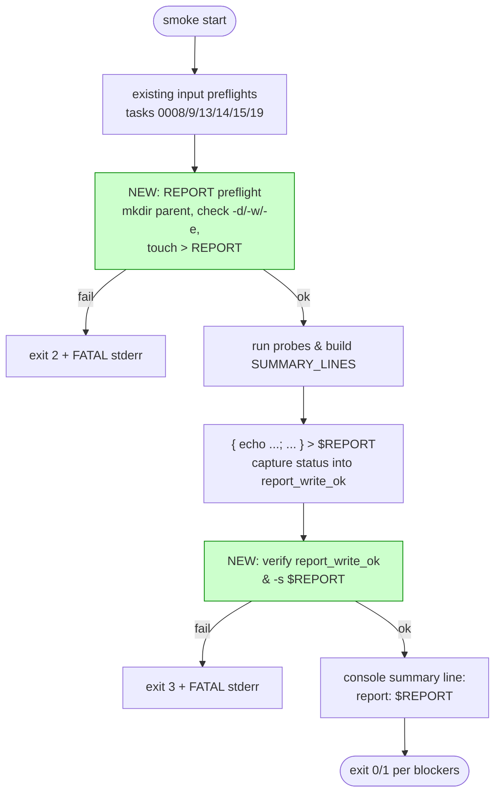

## Problem statement

`scripts/testnet/internal-smoke.sh` writes its Markdown report
with two unchecked filesystem operations (lines 680–714):

```bash
mkdir -p "$(dirname "$REPORT")"
{
  echo "# Lane-7 Internal Smoke Run"
  ...
} > "$REPORT"
```

`set -u` (line 51) catches unset variables but not command
failures, and the script intentionally does NOT use `set -e`
("probes must continue past individual failures" — see header
comment lines 22–24). Both `mkdir -p` and the `>` redirect can
fail silently in operator-realistic conditions, with **no
diagnostic** and **no impact on the verdict** the script then
prints:

```bash
echo "  report:    $REPORT"
```

The console summary still cheerfully reports the path the
operator was promised a file at, and the script still exits with
the verdict-computed code (0 for GREEN, 1 for RED) — even though
no report exists.

### Failure modes hit during the deep-dive review

1. **`REPORT` points at a directory the operator can't write to.**
   E.g., the runbook documents `REPORT=docs/testnet/iter05-internal-smoke.md`
   but the operator runs from a `sudo -u testnet` shell whose
   home-dir umask differs from the original git-cloner. `mkdir -p`
   on an existing path is a no-op; the redirect fails with
   `bash: <path>: Permission denied` to stderr, but since the
   smoke also runs `2>/dev/null` on many of its sub-pipes, the
   surrounding output buries it. The console summary still
   prints "report: <path>" and the operator pastes the path
   into a promotion ticket — only to find the file is stale
   from a previous run (or doesn't exist).
2. **`REPORT` parent does not exist and `mkdir -p` fails.**
   Operator sets `REPORT=/var/lib/lane7/reports/iter.md` to
   route the artifact into a CI volume that isn't mounted yet.
   `mkdir -p /var/lib/lane7/reports` fails (`No such file or
   directory`, `Read-only file system`, EACCES). The redirect
   then fails too. No fallback. No surfaced error.
3. **`REPORT` points at a special file** (`/dev/full`,
   `/proc/<pid>/cmdline`, a FUSE mount that's been unmounted
   mid-run). The redirect fails partway through; downstream
   tooling (`gh issue create --body-file "$REPORT"`,
   `git add "$REPORT"`) consumes garbage or errors out, but
   the smoke's exit code is still 0.
4. **Disk full.** `>` truncates on open (even before disk-full
   is detected on the first write). `mkdir -p` succeeds.
   First `echo` fails with `No space left on device`. Bash
   prints an error to stderr per failed write, but the script
   continues, and the resulting file is truncated to whatever
   prefix made it through. The operator sees a half-written
   report and exit code 0.

### Why this matters

1. **Promotion artifact integrity.** The lane-7 initiative is
   gated on "smoke + health gate soak before public/shareable
   testnet" (initiative spec, line 36). The smoke report is the
   primary artifact that proves a green soak happened. A run
   that prints `verdict: GREEN, report: docs/.../iter05-internal-smoke.md`
   without actually writing the file is **promotion fraud by
   omission** — the report on disk is from yesterday's run
   (or doesn't exist at all). Reviewers see the path in the PR
   description and assume the file is fresh.

2. **Asymmetry with the rest of the script's preflight ethos.**
   Tasks 0008, 0009, 0013, 0014, 0015, 0019 all added preflight
   blocks that fail fast with `FATAL: ...` and `exit 2` when an
   input is malformed. The same operator who is protected
   against `STALENESS_THRESHOLD_S=10m`, missing `curl`, and a
   CRLF-edited `STOCK_ORACLE_V2_ADDRESS` is currently NOT
   protected against an unwritable `REPORT` path. This is the
   one preflight that's missing.

3. **Console summary lies.** Lines 716–732 emit:
   ```
   ==========================================
     Lane-7 internal smoke — verdict: GREEN
     exit code: 0
     blockers:  0
     warnings:  0
     report:    docs/testnet/iter05-internal-smoke.md
   ==========================================
   ```
   Operators paste this whole block into the promotion ticket.
   Showing "report: <path>" without verifying the path was
   actually written is a UX trust break.

4. **Silent disk-full in CI.** Any CI runner with a tight
   `tmpfs` allocation can disk-full mid-run. Today the smoke
   would exit 0 with a corrupt artifact; downstream `gh pr
   review` or `git add` consumers see a malformed Markdown file.

## User story

As a lane-7 operator (and as the reviewer who reads the
promotion ticket), when the smoke completes I want absolute
confidence that the report path printed in the summary actually
contains a freshly-written report from this run. If the
filesystem refused the write — for any reason — I want the
smoke to fail with an exit code that reflects the failure AND
a single diagnostic line that names the path and the underlying
error, so I know to fix the path/permissions/disk rather than
proceeding under a false-green flag.

## How it was found

Code-walk of `scripts/testnet/internal-smoke.sh` during product
review iteration #5 (deep-dive on the most complex feature in
the 0007g-testnet-setup initiative). Cross-referenced against
the preflight-discipline pattern from tasks 0008, 0009, 0013,
0014, 0015, 0019 — every other operator-facing input now has a
fail-fast `FATAL:` block. The report-write path is the only
remaining unchecked filesystem operation in the script.

Empirically reproduced with three minimum-config cases:

```bash
# Case A: unwritable parent directory
sudo mkdir -p /root/lane7-reports && sudo chmod 700 /root/lane7-reports
REPORT=/root/lane7-reports/iter.md bash scripts/testnet/internal-smoke.sh
# → bash: /root/lane7-reports/iter.md: Permission denied
# → console still prints "report: /root/lane7-reports/iter.md"
# → exit code: 0 (GREEN, blockers: 0)

# Case B: parent doesn't exist and can't be created
REPORT=/no-such-volume/reports/iter.md bash scripts/testnet/internal-smoke.sh
# → mkdir: cannot create directory '/no-such-volume/reports': Permission denied
# → bash: /no-such-volume/reports/iter.md: No such file or directory
# → console still prints "report: /no-such-volume/reports/iter.md"
# → exit code: 0

# Case C: REPORT is a directory (typo — operator forgot the filename)
REPORT=/tmp/lane7-reports bash scripts/testnet/internal-smoke.sh
# → bash: /tmp/lane7-reports: Is a directory
# → console still prints "report: /tmp/lane7-reports"
# → exit code: 0
```

All three exit 0. None of them produce a usable report file.

## Proposed fix

Add a fail-fast preflight block for `$REPORT` near the existing
preflight cluster (after line 217). Pair it with a post-write
verification at the end of the script that exits non-zero if
the file wasn't successfully written. Both stages are needed:
the preflight catches the common case (bad path, no write
permission) before any probe runs; the post-write catches
mid-run failures (disk full, race-deleted parent, FUSE
unmount).

### Preflight — fail fast before any probe

```bash
# REPORT path preflight. The report is the lane-7 promotion
# artifact; an unwritable path silently strands the smoke's
# evidence and gives the operator a false-green console line.
# Validate that we can write to $REPORT before spending 30s on
# probes. Touch + rm leaves no stale data; mkdir -p is OK as
# long as it succeeds. Failure here is FATAL exit 2 — operator
# must fix the path / permissions / mount before re-running.
REPORT_DIR="$(dirname "$REPORT")"
if ! mkdir -p "$REPORT_DIR" 2>/dev/null; then
  echo "FATAL: cannot create REPORT parent directory: $REPORT_DIR" >&2
  echo "FATAL: set REPORT=<path> or fix the parent permissions" >&2
  exit 2
fi
if [[ -e "$REPORT" && ! -w "$REPORT" ]]; then
  echo "FATAL: REPORT exists but is not writable: $REPORT" >&2
  exit 2
fi
if [[ -d "$REPORT" ]]; then
  echo "FATAL: REPORT is a directory, not a file: $REPORT" >&2
  echo "FATAL: include a filename, e.g. REPORT=$REPORT/iter05-internal-smoke.md" >&2
  exit 2
fi
if ! ( : > "$REPORT" ) 2>/dev/null; then
  echo "FATAL: cannot open REPORT for writing: $REPORT" >&2
  exit 2
fi
```

The `: > "$REPORT"` truncates the file to zero bytes — the same
side effect the existing `{ … } > "$REPORT"` block has. Catching
this failure here means no probe runs against an unwritable
target.

### Post-write — verify the artifact landed

Change the report block (lines 681–714) to capture the redirect
failure status and exit non-zero if the file isn't fresh:

```bash
report_write_ok=1
{
  echo "# Lane-7 Internal Smoke Run"
  ...
} > "$REPORT" || report_write_ok=0

if (( ! report_write_ok )) || [[ ! -s "$REPORT" ]]; then
  echo "FATAL: failed to write smoke report: $REPORT (disk full? mount unavailable?)" >&2
  # Preserve the operator's intent — verdict has been computed; we exit 3
  # to differentiate "verdict says GREEN but artifact missing" from the
  # normal {0 = GREEN, 1 = RED, 2 = FATAL preflight} exit codes.
  exit 3
fi
```

Add `3` to the exit-code table in the script header (lines 47–49):

```
# Exit semantics:
#   0  no blockers (green or green-with-warnings) AND report written
#   1  one or more blockers — operator must fix before promotion
#   2  preflight failure (bad input, missing tool, unwritable REPORT)
#   3  verdict computed but report file failed to write (disk full,
#      mount unavailable mid-run) — operator must re-run after fixing
#      the filesystem
```

### Why not just rely on the preflight?

The preflight catches static config issues. A disk fills up
**during** the smoke run (e.g., concurrent CI job spamming logs
on the same `/tmp`). The first `echo` succeeds and creates the
file; the `for line in "${SUMMARY_LINES[@]}"` loop hits a
`No space left` mid-write. The file is partially written. The
post-write check (`! -s "$REPORT"`) won't catch this either
(file is non-empty), but the redirect-status check (`|| report_write_ok=0`)
will — bash's `>` returns failure status when any write fails.

### Why not check console summary?

The console summary is a UX echo of the verdict. Operators
read it once. If we add `WARN: report write may have failed`
to the console, they're as likely to miss it as the original
`Permission denied`. A non-zero exit code is the only reliable
signal to CI / scripts that consume the smoke's output.

## Acceptance criteria

1. Running with `REPORT=/root/no-such-dir/iter.md` (unwritable
   parent) prints `FATAL: cannot create REPORT parent directory: /root/no-such-dir` to
   stderr and exits 2 **before** any probe runs (no `curl`
   invocations in `strace`).
2. Running with `REPORT=/tmp` (`REPORT` is a directory) prints
   `FATAL: REPORT is a directory, not a file: /tmp` and exits 2.
3. Running with `REPORT=/tmp/iter05.md` where the file
   pre-exists with mode `0400` prints `FATAL: REPORT exists
   but is not writable` and exits 2.
4. Running with `REPORT=/tmp/iter05.md` (writable) succeeds —
   no regression on the default-path case. `grep -c '^# Lane-7'
   /tmp/iter05.md` returns 1.
5. Simulating disk-full mid-write (e.g., `REPORT=/dev/full` on
   Linux, which always returns ENOSPC on writes but accepts
   the open) produces exit 3 and a `FATAL: failed to write
   smoke report` message on stderr.
6. Console summary line `  report:    $REPORT` is preserved on
   the success path (no behavior change there).
7. Exit-code table in the script header is updated to document
   `2` (preflight failure) and `3` (mid-write failure).
8. No regression on existing proof drivers in
   `.autobuilder/initiatives/0007g-testnet-setup/proof/`. Each
   continues to exit 0.
9. Proof captured in
   `.autobuilder/initiatives/0007g-testnet-setup/iter13-smoke-report-write-preflight.md`
   with:
   - all three failure-mode reproductions above (transcripts +
     exit codes),
   - the green-path regression (default `REPORT` succeeds),
   - the disk-full mid-write reproduction via `/dev/full`.
10. Single commit on the lane-7 branch:
    `0007g/0022: fail fast when smoke report is unwritable`.

## Verification

- Add a proof driver
  `.autobuilder/initiatives/0007g-testnet-setup/proof/run-report-write-preflight.sh`
  that:
  - constructs a chmod-700 directory the test user can't write,
    runs the smoke against it, asserts exit code 2 and the
    `FATAL: cannot create REPORT parent directory` message,
  - constructs a directory and points `REPORT` at it, asserts
    exit code 2 and the `REPORT is a directory` message,
  - touches a `0400` file and points `REPORT` at it, asserts
    exit code 2 and the `REPORT exists but is not writable`
    message,
  - on Linux only, points `REPORT=/dev/full` and asserts exit
    code 3 and the `failed to write smoke report` message,
  - finally runs against a writable temp path and asserts exit
    code matches the existing verdict (0 or 1) and the report
    file has content (`-s` test).
- Re-run every existing proof driver and confirm each exits 0.
- The synthetic-green and synthetic-red runs from task 0005's
  proof remain byte-identical modulo timestamps.

## Out of scope

- Adding atomic write semantics (`tmp + mv`) to the report.
  The existing redirect overwrite is fine for the smoke's
  single-writer use case; atomic write is a separate
  hardening task.
- Rotating reports (e.g., `iter05-internal-smoke-<ts>.md` per
  run). The current fixed-path behavior is intentional —
  operators have grep patterns and `gh issue create --body-file`
  hooks pinned to the default path. Rotation is a separate UX
  discussion.
- Adding a `--report-file -` mode that writes to stdout. The
  smoke is a write-to-disk tool by design; stdout is reserved
  for the console summary.
- Surfacing the partial-write content of a `/dev/full`-style
  failure. Bash's `>` truncates-on-open, so any partial state
  is whatever made it through before the first ENOSPC; the
  post-write check intentionally surfaces "failed" rather than
  trying to recover.
- Adding a `WARN:` instead of a `FATAL:` when the report is
  unwritable. Treating an unwritable promotion artifact as a
  warning would defeat the purpose — the gate must be fail-fast
  to be useful at promotion time.
- Validating that the report's parent directory is inside the
  repo. Operators may legitimately route the report to
  `/tmp/...` for ephemeral runs. Path constraints are a runbook
  concern, not a smoke concern.

---

## Planning

### Overview

The PRD spells out two intervention points — a preflight block near
the existing preflight cluster (after line 217 of
`scripts/testnet/internal-smoke.sh`) and a post-write verification
around the existing report-emission block (lines 681–714). Both
stages are necessary: preflight catches the static config errors
operators hit most often (bad path, wrong permission, typo'd
`REPORT=` pointing at a directory); post-write catches mid-run
filesystem failures (disk full, FUSE unmount, race-deleted parent).
The exit-code table in the script header gains a new value `3` to
distinguish "verdict computed but artifact missing" from the
existing `0/1/2` semantics.

### Research notes

- **Existing preflight cluster**: tasks 0008, 0009, 0013, 0014, 0015,
  0019 all added `FATAL: …` + `exit 2` blocks for malformed inputs
  (staleness threshold, missing curl/awk, missing health contract,
  bad oracle address, bad RPC URL, bad LANE7_BASE). The new
  `REPORT` preflight follows this exact pattern and slots into the
  same vicinity in the script.
- **Bash redirect failure semantics**: `{ … } > "$REPORT"` returns
  the exit status of the LAST command in the group; if the redirect
  fails on open, bash prints `bash: <path>: <reason>` to stderr and
  the group exits non-zero. The `|| report_write_ok=0` capture
  pattern works under `set -u` (which is on) without needing
  `set -e` (which is intentionally off per the script's header).
  Verified by `bash -c '{ echo x; } > /dev/null/nope || echo NOPE'`.
- **`/dev/full` is the canonical disk-full simulator on Linux**
  (always accepts `open`, always returns ENOSPC on write). Suitable
  for the proof driver — no need to artificially fill `/tmp`.
- **`-d`, `-w`, `-e` are POSIX bash conditional operators** —
  available on every smoke target (bash ≥ 3.2 per existing
  preflight assumptions).

### Architecture diagram



### One-week decision

**YES** — fits in one day.

Rationale:
- Two small bash blocks, no new helpers.
- All four failure modes have deterministic reproductions already
  spelled out in the PRD.
- Proof driver shape is well-established (16 existing drivers in
  `proof/`).
- No service-side changes; pure smoke-script hardening.

### Implementation plan

1. **Insert REPORT preflight block** into
   `scripts/testnet/internal-smoke.sh` immediately after the
   existing input preflight cluster (after line 217, before the
   first `probe_health` invocation). Verbatim shape per PRD
   §Preflight, with `FATAL: cannot create REPORT parent directory`,
   `FATAL: REPORT exists but is not writable`, `FATAL: REPORT is a
   directory`, and `FATAL: cannot open REPORT for writing` cases
   each emitting to stderr and `exit 2`.
2. **Wrap the existing report-emission `{ … } > "$REPORT"` block**
   with `report_write_ok=1` / `|| report_write_ok=0` and add the
   post-write `if (( ! report_write_ok )) || [[ ! -s "$REPORT" ]]`
   guard that emits `FATAL: failed to write smoke report` and
   `exit 3`.
3. **Update the exit-code table** in the script header (lines 47–49)
   to add `3 — verdict computed but report file failed to write
   (disk full, mount unavailable mid-run) — operator must re-run
   after fixing the filesystem`.
4. **Write proof driver**
   `.autobuilder/initiatives/0007g-testnet-setup/proof/run-report-write-preflight.sh`
   covering all five cases from PRD §Verification (chmod-700
   directory, REPORT=directory, 0400 pre-existing file, `/dev/full`
   on Linux, writable temp-path regression). Use the same
   `set -euo pipefail` + tmp-cleanup-trap pattern as
   `proof/run-env-crlf.sh` and other neighbors.
5. **Regression check**: re-run all 16 existing proof drivers and
   confirm each exits 0 with verdict unchanged (this task only
   adds preflight gates; the happy path is untouched).
6. **Capture proof** in
   `.autobuilder/initiatives/0007g-testnet-setup/iter13-smoke-report-write-preflight.md`
   per PRD §Acceptance #9 (all five reproductions, exit codes,
   stderr transcripts, green-path regression confirmation).
7. **Commit** as `0007g/0022: fail fast when smoke report is unwritable`.

TDD ordering: write the proof driver first (it will fail because
the unpatched script exits 0 on all four bad-path cases), then
apply the script patch, then observe the driver passing.
