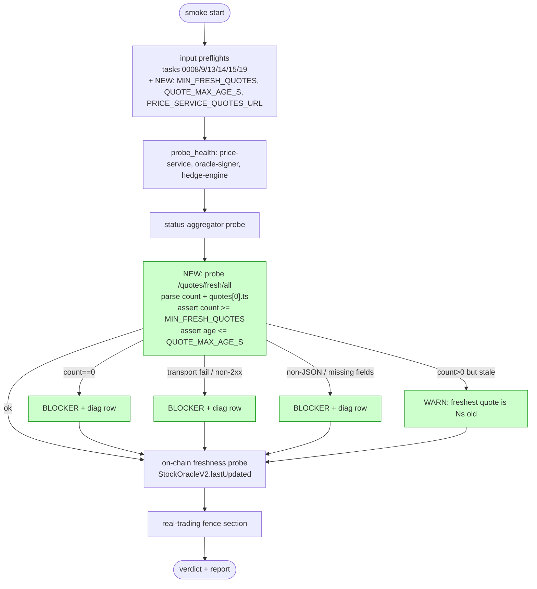

## Problem statement

The lane-7 initiative spec opens with an **URGENT OVERRIDE**
banner from Yoni (initiative spec, lines 1–21, repeated in
PRODUCT.md and constraints.md):

> Are prices flowing on testnet? That should be the goal of all
> cursor clis.
>
> For every Cursor/autobuilder lane, the priority is now
> end-to-end testnet price flow:
> `eToro/demo or safe fixture quote -> price-service ->
> oracle-signer -> on-chain oracle/testnet status ->
> frontend/proof page shows source/timestamp/freshness`
>
> Required evidence before considering the lane useful:
> - **price-service reachable and serving non-empty normalized
>   quotes**,
> - oracle-signer reachable and consuming/publishing or
>   health-only with explicit blocker,
> - on-chain freshness checked or explicitly blocked by missing
>   `LANE7_RPC` / signer key,
> - proof/status UI shows the live source, timestamp, stale
>   state, and tx/freshness status,
> - real trading remains fenced.

The current `scripts/testnet/internal-smoke.sh` validates:

1. `price-service /health` — **only**
2. `oracle-signer /health` — only
3. `hedge-engine /health` — only
4. `status-aggregator /status.json` — service-list presence
5. `StockOracleV2.lastUpdated()` — on-chain freshness
6. real-trading fence env

It does **NOT** probe `/quotes`, `/quotes/:symbol`,
`/quotes/fresh/all`, or `/status/quotes` on the price-service.
Those four endpoints exist
(`backend/price-service/src/server.ts:33,47,62,67`) and are the
ONLY way to verify "non-empty normalized quotes" — the explicit
phrase from the URGENT OVERRIDE.

### What `/health` does NOT prove

Looking at the live `/health` handler
(`backend/price-service/src/server.ts:20-31`):

```ts
app.get('/health', (_req, res) => {
  const fresh = cache.getFresh();
  const total = cache.size;
  const healthy = fresh.length > 0 || total === 0;
  res.status(healthy ? 200 : 503).json({
    status: healthy ? 'ok' : 'degraded',
    freshQuotes: fresh.length,
    totalCached: total,
    configuredSymbols: cfg.symbols.length,
    timestamp: Date.now(),
  });
});
```

The `healthy` boolean returns `true` when `fresh.length > 0`
**OR** `total === 0`. **A price-service with an empty cache —
no quotes EVER, no upstream provider, no eToro/demo feed —
returns `status: 'ok'` and 200.** The smoke's `probe_health`
asserts `status === 'ok'`. Verdict: **GREEN**. But there are
zero quotes flowing. The smoke claims the lane is healthy
when it is in the precise state the spec says the smoke must
guard against.

This is not theoretical. The `total === 0` short-circuit was
added so a freshly-started price-service doesn't fail health
during the first ~10s before its first poll completes — a
deliberate design choice for service-up signaling. But it makes
`/health` a service-aliveness check, not a price-flow check.
A separate probe is needed to validate the spec's mission.

### Failure modes the bug masks

1. **Upstream eToro / demo feed misconfigured.** Operator runs
   the lane-local stack with `ETORO_MODE=demo-readonly` but
   `ETORO_API_KEY` unset (or pointing at a 404'd demo
   endpoint). The price-service starts, fails every upstream
   poll, returns `status: 'ok'` on `/health` (because
   `total === 0`), and the smoke reports GREEN. Operator
   promotes to public testnet. The frontend shows blank
   prices.
2. **All symbols filtered out.** The `cfg.symbols` list is
   configured but every symbol is being rejected by the
   filter (`filterResult.accepted === false`). `cache.getFresh()`
   returns `[]`, but `cache.size > 0`, so `/health` reports
   `degraded` and the smoke catches it. ✓ (This case works.)
3. **Symbols list empty by accident.** `cfg.symbols = []`
   (env override didn't load, or YAML config typo). Cache
   is empty. `total === 0`. `/health` → ok. Smoke → GREEN.
   No quotes. Frontend blank. (Identical to case 1 in
   user-visible effect, distinct root cause.)
4. **price-service binary is stale** (running old code from
   before the eToro adapter was wired up). Health server
   starts, returns `status: 'ok'` based on the (empty)
   cache. Smoke → GREEN. No quotes.
5. **Quotes are flowing but `staleness` filter rejects all
   of them as stale.** `cache.getAll()` is non-empty,
   `cache.getFresh()` is empty. `/health` → degraded. Smoke
   catches it. ✓ (works because `freshQuotes === 0` AND
   `total > 0`.) But the operator gets the SAME signal as
   case 4 — they can't distinguish "stale" from "empty"
   from the smoke's diag row.

### Why this matters

1. **The smoke is the spec's primary gate.** The spec calls
   the smoke out by name as the artifact that gates public
   testnet promotion (spec lines 50–57: "Smoke gate covers:
   price-service health, oracle-signer health/status,
   on-chain oracle freshness, frontend proof/status page, no
   real-trading path enabled"). The bullet "price-service
   health" today refers to the `/health` endpoint, which —
   per the previous section — does NOT cover the URGENT
   OVERRIDE's "non-empty normalized quotes" requirement.
   The spec and the smoke are out of step.

2. **The 0007g lane has executed 19/20 tasks** and is
   approaching a promotion gate. Without a quote-flow probe,
   the entire lane has been hardening the wrong things
   (smoke crash-paths, redaction, markdown escaping) while
   the actual mission deliverable — proof of price flow —
   is unverified.

3. **The endpoint already exists.** `/quotes/fresh/all`
   returns `{ quotes: [...], count, timestamp }`. A probe
   that asserts `count > 0` (with a configurable minimum)
   directly validates "non-empty normalized quotes". No new
   service code; the smoke just needs to call it.

4. **It composes with the existing on-chain probe.** Today's
   on-chain freshness check verifies `StockOracleV2.lastUpdated()`
   advanced. Combined with a `/quotes/fresh/all` probe, the
   smoke can validate the full chain `price-service → cache →
   oracle-signer → on-chain` — which IS the URGENT OVERRIDE's
   end-to-end flow.

## User story

As the lane-7 stakeholder reading the smoke report before
approving public testnet promotion, I want a green verdict to
**prove** non-empty normalized quotes are flowing through the
price-service — not merely prove that the price-service's
process is up and its health server returns 200. If quotes are
not flowing (empty cache, upstream misconfigured, all symbols
filtered, stale binary), the smoke must surface that as a
BLOCKER with enough context to point at the root cause.

## How it was found

Spec-vs-implementation gap analysis during product review
iteration #5 (deep-dive on the most complex feature in the
0007g-testnet-setup initiative — `scripts/testnet/internal-smoke.sh`).

Cross-referenced:
- The URGENT OVERRIDE banner at the top of `spec.md`,
  `constraints.md`, and `PRODUCT.md` (all three carry the
  identical override block, indicating it's the active
  prioritization).
- The smoke's probe list (lines 388–397: `probe_health` calls
  for price-service, oracle-signer, hedge-engine; nothing for
  `/quotes`).
- The price-service's actual `/health` handler
  (`backend/price-service/src/server.ts:20-31`) which short-
  circuits to `healthy: true` when `cache.size === 0`.
- The price-service's existing `/quotes`-family endpoints
  (`server.ts:33-98`) that would directly satisfy the
  "non-empty normalized quotes" evidence.

No `/quotes` reference exists in any of the
`scripts/testnet/*.sh` files (`rg -F '/quotes' scripts/testnet`
returns zero matches except inside `price-service-fixture.js`,
which is the fake-server stub used in proof drivers — not the
smoke itself).

The previous five iterations (#1–#5 review cycles) found
16 issues with the smoke script (tasks 0006–0020), all of
them error-handling / input-validation / markdown-escaping.
None addressed the **what is the smoke supposed to prove**
question. This task does.

## Proposed UX

Add a new probe section to `internal-smoke.sh`, sequenced
**before** the on-chain freshness probe (so the operator sees
the off-chain flow first, then the on-chain consequence):

### Section: Price-service quote flow

Probe `${PRICE_SERVICE_URL%/health}/quotes/fresh/all` (compute
the URL by stripping `/health` from `PRICE_SERVICE_URL`, with
a `PRICE_SERVICE_QUOTES_URL` override for non-default
deployments). Expect:

```json
{
  "quotes": [
    { "symbol": "AAPL", "price": 187.42, "ts": 1748023400000, "source": "etoro-demo", ... },
    ...
  ],
  "count": <N>,
  "timestamp": <ms>
}
```

Assertions:

1. `count` is present and is a non-negative integer.
2. `count >= MIN_FRESH_QUOTES` (env-configurable, default
   `1`). Below that → BLOCKER "no fresh quotes" with the
   current `count` and the configured symbol list size for
   context.
3. `quotes[]` is an array (matches `count`).
4. At least one quote has a `symbol`, a numeric `price`,
   and a `ts` within the last
   `QUOTE_MAX_AGE_S` seconds (default `600` — matches the
   existing `STALENESS_THRESHOLD_S` default). Below that →
   WARN "freshest quote is N seconds old".
5. (Optional) If `quotes[0].source` is present, surface it
   in the report row ("source: etoro-demo") so the
   evidence trail in the spec's URGENT OVERRIDE
   (`eToro/demo or safe fixture quote -> price-service ...`)
   is captured in the artifact.

### Report shape

```
## Price-service quote flow

| metric | value | classification |
|--------|-------|----------------|
| fresh quote count | 7 / min 1 | ✅ OK |
| freshest quote age | 2 s ≤ 600 s | ✅ OK |
| source (first quote) | `etoro-demo` | ✅ OK |
```

On failure:

```
## Price-service quote flow

| metric | value | classification |
|--------|-------|----------------|
| fresh quote count | 0 / min 1 | ❌ BLOCKER |
| ↳ | configured symbols: 24; cached: 24; fresh: 0 | (filter rejecting all or upstream stale) |
```

### Override knobs

- `PRICE_SERVICE_QUOTES_URL` — full override (operator with
  non-default routes).
- `MIN_FRESH_QUOTES` — minimum count for OK (default 1; CI
  can raise to e.g. 5 to require multi-symbol flow).
- `QUOTE_MAX_AGE_S` — max age of the freshest quote for OK
  (default 600).

All three follow the `require_uint` / `PROBE_URL_RE`
preflight pattern from tasks 0008, 0014, 0015.

## Acceptance criteria

1. New section appears in the report under
   `## Price-service quote flow`, between the existing
   `## status-aggregator + contract classification` and
   `## On-chain oracle freshness` sections.
2. When `count >= MIN_FRESH_QUOTES` and the freshest quote is
   within `QUOTE_MAX_AGE_S` seconds, the section renders all
   green and the verdict is unaffected.
3. When `count == 0`, the section emits a BLOCKER ("price-service
   has no fresh quotes") with the diag breakdown (configured
   symbols / cached / fresh) and the overall verdict is RED
   (exit 1).
4. When `count > 0` but the freshest quote age exceeds
   `QUOTE_MAX_AGE_S`, the section emits a WARN ("freshest
   quote is Ns old") and the verdict drops to
   GREEN-with-warnings (exit 0).
5. When the `/quotes/fresh/all` endpoint is unreachable
   (transport failure) or returns non-2xx, the section emits
   a BLOCKER ("price-service /quotes/fresh/all unreachable"
   or "http-NNN") and runs `add_diag_row` so the operator
   sees the body / content-type. Verdict is RED.
6. When the response is not valid JSON or is missing
   `count` / `quotes`, the section emits a BLOCKER
   ("price-service /quotes/fresh/all response did not parse
   as JSON with `count` and `quotes[]`"). Verdict is RED.
7. `PRICE_SERVICE_QUOTES_URL` override works: setting it
   bypasses the URL-derivation step.
8. `MIN_FRESH_QUOTES` and `QUOTE_MAX_AGE_S` route through
   `require_uint` and FATAL-exit on malformed input
   (matching the existing `STALENESS_THRESHOLD_S` discipline
   from task 0008).
9. URL preflight (PROBE_URL_RE from task 0015) covers
   `PRICE_SERVICE_QUOTES_URL` if set explicitly.
10. The new section runs **after** the `/health` probe.
    Order matters: if `/health` says the service is up
    but `/quotes` says it has no data, that's a more
    informative report than the inverse.
11. Synthetic-green proof: a fake price-service returning a
    `count: 3, quotes: [...]` payload produces a GREEN verdict
    with the new section showing 3 / min 1.
12. Synthetic-red proof: a fake price-service returning
    `count: 0` produces a RED verdict with a BLOCKER message
    "price-service has no fresh quotes" and the new section
    visible in the report.
13. Synthetic-warn proof: a fake price-service returning a
    quote with `ts = Date.now() - 1_000_000` (freshest is
    1000s old) produces a GREEN-with-warnings verdict and
    the new section's age cell shows "1000 s > 600 s".
14. The runbook (`docs/testnet/INTERNAL-TESTNET-RUNBOOK.md`)
    is updated to document the new env knobs in its env-vars
    section.
15. Proof captured in
    `.autobuilder/initiatives/0007g-testnet-setup/iter15-smoke-quote-flow-probe.md`
    with the three synthetic cases above + a snippet of the
    new report section + a paragraph showing how the new
    section satisfies the URGENT OVERRIDE's "non-empty
    normalized quotes" evidence.
16. Single commit on the lane-7 branch:
    `0007g/0024: probe /quotes/fresh/all in lane-7 internal smoke`.

## Verification

- Extend the fake-price-service harness at
  `scripts/testnet/price-service-fixture.js` (already exists,
  per `grep -F 'app.get' scripts/testnet/price-service-fixture.js`)
  to support three modes via a `--mode` flag: `green`
  (3 fresh quotes), `empty` (count=0), `stale` (3 quotes
  but ts=1000s ago).
- Add a proof driver
  `.autobuilder/initiatives/0007g-testnet-setup/proof/run-quote-flow-probe.sh`
  that spawns the fixture in each mode, runs the smoke, and
  asserts the verdict + the section's BLOCKER / WARN /
  metrics rows.
- Re-run every existing proof driver and confirm no regression.
- Manually inspect the rendered report's new section and
  confirm it is visually consistent with the existing
  sections (column count, emoji, classification labels).

## Out of scope

- Probing per-symbol via `/quotes/:symbol`. The fresh/all
  endpoint is the right shape for a smoke: one HTTP call,
  one count, one age. Per-symbol probes are a follow-up if
  multi-symbol coverage gaps become observable.
- Adding a `/status/quotes` probe (the fourth quote
  endpoint). Its `freshCount` field overlaps with what
  `/quotes/fresh/all` provides; one probe is enough for
  the smoke.
- Validating quote content against a price-range or schema.
  The smoke is a presence + freshness check, not a price
  oracle. Range validation belongs in the oracle-signer.
- Probing oracle-signer's published-tx feed (similar gap:
  the spec wants "oracle-signer reachable and
  **consuming/publishing**"). The signer's health endpoint
  reports a publish counter that could be probed similarly;
  scope that as a sibling task (call it
  0026-smoke-no-actual-oracle-signer-publish-probe) once
  this one ships.
- Modifying the price-service to add a new endpoint. The
  existing `/quotes/fresh/all` is sufficient.
- Promoting GREEN-with-warnings to RED for the stale-age
  case. The existing `STALENESS_THRESHOLD_S` policy is
  WARN-grade for the on-chain probe; mirror that for
  consistency. Operators who want fail-on-stale can set
  `QUOTE_MAX_AGE_S=1` and re-run.

---

## Planning

### Overview

This is the only **net-new probe** in the 0021–0025 batch — the
other four are hardening fixes to existing probes. The PRD
identifies the spec-vs-implementation gap precisely: the URGENT
OVERRIDE banner in `spec.md` requires "price-service reachable
and serving **non-empty normalized quotes**" but today's smoke
only probes `/health`, which short-circuits to `status: 'ok'`
whenever `cache.size === 0` (a deliberate service-aliveness
choice). The fix is a new `## Price-service quote flow` section
in the smoke, sequenced AFTER `/health` and BEFORE the on-chain
freshness probe, that calls `/quotes/fresh/all` (an endpoint that
already exists in `backend/price-service/src/server.ts`) and
asserts `count >= MIN_FRESH_QUOTES` and freshest-quote age ≤
`QUOTE_MAX_AGE_S`. Three env knobs follow the established
`require_uint` / `PROBE_URL_RE` preflight discipline.

### Research notes

- **`/quotes/fresh/all` endpoint exists**:
  `backend/price-service/src/server.ts:62` returns
  `{ quotes: [...], count, timestamp }`. No service-side changes
  needed.
- **Existing probe pattern**: `probe_health` (lines 342–) and
  the status-aggregator probe (lines ~410) demonstrate the shape
  for adding a new probe section — `add_summary` for table rows,
  `BLOCKERS+=(…)` / `WARNINGS+=(…)` for the verdict aggregation,
  and `add_diag_row` on failure. The new section composes the
  same primitives.
- **`price-service-fixture.js` already exists**
  (`scripts/testnet/price-service-fixture.js`, 92 lines) and
  starts a real `PriceService` instance from the compiled
  `backend/price-service/dist/index.js`. It exports quotes via
  the live service's REST routes — including the
  `/quotes/fresh/all` route. **Synthetic-mode extension** for the
  proof driver can either:
  - extend the fixture to accept a `--mode={green,empty,stale}`
    flag that controls how many quotes it publishes (best —
    matches PRD §Verification), or
  - spawn a minimal stand-in `node http` server that hard-codes
    the three response shapes (simpler, no
    `dist/index.js` dependency for the proof driver).
  Choose the second approach for the proof driver to keep the
  proof self-contained and not depend on a built
  `backend/price-service/dist/`. The runbook's fixture stays as
  the operator-facing path.
- **Order matters**: probe `/quotes` AFTER `/health` (operator
  sees aliveness signal first, then content signal), BEFORE
  on-chain freshness (off-chain flow → on-chain consequence is
  the spec's mental order).
- **URL derivation**: `${PRICE_SERVICE_URL%/health}/quotes/fresh/all`
  is a standard bash parameter-expansion stripping the `/health`
  suffix. `PRICE_SERVICE_QUOTES_URL` is the explicit override
  for non-default routes.
- **Preflight discipline**: `MIN_FRESH_QUOTES` and
  `QUOTE_MAX_AGE_S` go through `require_uint` (defined post-task-0008).
  `PRICE_SERVICE_QUOTES_URL`, if set, goes through `PROBE_URL_RE`
  (defined post-task-0015).

### Architecture diagram



### One-week decision

**YES** — fits in one to two days.

Rationale:
- Single probe section, single endpoint, all primitives
  (`http_probe`, `json_field`, `add_summary`, `add_diag_row`,
  `escape_md_cell`, `require_uint`, `PROBE_URL_RE`) already
  exist in the script.
- Three synthetic modes for the proof driver are deterministic
  hard-coded responses (minimal `node http` server, ~50 lines).
- Runbook update is a single subsection.
- No service-side changes; the price-service endpoint already
  exists and is unchanged.

### Implementation plan

1. **Add three input preflights** in `scripts/testnet/internal-smoke.sh`
   alongside the existing `require_uint`/URL-validation cluster:
   - `MIN_FRESH_QUOTES` (default `1`) → `require_uint`
   - `QUOTE_MAX_AGE_S` (default `600`) → `require_uint`
   - `PRICE_SERVICE_QUOTES_URL` (optional; if set, validate via
     `PROBE_URL_RE`)
2. **Compute the quotes URL** with
   `PRICE_SERVICE_QUOTES_URL="${PRICE_SERVICE_QUOTES_URL:-${PRICE_SERVICE_URL%/health}/quotes/fresh/all}"`.
3. **Insert the new probe section** between the status-aggregator
   probe and the on-chain freshness probe. It MUST:
   - emit a section header `## Price-service quote flow`
   - run `http_probe "$PRICE_SERVICE_QUOTES_URL"`
   - on transport fail / non-2xx → BLOCKER + `add_diag_row`
   - parse `count` and freshest `ts` via `json_field` (or a
     small `node -e` helper that returns both on one line)
   - on parse-fail or missing fields → BLOCKER + `add_diag_row`
   - on `count < MIN_FRESH_QUOTES` → BLOCKER ("price-service has
     no fresh quotes") + diag row with `configured symbols /
     cached / fresh` from `/health`'s body (we already have
     it cached from the prior probe)
   - on stale (freshest > `QUOTE_MAX_AGE_S` old) → WARN
     ("freshest quote is Ns old")
   - on ok → 3-cell rows (`fresh quote count`, `freshest quote
     age`, `source (first quote)`)
4. **Extend the runbook**
   `docs/testnet/INTERNAL-TESTNET-RUNBOOK.md` with one subsection
   under "env vars" documenting `MIN_FRESH_QUOTES`,
   `QUOTE_MAX_AGE_S`, `PRICE_SERVICE_QUOTES_URL`.
5. **Write proof driver**
   `.autobuilder/initiatives/0007g-testnet-setup/proof/run-quote-flow-probe.sh`
   that spawns three synthetic `node http` price-service stubs
   in sequence (`green` mode → `count: 3`; `empty` mode →
   `count: 0`; `stale` mode → `count: 3` with
   `ts = Date.now() - 1_000_000`) and asserts:
   - `green` → exit 0, section all green, `count 3 / min 1`
   - `empty` → exit 1, BLOCKER "price-service has no fresh quotes"
   - `stale` → exit 0, WARN "freshest quote is 1000s old"
6. **Regression check**: re-run all 16 existing proof drivers
   and confirm none regress. Each driver targets an existing
   probe; this task's added section is independent and will
   simply emit BLOCKER for missing `/quotes/fresh/all` against
   the fake servers those drivers use. To avoid false failures,
   set `PRICE_SERVICE_QUOTES_URL=http://localhost:1/x` (or
   equivalent unreachable URL) inside each existing driver only
   if needed — better: make the quote-flow probe automatically
   skip when `PRICE_SERVICE_URL` already returned a 0-byte
   response (i.e., chain off the prior `http_probe` result
   captured in `HTTP_BODY` for that earlier probe) so existing
   drivers that already mark price-service as unreachable
   simply skip the new section with a `(skipped: price-service
   unreachable)` note. Decide between these two options during
   execution — prefer the auto-skip route for minimal driver
   churn.
7. **Capture proof** in
   `.autobuilder/initiatives/0007g-testnet-setup/iter15-smoke-quote-flow-probe.md`
   per PRD §Acceptance #15.
8. **Commit** as `0007g/0024: probe /quotes/fresh/all in lane-7 internal smoke`.

TDD ordering: write the proof driver first (it will fail because
the unpatched script doesn't probe `/quotes` and the driver's
"`green` → expect new section in report" assertion fails on a
missing section header), then add the probe section, then
observe the three modes pass with the expected verdicts.
