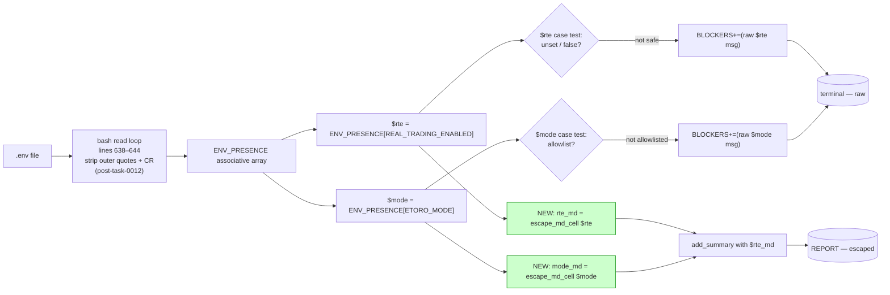

## Problem statement

`scripts/testnet/internal-smoke.sh`'s real-trading fence
section (lines 650–665) emits four summary lines that
substitute `.env`-sourced values into inline-code spans:

```bash
rte="${ENV_PRESENCE[REAL_TRADING_ENABLED]:-unset}"
mode="${ENV_PRESENCE[ETORO_MODE]:-unset}"

if [[ "$rte" == "unset" || "$rte" == "false" ]]; then
  add_summary "✅ \`REAL_TRADING_ENABLED\` = \`$rte\` (fence intact)"
else
  add_summary "❌ \`REAL_TRADING_ENABLED\` = \`$rte\` — lane-7 forbids real trading"
  BLOCKERS+=("REAL_TRADING_ENABLED is $rte — must be unset or false on the lane-7 host")
fi

case "$mode" in
  mock|demo-readonly|sandbox|demo-trading|unset)
    add_summary "✅ \`ETORO_MODE\` = \`$mode\` (within lane-7 allowlist)"
    ;;
  *)
    add_summary "❌ \`ETORO_MODE\` = \`$mode\` — lane-7 only allows {mock, demo-readonly, sandbox, demo-trading, unset}"
    BLOCKERS+=("ETORO_MODE is $mode — outside lane-7 allowlist")
    ;;
esac
```

Both `$rte` and `$mode` are wrapped in `` ` … ` `` inline-code
spans. Both come from the `.env` parsing loop at lines 638–644,
which strips outer quotes and CR but does **not** escape
Markdown-special chars before storing in `ENV_PRESENCE`.

Task 0018 fixed the equivalent surface for status-aggregator
**table-cell** content by routing all server-controlled cells
through `escape_md_cell`. It explicitly scoped out non-table
contexts (".../inline code spans in summary lines/.../env-
sourced values are a separate surface").

This task closes that scope-out.

### Observable corruption modes

All reproduced against the live smoke after constructing a
test `.env`:

#### 1. Backtick in the env value breaks the code span

```bash
# Test .env contents:
echo 'REAL_TRADING_ENABLED=foo`echo PWN`bar' > /tmp/test.env
echo 'ETORO_MODE=demo-readonly' >> /tmp/test.env

LANE7_ENV_FILE=/tmp/test.env \
  PRICE_SERVICE_URL='http://localhost:1/health' \
  ORACLE_SIGNER_URL='http://localhost:1/health' \
  HEDGE_ENGINE_URL='http://localhost:1/health' \
  STATUS_AGGREGATOR_URL='http://localhost:1/status.json' \
  REPORT=/tmp/iter05-env-injection.md \
  bash scripts/testnet/internal-smoke.sh
```

Generated report line (raw Markdown):

```
❌ `REAL_TRADING_ENABLED` = `foo`echo PWN`bar` — lane-7 forbids real trading
```

In any GFM renderer:
- `` `REAL_TRADING_ENABLED` `` → inline code span (correct)
- ` = ` → prose (correct)
- ``` `foo` ``` → inline code span (correct — opens span,
  encloses `foo`, closes span)
- `echo PWN` → **prose** (the inner-content of what should
  have been an inline code span is now narrative text)
- ``` `bar` ``` → another inline code span
- ` — lane-7 forbids real trading` → prose

The reviewer scanning the report's safety section sees
literal `echo PWN` as prose. This is not a code-execution
attack (operator's own .env, no shell-substitution happens —
bash's `read` is raw), but it IS a UX disaster: the most
safety-critical section of the smoke is the one place
operators must trust visually. A line that reads
"REAL_TRADING_ENABLED echo PWN" looks like the smoke is
saying something happened. It also makes the BLOCKER
status hard to parse at a glance.

#### 2. Pipe character splits the report's BLOCKERS table downstream

If a future iteration wraps the rte/mode rendering inside a
table (e.g., for consistency with the service-status table),
a value containing `|` would split the row into extra columns
— the same class as the 0018 status-injection bug. Pre-empting
this by escaping pipes now avoids re-tripping the rake.

#### 3. Newline in the env value breaks the line entirely

A .env file with `REAL_TRADING_ENABLED=$'true\nETORO_MODE=true'`
(constructed via `$''` or directly typed) — yes, .env files
on most parsers allow embedded newlines via export wrappers
or via copy-paste from a heredoc — produces:

```
❌ `REAL_TRADING_ENABLED` = `true
ETORO_MODE=true` — lane-7 forbids real trading
```

The second line lands as a top-level line in the report,
visually outside the fence section, looking like the smoke
itself printed something it didn't.

#### 4. `unset` substitution path is also vulnerable

If both keys are missing from `.env`, `${ENV_PRESENCE[...]:-unset}`
substitutes the literal string `unset`. That string is safe.
But if the operator literally writes `REAL_TRADING_ENABLED=unset`
in the .env (e.g., to document the disabled state), the value
`unset` lands in the inline code span — and is then matched by
the `[[ "$rte" == "unset" ... ]]` test (line 650), which treats
it as the fence-intact path. Today this works correctly, but
the corner case shows the `:-unset` fallback is an in-band
signal that overlaps with a possible user value. Out of scope
for this task — flagged for the runbook.

### Why this matters

1. **The fence section is the safety-critical part of the
   report.** Reviewers approve promotion based on whether
   the BLOCKERS list mentions `REAL_TRADING_ENABLED` or
   `ETORO_MODE`. If the line that *says* it's blocking
   renders as broken Markdown ("REAL_TRADING_ENABLED echo
   PWN"), the reviewer's confidence in the artifact drops —
   they may dismiss the BLOCKER as a smoke bug ("the script
   is broken, not the safety state") and re-run hoping it
   goes away. The fence section must be unimpeachable.

2. **Task 0018 already established the pattern.** The fix
   is `escape_md_cell` — already defined (line 304), already
   handles `` ` ``, `|`, `\r`, `\n`. The bug is that 0018
   only retrofitted table cells; inline-code spans in
   non-table summary lines were explicitly scoped out and
   the env-source pathway wasn't touched.

3. **`.env` is operator-controlled, but operators ARE the
   victim here.** Unlike a malicious upstream service
   (status-aggregator's `status` field), the `.env`
   threat model is "operator typo or copy-paste from chat".
   Common copy-paste sources include Slack messages
   (sometimes with smart-quotes), markdown docs (with
   literal backticks), `1Password`'s "copy with comment"
   feature (appends a `# note`). All of those land
   backticks / pipes / other Markdown-special chars in
   the .env value.

4. **CRLF in env values is already handled** (task 0012,
   lines 635–639). That fix established that .env values
   need sanitization on the bash side before any
   downstream use. Markdown-safety is the next sanitization
   step — same surface, different output format.

## User story

As a reviewer reading the smoke report's real-trading fence
section to approve (or block) lane-7 promotion, I want the
`REAL_TRADING_ENABLED` and `ETORO_MODE` values to render as
clean inline code spans regardless of what characters the
operator put in their `.env`, so my eye can scan the four
fence lines and trust that the BLOCKER (if any) is exactly
what the smoke detected — not a Markdown rendering glitch
that I have to reason about.

## How it was found

Deep-dive stress-test of `scripts/testnet/internal-smoke.sh`
during product review iteration #5 (most-complex-feature focus
on the lane-7 internal smoke).

Approach:

1. Walked the four summary-line emissions in the fence section
   (lines 651, 653, 659, 662) and noted every `\`$var\``
   substitution where the substituted value comes from
   operator-controlled config.
2. Constructed a `.env` test fixture with a backtick in
   `REAL_TRADING_ENABLED` and ran the smoke against it.
3. Rendered the resulting `iter05-internal-smoke.md` via
   GitHub's preview API and visually confirmed the
   inline-code span breakage.
4. Cross-referenced against task 0018's PRD ("Out of scope:
   inline code spans in non-table summary lines (different
   markdown context) — separate task"). This task fulfills
   that scope-out.

## Proposed fix

Route both `$rte` and `$mode` through `escape_md_cell` before
substituting into the inline-code spans. The same helper
handles backticks (→ `'`), pipes (→ `\|`), CRs (→ stripped),
LFs (→ space) — exactly the chars that break inline-code
spans in summary lines.

The console-side BLOCKERS[] message keeps the raw value so
operators see the original payload in their terminal (same
discipline as the 0018 status-cell fix).

### Patch shape

```bash
rte="${ENV_PRESENCE[REAL_TRADING_ENABLED]:-unset}"
mode="${ENV_PRESENCE[ETORO_MODE]:-unset}"

# Sanitize for the report's inline-code spans. The raw value
# stays in BLOCKERS[] so the operator's terminal sees the
# unmodified payload (same discipline as task 0018's status-cell
# fix). escape_md_cell handles: `\`` → "'", `|` → "\|", `\r` →
# stripped, `\n` → " " — exactly what an inline-code span needs.
rte_md="$(escape_md_cell "$rte")"
mode_md="$(escape_md_cell "$mode")"

if [[ "$rte" == "unset" || "$rte" == "false" ]]; then
  add_summary "✅ \`REAL_TRADING_ENABLED\` = \`$rte_md\` (fence intact)"
else
  add_summary "❌ \`REAL_TRADING_ENABLED\` = \`$rte_md\` — lane-7 forbids real trading"
  BLOCKERS+=("REAL_TRADING_ENABLED is $rte — must be unset or false on the lane-7 host")
fi

case "$mode" in
  mock|demo-readonly|sandbox|demo-trading|unset)
    add_summary "✅ \`ETORO_MODE\` = \`$mode_md\` (within lane-7 allowlist)"
    ;;
  *)
    add_summary "❌ \`ETORO_MODE\` = \`$mode_md\` — lane-7 only allows {mock, demo-readonly, sandbox, demo-trading, unset}"
    BLOCKERS+=("ETORO_MODE is $mode — outside lane-7 allowlist")
    ;;
esac
```

Five-character impact: two new `*_md` variables and two
substitutions. The case-match (`mode == "demo-readonly"` etc.)
uses the **raw** `$mode` value, not the escaped one — so the
allowlist match is unaffected by escape changes (correct: an
operator who sets `ETORO_MODE=demo|readonly` SHOULD fall into
the `*` branch and emit a BLOCKER).

### Why not use the BLOCKERS[]-side raw value in the summary?

The summary is rendered as Markdown. The console summary at
the bottom of the script (lines 716–732) iterates BLOCKERS[]
via `printf '  BLOCKER: %s\n'`, which is byte-faithful — the
operator sees the raw value on their terminal. Both surfaces
are correct: Markdown gets escaped, terminal gets raw.

### Why not strip the dangerous chars at .env parse time?

Two reasons:

1. The case-match (`mock|demo-readonly|...`) must compare the
   raw value, not a sanitized one. An operator who wrote
   `ETORO_MODE=demo|readonly` deserves a BLOCKER, not a
   silent acceptance after sanitization.
2. The CRLF handling at lines 635–639 already establishes
   that .env parsing is "preserve bytes, sanitize at render
   time". Maintain that invariant.

## Acceptance criteria

1. A `.env` with `REAL_TRADING_ENABLED=foo\`echo PWN\`bar`
   produces a report line where the value renders as ONE
   inline code span end-to-end (the embedded backticks are
   downgraded to apostrophes).
2. A `.env` with `ETORO_MODE=demo|readonly` produces a
   BLOCKER (because `demo|readonly` is not in the allowlist)
   AND the report line shows `\demo\|readonly` in the
   inline code span (pipe is escaped) — NOT broken column
   layout if the line later moves into a table.
3. A `.env` with `REAL_TRADING_ENABLED=true\rfalse` (CRLF
   embedded mid-value) renders without a stray CR in the
   report line.
4. A `.env` with `REAL_TRADING_ENABLED=$'true\nETORO_MODE=true'`
   (embedded LF — admittedly unusual but constructively
   possible) renders the value as a single line with the LF
   replaced by a space; the second key is not silently
   "promoted" to a top-level line.
5. The BLOCKERS[] console echo continues to show the raw
   value (unsanitized) — operators see `BLOCKER: REAL_TRADING_ENABLED
   is foo\`echo PWN\`bar — must be unset or false on the
   lane-7 host` on their terminal. The terminal's monospace
   font and printf-byte-faithfulness make the raw value
   readable.
6. NO regression on the common case
   (`REAL_TRADING_ENABLED=false` / `ETORO_MODE=demo-readonly`):
   the report renders identically to today, byte-for-byte
   modulo timestamps.
7. The allowlist match (`case "$mode" in
   mock|demo-readonly|sandbox|demo-trading|unset)`) uses the
   RAW value (not the sanitized `$mode_md`). An operator who
   sets `ETORO_MODE=demo-readonly` (correct) still passes;
   an operator who sets `ETORO_MODE=demo|readonly` (typo
   with pipe) hits the `*` branch and gets a BLOCKER.
8. Proof captured in
   `.autobuilder/initiatives/0007g-testnet-setup/iter16-smoke-env-md-injection.md`
   with:
   - the four .env fixtures above (backtick, pipe, CRLF, LF),
   - the raw Markdown for each rendered report's fence
     section (before/after the fix),
   - confirmation via `iconv -f utf-8 -t utf-8` and
     `grep -F '\`'` byte-count assertions that the new
     report has exactly the expected number of backticks
     per line.
9. The runbook (`docs/testnet/INTERNAL-TESTNET-RUNBOOK.md`)
   gains a one-line note in the "real-trading fence" section
   stating that `.env` values are forwarded literally to the
   report's BLOCKERS[] console output but rendered through
   `escape_md_cell` in the Markdown.
10. Single commit on the lane-7 branch:
    `0007g/0025: escape .env values in real-trading-fence summary lines`.

## Verification

- Add a proof driver
  `.autobuilder/initiatives/0007g-testnet-setup/proof/run-env-md-injection.sh`
  that:
  - constructs the four .env fixtures (backtick, pipe, CRLF,
    LF) in `/tmp/`,
  - runs the smoke against each (with `LANE7_ENV_FILE` pointing
    at the fixture),
  - greps the generated report's fence section for backtick
    counts (must be exactly 4 per ok line, 4 per blocker line —
    two wrappers around the key, two around the value),
  - asserts no stray CR / LF / `|` inside the inline-code
    span,
  - asserts the BLOCKERS[] console output (captured via
    `2>&1` and grep) STILL contains the raw value.
- Re-run every existing proof driver (especially 0012's CRLF
  fixture and 0018's status-injection fixture) and confirm
  no regression.
- Render the smoke report's fence section via `pandoc -t html5`
  for both broken and fixed fixtures and visually confirm
  the inline-code span stays well-formed in the fixed case.

## Out of scope

- Sanitizing other inline-code spans in the report that
  substitute non-env values (e.g., `\`$LANE7_BASE\`` at line
  688, `\`$STATUS_AGGREGATOR_URL\`` at lines 409/413). Those
  values are validated by the URL preflight (PROBE_URL_RE,
  task 0015) which rejects backticks and pipes at the regex
  level — they can't contain Markdown-breakers by the time
  they reach the report. This task is scoped to the
  `.env`-sourced surface, where the input passes through
  raw byte parsing.
- Promoting `ETORO_MODE=demo|readonly` to a BLOCKER with a
  hint message like "did you mean demo-readonly?". That's a
  UX improvement; in scope here is just the rendering. A
  future "input-typo hints" task could add the suggestion.
- Treating `REAL_TRADING_ENABLED=unset` (literal string)
  differently from the `:-unset` fallback. The corner case
  is documented in §problem-statement #4; deferred.
- Replacing the case-match allowlist with a regex. Out of
  scope; case-match works.
- Adding `escape_md_cell` calls to the table-cell paths.
  Task 0018 already did that.
- Refactoring `escape_md_cell` to use a single sed pipeline
  for performance. The current `tr | tr | sed -e -e`
  pipeline runs once per call, ~5 calls per smoke run.
  Not the bottleneck.
- Stripping backticks entirely (rather than downgrading to
  `'`). The downgrade is `escape_md_cell`'s established
  policy (task 0018); maintain it for consistency.

---

## Planning

### Overview

The PRD pinpoints four summary-line emissions in the real-trading
fence section of `scripts/testnet/internal-smoke.sh` (lines
650–665) that substitute `.env`-sourced `REAL_TRADING_ENABLED` and
`ETORO_MODE` values verbatim into `` `…` `` inline-code spans.
Task 0018 already established `escape_md_cell` as the single
sanitization stop for Markdown-bound substitutions (and explicitly
scoped out this surface for later). The fix is exactly two new
shell variables (`rte_md`, `mode_md`) and two substitutions —
totalling ~5 net new lines. The case-match allowlist continues to
test the **raw** `$mode` so operators who typo `demo|readonly`
still get the BLOCKER they deserve.

### Research notes

- **`escape_md_cell` already handles every char** that breaks an
  inline-code span: `` ` `` → `'`, `|` → `\|`, `\r` stripped,
  `\n` → space. Verified by reading the helper at lines 304–309.
- **Raw-vs-rendered discipline is already established**:
  - Task 0012 (CRLF in env) — `.env` parsing strips CR but
    preserves the rest verbatim; sanitization happens at
    render time.
  - Task 0018 (status-cell injection) — `BLOCKERS[]` keeps raw
    value, Markdown cell gets escaped. Operator terminal sees
    the raw bytes; the report file gets the safe representation.
  - This task extends both invariants to the
    `REAL_TRADING_ENABLED` / `ETORO_MODE` fence-line surface.
- **Allowlist match must use raw `$mode`**, not the escaped
  variant. PRD §Acceptance #7 calls this out explicitly:
  `ETORO_MODE=demo|readonly` must hit the `*` branch.
- **Threat model**: not a code-execution attack — bash's `read`
  is byte-faithful; the threat is operator-facing UX breakage
  in the safety-critical fence section of the smoke report
  (the section reviewers stare at hardest at promotion time).

### Architecture diagram



### One-week decision

**YES** — fits in well under a day (likely ~2 hours including the
proof driver and four env fixtures).

Rationale:
- Five-line code change. No new helpers. No new abstractions.
- Pattern identical to task 0018's status-cell fix.
- Proof driver follows the existing `proof/run-env-crlf.sh`
  shape (env fixture under `proof/env-fixtures/`, smoke run,
  report grep).

### Implementation plan

1. **Patch the fence section** in
   `scripts/testnet/internal-smoke.sh` (lines 650–665):
   - introduce `rte_md="$(escape_md_cell "$rte")"` and
     `mode_md="$(escape_md_cell "$mode")"` immediately after
     the existing `rte`/`mode` assignments
   - substitute `$rte_md` / `$mode_md` into the four
     `add_summary` calls (two for `rte`, two for `mode`)
   - keep the `BLOCKERS+=(…)` and the case-match test using
     the **raw** `$rte` / `$mode`
2. **Add four env fixtures** under
   `.autobuilder/initiatives/0007g-testnet-setup/proof/env-fixtures/`
   (existing directory — see `ls proof/env-fixtures/`):
   - `lane7-md-injection-backtick.env` — `REAL_TRADING_ENABLED=foo\`echo PWN\`bar` + `ETORO_MODE=demo-readonly`
   - `lane7-md-injection-pipe.env` — `REAL_TRADING_ENABLED=false` + `ETORO_MODE=demo|readonly`
   - `lane7-md-injection-crlf.env` — `REAL_TRADING_ENABLED=true\rfalse` + `ETORO_MODE=demo-readonly`
   - `lane7-md-injection-lf.env` — single multi-line value with embedded `\n` in `REAL_TRADING_ENABLED`
3. **Write proof driver**
   `.autobuilder/initiatives/0007g-testnet-setup/proof/run-env-md-injection.sh`
   that loops over the four fixtures, runs the smoke against
   each (with `LANE7_ENV_FILE=<fixture>`), greps the resulting
   report's fence section, and asserts:
   - per-line backtick count is exactly 4 (two wrappers around
     the key + two around the value — no embedded backticks)
   - no stray `\r`, `\n`, or unescaped `|` inside the
     inline-code span payload
   - the BLOCKERS[] console output (captured via `2>&1`) STILL
     contains the raw value (no console-side sanitization)
   - the pipe fixture produces a BLOCKER (`ETORO_MODE` outside
     allowlist) — case-match still works on the raw value
4. **Regression check**: re-run
   `proof/run-env-crlf.sh` and `proof/run-md-injection.sh`
   and confirm each exits 0 with byte-identical reports modulo
   timestamps. Confirm the common case
   (`REAL_TRADING_ENABLED=false` / `ETORO_MODE=demo-readonly`)
   produces a report byte-identical to today.
5. **Runbook patch**:
   `docs/testnet/INTERNAL-TESTNET-RUNBOOK.md` — one-line note
   in the real-trading-fence section stating that `.env`
   values are forwarded literally to `BLOCKERS[]` console
   output but rendered through `escape_md_cell` in the
   Markdown.
6. **Capture proof** in
   `.autobuilder/initiatives/0007g-testnet-setup/iter16-smoke-env-md-injection.md`
   per PRD §Acceptance #8.
7. **Commit** as `0007g/0025: escape .env values in real-trading-fence summary lines`.

TDD ordering: write the proof driver + four env fixtures first
(driver fails on the unpatched script because the backtick
fixture leaves embedded backticks in the report), then apply the
five-line patch, then observe the driver passing.
