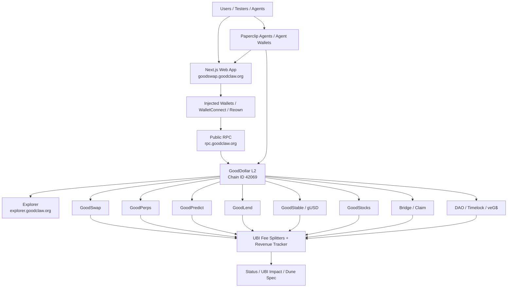

# GoodDollar L2 — The UBI Chain


GoodDollar L2 is an OP Stack-style EVM chain where useful financial activity routes protocol fees into universal basic income for verified humans. The project combines a public-good chain, a DeFi app suite, backend keepers, analytics, and agent-wallet infrastructure into one testnet-ready ecosystem.

## Live Links

- Landing site: https://goodclaw.org
- Web app: https://goodswap.goodclaw.org
- Status API: https://goodswap.goodclaw.org/api/status
- Public RPC: https://rpc.goodclaw.org — chain ID `42069` / `0xa455`
- Explorer: https://explorer.goodclaw.org
- Agents / Paperclip dashboard: https://paperclip.goodclaw.org
- Active readiness plan: [`docs/TESTNET-READINESS-50-ITERATIONS.md`](docs/TESTNET-READINESS-50-ITERATIONS.md)
- Architecture diagrams: [`docs/ARCHITECTURE.md`](docs/ARCHITECTURE.md)
- Testnet guide: [`docs/TESTNET_README.md`](docs/TESTNET_README.md)

## POC V1 Status — 2026-05-19

POC V1 is live as a persistent public GoodDollar L2 devnet / alpha-testnet candidate. The product app, public RPC, faucet, protocol pages, analytics, feedback path, Paperclip agent dashboard, Explorer / Blockscout, and 12 backend health services are online. Explorer was restored at `2026-05-19 07:54 UTC` after the Blockscout web/proxy containers had exited; it remains an alpha hardening watch item, but is no longer a public `502` blocker.

### Recent UX polish (updated: 2026-05-21)

- Stocks detail now includes a `Rebalance Sync` panel that surfaces oracle snapshot block, per-product sync blocks (AMM/perps/predict/lend/yield), two-block proof state, and divergence thresholds, with a fail-safe risk-stop banner/CTA gate that blocks order submission when same-block sync invariants are not met.
- Stocks oracle health polling now uses same-origin `/api/oracle/status` proxying instead of browser-direct `localhost:9300` requests, removing repeated `ERR_CONNECTION_REFUSED` failures in stocks detail/watchlist flows when local keeper ports are unavailable.
- Stocks detail hydration now stays SSR/client-consistent for initial chart-derived metrics (performance summary + day range), removing hydration mismatch/Suspense fallback rerenders that were degrading first-load stability on `/stocks/[ticker]`.
- Stocks detail now includes an in-page `Switch symbol` control (desktop inline + mobile toggle) so users can jump directly between tickers without returning to the markets table.
- Stocks detail chart now shows a prominent timeframe performance summary (for example `+/-X.XX% Past 3 Months`) that updates as users switch timeframe tabs.
- Stocks detail quote header now includes explicit market context (`USD`, source, freshness) and Key Statistics now includes an intraday `Day Range` row with graceful fallback when data is unavailable.
- Stocks detail now shows an explicit first-load trade-panel fallback (`Preparing trade panel…`) with stable Buy/Sell/control structure instead of unlabeled blank skeleton blocks before controls hydrate.
- Stocks markets disconnected onboarding CTA now performs a true wallet-connect action (opens connect modal) instead of routing to a ticker page, with a separate secondary button to browse a starter stock.
- Stocks detail chart timeframe controls now stay in a single horizontal rail on mobile (scrollable chips instead of wrapped rows), avoiding orphaned options like `ALL` dropping to a second line.
- Stocks markets list now keeps the per-row `Trade` action visible by default on desktop (not hover-gated), improving first-time action discoverability.
- Stocks portfolio disconnected state now reliably stays neutral (including stale-address / not-connected wallet sessions), with a portfolio-first `Connect Wallet to View Holdings & History` primary CTA while UBI-impact modules remain secondary.
- Perps portfolio empty state no longer leaks raw template fragments (for example `positions.length === 0 ? (`), restoring clean, production-grade empty-state rendering.
- Perps portfolio positions-tab empty state now renders through a dedicated row component plus stricter leak assertions, adding another guard rail against template fragment regressions.
- Stocks detail page now lazy-loads chart/oracle UI modules; latest build reduced `/stocks/[ticker]` First Load JS from ~386 kB to ~332 kB while preserving trading flow.
- Stocks header/navigation now disables eager route prefetch to keep stocks-first loading focused; latest production capture reduced `/stocks` requests from `60` to `44` and `/stocks/[ticker]` from `66` to `45`, while eliminating background `_rsc` fan-out and unrelated perps/predict/lend chunk preloads during initial stocks render.
- Stocks detail now includes an `Analyst Outlook` card (consensus, low/mean/high target context, and implied upside/downside) with explicit loading and unavailable-data fallbacks.
- Stocks detail now includes a `News & Events` panel with per-ticker catalyst headlines, tags, source attribution, and empty/error fallbacks so users can keep context in-app.
- Stocks detail sidebar now includes stocks-native discovery modules (`Related symbols` + `Daily movers`) so users can jump directly into adjacent opportunities without leaving the stocks flow.
- Stocks portfolio now defers heavy impact widgets behind a non-blocking skeleton and enforces a route bundle budget check; latest build reduced `/stocks/portfolio` First Load JS from ~410 kB to ~258 kB.
- Stocks detail oracle badge now avoids false `Oracle offline` states during rapid ticker hops (for example AAPL → MSFT → AAPL) by showing an explicit `Checking oracle...` transitional state until fallback health resolves.

### POC V1 live endpoints

| Surface | Link | Status | Notes |
|---|---|---|---|
| Landing site | https://goodclaw.org | ✅ Live | HTTP 200 with browser user-agent. |
| Main web app | https://goodswap.goodclaw.org | ✅ Live | Next.js app served by PM2 process `goodswap` on port 3100. |
| Status API | https://goodswap.goodclaw.org/api/status | ✅ Healthy | `12 / 12` services healthy at `2026-05-19 06:57 UTC`. |
| Public RPC | https://rpc.goodclaw.org | ✅ Live | `eth_chainId = 0xa455` / decimal chain ID `42069`. |
| Explorer | https://explorer.goodclaw.org | ✅ Live | Restored at `2026-05-19 07:54 UTC`; root `/`, `/blocks`, and `/api/v2/main-page/indexing-status` returned HTTP `200`. |
| Paperclip / Agents dashboard | https://paperclip.goodclaw.org | ✅ Live | Agent dashboard returned HTTP 200. |
| Analytics dashboard | https://goodswap.goodclaw.org/analytics | ✅ Live | Public analytics page returned HTTP 200. |
| Analytics API | https://goodswap.goodclaw.org/api/analytics/overview | ✅ Live | Returns protocol/address-book summary JSON. |
| Feedback API | `POST /api/feedback` on the main app | ✅ Live | `GET` correctly returns HTTP 405. Floating feedback button writes redacted JSONL for triage. |

### POC V1 app matrix

| App / surface | Link | Current status | What it proves in POC V1 |
|---|---|---|---|
| GoodSwap | https://goodswap.goodclaw.org | ✅ Live / E2E green | Token swap surface and UBI-fee routing entry point. |
| Explore | https://goodswap.goodclaw.org/explore | ✅ Live / E2E green | Token and market discovery. |
| Pool | https://goodswap.goodclaw.org/pool | ✅ Live / E2E green | Liquidity pool UX. |
| Yield | https://goodswap.goodclaw.org/yield | ✅ Live / E2E green | Yield / harvest surface. |
| Faucet | https://goodswap.goodclaw.org/faucet | ✅ Live / E2E green | Tester funding with native gas and test assets. |
| Bridge | https://goodswap.goodclaw.org/bridge | ✅ Live / E2E green | Bridge UX for L1/L2 and multichain test flows. |
| GoodPerps | https://goodswap.goodclaw.org/perps | ✅ Live / E2E green | Perpetual futures terminal backed by perps contracts/backend. |
| Perps leaderboard | https://goodswap.goodclaw.org/perps/leaderboard | ✅ Live / E2E green | Perps ranking / activity surface. |
| Perps portfolio | https://goodswap.goodclaw.org/perps/portfolio | ✅ Live / E2E green | Perps user positions view. |
| GoodPredict | https://goodswap.goodclaw.org/predict | ✅ Live / E2E green | Prediction-market listing and trading surface. |
| Predict create | https://goodswap.goodclaw.org/predict/create | ✅ Live / E2E green | Market creation flow. |
| Predict portfolio | https://goodswap.goodclaw.org/predict/portfolio | ✅ Live / E2E green | User prediction-market positions. |
| GoodLend | https://goodswap.goodclaw.org/lend | ✅ Live / E2E green | Supply / borrow / liquidation lane. |
| GoodStable | https://goodswap.goodclaw.org/stable | ✅ Live / E2E green | gUSD stablecoin, PSM, vault, and stability-pool surface. |
| GoodStocks | https://goodswap.goodclaw.org/stocks | ✅ Live / E2E green | Synthetic stock listing/trading surface. |
| Stock detail | https://goodswap.goodclaw.org/stocks/AAPL | ✅ Live / E2E green | Individual synthetic-stock trading page. |
| Stocks portfolio | https://goodswap.goodclaw.org/stocks/portfolio | ✅ Live / E2E green | User synthetic-stock positions. |
| Portfolio / Claim | https://goodswap.goodclaw.org/portfolio | ✅ Live / E2E green | Wallet overview, balances, claim-oriented UX. |
| Agents | https://goodswap.goodclaw.org/agents | ✅ Live / E2E green | Agent-wallet discovery and automation entry point. |
| Agent registration | https://goodswap.goodclaw.org/agents/register | ✅ Live / E2E green | Agent onboarding/register flow. |
| Governance | https://goodswap.goodclaw.org/governance | ✅ Live / E2E green | DAO / timelock / veG$ governance surface. |
| Governance analytics | https://goodswap.goodclaw.org/governance/analytics | ✅ Live / E2E green | Governance metrics surface. |
| UBI Impact | https://goodswap.goodclaw.org/ubi-impact | ✅ Live / E2E green | Shows transaction fees → UBI impact narrative. |
| Activity | https://goodswap.goodclaw.org/activity | ✅ Live / E2E green | Chain/app activity timeline. |
| Test dashboard | https://goodswap.goodclaw.org/test-dashboard | ✅ Live / E2E green | Public QA evidence dashboard. |
| Tests page | https://goodswap.goodclaw.org/tests | ✅ Live / E2E green | Public test status / checks page. |
| Testnet guide | https://goodswap.goodclaw.org/testnet-guide | ✅ Live / E2E green | Tester onboarding and network instructions. |
| Invite page | https://goodswap.goodclaw.org/invite | ✅ Live | Alpha tester invitation page; HTTP 200 at refresh. |

### POC V1 runtime status

| Component | Current status | Evidence / note |
|---|---|---|
| Chain | ✅ Live | Public RPC returned `eth_chainId = 0xa455`; `/api/status` chain-backed services reported block `14777` at refresh. |
| Backend health | ✅ Healthy | `/api/status` reported `overall: healthy`, `healthy: 12`, `total: 12`. |
| PM2 app processes | ✅ Online | `goodswap`, `goodperps`, `goodpredict`, `paperclip`, and keeper services were online during refresh. |
| Frontend E2E registry | ✅ Green | Latest gate log `.autobuilder/final-e2e-gate-20260519T051711Z.log`: `27 passed`. |
| Contract tests | ✅ Green baseline | README checkpoint records Foundry suite at `1126 / 1126` passing; run fresh before release tag. |
| UBI fee accounting | ✅ Integration-proven on devnet | All 14 routes are proven in [`docs/UBI-FEE-ACCOUNTING.md`](docs/UBI-FEE-ACCOUNTING.md) with integration proofs for Swap/Perps and Predict/Lend/Stable/Stocks. |
| Explorer / Blockscout | ✅ Restored / watch | Public explorer URL, `/blocks`, and indexing-status API returned HTTP `200` at `2026-05-19 07:54 UTC`; keep Blockscout devnet hardening active for restart durability and indexing catch-up. |

### POC V1 go / no-go

**Go for internal demo and controlled POC V1 testing.** The web app, RPC, backend health, faucet, app routes, analytics, feedback capture, and core protocol surfaces are live.

**Not yet go for broad public alpha.** Explorer is restored, but the alpha release manifest still needs exact commit, build ID, service versions, canonical addresses, reset policy, proof transaction hashes, sustained explorer/RPC soak, and final go/no-go signoff.

## Current Status

_Last refreshed: 2026-05-19 06:57 UTC. This README refresh documents **POC V1** after live URL checks, `/api/status`, public RPC, PM2 process inspection, and the latest E2E gate evidence._

GoodDollar L2 is running as a persistent public devnet / alpha-testnet candidate and is ready for internal demo plus controlled POC V1 testing.

- Public health: `healthy`, `12 / 12` services OK from `https://goodswap.goodclaw.org/api/status` at `2026-05-19T06:57:10Z`.
- Public app pages verified live: main app, faucet, perps, predict, lend, stable, stocks, bridge, agents, portfolio, tests, testnet guide, analytics, activity, pool, yield, governance, UBI impact, and invite returned HTTP `200` during this refresh.
- Public RPC verified: `eth_chainId = 0xa455` / decimal chain ID `42069`.
- Public explorer status: **live / watch** — `https://explorer.goodclaw.org`, `/blocks`, and `/api/v2/main-page/indexing-status` returned HTTP `200` at `2026-05-19 07:54 UTC` after restarting the Blockscout web/proxy stack.
- Active initiative: Alpha Testnet Readiness — 50 iterations (`.autobuilder/initiatives/0005-alpha-testnet-50/`), with current planned blockers focused on RPC saturation hardening and Blockscout devnet hardening.
- Active priorities: explorer reliability, proof transaction links, public tester onboarding, protocol smoke evidence, UBI-fee accounting, analytics + feedback loops, and release-candidate packaging.
- Security hardening status: Slither high/medium cleanup completed in the prior security initiative; release gates still require continuous security checks before public testnet.
- Foundry contract test suite: `1126 / 1126` passing as of the latest README checkpoint baseline; run fresh before a release tag.
- Frontend E2E registry: latest gate log `.autobuilder/final-e2e-gate-20260519T051711Z.log` shows `27 passed`.
- Frontend production build: `goodswap` PM2 process is online; iter 27 `/analytics`, iter 28 Dune package surfaces, and iter 29 `/api/feedback` schema are live on `https://goodswap.goodclaw.org` ([iter30 stale-build redeploy evidence](docs/testnet/iter30-stale-build-redeploy.md)).

### Recent readiness milestones (iter 15–35)

- **Iter 15 — README/doc checkpoint 3.** Refreshed `README.md`, `docs/ARCHITECTURE.md`, and `docs/TESTNET_README.md` after the iter 10–14 work landed; added the doc-link CI gate (`python3 scripts/check-doc-links.py`) to keep cross-doc references honest.
- **Iter 16 — Swap lane hardening.** Re-pointed the stale `SwapGD` / `SwapWETH` / `SwapUSDC` constants in `frontend/src/lib/devnet.ts` at the canonical addresses from `op-stack/addresses.json`, unblocking the swap happy-path and dust/error proof on the public app.
- **Iter 17 — Perps lane hardening.** Unblocked the Playwright E2E port collision and re-ran the full open/close flow via `frontend/e2e/perps-journey.spec.ts`, producing on-chain `PerpEngine.positions(...)` proof of a margin-funded trade.
- **Iter 18 — Predict lane + PM2 build-less-start fence.** Stabilised the public `/predict` market grid so it surfaces meaningful markets even when on-chain seeds are empty, and shipped the iter 18 BLOCKER fix that fences PM2 against build-less starts (`frontend/scripts/pm2-launch-next.mjs` refuses to launch `next start` if `.next/` is missing a manifest or contaminated by a `next dev` tree).
- **Iter 19 — `next dev` clobber recurrence #3 closed.** Removed the upstream cause of three production outages via `distDir` isolation for Playwright + added the `goodswap-watchdog` PM2 process that probes `/_next/static/chunks/*.js` every 60 s and reloads `goodswap` after a 3-failure streak (`frontend/scripts/goodswap-watchdog.mjs`, `frontend/ecosystem.watchdog.config.cjs`, [frontend health runbook](docs/TESTNET_README.md#frontend-health-iter-19)). Note: the Lend/Stable lane hardening originally mapped to row 19 of the 50-iteration plan is **deferred** to a future iteration — iter 19's slot was consumed by closing the production-down recurrence.
- **Iter 20 — README/doc checkpoint 4 + testnet gate.** Re-ran the public surface sweep, refreshed `README.md` / `docs/TESTNET_README.md` / `docs/ARCHITECTURE.md`, and re-greened the doc link checker after the iter 16–19 lane and watchdog work.
- **Iter 21 — Stocks/portfolio lane hardening.** Added Playwright E2E proof for the `/portfolio` lane (`frontend/e2e/portfolio-journey.spec.ts`) so wallet-state, balances, and claim UX have named proof on the public app; in-flight blocker (`--dist-dir` CLI flag unsupported) was fixed in the same iteration so the lane could be greened.
- **Iter 22 — UBI fee truth source.** Shipped [`docs/UBI-FEE-ACCOUNTING.md`](docs/UBI-FEE-ACCOUNTING.md), the canonical 14-route map from every protocol fee path (Swap V4, Swap Li.Fi, Perps trading/funding/liquidation, Predict factory + resolver, Lend reserve factor, Stable stability/minting/liquidation/governance, Stocks trading + liquidation remnant) into the UBI revenue tracker, with addresses sourced from `op-stack/addresses.json`.
- **Iter 23 — UBI integration proof I (Swap + Perps).** Added [`test/integration/UBIFeeIntegrationProofSwapPerps.t.sol`](test/integration/UBIFeeIntegrationProofSwapPerps.t.sol) proving routes 1–5 by event + balance-delta receipts (commit `2b30ad5`); the matching rows in `docs/UBI-FEE-ACCOUNTING.md` flipped from `⏳ proof needed` to `✅ integration proven (iter 23)`.
- **Iter 24 — UBI integration proof II (Predict + Lend + Stable + Stocks).** Added [`test/integration/UBIFeeIntegrationProofPredictLendStableStocks.t.sol`](test/integration/UBIFeeIntegrationProofPredictLendStableStocks.t.sol) proving routes 6–14 with the same event + balance-delta methodology (commit `3f2806a`); all 14 fee routes now read `✅ integration proven` and the spec records the closeout in its §6 summary.
- **Iter 25 — README/doc checkpoint 5.** Refreshed `README.md`, `docs/TESTNET_README.md`, and `docs/TESTNET-READINESS-50-ITERATIONS.md` to surface the iter 20–24 milestones, link the UBI fee accounting spec and its two integration proofs from the canonical entry points, and re-ran the intra-repo link check ([iter25 checkpoint summary](docs/testnet/iter25-readme-doc-checkpoint-5.md), [link-check artefact](docs/testnet/iter25-link-check.md)).
- **Iter 26 — Analytics address book.** Shipped [`analytics/address-book.json`](analytics/address-book.json) and [`analytics/README.md`](analytics/README.md) as the machine-readable truth source for chain ID, RPC, protocol contracts, and the 14 UBI fee routes. The address book is derived from `op-stack/addresses.json` so indexers (Dune, The Graph, Goldsky, custom) consume one canonical map instead of scraping the frontend.
- **Iter 27 — Public `/analytics` dashboard.** Added the [`/analytics`](https://goodswap.goodclaw.org/analytics) page backed by `/api/analytics/overview`, exposing protocol-level KPIs (active markets, swap volume, perps OI, UBI fees split), data freshness, and last-block heartbeat for testers and stakeholders without requiring Dune access. The endpoint reads canonical addresses from the iter 26 address book so on-chain reality stays the source of truth.
- **Iter 28 — Dune / indexing-request package.** Published [`analytics/dune-package/`](analytics/dune-package/README.md): `INDEXING_MANIFEST.json`, a SQL pack covering swap volume, perps OI, UBI fee splits, and a decoding cookbook so an external Dune wizard (or any other indexer) can stand up the same dashboards we run in-house. This is the iter 28 release-prep deliverable for analytics partners.
- **Iter 29 — Feedback pipeline with context capture + redaction.** Promoted the floating "Feedback" button on `goodswap.goodclaw.org` from a stub to a real ingest path. The client now captures route, connected wallet, viewport, sessionId, frontend buildSha, and the last ≤ 20 console errors; the `/api/feedback` route is schema-validated, body-capped at 16 KiB, redacts private keys / mnemonics / JWTs / Bearer tokens / emails via [`frontend/src/lib/redactSecrets.ts`](frontend/src/lib/redactSecrets.ts), persists to a JSONL log for triage, and is still rate-limited. Proofs: Vitest API suite (17/17), Vitest helper suite, Playwright UI suite (3/3), react-doctor 96/100 ([iter29 evidence](docs/testnet/iter29-feedback-pipeline.md)).
- **Iter 30 — README/doc checkpoint 6 + stale-prod-build fix.** This refresh. The iter 30 product review caught a stale public build — iter 27 `/analytics` and the iter 29 `/api/feedback` schema were not live on `https://goodswap.goodclaw.org` because the `.next/` bundle dated from before iter 27. Critical task `0041` ran `frontend/scripts/deploy.sh` to rebuild + `pm2 reload` + sync `BUILD_ID` ([iter30 redeploy evidence](docs/testnet/iter30-stale-build-redeploy.md)), and task `0042` (this commit) refreshes `README.md`, `docs/TESTNET_README.md`, `docs/ARCHITECTURE.md`, and the 50-iter plan to document the iter 26–29 analytics + feedback work ([iter30 checkpoint summary](docs/testnet/iter30-readme-doc-checkpoint-6.md), [link-check artefact](docs/testnet/iter30-link-check.md)).
- **Iter 35 — Oracle risk controls verification (plan row 33).** Verification-only sweep across all four price oracles: `PerpPriceOracle` (`maxStaleness 120s`, deviation 20%), `SwapPriceOracle` (per-token `maxAge`, default 300s, deviation 25%), `Stocks PriceOracle` (`maxAge 1h`), and `Lending SimplePriceOracle` (devnet placeholder — no guards, replacement tracked in Known Boundaries). Off-chain monitoring confirmed: `swap-oracle` keeper + `backend/monitor` chain-block-age check are both `ok` on `/api/status`. Tests: 56/56 oracle tests passed (`PerpPriceOracle.t.sol` 18, `SwapPriceOracle.t.sol` 20, `OracleVerification.t.sol` 18). Evidence: [`docs/security/iter35-oracle-risk-controls.md`](docs/security/iter35-oracle-risk-controls.md).
- **2026-05-20 — Stocks oracle-status UX hardening (task 0024).** `/stocks` no longer relies solely on `NEXT_PUBLIC_PRICE_SERVICE_URL/status/quotes` for health. The `OracleStatusBadge` now has a stocks-specific fallback to `/api/status` (`stocks-keeper`) and renders `Live` / `degraded` / `offline` state accordingly, reducing false “Oracle offline” messaging during healthy runs.
- **2026-05-20 — Invalid ticker resilience hardening (task 0025).** The `/stocks/[ticker]` not-found state now normalizes malformed URL inputs to a safe `UNKNOWN` label, avoids leaking raw encoded payload strings (e.g. `%20`, encoded script-like fragments), and adds direct recovery links (`AAPL`, `MSFT`, `NVDA`) alongside `Back to Stocks`.
- **2026-05-20 — Invalid ticker encoded-payload regression guard (task 0026).** Strengthened `/stocks/[ticker]` malformed-input normalization with multi-pass URL decoding and explicit control-character rejection, and expanded regression tests for `%00`, `%2520`, and double-encoded symbols so encoded payload text cannot leak into not-found copy.
- **2026-05-20 — Malformed ticker leak follow-up coverage (task 0027).** Extended malformed-route regression coverage for `/stocks/[ticker]` to include `%252520` and encoded SVG payload probes in both unit and Playwright suites, locking in the `UNKNOWN` fallback and preventing future encoded-payload leakage in user-facing error copy.
- **2026-05-20 — Encoded-valid ticker route normalization (task 0028).** Fixed `/stocks/[ticker]` boundary behavior so double/triple-encoded valid symbols (for example `%2541APL`, `%252541APL`) resolve to the real stock detail page instead of a false `Stock Not Found`, while preserving strict `UNKNOWN` fallback behavior for malformed payloads.
- **2026-05-20 — Invalid ticker copy de-risking (task 0029).** Updated `/stocks/[ticker]` not-found UX to use generic safe copy (`This stock symbol is not available.`) instead of echoing route input, and tightened regression tests to ensure percent-encoded malformed payloads (`%20`, `%00`, `%2520`, `%3Csvg...`) never appear in user-facing error text.
- **2026-05-20 — Slash/null malformed ticker guard expansion (task 0030).** Hardened `/stocks/[ticker]` lookup normalization to reject unsafe ticker shapes and expanded route regression coverage for `%2F`, `%252525252525`, and `AAPL%00`, ensuring malformed slash/null payloads never surface in user-facing error copy.
- **2026-05-20 — Malformed percent-path recovery routing (task 0031).** Added a guarded Next runtime server path normalizer that rewrites malformed `%` stocks routes (for example `/stocks/%`, `/stocks/%2`, `/stocks/%E0%A4%A`) to a safe fallback ticker so users stay inside branded stocks recovery UI instead of hitting a raw `400 Bad Request` page.
- **2026-05-20 — Stocks portfolio empty-state collateral health fix (task 0032).** Updated the `/stocks/portfolio` collateral-health card to keep empty/disconnected users in a neutral onboarding state instead of showing a false `0% — Critical` risk alert, and added regression coverage for the `totalCollateral > 0` + `totalRequired = 0` boundary.
- **2026-05-20 — Stocks first-time onboarding CTA and mobile trade affordance (task 0033).** Added a clear wallet-disconnected onboarding panel on `/stocks` with an explicit primary CTA plus a concise 3-step start path, and added a visible `Tap to trade` affordance on mobile stock cards to improve first-action discoverability.
- **2026-05-20 — Perps portfolio JSX leak hardening (task 0034).** Refactored `/perps/portfolio` positions tab rendering into explicit precomputed branches to prevent ternary-source text leakage in the UI and keep empty/table states cleanly separated.
- **2026-05-20 — Stocks portfolio collateral-state regression guard (task 0035).** Tightened `/stocks/portfolio` collateral health gating to require actual holdings before rendering risk tiers, so empty/disconnected states stay neutral even when stale required-collateral values are present.
- **2026-05-20 — Double-encoded malformed ticker guard expansion (task 0036).** Hardened `/stocks/[ticker]` normalization with explicit unsafe payload blocking (encoded separators, control chars, traversal markers) and expanded regression coverage for `%252F..%252F%00` so not-found copy never leaks attacker-controlled route text.
- **2026-05-20 — Perps portfolio template-leak regression hardening (task 0037).** Updated `/perps/portfolio` positions rendering to keep a stable table structure in empty states and added regression coverage that verifies no template-source fragments leak into visible UI.
- **2026-05-20 — Stocks portfolio empty-state collateral clarity hardening (task 0038).** Tightened `/stocks/portfolio` collateral helper-state gating so stale required-collateral values do not render risk-baseline text when there are no holdings, and added regression assertions for neutral empty-state copy.
- **2026-05-20 — Perps portfolio template-leak guard expansion (task 0039).** Extended route-registry E2E assertions plus unit-level leak checks so `/perps/portfolio` explicitly fails CI if raw JSX/template fragments (for example `positions.length===0 ? (` or `):(`) ever appear in rendered UI again.
- **2026-05-20 — Stocks collateral-critical empty-state guard expansion (task 0040).** Added registry-level forbidden-copy checks for `/stocks/portfolio` and expanded unit coverage to enforce neutral empty-state collateral messaging while preserving `Critical` risk labels for real open-position scenarios.
- **2026-05-20 — Stocks malformed URL decode-edge fallback hardening (task 0043).** Expanded `safe-route-normalizer` coverage for browser-normalized malformed ticker payloads (replacement-character variants such as `/stocks/�(�(` / `%EF%BF%BD(%EF%BF%BD(`) and rewired the normalizer to route these cases to `/stocks/UNKNOWN`, preventing raw decode-edge payloads from bypassing stocks recovery handling in Next runtime entry.
- **2026-05-20 — Stocks detail empty-position journey polish (task 0046).** Reworked `/stocks/[ticker]` no-position next actions to stay within the stocks journey (`Buy s<TICKER>`, `Open Stock Portfolio`, `Browse Stocks`) instead of routing users to unrelated crypto/perps/predict pages, with regression tests covering CTA labels and link targets.

## Logo and Brand

The logo in `docs/assets/gooddollar-l2-logo.svg` is the current project mark for the repository README and testnet documentation.

- `G$` circle: the GoodDollar economic primitive and verified-human UBI claim path.
- Green gradient: public-good finance, sustainability, and real value flowing back to people.
- Blue/green L2 ring: the OP Stack-style Layer 2 network wrapping GoodDollar with cheaper, faster execution.
- Connected nodes: apps, keepers, agents, bridges, and analytics all writing to one shared chain.
- Tagline: **The UBI Chain** — every useful transaction should create a measurable contribution to UBI.

This is intentionally simple enough to render well in GitHub, docs, social previews, and release notes. The source is plain SVG so it can be versioned and edited without binary design tooling.

## What the Project Contains

GoodDollar L2 is not just a token or a single dapp. It is a full stack:

1. **Chain layer** — local/persistent OP Stack-style EVM devnet with chain ID `42069`.
2. **Protocol layer** — Solidity contracts for swaps, perps, prediction markets, lending, gUSD, synthetic stocks, bridges, governance, validators, and UBI routing.
3. **App layer** — a Next.js frontend at `goodswap.goodclaw.org` exposing every protocol surface to users and testers.
4. **Backend services** — PM2-managed keepers, indexers, monitors, oracles, health checks, and protocol service APIs.
5. **SDK and automation** — TypeScript SDK, scripts, lane tests, health gates, and autonomous builder workflow.
6. **Agent economy** — Paperclip/agent-wallet integration and AntSeed compute lane for agent-driven transactions.
7. **Analytics and proof** — status API, test dashboard, UBI impact pages, integration receipts, and Dune dashboard specification.

## Apps Running on GoodDollar L2

The POC V1 app suite is centered on `https://goodswap.goodclaw.org`. Status below reflects the `2026-05-19 06:57 UTC` refresh: direct HTTP checks plus the latest 27-route Playwright registry gate where applicable.

| App | Live link | Status | Purpose | UBI Link |
|---|---|---|---|---|
| GoodSwap | https://goodswap.goodclaw.org | ✅ Live / E2E green | Swap tokens and route value through GoodSwap contracts. | Swap/router fees flow into UBI accounting. |
| Faucet | https://goodswap.goodclaw.org/faucet | ✅ Live / E2E green | Give testers gas/test assets with boundary and capacity checks. | Enables public testing without manual funding. |
| GoodPerps | https://goodswap.goodclaw.org/perps | ✅ Live / E2E green | Perpetual futures UX backed by `PerpEngine`, margin vault, funding, and liquidation logic. | Trading, funding, and liquidation fees fund UBI. |
| GoodPredict | https://goodswap.goodclaw.org/predict | ✅ Live / E2E green | Prediction markets using conditional tokens, market factory, resolver, and CLOB-style backend work. | Market fees route into Predict UBI splitter. |
| GoodLend | https://goodswap.goodclaw.org/lend | ✅ Live / E2E green | Supply, borrow, debt tokens, interest-rate model, and liquidation lane. | Interest/spread/liquidation fees route to UBI. |
| GoodStable | https://goodswap.goodclaw.org/stable | ✅ Live / E2E green | gUSD stablecoin, collateral registry, vault manager, PSM, and stability pool. | Stability and PSM fees route to UBI. |
| GoodStocks | https://goodswap.goodclaw.org/stocks | ✅ Live / E2E green | Synthetic stock assets with price oracle and collateral vault. | Mint/burn/trading fees route to UBI. |
| Bridge | https://goodswap.goodclaw.org/bridge | ✅ Live / E2E green | L1/L2 and multichain bridge UX for future public testnet flows. | Bridge fees and routing fees can fund UBI. |
| Portfolio / Claim | https://goodswap.goodclaw.org/portfolio | ✅ Live / E2E green | Wallet overview, positions, balances, and claim-oriented UX. | Shows the user-facing impact of the UBI economy. |
| Pool / Yield | https://goodswap.goodclaw.org/pool / https://goodswap.goodclaw.org/yield | ✅ Live / E2E green | Liquidity and yield surfaces for testers. | Liquidity activity supports protocol depth and fees. |
| Explore | https://goodswap.goodclaw.org/explore | ✅ Live / E2E green | Token and market discovery. | Makes useful protocol activity easier to find. |
| Agents | https://goodswap.goodclaw.org/agents | ✅ Live / E2E green | Agent-wallet and automation entry point. | Agent transactions become another UBI-fee source. |
| UBI Impact | https://goodswap.goodclaw.org/ubi-impact | ✅ Live / E2E green | Impact and analytics narrative. | Shows transactions → fees → UBI outcomes. |
| Governance | https://goodswap.goodclaw.org/governance | ✅ Live / E2E green | DAO/timelock/veG$ governance surface. | Long-term protocol stewardship. |
| Analytics | https://goodswap.goodclaw.org/analytics | ✅ Live | Protocol KPI dashboard backed by `/api/analytics/overview`. | Makes UBI fee impact measurable. |
| Activity | https://goodswap.goodclaw.org/activity | ✅ Live / E2E green | Chain/app activity timeline. | Makes useful protocol activity visible. |
| Tests | https://goodswap.goodclaw.org/tests / https://goodswap.goodclaw.org/test-dashboard | ✅ Live / E2E green | Public QA evidence and test status. | Makes readiness transparent. |
| Testnet Guide | https://goodswap.goodclaw.org/testnet-guide | ✅ Live / E2E green | Tester onboarding and network instructions. | Converts visitors into useful test activity. |
| Invite | https://goodswap.goodclaw.org/invite | ✅ Live | Alpha tester invitation page. | Helps recruit testnet users. |

## System Architecture



More diagrams live in [`docs/ARCHITECTURE.md`](docs/ARCHITECTURE.md), including runtime services and test layers.

## Protocol Contracts

The Solidity contracts are organized by protocol:

- `src/GoodDollarToken.sol`, `src/GoodDollarTokenSecure.sol` — G$ token implementations.
- `src/UBIFeeSplitter.sol`, `src/UBIRevenueTracker.sol`, `src/UBIClaimV2.sol` — UBI routing, revenue tracking, and claim infrastructure.
- `src/GoodSwap.sol`, `src/swap/GoodSwapRouter.sol`, `src/swap/LimitOrderBook.sol`, `src/hooks/UBIFeeHook.sol` — swap and fee hook layer.
- `src/perps/*` — perpetuals engine, margin vault, funding, price oracle, and UBI fee splitter.
- `src/predict/*` — conditional tokens, market factory, optimistic resolver, and Predict UBI fee splitter.
- `src/lending/*` — GoodLend pool, tokens, debt tokens, oracle, addresses provider, and rate model.
- `src/stable/*` — gUSD, collateral registry, vault manager, PSM, stability pool, and stable UBI fee splitter.
- `src/stocks/*` — synthetic asset factory, collateral vault, stock oracle, and stocks UBI fee splitter.
- `src/bridge/*` — OP-style portal/bridge contracts and multichain bridge helpers.
- `src/governance/*` — DAO, timelock, and vote-escrowed G$.
- `src/AgentRegistry.sol`, `src/ValidatorStaking*.sol` — agent and validator infrastructure.

Canonical deployed addresses must come from [`op-stack/addresses.json`](op-stack/addresses.json). Do not add stale frontend fallbacks when the registry has an address.

## Backend and Runtime Services

The live stack is PM2-managed. `/api/status` aggregates the public readiness state from the runtime services.

| Service | Role |
|---|---|
| `goodswap` | Next.js frontend server on port `3100`. |
| `swap-oracle` | Swap pricing and on-chain price support. |
| `indexer` | Chain/event indexing and API data source. |
| `monitor` | Contract and chain-health monitor. |
| `revenue-tracker` | Tracks UBI-routed protocol revenue. |
| `activity-reporter` | Reports user/protocol activity. |
| `harvest-keeper` | Yield/harvest automation lane. |
| `liquidator` | Lending/stable liquidation automation. |
| `stocks-keeper` | Synthetic-stock upkeep lane. |
| `rpc-balancer` | Public RPC proxy/balancer health. |
| `bridge-keeper` | Bridge support/health lane. |
| `perps`, `predict` | Protocol-specific backend services. |

## Repository Layout

```text
.
├── src/                         # Solidity contracts
├── script/                      # Foundry deploy/read scripts
├── test/                        # Foundry tests, fuzz, and invariants
├── frontend/                    # Next.js app, API routes, Playwright/Vitest tests
├── backend/                     # PM2 services, keepers, indexers, monitors
├── sdk/                         # TypeScript SDK package
├── op-stack/                    # Chain config and canonical addresses
├── docs/                        # Architecture, readiness, runbooks, analytics specs
├── scripts/                     # Health gates, lane tests, doc checks, deployment helpers
├── research/                    # Protocol research notes and imported references
└── .autobuilder/                # Autonomous build-loop plans, evidence, screenshots, receipts
```

## How Fees Become UBI

The design goal is intentionally measurable:

```text
User or agent activity
  → protocol transaction
  → protocol fee
  → protocol UBI fee splitter
  → UBI revenue tracker
  → verified-human claim / UBI funding pool
  → public analytics evidence
```

Release work must preserve this path for every app. A feature is not complete just because it renders; it needs contract wiring, test evidence, and UBI-fee accounting or an explicit reason it is excluded from the public gate.

**Canonical fee map.** Every protocol's fee path is enumerated in [`docs/UBI-FEE-ACCOUNTING.md`](docs/UBI-FEE-ACCOUNTING.md) — 14 routes covering Swap (V4 + Li.Fi), Perps (trading, funding, liquidation), Predict (factory + resolver), Lend (reserve factor), Stable (stability/minting/liquidation/governance), and Stocks (trading + liquidation remnant). All 14 routes are **`✅ integration proven`** on devnet via:

- [`test/integration/UBIFeeIntegrationProofSwapPerps.t.sol`](test/integration/UBIFeeIntegrationProofSwapPerps.t.sol) — routes 1–5 (iter 23).
- [`test/integration/UBIFeeIntegrationProofPredictLendStableStocks.t.sol`](test/integration/UBIFeeIntegrationProofPredictLendStableStocks.t.sol) — routes 6–14 (iter 24).

## Analytics + Feedback Loops

Iterations 26–29 added the four loops that turn on-chain activity and tester reports into measurable, redacted, and actionable signal. Iter 30 surfaced and stabilised these loops on the public app after a stale-build redeploy.

| Loop | Surface | Source of truth | Iter | Evidence |
|---|---|---|---:|---|
| Address book | [`analytics/address-book.json`](analytics/address-book.json) | Derived from [`op-stack/addresses.json`](op-stack/addresses.json) | 26 | [`analytics/README.md`](analytics/README.md) |
| Public analytics dashboard | [`/analytics`](https://goodswap.goodclaw.org/analytics) on the live app + [`/api/analytics/overview`](https://goodswap.goodclaw.org/api/analytics/overview) | On-chain reads via the address book | 27 | live route returns HTTP 200 after the iter 30 redeploy |
| Dune / indexing-request package | [`analytics/dune-package/`](analytics/dune-package/README.md) | `INDEXING_MANIFEST.json` + SQL pack + cookbook | 28 | [`analytics/dune-package/README.md`](analytics/dune-package/README.md) |
| Tester feedback ingest | Floating "Feedback" button on every page → `/api/feedback` → `frontend/data/feedback.jsonl` | Client-captured route, wallet, viewport, sessionId, buildSha, last ≤ 20 console errors | 29 | [`docs/testnet/iter29-feedback-pipeline.md`](docs/testnet/iter29-feedback-pipeline.md) |

**Feedback safety contract.** The `/api/feedback` route is the only place where tester input enters disk, and its safety posture is fixed in code:

1. Wrapped by `withApiRateLimit` — no DoS lane added by iter 29.
2. Body capped at `FEEDBACK_LIMITS.totalBodyMaxBytes = 16 KiB` _before_ JSON parsing.
3. Schema-validated against `FeedbackPayload` ([`frontend/src/lib/feedbackContext.ts`](frontend/src/lib/feedbackContext.ts)) — wrong field name, wrong type, or out-of-bounds value returns HTTP 400 with a per-field message.
4. **Every string leaf** is passed through `redactDeep` ([`frontend/src/lib/redactSecrets.ts`](frontend/src/lib/redactSecrets.ts)) which replaces hex private keys, 12/24-word BIP-39 mnemonics, JWTs, `Bearer …` tokens, `password=`/`api_key=` form/query fragments, and emails with `[REDACTED]`. Wallet addresses (`0x` + 40 hex) are intentionally preserved — they are public on-chain identifiers and the operator needs them for correlation.
5. Persistence is one JSON record per line to `FEEDBACK_LOG_FILE` (default `frontend/data/feedback.jsonl`, gitignored). Disk-write failures are logged but never bubble up — feedback must never 5xx.

This contract is pinned by tests:

- API contract: [`frontend/src/app/api/feedback/__tests__/route.test.ts`](frontend/src/app/api/feedback/__tests__/route.test.ts) (17 / 17 passing — covers verb/content-type guard, body cap, schema rejections, happy path, redaction path, disk-failure path).
- Helper: [`frontend/src/lib/__tests__/feedbackContext.test.ts`](frontend/src/lib/__tests__/feedbackContext.test.ts).
- End-to-end UX: [`frontend/e2e/feedback-button.spec.ts`](frontend/e2e/feedback-button.spec.ts) (3 / 3 passing — open → fill → submit, disabled-when-empty, and 400 surface).

**How testers use it.** See [`docs/TESTNET_README.md` § Analytics + Feedback Loops](docs/TESTNET_README.md#analytics--feedback-loops-iter-26-29) for the tester-facing walk-through. The short version: every page has a floating Feedback button in the bottom-right; the modal captures context automatically and the operator triages the resulting JSONL stream.

## Test and Release Gates

Before a release-candidate push or deploy, run the relevant gates:

```bash
export PATH="$HOME/.foundry/bin:$HOME/.nvm/versions/node/v22.22.1/bin:$PATH"

# Contracts
forge build
forge test -vvv

# SDK
cd sdk
npm run build
npm test
cd ..

# Frontend
cd frontend
npx tsc --noEmit
npx vitest run --reporter=verbose
npx playwright test e2e/app-regression.spec.ts --project=chromium
cd ..

# Dapp smoke lanes
for lane in swap perps predict lend stable stocks portfolio-claim explore; do
  ./scripts/run-dapp-lane.sh "$lane"
done

# Public health and docs
bash scripts/health-check.sh
python3 scripts/check-doc-links.py README.md docs/TESTNET_README.md docs/ARCHITECTURE.md
```

Recent historical full local release pass:

- Foundry: `1126 / 1126` tests passing at the latest README checkpoint baseline.
- SDK: `79 / 79` tests passing at the latest full release baseline.
- Frontend Vitest: `834` passing, `1` skipped at the latest full release baseline.
- Frontend route registry: `27 / 27` Playwright routes passing in `.autobuilder/final-e2e-gate-20260519T051711Z.log`.
- Public health: `12 / 12` services healthy at the POC V1 refresh.
- Public RPC: `eth_chainId = 0xa455`; Explorer restored at `2026-05-19 07:54 UTC` and remains on soak/watch for alpha hardening.

## Deploy

Frontend deploys must use the supported script so the Next.js build and PM2 process stay in sync:

```bash
cd frontend
npm run deploy
```

`npm run build` is now wrapped by [`frontend/scripts/atomic-build.mjs`](frontend/scripts/atomic-build.mjs), which snapshots `.next/` via `cp -al` before invoking `next build` and atomically rolls back on a non-zero exit or a missing/empty `BUILD_ID`. This structurally prevents the iter 14 outage pattern where a partial build wiped `.next/` while PM2 kept serving stale asset hashes. The same wrapper also recovers cleanly from the failure mode 4 (`next dev` contamination of the production tree) documented in the runbook — never run `next dev` against the live `frontend/` tree; use a separate worktree.

Operations playbooks:

- [`docs/runbooks/frontend-rebuild.md`](docs/runbooks/frontend-rebuild.md) — routine rebuild, emergency restore of `goodswap.goodclaw.org`, manual BUILD_ID drift diagnosis.
- [`scripts/testnet/iter14-restore-goodswap.sh`](scripts/testnet/iter14-restore-goodswap.sh) — one-shot recovery script invoked by the runbook.

Relevant workflows:

- `.github/workflows/ci.yml` — CI checks.
- `.github/workflows/deploy.yml` — deploy latest `main` or a selected tag by SSH.
- `.github/workflows/dapp-parallel-tests.yml` — independent dapp lane matrix.

## Testnet Release Path

The active plan is [`docs/TESTNET-READINESS-50-ITERATIONS.md`](docs/TESTNET-READINESS-50-ITERATIONS.md):

1. Iterations 1–10 — infra health, PM2/process hygiene, public RPC/explorer/faucet stability.
2. Iterations 11–20 — address/env freeze, onboarding, and protocol lane hardening.
3. Iterations 21–30 — UBI fee accounting, analytics package, feedback/debug loop.
4. Iterations 31–40 — security, risk controls, runbooks, deploy hardening.
5. Iterations 41–50 — load tests, tester gates, release-candidate manifest, final GitHub README/doc refresh.

Every five iterations the README, testnet guide, architecture docs, status proof, and known limitations should be refreshed.

## Known Boundaries Before Public Testnet

- The current network is **POC V1**: a persistent public devnet / alpha-testnet candidate, not final mainnet infrastructure.
- Explorer / Blockscout was restored at `2026-05-19 07:54 UTC` after the web/proxy containers had exited; keep it under soak/watch before broad public alpha.
- Public testnet release still needs final release-candidate manifest and tag recommendation.
- Internal analytics is now shipped on the public app at [`/analytics`](https://goodswap.goodclaw.org/analytics) backed by [`/api/analytics/overview`](https://goodswap.goodclaw.org/api/analytics/overview) (iter 27), and the Dune / indexing-request package is published in [`analytics/dune-package/`](analytics/dune-package/) (iter 28); external Dune indexing remains pending and is tracked as a release artifact.
- Tester feedback now has a redacted ingest path (iter 29): the floating Feedback button → `/api/feedback` → `frontend/data/feedback.jsonl`. The on-disk JSONL stream is the operator triage queue; there is no public viewer yet — surfacing it (e.g. a moderated `/feedback` page) is deferred.
- WalletConnect/Reown Cloud origin allowlist should include production/testnet origins to remove SDK remote-config noise at the source.
- **Lending oracle is admin-set (iter 35).** `src/lending/SimplePriceOracle.sol` has no on-chain staleness or deviation guard; it is a documented devnet placeholder to be replaced with a Pyth/Chainlink adapter for mainnet. The other three oracles (`PerpPriceOracle`, `SwapPriceOracle`, `Stocks PriceOracle`) all enforce staleness + deviation and are covered by 56 passing tests — see [`docs/security/iter35-oracle-risk-controls.md`](docs/security/iter35-oracle-risk-controls.md).
- External audit and bug bounty are still required before mainnet.

## Key Docs

- [`docs/ARCHITECTURE.md`](docs/ARCHITECTURE.md) — architecture, app diagrams, runtime services, test layers.
- [`docs/TESTNET_README.md`](docs/TESTNET_README.md) — current public testnet guide and operator notes.
- [`docs/TESTNET-READINESS-50-ITERATIONS.md`](docs/TESTNET-READINESS-50-ITERATIONS.md) — active readiness sprint.
- [`docs/PRODUCTION-ROADMAP-50-ITERATIONS.md`](docs/PRODUCTION-ROADMAP-50-ITERATIONS.md) — previous production roadmap.
- [`docs/UBI-FEE-ACCOUNTING.md`](docs/UBI-FEE-ACCOUNTING.md) — canonical 14-route UBI fee map (all routes integration-proven on devnet, iter 22–24).
- [`analytics/address-book.json`](analytics/address-book.json) + [`analytics/README.md`](analytics/README.md) — machine-readable chain/protocol/fee-route address book (iter 26 truth source for indexers).
- [`analytics/dune-package/README.md`](analytics/dune-package/README.md) — Dune / indexing-request package: SQL pack, `INDEXING_MANIFEST.json`, decoding cookbook (iter 28).
- [`docs/DUNE-DASHBOARD-SPEC.md`](docs/DUNE-DASHBOARD-SPEC.md) — analytics dashboard spec.
- [`docs/SECURITY-AUDIT.md`](docs/SECURITY-AUDIT.md) — security audit notes.
- [`docs/security/iter35-oracle-risk-controls.md`](docs/security/iter35-oracle-risk-controls.md) — iter 35 oracle staleness/deviation guards + monitor coverage evidence (plan row 33).
- [`docs/runbooks/frontend-rebuild.md`](docs/runbooks/frontend-rebuild.md) — frontend rebuild, restore, and BUILD_ID drift diagnosis runbook.
- [`docs/testnet/iter25-readme-doc-checkpoint-5.md`](docs/testnet/iter25-readme-doc-checkpoint-5.md) — iter 25 documentation checkpoint summary.
- [`docs/testnet/iter25-link-check.md`](docs/testnet/iter25-link-check.md) — iter 25 link-check artefact (`scripts/check-doc-links.py`).
- [`docs/testnet/iter29-feedback-pipeline.md`](docs/testnet/iter29-feedback-pipeline.md) — iter 29 feedback pipeline (architecture, redaction policy, schema, persistence format, Vitest / Playwright proofs).
- [`docs/testnet/iter30-stale-build-redeploy.md`](docs/testnet/iter30-stale-build-redeploy.md) — iter 30 stale-prod-build diagnosis and `frontend/scripts/deploy.sh` redeploy evidence (task 0041).
- [`docs/testnet/iter30-readme-doc-checkpoint-6.md`](docs/testnet/iter30-readme-doc-checkpoint-6.md) — iter 30 documentation checkpoint summary + gate sweep.
- [`docs/testnet/iter30-link-check.md`](docs/testnet/iter30-link-check.md) — iter 30 link-check artefact (`scripts/check-doc-links.py`).
- [`.autobuilder/integration-results.md`](.autobuilder/integration-results.md) — integration smoke matrix.
- [`scripts/check-doc-links.py`](scripts/check-doc-links.py) — README/docs link checker.

## Development Rules

- Keep `main` merged with `origin/main` before readiness or deploy work.
- Use canonical addresses from `op-stack/addresses.json`.
- Treat public URL behavior as release-critical; localhost-only success is not enough.
- Never hide degraded services in `/api/status`; fix them or document why they are excluded.
- Every major feature needs proof: unit test, Foundry test, E2E, smoke script, health JSON, screenshot, tx hash, or explicit blocker.
- Keep docs accurate enough that a GitHub visitor can understand the chain, the apps, the logo, how to test it, and how fees become UBI.
