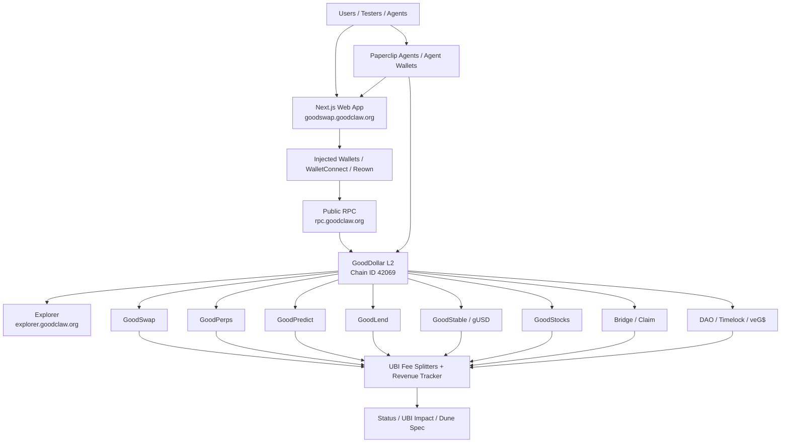

# GoodDollar L2 — The UBI Chain


GoodDollar L2 is an OP Stack-style EVM chain where useful financial activity routes protocol fees into universal basic income for verified humans. The project combines a public-good chain, a DeFi app suite, backend keepers, analytics, and agent-wallet infrastructure into one testnet-ready ecosystem.

## Live Links

- Landing site: https://goodclaw.org
- Web app: https://goodswap.goodclaw.org
- Status API: https://goodswap.goodclaw.org/api/status
- Public RPC: https://rpc.goodclaw.org — chain ID `42069` / `0xa455`
- Explorer: https://explorer.goodclaw.org
- Agents / Paperclip dashboard: https://paperclip.goodclaw.org
- Active readiness plan: [`docs/TESTNET-READINESS-50-ITERATIONS.md`](docs/TESTNET-READINESS-50-ITERATIONS.md)
- Architecture diagrams: [`docs/ARCHITECTURE.md`](docs/ARCHITECTURE.md)
- Testnet guide: [`docs/TESTNET_README.md`](docs/TESTNET_README.md)

## Current Status

_Last refreshed: 2026-05-17 19:45 UTC. `main` was fetched from origin and confirmed current at commit `5fe7e70` before this README expansion._

GoodDollar L2 is running as a persistent public devnet and is being hardened into a public testnet release candidate.

- Public health: `healthy`, `12 / 12` services OK from `https://goodswap.goodclaw.org/api/status`.
- Public pages verified: `/`, `/faucet`, `/perps`, `/portfolio`, `/tests`, `/testnet-guide`, `/predict`, `/lend`, `/stable`, `/stocks`, `/bridge`, `/agents` all returned HTTP `200`.
- Public RPC verified: `eth_chainId = 0xa455`.
- Active initiative: Testnet Readiness Gate — 50 iterations.
- Active priorities: stability, public tester onboarding, protocol smoke evidence, UBI-fee accounting, and release-candidate packaging.
- Security hardening status: Slither high/medium cleanup complete in the prior security initiative; release gates still require continuous security checks before public testnet.

## Logo and Brand

The logo in `docs/assets/gooddollar-l2-logo.svg` is the current project mark for the repository README and testnet documentation.

- `G$` circle: the GoodDollar economic primitive and verified-human UBI claim path.
- Green gradient: public-good finance, sustainability, and real value flowing back to people.
- Blue/green L2 ring: the OP Stack-style Layer 2 network wrapping GoodDollar with cheaper, faster execution.
- Connected nodes: apps, keepers, agents, bridges, and analytics all writing to one shared chain.
- Tagline: **The UBI Chain** — every useful transaction should create a measurable contribution to UBI.

This is intentionally simple enough to render well in GitHub, docs, social previews, and release notes. The source is plain SVG so it can be versioned and edited without binary design tooling.

## What the Project Contains

GoodDollar L2 is not just a token or a single dapp. It is a full stack:

1. **Chain layer** — local/persistent OP Stack-style EVM devnet with chain ID `42069`.
2. **Protocol layer** — Solidity contracts for swaps, perps, prediction markets, lending, gUSD, synthetic stocks, bridges, governance, validators, and UBI routing.
3. **App layer** — a Next.js frontend at `goodswap.goodclaw.org` exposing every protocol surface to users and testers.
4. **Backend services** — PM2-managed keepers, indexers, monitors, oracles, health checks, and protocol service APIs.
5. **SDK and automation** — TypeScript SDK, scripts, lane tests, health gates, and autonomous builder workflow.
6. **Agent economy** — Paperclip/agent-wallet integration and AntSeed compute lane for agent-driven transactions.
7. **Analytics and proof** — status API, test dashboard, UBI impact pages, integration receipts, and Dune dashboard specification.

## Apps Running on GoodDollar L2

| App | Route | Purpose | UBI Link |
|---|---:|---|---|
| GoodSwap | `/` | Swap tokens and route value through GoodSwap contracts. | Swap/router fees flow into UBI accounting. |
| Faucet | `/faucet` | Give testers gas/test assets with boundary and capacity checks. | Enables public testing without manual funding. |
| GoodPerps | `/perps` | Perpetual futures UX backed by `PerpEngine`, margin vault, funding, and liquidation logic. | Trading, funding, and liquidation fees fund UBI. |
| GoodPredict | `/predict` | Prediction markets using conditional tokens, market factory, resolver, and CLOB-style backend work. | Market fees route into Predict UBI splitter. |
| GoodLend | `/lend` | Supply, borrow, debt tokens, interest-rate model, and liquidation lane. | Interest/spread/liquidation fees route to UBI. |
| GoodStable | `/stable` | gUSD stablecoin, collateral registry, vault manager, PSM, and stability pool. | Stability and PSM fees route to UBI. |
| GoodStocks | `/stocks` | Synthetic stock assets with price oracle and collateral vault. | Mint/burn/trading fees route to UBI. |
| Bridge | `/bridge` | L1/L2 and multichain bridge UX for future public testnet flows. | Bridge fees and routing fees can fund UBI. |
| Portfolio / Claim | `/portfolio` | Wallet overview, positions, balances, and claim-oriented UX. | Shows the user-facing impact of the UBI economy. |
| Pool / Yield | `/pool`, `/yield` | Liquidity and yield surfaces for testers. | Liquidity activity supports protocol depth and fees. |
| Explore | `/explore` | Token and market discovery. | Makes useful protocol activity easier to find. |
| Agents | `/agents` | Agent-wallet and automation entry point. | Agent transactions become another UBI-fee source. |
| UBI Impact | `/ubi-impact` | Impact and analytics narrative. | Shows transactions → fees → UBI outcomes. |
| Governance | `/governance` | DAO/timelock/veG$ governance surface. | Long-term protocol stewardship. |
| Tests | `/tests`, `/test-dashboard` | Public QA evidence and test status. | Makes readiness transparent. |
| Testnet Guide | `/testnet-guide` | Tester onboarding and network instructions. | Converts visitors into useful test activity. |
| Invite | `/invite` | Alpha tester invitation page. | Helps recruit testnet users. |

## System Architecture



More diagrams live in [`docs/ARCHITECTURE.md`](docs/ARCHITECTURE.md), including runtime services and test layers.

## Protocol Contracts

The Solidity contracts are organized by protocol:

- `src/GoodDollarToken.sol`, `src/GoodDollarTokenSecure.sol` — G$ token implementations.
- `src/UBIFeeSplitter.sol`, `src/UBIRevenueTracker.sol`, `src/UBIClaimV2.sol` — UBI routing, revenue tracking, and claim infrastructure.
- `src/GoodSwap.sol`, `src/swap/GoodSwapRouter.sol`, `src/swap/LimitOrderBook.sol`, `src/hooks/UBIFeeHook.sol` — swap and fee hook layer.
- `src/perps/*` — perpetuals engine, margin vault, funding, price oracle, and UBI fee splitter.
- `src/predict/*` — conditional tokens, market factory, optimistic resolver, and Predict UBI fee splitter.
- `src/lending/*` — GoodLend pool, tokens, debt tokens, oracle, addresses provider, and rate model.
- `src/stable/*` — gUSD, collateral registry, vault manager, PSM, stability pool, and stable UBI fee splitter.
- `src/stocks/*` — synthetic asset factory, collateral vault, stock oracle, and stocks UBI fee splitter.
- `src/bridge/*` — OP-style portal/bridge contracts and multichain bridge helpers.
- `src/governance/*` — DAO, timelock, and vote-escrowed G$.
- `src/AgentRegistry.sol`, `src/ValidatorStaking*.sol` — agent and validator infrastructure.

Canonical deployed addresses must come from [`op-stack/addresses.json`](op-stack/addresses.json). Do not add stale frontend fallbacks when the registry has an address.

## Backend and Runtime Services

The live stack is PM2-managed. `/api/status` aggregates the public readiness state from the runtime services.

| Service | Role |
|---|---|
| `goodswap` | Next.js frontend server on port `3100`. |
| `swap-oracle` | Swap pricing and on-chain price support. |
| `indexer` | Chain/event indexing and API data source. |
| `monitor` | Contract and chain-health monitor. |
| `revenue-tracker` | Tracks UBI-routed protocol revenue. |
| `activity-reporter` | Reports user/protocol activity. |
| `harvest-keeper` | Yield/harvest automation lane. |
| `liquidator` | Lending/stable liquidation automation. |
| `stocks-keeper` | Synthetic-stock upkeep lane. |
| `rpc-balancer` | Public RPC proxy/balancer health. |
| `bridge-keeper` | Bridge support/health lane. |
| `perps`, `predict` | Protocol-specific backend services. |

## Repository Layout

```text
.
├── src/                         # Solidity contracts
├── script/                      # Foundry deploy/read scripts
├── test/                        # Foundry tests, fuzz, and invariants
├── frontend/                    # Next.js app, API routes, Playwright/Vitest tests
├── backend/                     # PM2 services, keepers, indexers, monitors
├── sdk/                         # TypeScript SDK package
├── op-stack/                    # Chain config and canonical addresses
├── docs/                        # Architecture, readiness, runbooks, analytics specs
├── scripts/                     # Health gates, lane tests, doc checks, deployment helpers
├── research/                    # Protocol research notes and imported references
└── .autobuilder/                # Autonomous build-loop plans, evidence, screenshots, receipts
```

## How Fees Become UBI

The design goal is intentionally measurable:

```text
User or agent activity
  → protocol transaction
  → protocol fee
  → protocol UBI fee splitter
  → UBI revenue tracker
  → verified-human claim / UBI funding pool
  → public analytics evidence
```

Release work must preserve this path for every app. A feature is not complete just because it renders; it needs contract wiring, test evidence, and UBI-fee accounting or an explicit reason it is excluded from the public gate.

## Test and Release Gates

Before a release-candidate push or deploy, run the relevant gates:

```bash
export PATH="$HOME/.foundry/bin:$HOME/.nvm/versions/node/v22.22.1/bin:$PATH"

# Contracts
forge build
forge test -vvv

# SDK
cd sdk
npm run build
npm test
cd ..

# Frontend
cd frontend
npx tsc --noEmit
npx vitest run --reporter=verbose
npx playwright test e2e/app-regression.spec.ts --project=chromium
cd ..

# Dapp smoke lanes
for lane in swap perps predict lend stable stocks portfolio-claim explore; do
  ./scripts/run-dapp-lane.sh "$lane"
done

# Public health and docs
bash scripts/health-check.sh
python3 scripts/check-doc-links.py README.md docs/TESTNET_README.md docs/ARCHITECTURE.md
```

Recent historical full local release pass:

- Foundry: `1026 / 1026` tests passing.
- SDK: `79 / 79` tests passing.
- Frontend Vitest: `834` passing, `1` skipped.
- Dapp lanes: all lanes green.
- Public health: now `12 / 12` services healthy.

## Deploy

Frontend deploys must use the supported script so the Next.js build and PM2 process stay in sync:

```bash
cd frontend
npm run deploy
```

`npm run build` is now wrapped by [`frontend/scripts/atomic-build.mjs`](frontend/scripts/atomic-build.mjs), which snapshots `.next/` via `cp -al` before invoking `next build` and atomically rolls back on a non-zero exit or a missing/empty `BUILD_ID`. This structurally prevents the iter 14 outage pattern where a partial build wiped `.next/` while PM2 kept serving stale asset hashes.

Operations playbooks:

- [`docs/runbooks/frontend-rebuild.md`](docs/runbooks/frontend-rebuild.md) — routine rebuild, emergency restore of `goodswap.goodclaw.org`, manual BUILD_ID drift diagnosis.
- [`scripts/testnet/iter14-restore-goodswap.sh`](scripts/testnet/iter14-restore-goodswap.sh) — one-shot recovery script invoked by the runbook.

Relevant workflows:

- `.github/workflows/ci.yml` — CI checks.
- `.github/workflows/deploy.yml` — deploy latest `main` or a selected tag by SSH.
- `.github/workflows/dapp-parallel-tests.yml` — independent dapp lane matrix.

## Testnet Release Path

The active plan is [`docs/TESTNET-READINESS-50-ITERATIONS.md`](docs/TESTNET-READINESS-50-ITERATIONS.md):

1. Iterations 1–10 — infra health, PM2/process hygiene, public RPC/explorer/faucet stability.
2. Iterations 11–20 — address/env freeze, onboarding, and protocol lane hardening.
3. Iterations 21–30 — UBI fee accounting, analytics package, feedback/debug loop.
4. Iterations 31–40 — security, risk controls, runbooks, deploy hardening.
5. Iterations 41–50 — load tests, tester gates, release-candidate manifest, final GitHub README/doc refresh.

Every five iterations the README, testnet guide, architecture docs, status proof, and known limitations should be refreshed.

## Known Boundaries Before Public Testnet

- The current network is a persistent public devnet, not final mainnet infrastructure.
- Public testnet release still needs final release-candidate manifest and tag recommendation.
- Analytics/Dune indexing remains a release artifact; if public Dune indexing is not available on day one, internal analytics must be shipped and Dune marked pending.
- WalletConnect/Reown Cloud origin allowlist should include production/testnet origins to remove SDK remote-config noise at the source.
- External audit and bug bounty are still required before mainnet.

## Key Docs

- [`docs/ARCHITECTURE.md`](docs/ARCHITECTURE.md) — architecture, app diagrams, runtime services, test layers.
- [`docs/TESTNET_README.md`](docs/TESTNET_README.md) — current public testnet guide and operator notes.
- [`docs/TESTNET-READINESS-50-ITERATIONS.md`](docs/TESTNET-READINESS-50-ITERATIONS.md) — active readiness sprint.
- [`docs/PRODUCTION-ROADMAP-50-ITERATIONS.md`](docs/PRODUCTION-ROADMAP-50-ITERATIONS.md) — previous production roadmap.
- [`docs/DUNE-DASHBOARD-SPEC.md`](docs/DUNE-DASHBOARD-SPEC.md) — analytics dashboard spec.
- [`docs/SECURITY-AUDIT.md`](docs/SECURITY-AUDIT.md) — security audit notes.
- [`docs/runbooks/frontend-rebuild.md`](docs/runbooks/frontend-rebuild.md) — frontend rebuild, restore, and BUILD_ID drift diagnosis runbook.
- [`.autobuilder/integration-results.md`](.autobuilder/integration-results.md) — integration smoke matrix.
- [`scripts/check-doc-links.py`](scripts/check-doc-links.py) — README/docs link checker.

## Development Rules

- Keep `main` merged with `origin/main` before readiness or deploy work.
- Use canonical addresses from `op-stack/addresses.json`.
- Treat public URL behavior as release-critical; localhost-only success is not enough.
- Never hide degraded services in `/api/status`; fix them or document why they are excluded.
- Every major feature needs proof: unit test, Foundry test, E2E, smoke script, health JSON, screenshot, tx hash, or explicit blocker.
- Keep docs accurate enough that a GitHub visitor can understand the chain, the apps, the logo, how to test it, and how fees become UBI.
