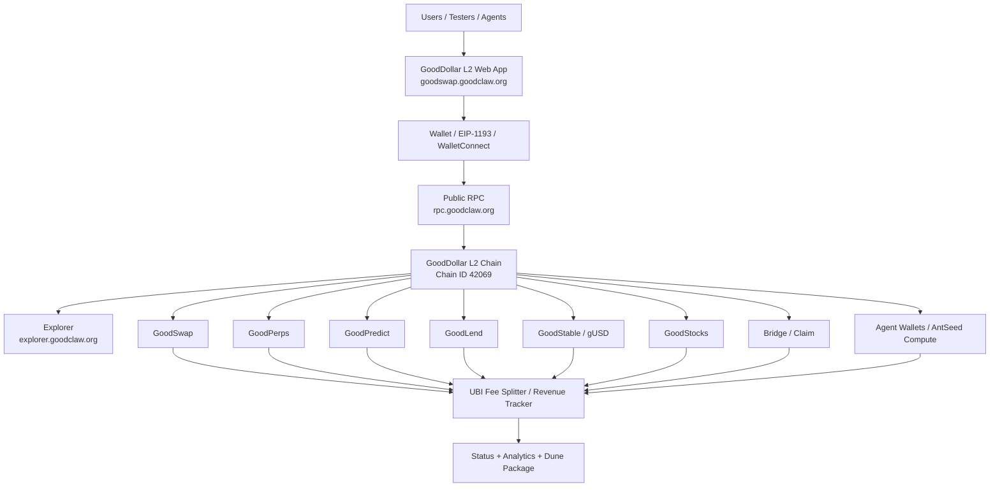
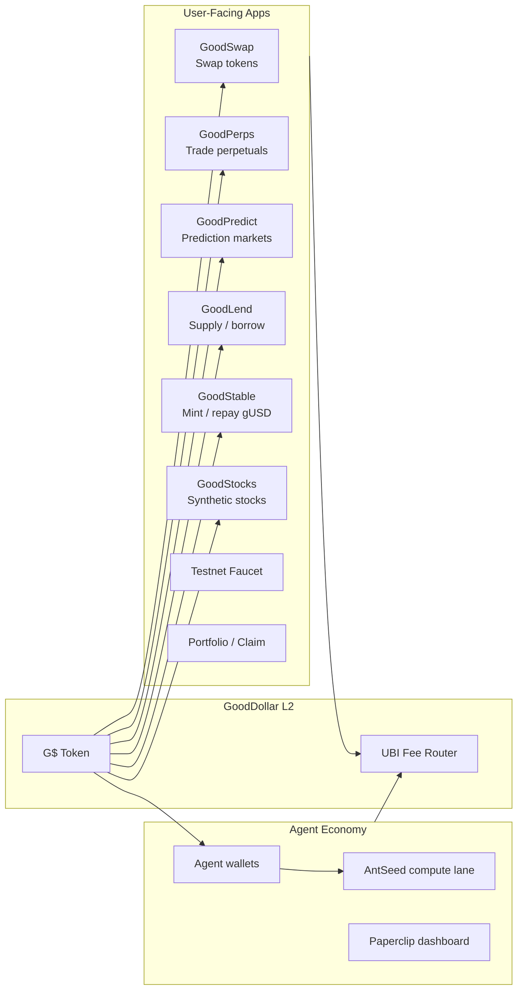
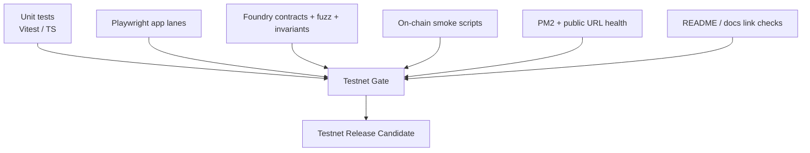

# GoodDollar L2 Architecture

_Last updated: 2026-05-17 22:03 UTC (iter 15 / 50 — README/doc checkpoint 3)._

GoodDollar L2 is the Good Chain: an OP Stack-style EVM chain where useful app activity routes protocol fees into UBI funding.

## Live Surfaces

- App: https://goodswap.goodclaw.org
- RPC: https://rpc.goodclaw.org
- Explorer: https://explorer.goodclaw.org
- Agent / dashboard: https://paperclip.goodclaw.org
- Testnet guide: `docs/TESTNET_README.md`
- Readiness plan: `docs/TESTNET-READINESS-50-ITERATIONS.md`

## System Topology



## Apps Running on Top of the Chain



## Runtime Services

```mermaid
flowchart TB
  PM2[PM2 Process Manager] --> Frontend[goodswap / Next.js]
  PM2 --> SwapOracle[swap-oracle]
  PM2 --> Indexer[indexer]
  PM2 --> Monitor[monitor]
  PM2 --> Revenue[revenue-tracker]
  PM2 --> Activity[activity-reporter]
  PM2 --> Harvest[harvest-keeper]
  PM2 --> Liquidator[liquidator]
  PM2 --> StocksKeeper[stocks-keeper]
  PM2 --> RPCBalancer[rpc-balancer]
  PM2 --> BridgeKeeper[bridge-keeper]

  Frontend --> StatusAPI[/api/status]
  StatusAPI --> PM2
  SwapOracle --> ChainRPC[Chain RPC]
  Indexer --> ChainRPC
  Revenue --> ChainRPC
  Monitor --> ChainRPC
```

## Recent Readiness Milestones (iter 10–14)

These five iterations harden the boundary between the canonical registry,
the runtime, and the public app — so a redeploy or env drift can no longer
silently land in production.

- **Iter 10 — Reown / WalletConnect allowlist hygiene.** WalletConnect
  Cloud's `Origin not on Allowlist` console pair is suppressed at runtime
  in [`frontend/src/lib/wagmi.ts`](../frontend/src/lib/wagmi.ts) so the
  production console stays clean for testers. The permanent
  cloud-allowlist fix is documented in
  [`docs/TESTNET_README.md` → Operator runbook](TESTNET_README.md#operator-runbook).
- **Iter 11 — Address registry freeze.** `op-stack/addresses.json` and
  `.autobuilder/addresses.env` are now treated as a single canonical
  registry, regenerated from Foundry broadcast artifacts plus on-chain
  bytecode by [`scripts/refresh-addresses.py`](../scripts/refresh-addresses.py).
  Two CI gates protect against drift:
  `python3 scripts/refresh-addresses.py --check` (diff guard) and
  [`scripts/check_no_stale_addresses.py`](../scripts/check_no_stale_addresses.py)
  (stale-address scanner over `frontend/src/`). Both are exercised by
  `scripts/test_refresh_addresses.py`.
- **Iter 12 — Frontend env freeze.** A canonical `frontend/.env.production`
  plus an env-drift gate ensure the public build always points at the
  canonical RPC, explorer, chain ID, and contract registry. Together
  with iter 11 this means `op-stack/addresses.json` is the single source
  of truth from contracts → env → frontend.
- **Iter 13 — Wallet onboarding.** A reusable EIP-3085
  [`AddNetworkButton`](../frontend/src/components/AddNetworkButton.tsx) is
  embedded in `/testnet-guide` and `/faucet`. Coverage:
  [`frontend/src/components/__tests__/AddNetworkButton.test.tsx`](../frontend/src/components/__tests__/AddNetworkButton.test.tsx)
  (8 unit specs) and
  [`frontend/e2e/onboarding.spec.ts`](../frontend/e2e/onboarding.spec.ts)
  (Playwright, captures before/after screenshots and asserts the
  canonical EIP-3085 payload reached the wallet via the
  `frontend/e2e/fixtures/wallet.ts` mock).
- **Iter 14 — Atomic build wrapper + developer guide.**
  [`frontend/scripts/atomic-build.mjs`](../frontend/scripts/atomic-build.mjs)
  builds into `.next.tmp` and atomically renames it to `.next` only on
  success, so partial or failed builds cannot corrupt deployed assets.
  Operator workflow lives in
  [`docs/runbooks/frontend-rebuild.md`](runbooks/frontend-rebuild.md).
  In parallel, `/testnet-guide` gained a `#for-developers` section with
  a copy-pasteable RPC `curl`, a GitHub feedback link, and direct links
  to `op-stack/addresses.json` and this architecture document.

## Canonical Data Sources

- Contract addresses: `op-stack/addresses.json`
- Frontend devnet config: `frontend/src/lib/devnet`
- Integration receipts: `.autobuilder/integration-receipts/`
- Integration matrix: `.autobuilder/integration-results.md`
- Status API: `https://goodswap.goodclaw.org/api/status`
- Testnet readiness gate: `scripts/testnet-health-gate.sh` (to be finalized in the readiness sprint)

## Test Layers



## Security and Reliability Principles

- Public status must reflect real readiness, not aspirational service names.
- All production browser paths must use public RPC/proxy URLs, never localhost-only assumptions.
- Every protocol fee path must be mapped to UBI accounting evidence.
- Deployments must be reproducible from `op-stack/addresses.json`, Git commit SHA, and release manifest.
- README must always point to the latest architecture, status, testnet guide, and known limitations.
