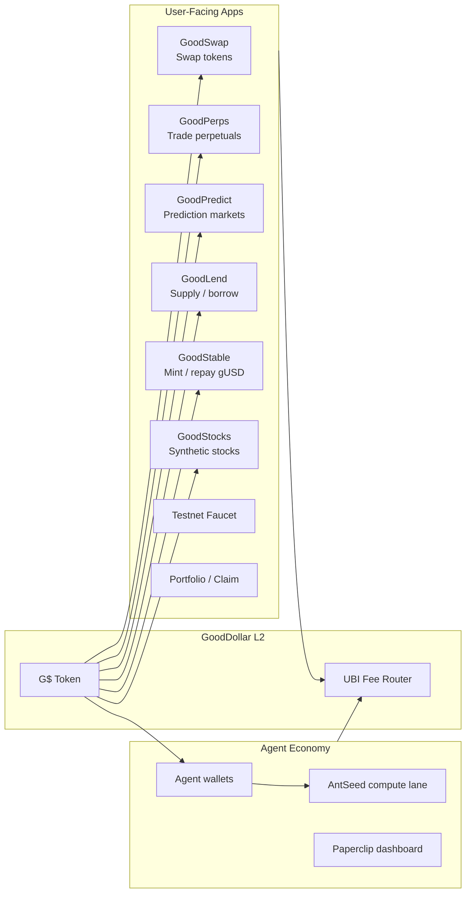
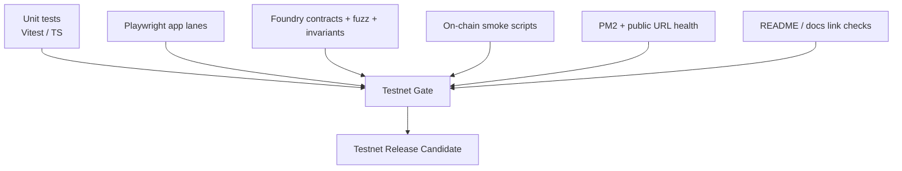

# GoodDollar L2 Architecture

_Last updated: 2026-05-18 10:35 UTC (iter 30 / 50 — README/doc checkpoint 6). Adds the analytics + feedback pipeline that landed in iter 26–29 and was restored to the public app by the iter 30 stale-build redeploy._

GoodDollar L2 is the Good Chain: an OP Stack-style EVM chain where useful app activity routes protocol fees into UBI funding.

## Live Surfaces

- App: https://goodswap.goodclaw.org
- RPC: https://rpc.goodclaw.org
- Explorer: https://explorer.goodclaw.org
- Agent / dashboard: https://paperclip.goodclaw.org
- Testnet guide: `docs/TESTNET_README.md`
- Readiness plan: `docs/TESTNET-READINESS-50-ITERATIONS.md`

## System Topology

```mermaid
flowchart TB
  Users[Users / Testers / Agents] --> Frontend[GoodDollar L2 Web App\ngoodswap.goodclaw.org]
  Frontend --> Wallet[Wallet / EIP-1193 / WalletConnect]
  Wallet --> RPC[Public RPC\nrpc.goodclaw.org]
  RPC --> Chain[GoodDollar L2 Chain\nChain ID 42069]
  Chain --> Explorer[Explorer\nexplorer.goodclaw.org]

  Chain --> Swap[GoodSwap]
  Chain --> Perps[GoodPerps]
  Chain --> Predict[GoodPredict]
  Chain --> Lend[GoodLend]
  Chain --> Stable[GoodStable / gUSD]
  Chain --> Stocks[GoodStocks]
  Chain --> Bridge[Bridge / Claim]
  Chain --> Agents[Agent Wallets / AntSeed Compute]

  Swap --> UBI[UBI Fee Splitter / Revenue Tracker]
  Perps --> UBI
  Predict --> UBI
  Lend --> UBI
  Stable --> UBI
  Stocks --> UBI
  Bridge --> UBI
  Agents --> UBI

  UBI --> AnalyticsAPI[/api/analytics/overview\niter 27]
  AnalyticsAPI --> AnalyticsPage[/analytics dashboard\niter 27]
  Chain --> AddressBook[analytics/address-book.json\niter 26]
  AddressBook --> AnalyticsAPI
  AddressBook --> DunePackage[analytics/dune-package/\niter 28]

  Frontend --> FeedbackButton[Feedback button\niter 29]
  FeedbackButton --> FeedbackAPI[/api/feedback\nrate-limit + 16KiB cap\nschema-validated\nredacted]
  FeedbackAPI --> FeedbackJSONL[frontend/data/feedback.jsonl]
```

## Apps Running on Top of the Chain



## Runtime Services

```mermaid
flowchart TB
  PM2[PM2 Process Manager] --> Frontend[goodswap / Next.js]
  PM2 --> SwapOracle[swap-oracle]
  PM2 --> Indexer[indexer]
  PM2 --> Monitor[monitor]
  PM2 --> Revenue[revenue-tracker]
  PM2 --> Activity[activity-reporter]
  PM2 --> Harvest[harvest-keeper]
  PM2 --> Liquidator[liquidator]
  PM2 --> StocksKeeper[stocks-keeper]
  PM2 --> RPCBalancer[rpc-balancer]
  PM2 --> BridgeKeeper[bridge-keeper]

  Frontend --> StatusAPI[/api/status]
  StatusAPI --> PM2
  SwapOracle --> ChainRPC[Chain RPC]
  Indexer --> ChainRPC
  Revenue --> ChainRPC
  Monitor --> ChainRPC
```

## Analytics + Feedback Pipeline (iter 26–29)

Iter 26–29 added the two observability loops the public testnet needs: a
**read loop** so testers and external analysts can see what the chain is
doing, and a **write loop** so testers can report what they actually hit on
the app. Both loops landed in iter 26–29 and were restored to the public
deployment by the iter 30 stale-build redeploy
([`docs/testnet/iter30-stale-build-redeploy.md`](testnet/iter30-stale-build-redeploy.md)).

```mermaid
flowchart LR
  subgraph ReadLoop[Read loop: chain → analysts]
    AddressBook[analytics/address-book.json\niter 26: canonical contract index]
    OverviewAPI[/api/analytics/overview\niter 27: live JSON aggregate]
    DashboardPage[/analytics page\niter 27: public dashboard]
    DunePackage[analytics/dune-package/\niter 28: indexer-ready ABIs + manifest]
    AddressBook --> OverviewAPI
    OverviewAPI --> DashboardPage
    AddressBook --> DunePackage
  end

  subgraph WriteLoop[Write loop: testers → maintainers]
    FloatingButton[Feedback button\nframework wrapper on every page]
    ClientContext[feedbackContext.ts\nFEEDBACK_LIMITS cap + redact]
    FeedbackRoute[/api/feedback route\niter 29]
    RateLimit[withApiRateLimit]
    SchemaCheck[FeedbackPayload schema]
    ServerRedact[redactDeep — redactSecrets.ts]
    JSONL[frontend/data/feedback.jsonl\nappend-only, gitignored]
    FloatingButton --> ClientContext
    ClientContext --> FeedbackRoute
    FeedbackRoute --> RateLimit
    RateLimit --> SchemaCheck
    SchemaCheck --> ServerRedact
    ServerRedact --> JSONL
  end

  Testers[Public testers + agents] --> FloatingButton
  Testers --> DashboardPage
  Analysts[External analysts] --> DunePackage
  Analysts --> OverviewAPI
```

**Read loop — what testers and analysts can see.**

- [`analytics/address-book.json`](../analytics/address-book.json) (iter 26)
  is the canonical, per-protocol contract index derived from
  [`op-stack/addresses.json`](../op-stack/addresses.json). Both the public
  dashboard and the Dune package depend on it instead of hardcoding
  addresses, so a redeploy of the chain only requires regenerating the
  address book.
- [`/api/analytics/overview`](../frontend/src/app/api/analytics/overview/route.ts)
  (iter 27) aggregates chain reads (block height, UBI splitter totals,
  per-protocol volume) into one cacheable JSON document.
  [`/analytics`](../frontend/src/app/%28app%29/analytics/page.tsx) is the public,
  no-wallet dashboard that renders it.
- [`analytics/dune-package/`](../analytics/dune-package/) (iter 28) ships
  the ABIs, deployment metadata, and
  [`INDEXING_MANIFEST.json`](../analytics/dune-package/INDEXING_MANIFEST.json)
  needed by external indexers (Dune, Goldsky, Subsquid) so we are not the
  only source of truth for chain analytics.

**Write loop — how testers tell us what broke.**

The feedback pipeline is a deliberate trust boundary: the client builds a
rich payload (route, console errors ring buffer, browser metadata, optional
free-text), but the server treats every field as untrusted and enforces a
hard contract before anything reaches disk.

- **Transport.** `POST /api/feedback` only. The floating Feedback button is
  the only first-party caller. There is no GET path and no admin UI yet —
  surfacing feedback is intentionally deferred (see
  [`docs/TESTNET_README.md` → Known Boundaries](TESTNET_README.md#known-boundaries-before-public-testnet)).
- **Rate + size limits.** Wrapped in
  [`withApiRateLimit`](../frontend/src/lib/withApiRateLimit.ts) and capped
  at 16 KiB request body. Anything bigger is rejected with 413 before the
  schema check.
- **Schema.** The `FeedbackPayload` interface and `FEEDBACK_LIMITS`
  constants live in
  [`frontend/src/lib/feedbackContext.ts`](../frontend/src/lib/feedbackContext.ts).
  `pathname` must be a string starting with `/`. Free-text fields, console
  error arrays, and metadata each have explicit length and shape caps.
- **Redaction.** Every accepted payload is recursively scrubbed by
  [`redactDeep` in `frontend/src/lib/redactSecrets.ts`](../frontend/src/lib/redactSecrets.ts)
  before persistence. Regexes cover private keys, mnemonics, JWTs, bearer
  tokens, generic `api_key=` parameters, and bare email addresses. Test
  vectors live in
  [`frontend/src/app/api/feedback/__tests__/route.test.ts`](../frontend/src/app/api/feedback/__tests__/route.test.ts) (redaction is exercised via the route integration tests; see the `redacts private keys, mnemonics, JWTs, bearer tokens, emails` case).
- **Persistence.** Redacted payloads are appended to
  `frontend/data/feedback.jsonl` via `appendFileSync` with `mkdirSync` on
  first write. The directory is gitignored so testers' content never enters
  the public history.
- **Proofs.** Vitest unit suite for redactor + route, Playwright spec for
  the floating-button → JSONL flow, plus live `curl` probes captured in
  [`docs/testnet/iter29-feedback-pipeline.md`](testnet/iter29-feedback-pipeline.md).

## Recent Readiness Milestones (iter 10–14)

These five iterations harden the boundary between the canonical registry,
the runtime, and the public app — so a redeploy or env drift can no longer
silently land in production.

- **Iter 10 — Reown / WalletConnect allowlist hygiene.** WalletConnect
  Cloud's `Origin not on Allowlist` console pair is suppressed at runtime
  in [`frontend/src/lib/wagmi.ts`](../frontend/src/lib/wagmi.ts) so the
  production console stays clean for testers. The permanent
  cloud-allowlist fix is documented in
  [`docs/TESTNET_README.md` → Operator runbook](TESTNET_README.md#operator-runbook).
- **Iter 11 — Address registry freeze.** `op-stack/addresses.json` and
  `.autobuilder/addresses.env` are now treated as a single canonical
  registry, regenerated from Foundry broadcast artifacts plus on-chain
  bytecode by [`scripts/refresh-addresses.py`](../scripts/refresh-addresses.py).
  Two CI gates protect against drift:
  `python3 scripts/refresh-addresses.py --check` (diff guard) and
  [`scripts/check_no_stale_addresses.py`](../scripts/check_no_stale_addresses.py)
  (stale-address scanner over `frontend/src/`). Both are exercised by
  `scripts/test_refresh_addresses.py`.
- **Iter 12 — Frontend env freeze.** A canonical `frontend/.env.production`
  plus an env-drift gate ensure the public build always points at the
  canonical RPC, explorer, chain ID, and contract registry. Together
  with iter 11 this means `op-stack/addresses.json` is the single source
  of truth from contracts → env → frontend.
- **Iter 13 — Wallet onboarding.** A reusable EIP-3085
  [`AddNetworkButton`](../frontend/src/components/AddNetworkButton.tsx) is
  embedded in `/testnet-guide` and `/faucet`. Coverage:
  [`frontend/src/components/__tests__/AddNetworkButton.test.tsx`](../frontend/src/components/__tests__/AddNetworkButton.test.tsx)
  (8 unit specs) and
  [`frontend/e2e/onboarding.spec.ts`](../frontend/e2e/onboarding.spec.ts)
  (Playwright, captures before/after screenshots and asserts the
  canonical EIP-3085 payload reached the wallet via the
  `frontend/e2e/fixtures/wallet.ts` mock).
- **Iter 14 — Atomic build wrapper + developer guide.**
  [`frontend/scripts/atomic-build.mjs`](../frontend/scripts/atomic-build.mjs)
  builds into `.next.tmp` and atomically renames it to `.next` only on
  success, so partial or failed builds cannot corrupt deployed assets.
  Operator workflow lives in
  [`docs/runbooks/frontend-rebuild.md`](runbooks/frontend-rebuild.md).
  In parallel, `/testnet-guide` gained a `#for-developers` section with
  a copy-pasteable RPC `curl`, a GitHub feedback link, and direct links
  to `op-stack/addresses.json` and this architecture document.

## Canonical Data Sources

- Contract addresses: `op-stack/addresses.json`
- Frontend devnet config: `frontend/src/lib/devnet`
- Integration receipts: `.autobuilder/integration-receipts/`
- Integration matrix: `.autobuilder/integration-results.md`
- Status API: `https://goodswap.goodclaw.org/api/status`
- Testnet readiness gate: `scripts/testnet-health-gate.sh` (to be finalized in the readiness sprint)

## Test Layers



## Security and Reliability Principles

- Public status must reflect real readiness, not aspirational service names.
- All production browser paths must use public RPC/proxy URLs, never localhost-only assumptions.
- Every protocol fee path must be mapped to UBI accounting evidence.
- Deployments must be reproducible from `op-stack/addresses.json`, Git commit SHA, and release manifest.
- README must always point to the latest architecture, status, testnet guide, and known limitations.
