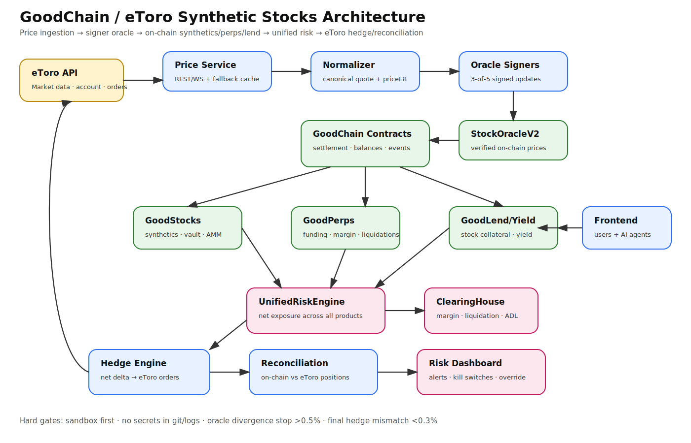
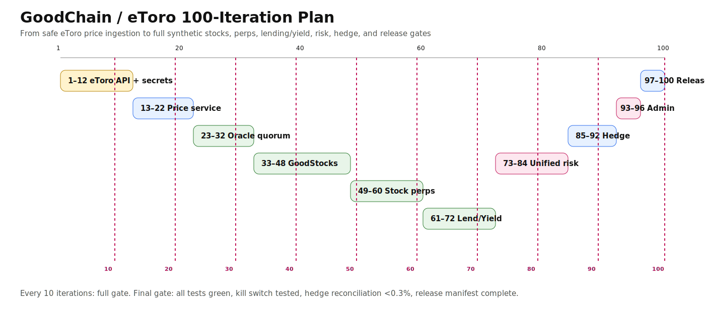

# GoodChain / eToro Synthetic Stocks — SpecKit Package

This folder is the finalized SpecKit planning package for connecting eToro prices and hedging flows to GoodChain synthetic stocks, perps, lend/yield, risk, and frontend/admin tooling.

## Visual Architecture

## Visual 100-Iteration Plan

## Artifact Index

1. [Constitution](CONSTITUTION.md)
2. [Spec](spec.md)
3. [Plan](plan.md)
4. [Tasks](tasks.md)
5. [Risk Register](RISK_REGISTER.md)
6. [Gates](GATES.md)
7. [Manifest](MANIFEST.md)

## Status

- SpecKit planning package: finalized.
- First implementation slice: eToro adapter/normalizer created under `backend/stocks-keeper/src/etoro/`.
- Remaining blocker: confirm live eToro sandbox endpoint/auth flow before live smoke tests.
