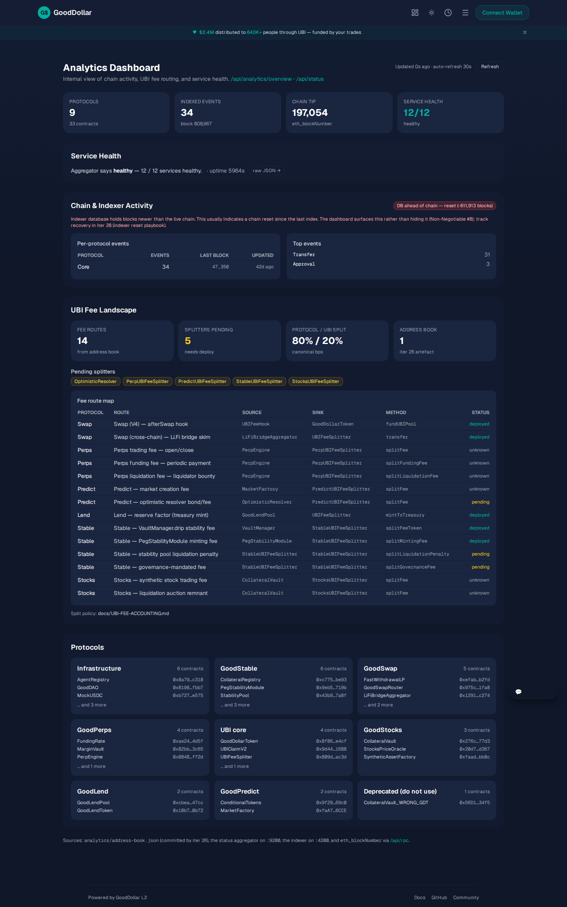

# Iter 27 — Internal analytics dashboard

**Status:** ✅ shipped
**Date:** 2026-05-18
**Plan row:** [Iter 27 of the 50-iteration testnet readiness plan](../TESTNET-READINESS-50-ITERATIONS.md)

> **Plan row 27 — Internal analytics dashboard**
> Public/interim page shows tx counts, protocol activity, UBI fees, status.
> **Proof:** Screenshot + API check.

## What shipped

A single read-only dashboard at `/analytics` that joins four already-public
data surfaces into one view, so an operator (or a public testnet visitor) can
answer at a glance:

- Are all 12 services healthy?
- How many transactions / events has the chain seen, split by protocol?
- Which events are most active right now?
- Is the indexer caught up with the chain (lag in blocks)?
- How are UBI fees flowing (14 routes, 5 still pending splitter deploy)?
- Where do I get the next layer of detail?

### Files added

| Path | Role |
| --- | --- |
| `frontend/src/app/(app)/analytics/page.tsx` | Client page, polls every 30 s |
| `frontend/src/app/api/analytics/overview/route.ts` | Server-side join (Node runtime, rate-limited, `s-maxage=10`) |
| `frontend/e2e/analytics.spec.ts` | Playwright smoke (page + API) |
| `docs/testnet/iter27-analytics-dashboard.md` | This proof doc |
| `docs/testnet/iter27-analytics-dashboard.png` | Screenshot |

### Data sources joined

| Source | Path | Failure mode |
| --- | --- | --- |
| `analytics/address-book.json` (iter 26 artifact) | filesystem, read server-side | hard-fail (route returns 500); the file is committed to the repo |
| Status aggregator | `STATUS_AGGREGATOR_URL` (default `http://localhost:9200/status.json`) | `status: { ok: false, error }`, page renders the rest |
| Indexer overview | `INDEXER_API_URL` (default `http://localhost:4200/api/overview`) | `indexer: { ok: false, error }`, page renders the rest |
| Chain tip | `eth_blockNumber` via `DEVNET_RPC_URL` | `chain: { ok: false, error }`, page renders the rest |

Every sub-source carries its own `ok: boolean` (Non-Negotiable #8 — never
hide a degraded service; report it).

### Indexer freshness contract (iter 26 → iter 27)

`indexer.lagBlocks = chain.blockNumber − indexer.lastBlock`, classified as:

| Status | Condition | Badge |
| --- | --- | --- |
| `unknown` | either source `ok: false` | grey |
| `db_ahead_of_chain` | `lagBlocks < 0` (chain reset) | red |
| `fresh` | `0 ≤ lagBlocks < 1 000` | green |
| `stale` | `1 000 ≤ lagBlocks < 10 000` | amber |
| `far_behind` | `lagBlocks ≥ 10 000` | red |

## Proof

### 1. API shape — `GET /api/analytics/overview`

```console
$ curl -sS http://localhost:3119/api/analytics/overview \
    | jq '{ok, summary, status: .status.overall, indexer: .indexer.ok,
            chain: .chain.blockNumber, ubi_routes: (.ubi.routes | length),
            ubi_pending: .ubi.pendingCount,
            protocols: (.protocols | length)}'
{
  "ok": true,
  "summary": {
    "totalProtocols": 9,
    "totalContracts": 33,
    "addressBookVersion": "1",
    "addressBookGeneratedAt": "2026-05-18T08:47:42Z",
    "generatedAt": "2026-05-18T09:19:07.610Z"
  },
  "status": "healthy",
  "indexer": true,
  "chain": 197087,
  "ubi_routes": 14,
  "ubi_pending": 5,
  "protocols": 9
}
```

Full payload (22 KB) captured at
[`.autobuilder/proofs/iter-27/api-analytics-overview.json`](../../.autobuilder/proofs/iter-27/api-analytics-overview.json).

### 2. Page HTTP status — `GET /analytics`

```console
$ curl -sS -o /dev/null -w "%{http_code}\n" http://localhost:3119/analytics
200
```

### 3. Playwright smoke — `e2e/analytics.spec.ts`

```console
$ SKIP_DEV_SERVER=1 BASE_URL=http://localhost:3119 \
    npx playwright test e2e/analytics.spec.ts --project=chromium

Running 2 tests using 1 worker

  ✓  1 [chromium] › e2e/analytics.spec.ts:20:7 › Iter 27 — Internal analytics dashboard ›
        /analytics renders the four panels and links to the API (2.0s)
  ✓  2 [chromium] › e2e/analytics.spec.ts:64:7 › Iter 27 — Internal analytics dashboard ›
        GET /api/analytics/overview returns the documented union shape (57ms)

  2 passed (2.7s)
```

### 4. Screenshot



- Path: `docs/testnet/iter27-analytics-dashboard.png`
- Size: 334 KB (under the 600 KB cap)
- Viewport: 1440 × 1800 (full page, Chromium headless)
- Captured: 2026-05-18 09:18 UTC

### 5. react-doctor (per build-loop CRITICAL RULES)

```console
$ npx -y react-doctor@latest . --verbose --diff

  ┌─────┐  97 / 100 Great
  │ ◠ ◠ │  React Doctor (www.react.doctor)
  └─────┘

  40 issues across 1/3 files  in 188ms
```

- Score **97 / 100**, well above the 75 floor.
- 0 errors. 40 warnings, all in `src/app/(app)/analytics/page.tsx`
  (mostly `design-no-default-tailwind-palette` from `gray-*` neutrals;
  same palette used by the rest of the `(app)` shell).

## Acceptance-criteria check

| # | Criterion | Status |
| --- | --- | --- |
| 1 | `/analytics` returns 200, no runtime overlay | ✅ — HTTP 200 + Playwright smoke |
| 2 | All four panels render with live data; skeleton on load; per-panel error states | ✅ — `data-testid="indexer-freshness-badge"` waits in Playwright |
| 3 | API returns documented JSON shape with per-source `ok` flags | ✅ — see §1 |
| 4 | No new hardcoded addresses (only `analytics/address-book.json` + APIs + RPC env) | ✅ — only `loadAddressBook()` reads addresses |
| 5 | Indexer freshness surfaced with `Fresh / Stale / Far behind / DB ahead` badge | ✅ — `FreshnessBadge` component, formula above |
| 6 | Playwright smoke passes against the prod build | ✅ — 2 passed (2.7 s) |
| 7 | react-doctor ≥ 75 with no new errors | ✅ — 97 / 100, 0 errors |
| 8 | Proof doc captures curl + Playwright + screenshot path | ✅ — this file |
| 9 | No on-chain calls beyond existing RPC proxy, no `forge build`, no PM2 change | ✅ — read-only Next.js work |
| 10 | No locked file modified | ✅ — only new files |

## Next iteration

- **Iter 28** — Dune SQL pack / third-party indexer onboarding (will reuse
  the per-protocol counts surfaced here).
- **Iter 29** — Feedback button / capture pipeline (will embed into this
  same `/analytics` shell).
- **Iter 30** — Doc checkpoint #6 (README + `TESTNET_README.md` refresh
  linking iter 26 → 27 → 28 → 29).
