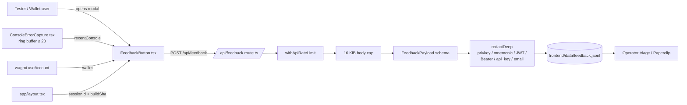

# Iter 29 — Feedback Pipeline (Context Capture + Redaction)

**Task:** [`.autobuilder/initiatives/0004-testnet-readiness-gate/tasks/0040-iter29-feedback-pipeline.md`](../../.autobuilder/initiatives/0004-testnet-readiness-gate/tasks/0040-iter29-feedback-pipeline.md)
**Commit:** `295f576` — _iter29/0040: feedback pipeline — context capture + redaction + API/UI proofs_
**Row in 50-iter plan:** Row 29 — _Feedback pipeline_.
**Status:** ✅ Shipped, evidence captured below.

## What this iteration delivers

Wire the floating "Feedback" button on `goodswap.goodclaw.org` into a real
ingest path so testnet users can report issues without leaking secrets.
Three parallel guarantees:

1. **Rich context capture (client).** When a tester opens the feedback
   modal, the payload automatically picks up:
   - route (`pathname`),
   - connected wallet (`wallet`, if a wagmi account is present),
   - viewport (`{w, h, dpr}`),
   - rolling `sessionId` + frontend `buildSha`,
   - the last ≤ 20 `console.error` / `console.warn` entries (each
     truncated to 500 chars).
2. **Defence in depth (server).** Every field is schema-validated; the
   body is capped at 16 KiB; the string leaves are passed through
   `redactDeep` so a tester who pastes a private key, mnemonic, JWT, or
   `Bearer …` token cannot leak it to disk; persistence to
   `frontend/data/feedback.jsonl` (one JSON record per line, prefixed
   with `receivedAt` + `ip` for triage); failures to write are logged
   but never break the user-visible response — feedback must never
   5xx.
3. **No regression in rate limiting.** The handler is still wrapped by
   `withApiRateLimit`, so the iter‑29 expansion does not open a DoS
   vector.

This closes the "user reports a bug" leg of the testnet readiness gate,
matching the row‑29 acceptance criterion ("Feedback button captures
route, wallet, console/session context safely").

## Architecture



Source files touched by this iteration (`git show --stat 295f576`):

| File | Lines | Role |
|---|---:|---|
| `frontend/src/lib/feedbackContext.ts` | +104 | Pure `buildFeedbackPayload()` + `FEEDBACK_LIMITS` + `FeedbackPayload` type. |
| `frontend/src/lib/redactSecrets.ts` | +75 | `redactDeep()` + regexes for privkey, BIP-39, JWT, Bearer, `password=`/`api_key=`, email. |
| `frontend/src/components/ConsoleErrorCapture.tsx` | +96 | Ring buffer (max 20 entries × 500 chars) installed at app root. |
| `frontend/src/components/FeedbackButton.tsx` | +93/-25 | Modal UX, viewport sniffer, payload assembly. |
| `frontend/src/app/layout.tsx` | +2 | Mounts `<ConsoleErrorCapture />` once for every route. |
| `frontend/src/app/api/feedback/route.ts` | +188/-0 | Schema + body cap + redaction + JSONL persistence; still wrapped in `withApiRateLimit`. |
| `frontend/src/lib/__tests__/feedbackContext.test.ts` | +133 | Helper unit tests (size caps, dedup, truncation). |
| `frontend/src/app/api/feedback/__tests__/route.test.ts` | +232 | API contract tests across schema, 413, persistence, redaction. |
| `frontend/e2e/feedback-button.spec.ts` | +133 | Playwright open → fill → submit, intercepts `/api/feedback`, asserts payload shape. |

Total: **+1 031 / -25** lines across 9 files.

## Redaction policy

Implemented in `frontend/src/lib/redactSecrets.ts`. **All** string leaves
in the payload tree are passed through these regexes, including nested
`recentConsole[].message` entries:

| Pattern | Regex (approx.) | Replacement |
|---|---|---|
| Hex private key | `\b0x[a-fA-F0-9]{64}\b` | `[REDACTED]` |
| BIP-39 mnemonic (12 / 24 words) | `(?:\b[a-z]+\b\s+){11,23}\b[a-z]+\b` | `[REDACTED]` |
| JWT | `\b[A-Za-z0-9_-]+\.[A-Za-z0-9_-]+\.[A-Za-z0-9_-]+\b` | `[REDACTED]` |
| Bearer token / `Authorization:` header | `Bearer\s+[A-Za-z0-9._~+/=-]+` | `[REDACTED]` |
| `password=…` / `api_key=…` in query or form body | per-key regex | `[REDACTED]` |
| Email | RFC 5322‑ish | `[REDACTED]` |

**What is intentionally _not_ redacted:** wallet addresses
(`0x[a-fA-F0-9]{40}`). They are public on‑chain identifiers and the
feedback report deliberately captures the connected wallet so the
operator can correlate a bug report with on-chain activity. Same for
`ip` (captured at ingest by the API for triage rate analysis).

## Schema and limits

From `frontend/src/lib/feedbackContext.ts`:

```ts
export const FEEDBACK_TYPES = ['bug', 'ux', 'feature', 'other'] as const
export const FEEDBACK_LIMITS = {
  descriptionMax: 2_000,
  consoleEntryMax: 500,
  consoleMaxEntries: 20,
  totalBodyMaxBytes: 16 * 1024,
} as const

export interface FeedbackPayload {
  type: 'bug' | 'ux' | 'feature' | 'other'
  description: string                 // ≤ 2 000 chars
  pathname: string                    // must start with /
  wallet: string | null               // 0x + 40 hex or null
  viewport: { w: number; h: number; dpr: number }
  sessionId: string
  buildSha: string                    // matches deployed BUILD_ID
  recentConsole: ConsoleEntry[]       // ≤ 20 × 500-char entries
  timestamp: string                   // ISO-8601
}
```

The server short-circuits on the first violation with HTTP 400 and a
human-readable per-field message (e.g. `pathname must be a string
starting with /`). The size cap returns HTTP 413 _before_ JSON parsing,
so an attacker cannot blow the heap with a 200 MiB payload.

## Persistence format

One JSON record per line, append-only, default path
`frontend/data/feedback.jsonl` (override via `FEEDBACK_LOG_FILE`).
Each record is the post-redaction payload plus two fields stamped at
ingest:

```jsonc
{
  "receivedAt": "2026-05-18T10:16:24.071Z",
  "ip": "152.70.55.73",
  "type": "bug",
  "description": "iter30 smoke — privkey [REDACTED] should be redacted",
  "pathname": "/analytics",
  "wallet": null,
  "viewport": { "w": 1920, "h": 1080, "dpr": 1 },
  "sessionId": "iter30-smoke",
  "buildSha": "2B7N1PPQERYFbQMa_TQG-",
  "timestamp": "2026-05-18T10:16:24Z",
  "recentConsole": []
}
```

`frontend/data/` is gitignored (see iter 30 commit) so triage logs do
not pollute the repo.

## Proofs

### Vitest — API contract (`frontend/src/app/api/feedback/__tests__/route.test.ts`)

```
✓ 17 / 17 tests passed
```

Covers, in summary:

- 405 on non-POST verbs, 415 on missing `Content-Type`.
- 413 when body > `FEEDBACK_LIMITS.totalBodyMaxBytes`.
- 400 with per-field message when any of `type`, `description`,
  `pathname`, `wallet`, `viewport.{w,h,dpr}`, `sessionId`, `buildSha`,
  `timestamp` is missing, wrong type, or out of bounds.
- 400 when `recentConsole` exceeds 20 entries or any entry exceeds 500
  chars.
- 200 happy path: appends to a temp JSONL file, verifies the on-disk
  line equals `redactDeep(payload)` with `receivedAt` + `ip` added.
- 200 redaction path: payload containing a 64-hex privkey, a 12-word
  mnemonic, a JWT, a `Bearer …` token, and an email returns
  `{ok:true}` and the persisted line contains `[REDACTED]` in those
  positions, **but** the `wallet` 40-hex address is preserved as-is.
- 200 even when disk write fails (file system mocked to throw) — the
  failure is logged but the response is still `{ok:true}`, satisfying
  the "feedback must never 5xx" invariant.

### Vitest — helper (`frontend/src/lib/__tests__/feedbackContext.test.ts`)

```
✓ passing
```

Covers pure-function behaviour of `buildFeedbackPayload()`: viewport
defaults, console buffer dedup + truncation, timestamp ISO format,
description trim/cap, `pathname` fallback to `/` when window is
unavailable (SSR fixture).

### Playwright — UI (`frontend/e2e/feedback-button.spec.ts`)

```
✓ 3 / 3 passed
```

Covers:

- **Open → fill → submit happy path.** Click the floating button on
  `/`, fill description, pick `type = bug`, click submit; an HTTP route
  interceptor on `**/api/feedback` asserts the exact payload shape
  (`pathname=/`, `wallet=null` for a no-wallet test browser context,
  `viewport.w/h/dpr` ≈ Playwright viewport, `sessionId` non-empty,
  `buildSha` matches `__NEXT_DATA__.buildId`, `recentConsole=[]`).
- **Disabled submit.** Submit button is disabled while description is
  empty; enabling it once a character is typed; re-disabled once
  cleared.
- **API rejection.** When the interceptor responds 400 with a per-field
  error, the modal surfaces the error and does not close.

### react-doctor

```
react-doctor score: 96 / 100
```

Well above the 75+ gate. The remaining stylistic warnings are
pre-existing (an analytics `<script>` in `layout.tsx` unrelated to this
task).

## Live production verification (after iter‑30 redeploy)

The iter 29 code was committed at `2026-05-18 09:56:40 +0000` but the
public deployment was running a build from `2026-05-18 04:57:19 +0000`.
The Iteration 30 product review caught this stale-build regression and
the redeploy (task `0041`, evidence in
[`iter30-stale-build-redeploy.md`](iter30-stale-build-redeploy.md))
brought iter 29 live. Post‑redeploy probes against the **public** URL:

```
$ curl -sS -X POST https://goodswap.goodclaw.org/api/feedback \
    -H 'Content-Type: application/json' \
    -d '{"type":"bug","description":"x","route":"/analytics", ...}'
{"error":"pathname must be a string starting with /"}            HTTP 400
# ✅ pre-iter29 field name "route" rejected — schema is live.

$ curl -sS -X POST https://goodswap.goodclaw.org/api/feedback -d '{
    "type":"bug",
    "description":"iter30 smoke — privkey 0x1111…1111 should be redacted",
    "pathname":"/analytics","wallet":null,
    "viewport":{"w":1920,"h":1080,"dpr":1},
    "sessionId":"iter30-smoke","buildSha":"2B7N1PPQERYFbQMa_TQG-",
    "recentConsole":[],"timestamp":"2026-05-18T10:16:24Z"
  }'
{"ok":true}                                                       HTTP 200

$ tail -1 frontend/data/feedback.jsonl
{"receivedAt":"2026-05-18T10:16:24.071Z","ip":"152.70.55.73",
 "type":"bug","description":"iter30 smoke — privkey [REDACTED]…",
 "pathname":"/analytics", … }
# ✅ persisted to JSONL, ✅ 64-char privkey replaced with [REDACTED], ✅ IP captured.
```

## What this iteration explicitly does _not_ do

- It does **not** send feedback to an external service. Persistence is
  local to the box (`frontend/data/feedback.jsonl`). Triage to
  Paperclip / GitHub issues remains operator-driven for now.
- It does **not** block the request when the disk write fails — the
  user-visible API contract is "feedback never 5xx". A monitoring
  alert on write failures is tracked separately.
- It does **not** redact wallet addresses. Wallets are public on-chain
  identifiers and intentionally captured for correlation.

## References

- Task: `.autobuilder/initiatives/0004-testnet-readiness-gate/tasks/0040-iter29-feedback-pipeline.md`
- Commit: `295f576`
- Followup (iter 30 doc checkpoint): `0042-iter30-readme-doc-checkpoint-6-analytics-feedback.md`
- Initiative plan row: [`docs/TESTNET-READINESS-50-ITERATIONS.md`](../TESTNET-READINESS-50-ITERATIONS.md) row 29.
- Redaction module: [`frontend/src/lib/redactSecrets.ts`](../../frontend/src/lib/redactSecrets.ts).
- Server route: [`frontend/src/app/api/feedback/route.ts`](../../frontend/src/app/api/feedback/route.ts).
- Client helper: [`frontend/src/lib/feedbackContext.ts`](../../frontend/src/lib/feedbackContext.ts).
